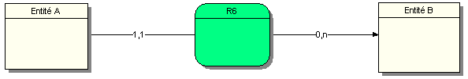

# MERISE

## Cardinalités

# MERISE

## EXPRESSION DES CONTRAINTES (OU CARDINALITES)

Dans ce supplément de cours MERISE, vous allez voir 10 ASSOCIATIONS BINAIRES avec toutes les combinaisons de cardinalités possibles, improbables, voire interdites ou déconseillées.

Pour chaque association, il y a une représentation graphique et textuelle, ainsi qu’une conclusion et des questions se rapportant au type d’association. On utilisera toujours la même syntaxe, à savoir Une entité A associée par la relation R à une entité B. Libre à vous de trouver des exemples concrets pouvant éventuellement correspondre à la relation R.

### 1. Association zéro-un à zéro-un

R1 (2 pattes) 
A 0,1  
B 0,1  

Une occurrence de l’entité A peut ne pas être associé ou être associé au maximum à une occurrence de l’entité B. Une occurrence de l’entité B peut ne pas être associé ou être associé au maximum à une occurrence de l’entité A. 

Question : Quel est l’intérêt d’avoir des occurrences des entités A et B qui ne participeront jamais à l’association R1 ?  
Comment construire une telle relation et quelle est sa signification ?

Conclusion : éviter ce genre de relation dont la sémantique semble hasardeuse !

### 2.Association zéro-un à un-un

R2 (2 pattes) :  
A 0,1  
B 1,1  

Une occurrence de l’entité A peut ne pas être associée ou être associée au maximum à une occurrence de la relation R2. Une occurrence de l’entité B est associée à une et une seule occurrence de la relation R2. Cette formulation est quelque peu différente de celle du paragraphe 1 mais revient au même. Cette formulation est légitime puisqu’on parle d’occurrences de la relation R2. La première formulation que nous utilisons souvent s’avère plus facile à comprendre.

Question : Aucune

Conclusion : ce type de relation est plausible, B est le déterminant et A est le déterminé. Une occurrence de B dans R2 sera toujours reliée à une occurrence de A.

Exemple 1 :

Relation : Posséder (2 pattes)  
Cartable 0,1  
Elève 1,1  

Dans une école, on suppose qu’un ELEVE possède un et un seul CARTABLE, qu’un CARTABLE est possédé par aucun ou au plus un ELEVE.

Emmanuelle possède le Cartable "Nounours Bleus"
Vincent possède le cartable "Footeux"
On a trouvé un cartable "Bidule-Vert" qui n’appartient à aucun élève !

Exemple 2 :

Relation : Recruter (2 pattes)  
Fonctionnaire 0,1  
Contrat 1,1  

Dans une administration, on suppose qu’un CONTRAT permet de recruter un et un seul FONCTIONNAIRE, qu’un FONCTIONNAIRE peut être recruté sans contrat ou au plus par un CONTRAT.

### 3.Association zéro-un à zéro-n

R3 (2 pattes) :  
A 0,1  
B 0,n  

Une occurrence de l’entité A peut ne pas être associée ou être associée au maximum à une occurrence de la relation R2. Une occurrence de l’entité B est associée à aucune ou plusieurs occurrences de la relation R2.

Question : Aucune

Conclusion : cas plutôt rare cependant existant comme dans le TP2 sur la société CourCircuit dont voici une partie du MCD. Dans notre étude de cas, une commande peut être associé à deux représentants, un vendeur-responsable et optionnellement un vendeur-secondaire. Les deux jouant un rôle pour une commande auront la commission à se partager.

Exemple : 

Relation : Avoir_pour_vendeur_secondaire (2 pattes)  
Commande 0,1  
Représentant 0,n  

### 4.Association zéro-un à un-n

R4 (2 pattes) :  
A 0,1  
B 1,n  

Une occurrence de l’entité A peut ne pas être associée ou être associée au maximum à une occurrence de la relation R4. Une occurrence de l’entité B est associée au minimum à une ou plusieurs occurrences de la relation R4. 

Question : Aucune. 

Conclusion : Cas de figure rare et cependant possible comme dans l’exemple suivant.

Exemple :

Relation : Etre_responsable_de (2 pattes)    
Service 0,1  
Fonctionnaire 1,n  

Un FONCTIONNAIRE peut être responsable de un ou plusieurs SERVICES. Un SERVICE peut n’avoir aucun ou au plus un RESPONSABLE. Il se peut que dans l’attente  d’une nouvelle embauche d’un responsable, le poste ne soit plus occupé et donc n’est rattaché à aucune personne responsable.

### 5.Association un-un à un-un (INTERDIT !!!)

Cette relation est autorisée dans un diagramme de classe UML mais pas dans un MCD Merise.

R5 (2 pattes) :
A 1,1
B 1,1

Une occurrence de l’entité A est associée à une et une seule occurrence de la relation R5. Une occurrence de l’entité B est associée à une et une seule occurrence de la relation R5. Comme vous pouvez le constater sur le MCD ci-dessus, le Modeleur Win’Design n’autorise pas l’utilisateur à saisir deux cardinalités 1,1 sur chacune des pattes d’une même relation ! Il propose 0,n ou 1,n ou toutes autres cardinalités.

Question : Comment en êtes-vous arrivé là ? Pourquoi avoir mis un CIF, contrainte d’intégrité fonctionnelle sur chaque patte ? L’une des entités ne serait-elle pas tout simplement une propriété de l’autre ?

Conclusion : ne JAMAIS écrire ce type d’association dans vos MCD.

### 6.Association un-un à zéro-n

R6 (2 pattes) :  
A 1,1  
B 0,n  

Une occurrence de l’entité A est associée à une et une seule occurrence de la relation R6. Une occurrence de l’entité B est associée à aucune ou plusieurs occurrences de la relation R6.

Question : Aucune.

Conclusion : Ce type d’association est courante comme dans l’exemple suivant.

Exemple :

Relation : Appartenir (2)  
Tuteur_Enseignant 1,1  
Ecole 0,n  

Dans cet exemple, un Tuteur_enseignant appartient à une et une seule école, tandis qu’une école peut n’avoir aucun ou plusieurs Tuteur_Enseignants. On utilise souvent cette formulation simplifiée comme si l’on parlait d’occurrences plutôt que d’entités. Lorsque nous sommes en présence d’une association ternaire ou n-aire, cette formulation n’est plus possible car l’on doit raisonner par  couple ou triplet (voir cours Merise - MCD).

### 7.Association un-un à un-n

R7 (2 pattes) :  
A 1,1  
B 1,n  

Une occurrence de l’entité A est associée à une et une seule occurrence de la relation R7. Une occurrence de l’entité B est associée au minimum à une occurrence et au maximum à plusieurs occurrences de la relation R7.

Question : l’Entité A est elle une propriété MULTIPLE de l’entité B ?

Conclusion : Ce type d’association doit être vérifié. Elle se révèle souvent (mais pas toujours) fausse du point de vue sémantique. On peut considérer que cette relation est justifiée si l’entité A est une propriété multiple de l’entité B comme dans l’exemple ci-dessous.

Exemple :

Relation : Affecter (2)  
Commande 1,1  
Représentant 1,n  

Dans cet exemple, une commande est affectée à un et un seul Représentant, tandis qu’un représentant doit être affecté à une ou plusieurs Commandes.

Une Commande est bien une propriété MULTIPLE de Représentant !

Dans notre cas, on considère qu’une commande est toujours rattachée à un représentant (il ne peut pas y avoir de commande sans représentant). On considère aussi qu’un représentant doit au minimum avoir effectué une vente  donnant lieu à une commande, voire plusieurs commandes. Sincèrement, une relation 0,n côté Représentant me semblerait plus logique si l’on considère  qu’une nouvelle occurrence de Représentant n’est pas obligatoirement rattachée à une occurrence de Commande. Comment un nouvel embauché pourrait-il être rattaché à une commande sans avoir pu effectuer une vente ?

La construction d’un MCD doit être COHERENTE, il nous faut faire bien attention à la sémantique que nous exprimons par l’intermédiaire des schémas car elle servira à construire notre future base de données !

### 8.Association zéro-n à zéro-n

R8 (2 pattes)    
A 0,n  
B 0,n  

Une occurrence de l’entité A est associée à aucune ou plusieurs occurrences de la relation R8. Une occurrence de l’entité B est associée à aucune ou plusieurs occurrences de la relation R8.

Question : Pourquoi avoir créer cette association qui peut ne concerner aucune des occurrences des deux entités A et B ? Sommes-nous en présence d’une aberration, d’un non-sens ?

Conclusion : Ce type d’association doit être vérifié et s’avère plutôt rare. Le zéro-n-zéro-n est généralement le fait d’une association réflexive. Toutefois, voici un exemple ci-dessous.

Exemple :

Relation : Suivre (2)  
Stagiaire 0,n  
Matière 0,n  
 
Dans cet exemple, un stagiaire peut ne suivre aucune matière ou plusieurs, et une Matière peut n’être suivie pas aucun stagiaire, voire plusieurs stagiaires.

Qu’un stagiaire ne suive aucune matière, on peut l’admettre si ce dernier sèche les cours ! Par contre, qu’une matière ne soit suivie par aucun stagiaire, que fait l’enseignant ou le formateur ? peut-il enseigner une matière à une classe vide ? rien n’est vraiment faux ou vrai, tout dépend de la sémantique, de ce que l’on veut dire par notre modélisation.

### 9.Association zéro-n à un-n

R9 (2 pattes)  
A 0,n  
B 1,n  

Une occurrence de l’entité A est associée à aucune ou plusieurs occurrences de la relation R9. Une occurrence de l’entité B participe au minimum une fois et au maximum plusieurs fois à une occurrence de la relation R9.

Question : Aucune.

Conclusion : Ce type d’association est courant. Voici un exemple ci-dessous.

Exemple :

Relation : concerner (2)  
Propriété : Quantité commandée  
Produit 0,n  
Commande 1,n  

Dans cet exemple, un Produit peut être concerné par aucune ou plusieurs commandes, une Commande concerne au minimum un produit, voire plusieurs produits. En effet, pouvons-nous avoir une commande ne concernant aucun produit  Pour que l’entité commande ait du sens il lui faut au moins une association avec un produit.

### 10.Association un-n à un-n

R10 (2 pattes)  
A 1,n  
B 1,n  

Une occurrence de l’entité A est associée à aucune ou plusieurs occurrences de la relation R9. Une occurrence de l’entité B participe au minimum une fois et au maximum plusieurs fois à une occurrence de la relation R9.

Question : Que penser du caractère obligatoire de cette relation ? Comment créer une entité A sans la rattacher à une entité B et comment créer une entité B sans la rattacher à une entité A ?

Conclusion : Evitez ce type d’association. Pourtant, vous trouverez de nombreux ouvrages sur Merise avec des exemples ou exercices avec des relations 1,n à 1,n. Il faudrait que ceux qui modélisent de cette façon constatent ce que cela donne dans une vraie base de données avec des vraies données et une vraie application.

Remarques : Comme vous avez pu le constater, j’ai utilisé différentes formulations pour exprimer les cardinalités propres à la relation R correspondante.
La plus rationnelle concerne celle qui spécifie la participation d’une occurrence d’entité à une occurrence de la relation R. Dans un MCD, une entité n’a de raison d’être que dans la mesure ou elle est associée à une autre entité par une relation R… mais maintenant vous le savez ! … enfin je l’espère.

**Les cardinalités minimales sont toujours ZERO ou UN, autrement dit OPTIONNEL ou bien OBLIGATOIRE**.

**Les cardinalités maximales sont toujours UN ou N, soit UNE SEULE occurrence ou bien PLUSIEURS**.

Auteur : **Philippe Bouget**