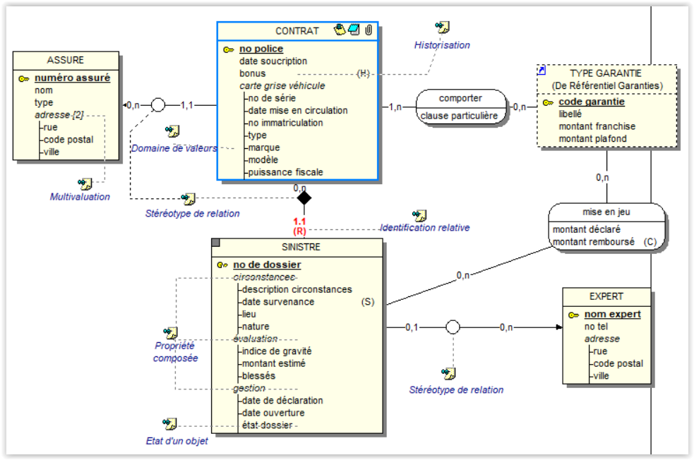
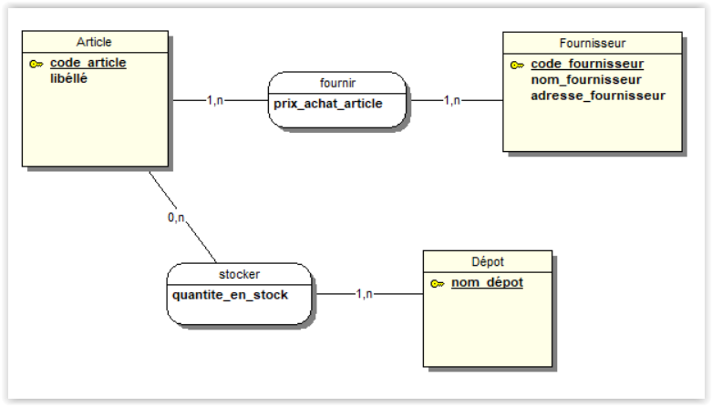

# MERISE

## Logiciels gratuits de modélisation

- [Looping](https://www.looping-mcd.fr/)
- [JMerise](https://www.jfreesoft.com/JMerise/)

## Modèle Conceptuel de Données

### Qu’est-ce qu’un MCD (Modèle Conceptuel de Données) ?

Un Modèle Conceptuel de Données est un formalisme de description des données dérivé du modèle Entité-Relation normalisé par l’ISO (International Standard Organisation).

Le MCD décrit la **SÉMANTIQUE**, c’est-à-dire le SENS, attachée à ces données et à leurs rapports, et non l’utilisation qui en est faite.

C’est une *représentation graphique des données et de leurs relations sous forme d’entités et de liens* (associations) en tenant compte des contraintes exprimées par des cardinalités.

#### Quel est l’objectif du M.C.D ?

Etudier et modéliser le contenu de la mémoire collective de l'entreprise ou du champ de l'étude, sachant que la représentation des données est d'un niveau d'invariance élevé (la partie la plus stable dite STATIQUE).

Cette modélisation fait abstraction : 

- de l'utilisation qui sera faite de ces données (traitements)  
- de la technologie à utiliser (organisation et techniques)  

Le modèle est fait pour être lu, discuté et si possible compris.

#### Comment construire un MCD ?

La base pour construire un M.C.D. reste le discours (parlé ou écrit) de l’utilisateur/client exprimé en langue naturelle.
Les mots utilisés comprennent les termes usuels de la langue, mais aussi des termes spécialisés du domaine. Les phrases fournissent, après une analyse grammaticale, les principales entités et les associations entre ces dernières. Le MCD est la traduction sémantique du SI.

#### Quels sont les composants du MCD ?

Nous allons aborder les concepts de base nécessaire à la compréhension et à l’élaboration d’un M.C.D :

- Entité (Individu)
- Association (Lien, Relation)
- Propriétés (Attribut)
- Identifiants d’entité et d’association
- Dimension (Patte) 
- Cardinalités (Contraintes)
- Occurrence (instance)

##### ENTITÉ (Individu, Objet)

Est pourvue d'une EXISTENCE PROPRE et CONFORME AUX BESOINS de gestion de l’entreprise.

Exemples : un CLIENT, un PORTEFEUILLE D'ACTIONS, une COMMANDE, un DEPOT, une FACTURE, une LIGNE-FACTURE, un FOURNISSEUR, un ARTICLE,...

##### ASSOCIATION (Lien, Relation)

Est un LIEN SÉMANTIQUE qui unit deux ou plusieurs ENTITÉS.
Souvent nommé par un verbe à l’infinitif ou un substantif. 
Le lien n'est pas orienté.

Types d’association :

- Binaire : associe 2 entités.
- Ternaire : associe 3 entités.
- N-aire : associe n entités. (plus de 3)
- Réflexives : associe les occurrences d’une même entité. 

Exemples : client COMMANDER produit, professeur ENSEIGNER matière,
Facture CONTENIR ligne-facture, fournisseur FOURNIR article.

##### PROPRIÉTÉ (Attribut)

Est une donnée ÉLÉMENTAIRE permettant de DÉCRIRE une entité ou une association (lien).

Cette donnée peut se mesurer par une valeur.
Une propriété n’est portée qu’UNE SEULE FOIS par UNE SEULE entité ou bien par une SEULE association.

Exemples : Adresse d’un client, prix d’achat d’un article, libéllé du produit, dimension du produit, couleur de l’article,…

##### IDENTIFIANT D’ENTITÉ

Propriété PARTICULIÈRE de l'entité telle que pour chacune des valeurs de cette propriété, il existe une occurrence UNIQUE de l'entité.

Exemples : Numéro de commande permet d’identifier une commande, un numéro d’immatriculation permet d’identifier un véhicule, un numéro de sécurité sociale permet d’identifier une personne assurée.

##### IDENTIFIANT D’ASSOCIATION

Est la **concaténation** des identifiants des entités qui participent à l’association.

Une association **N'A PAS D'IDENTIFIANT** explicite : l'association dépend toujours des entités qu'elle relie. Son identifiant se déduit par calcul du produit cartésien des identifiants des entités associées.

Exemples : Pour l'association **CONCERNER** qui relie l’entité **COMMANDE** à l’entité **PRODUIT**, l'identifiant est le produit cartésien de __Numéro Commande et Numéro Produit__, soit la concaténation de ces derniers.

##### DIMENSION (pattes)

On appelle DIMENSION d'une association le nombre d'entités qu'elle relie. On dit souvent son nombre de "pattes".

Une association qui relie seulement deux entités est donc un cas particulier. Il n'existe pas de limite au nombre de pattes d'une association. Cependant un nombre de pattes ÉLEVÉ est un indice que l'étude a été superficielle et approximative. Il existe en effet un procédé de simplification que nous verrons ultérieurement.

##### CARDINALITÉS (contraintes)

Nombre d’occurrences d’une entité qui participe à une association. Cette précision est donnée par une valeur minimale et maximale.

- Minimum	: valeur 0 ou 1
- Maximum	: valeur 1 ou n
- Contrainte d'intégrité fonctionnelle  ou  CIF ( minimum : 1, maximum : 1)

Pour déterminer les cardinalités, nous nous poserons la question suivante :

**POUR UNE OCCURRENCE DE CETTE ENTITÉ, combien y a t-il d'occurrences de l'association auxquelles cette occurrence d'entité participe, au plus et au moins ?*

C'est donc l'**expression d'une CONTRAINTE** perçue sur le monde, et que l'on écrit dans notre modèle.

Exemple :  « il n'est pas possible qu'une commande ne concerne aucun produit », « qu’un client n’ait jamais passé au moins une commande »...

[Pour comprendre les cardinalités](MCD-cardinalites.md)

##### OCCURRENCE (Instance)

Réalisation particulière d'une entité, propriété ou association. 

Exemples :

L'occurrence d'une entité COMMANDE peut être la commande numéro 1234 du 28/03/98. Une occurrence de l'association CONCERNER peut être 5 produits ED12 pour la commande n°1234.

Une occurrence de propriété est une VALEUR : Une occurrence de la propriété Prix Unitaire pour un produit P1 est de 25 €. 

##### RÈGLES DE BASE POUR LA MODELISATION

- Une propriété ne peut pas figurer sur deux entités différentes
- Une entité a UN SEUL identifiant
- Une entité possède au moins une propriété (son identifiant)
- Une entité participe a au moins une association
- A chaque occurrence de l’entité, il ne peut y avoir au plus qu’une valeur de la propriété
- Si l'on ne sait pas trouver d'identifiant à une entité, c'est qu'elle n'a peut être pas d'existence propre. Il pourrait donc s'agir d'une association.
- Une propriété possède un code, un libellé et une définition
- Une propriété a UNE SEULE signification (pas d’homonymie)
- Si une propriété a plusieurs sens, il faut la décomposer en plusieurs propriétés
- Une propriété n’a pas de synonyme (pas de nom différent pour le même sens)
- Si l’on trouve 2 propriétés ayant le même sens, on n’en garde qu’une
- Une association peut ne pas avoir de propriété

Pour les Kinesthésiques :

Pour déterminer la cardinalité, se POSITIONNER sur l'entité concernée et regarder EN FACE combien de fois l'une de ses occurrences participe à l'association.

Puis se DEPLACER du côté de l'autre entité et faire la même chose dans l'autre sens.

##### Logiciel de Modélisation pour créer des MCD

[Lien vers un logiciel gratuit (en Java) JFreesoft](http://jfreesoft.com/)

##### Exemple de formalisme graphique

Une **ENTITÉ** est représentée par un **RECTANGLE** divisé en **DEUX CELLULES**. La cellule supérieure reçoit l’intitulé de l’entité, tandis que les propriétés de  celle-ci sont logées dans la cellule inférieure. Il est courant de ne placer que l’identifiant dans la cellule inférieure au tout début de la construction du modèle.

La représentation graphique d’une **ASSOCIATION** entre entités a une forme **CIRCULAIRE** divisée en deux cellules. Dans la cellule supérieure on spécifie le **VERBE** caractérisant au mieux le lien unissant les entités, tandis que la cellule inférieure peut accueillir les éventuelles propriétés portées par cette association.

Le segment qui relie le **SYMBOLE** de l’entité à celui de l’association se nomme une **PATTE**.

##### Autre exemple de MCD basique

- TROIS ENTITÉS :

    - FOURNISSEUR
    - ARTICLE
    - DÉPÔT

- DEUX ASSOCIATIONS :

    - FOURNIR (prix_achat_article)
    - STOCKER (quantité_en_stock)

L’entité FOURNISSEUR dont l’identifiant est le CODE FOURNISSEUR et dont les propriétés sont NOM FOURNISSEUR et ADRESSE FOURNISSEUR est liée par l’association FOURNIR qui contient la propriété PRIX D’ACHAT DE L’ARTICLE à l’entité ARTICLE dont l’identifiant est CODE ARTICLE et la propriété est LIBELLE ARTICLE.

L’entité ARTICLE est liée par l’association STOCKER qui contient la propriété QUANTITE STOCKEE à l’entité DEPOT dont l’identifiant est NOM DEPOT.
 
Description plus explicite des contraintes exprimées par les cardinalités :

- Un Fournisseur Fournit au minimum UN Article et au maximum PLUSIEURS Articles, soit la cardinalité 1,n.

- Un Article est Fournit par au moins UN Fournisseur et au plus PLUSIEURS Fournisseurs, soit la cardinalité 1,n.

- Un Article est Stocké dans AUCUN Dépôt ou PLUSIEURS Dépôts, soit la cardinalité 0,n.

- Un Dépôt Stocke au minimum UN Article et au maximum PLUSIEURS Articles, soit la cardinalité 1,n. 

#### Dépendances fonctionnelles (DF - CIF)

Les cas d'associations comportant un grand nombre de pattes sont relativement rares. C'est en effet parce qu'elles peuvent être simplifiées lorsqu'il existe une :

**CONTRAINTE D'INTÉGRITÉ FONCTIONNELLE (CIF)**

Une CIF se définit par le fait que l'une des entités participant à l'association est complètement DETERMINÉE par la connaissance d'une ou plusieurs autres entités participant dans cette même association.

La CIF consiste simplement en une cardinalité 1-1 sur l'une des pattes comme dans le schéma ci-dessous.

La connaissance d'une COMMANDE *détermine* celle du REPRÉSENTANT qui l'a prise : il n'y en a qu'UN.

La CIF est souvent représentée par une flèche du DÉTERMINANT vers le DÉTERMINÉ. Dans notre exemple COMMANDE est le déterminant et  REPRÉSENTANT est le déterminé.

#### Les Formes Normales (FN)

Dans l’étude conceptuelle des données, on parle souvent de la NORMALISATION définie par un dénommé Codd (1970). Cette normalisation nous  propose un certain nombre de règles appelées des FORMES NORMALES.

Objectifs :

- Garantir la COHÉRENCE
- Faire apparaître des OBJETS DE GESTION ou ASSOCIATION
- SIMPLIFIER le modèle
- CORRIGER les INCOHÉRENCES.

##### Une entité est en 1ère  FORME  NORMALE (1FN)

Si toutes les propriétés sont ÉLÉMENTAIRES (ATOMIQUES) et s'il existe au moins un identifiant caractérisant chaque occurrence de l’entité.
(Cette règle correspond à la règle 5 de la vérification du MCD).

Exemple : Imaginons que nous ayons une entité CLIENT possédant les propriétés NOM-CLIENT et ADRESSE-CLIENT. Dans cette entité, il n'y a pas d'identifiant car plusieurs clients peuvent avoir le même nom. De plus l'adresse n'est pas une propriété élémentaire car elle peut être décomposée.

*Comment cette entité CLIENT peut-elle être réécrite ?*

Atomique veut dire non décomposable, par exemple une adresse n’est pas atomique car elle peut se décomposer en numéro, rue, nomDeRue, CP et Ville.

##### Une entité est en 2ème FORME  NORMALE (2FN)

Si elle est déjà en 1ière FORME NORMALE Et si TOUTES les propriétés autre que l'identifiant sont en dépendance fonctionnelle élémentaire de tout l'identifiant.

Exemple : Imaginons une entité LIGNE-COMMANDE ou ARTICLE-COMMANDER possédant pour identifiant la concaténation du NUMERO COMMANDE + RÉFÉRENCE, et pour propriétés, la DÉSIGNATION et la QUANTITÉ. On s'aperçoit que la dépendance fonctionnelle de la Désignation n'est pas élémentaire puisqu’elle dépend d'une partie de l'identifiant qui est la Référence et non de tout l’identifiant (Numéro Commande + Référence).

*Comment ce MCD pourrait-il être transformer pour respecter cette 2FN ?*

##### Une entité est en 3ème FORME  NORMALE (3FN)

Si elle est déjà en 2ème FORME NORMALE Et si TOUTES ses PROPRIETES dépendent UNIQUEMENT de l’identifiant.

Autrement dit, si dans une entité, une propriété dépend de l’identifiant de celle-ci et également d’une autre propriété de cette même entité, il doit y avoir une entité imbriquée comme nous l'avons vu avec la règle 6 de vérification du MCD.

Exemple : Imaginons une entité CLIENT possédant l'identifiant CODE-CLIENT et les propriétés suivantes, Nom-client, Code-catégorie et Nom-catégorie.

*Cette entité est-elle en 3FN ?  
Comment ce MCD pourrait-il respecter cette 3FN ?*

On découvre que la DF : Code-Client -> Nom-catégorie n'est pas directe du fait de la TRANSITIVITÉ suivante à savoir :

Code-Client -> Code-catégorie ->Nom-catégorie

En effet, on peut déterminer le Nom de la catégorie par le Code catégorie. Il suffit donc de créer une nouvelle entité CATÉGORIE contenant l'identifiant Code-catégorie et sa propriété Nom-catégorie puis d'établir une relation APPARTENIR-A reliée à l'entité CLIENT.

##### Autres règles que l'on trouve dans certains manuels

- Une propriété ne peut apparaître qu'une seule fois dans un même MCD.

- Les propriétés qui sont le résultat d'un calcul ne doivent en principe pas figurer.

Auteur : **Philippe Bouget**