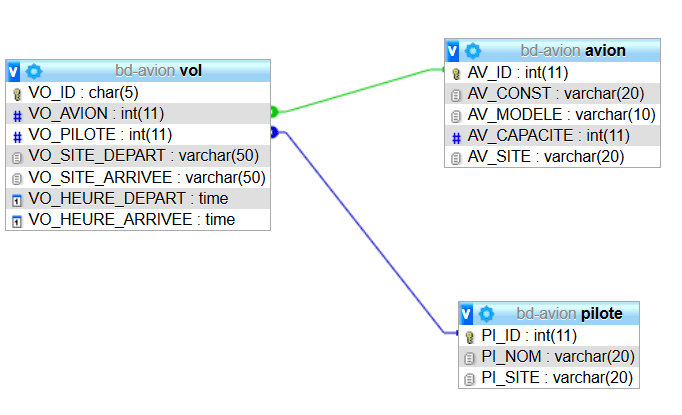
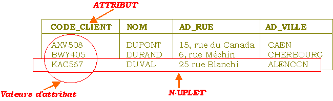
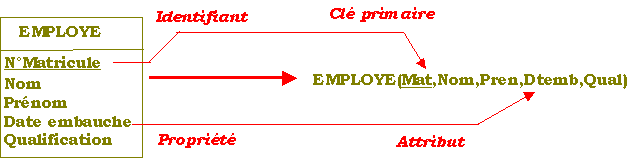
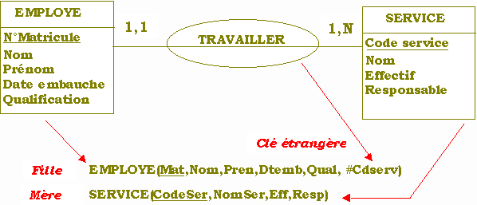
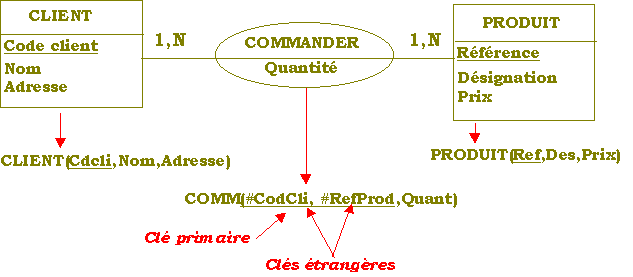
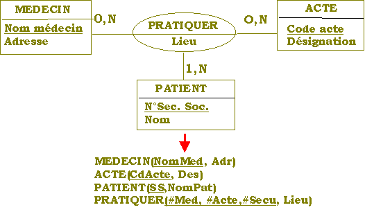
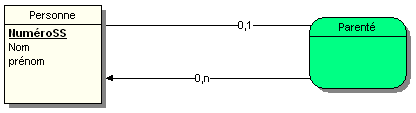
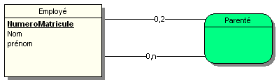
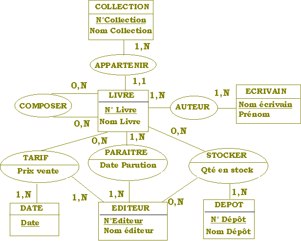

# MERISE

## Modèle Logique de Données

## INTRODUCTION

### Qu'est-ce qu'un Modèle Logique de Données ?

Le niveau **Logique** est une représentation du système tel qu'il sera implémenté dans les ordinateurs.
Ainsi, le Modèle Logique de Données ou MLD est la **TRADUCTION** du Modèle Conceptuel de Donneés auparavant validé et que nous souhaitons mettre en place en fonction de choix d'organisation des données.

- La modélisation logique des données est une **représentation** des données, issues de la modélisation conceptuelle (MCD) puis organisationnelle des données.

- Elle est exprimée dans un **formalisme** général et compatible avec l’état de l’art technique.

- Elle tient compte des aspects coûts/performances liées aux traitements.

### Pourquoi créer un MLD à partir d'un MCD ?

Tout simplement parce qu'*on ne sait pas implémenter facilement un MCD* ou modèle Entité-Association directement dans une machine.

Cela va nous obliger à effectuer un travail de TRADUCTION pour construire notre base de données en fonction de la technologie des SGBD (Système de Gestion de Bases de Données) qui possèdent chacun leur propre modèle.

Notre MLD sera ensuite transformé et adapté en fonction des particularités du *langage de définition des données* spécifiques à l’outil retenu pour devenir un MPD (Modèle Physique de Données) à l'étape suivante. Le MPD est en quelque sorte l’équivalent du script SQL pour la génération des tables de la base de données.

Nous n’étudierons que le formalisme du MLD pour le :

**
Modèle Relationnel
**

Associé à :

**
Un SGBD relationnel (SGBDR) comme MySQL
**

## LE MODÈLE RELATIONNEL

### Définition

Le modèle relationnel a été défini par Codd en 1970, les aspects fondamentaux du modèle relationnel sont :

**Une algèbre permettant de manipuler des tables et des relations**
**Une démarche de conception permettant de définir une collection de relations.**

Un modèle est dit relationnel dans la mesure où il __permet de parcourir
la structure des données empruntant des chemins non prédéfinis__, constitués en dynamique par des *requêtes*. Les concepts du modèle relationnel découlent de la théorie des ensembles.

### Rappel des concepts du Modèle Relationnel

A ce type de modèle sont associées les notions suivantes :

- Domaine : valeurs possibles pour un atribut
- Table relationnelle : Table
- Attribut : Colonne dans une table
- Tuple (ou n-uplet) : enregistrement dans une table

#### Les Domaines : valeur possible pour un attribut

Un domaine est un ensemble de valeurs ayant une signification pour l'utilisateur. Par exemple, le domaine des noms, le domaine des âges, le domaine des entiers E={...-2,-1,0,+1,+2,...}.

#### Table relationnelle, Attribut, Tuple, Clé primaire,…

Une *table relationnnelle* est un sous-ensemble du produit cartésien d'une
liste de domaines (non nécessairement distincts). Elle est généralement caractérisée par un nom.

La **table** (ou relation) se définie comme un tableau de données. Les colonnes sont les **attributs** et les lignes sont des **tuples** (enregistrements). une RELATION ou TABLE est le résultat d'une opération sur les ensembles constitués par les valeurs des attributs.

Un ou plusieurs attributs permettent d’identifier de façon unique chaque
enregistrement (tuple) de la table: **la clé primaire**

La **clé primaire** est dite simple si elle est constituée d’un seul attribut et composée dans le cas contraire.

Un **attribut** est la colonne d'une table caractérisée par un nom. L'ordre
des colonnes est sans importance. Plusieurs colonnes peuvent appartenir à un même domaine. On associe un nom à chaque colonne.

Une **clé de table relationnelle** est un ensemble minimal d'attributs qui
détermine tous les autres, il peut y avoir plusieurs clés pour une même relation. On en choisit en général une comme clé primaire.

Le lien entre 2 tables relationnelles est réalisé par la duplication de
la clé primaire d’une table dans l’autre. Cette clé dupliquée est appelée **clé externe** (ou étrangère).

Exemple

Soit 2 relations **EMPLOYE** et **SERVICE** avec leurs attributs :

EMPLOYE ( Matricule, Nom, Prénom, Datemb,Qual, **#service_id**)  
SERVICE ( Id_service, NomSer,Effectif, Resp)

Dans notre schéma de relations, l'attribut **#service_id** de la relation
EMPLOYE prend ses valeurs dans le domaine de valeurs de l'attribut **Id_service** qui se trouve, lui, au sein d'une autre relation appelée **SERVICE**, d'où ce nom de *clé étrangère*. Par convention, elle est souvent symbolisée au moyen du **#** (dièze).

Autrement dit : quel que soit le service de l'employé (toute valeur de
**#service_id**), celui-ci doit exister dans la table SERVICE en tant que valeur de l'attribut *Id_service*. *A contrario, cela voudrait dire qu'un employé qui travaille dans un service serait inconnu dans notre entreprise. Soit une  absurdité (ou incohérence)*.

Cette propriété remarquable d'une clé étrangère (à nuancer pour le cas 0,1) est nommée **CONTRAINTE D'INTEGRITE REFERENTIELLE** (à distinguer de notre contrainte
d'intégrité fonctionnelle CIF avec son 1,1.

#### règle de la contrainte d'intégrité référentielle

Pour toute valeur de la clé étrangère, elle fait référence à une valeur identique de la clé primaire de la table associée.

Cette règle est automatiquement contrôlée par tout SGBDR digne de ce nom. On notera enfin que la liaison entre les tables assurée par le mécanisme de clé étrangère d'un SGBDR se fait par VALEUR, de la même manière que dans les systèmes de gestion de fichiers. Il en va autrement dans les systèmes OO qui font de telles liaisons par ADRESSE.

## LES RÈGLES DE TRANSFORMATION

Les règles de transformation d'un MCD en MLD sont les suivantes :

### Table issue d’une entité

Toute **entité** est transformée en **table**. Ses propriétés deviennent les attributs de la table. L’identifiant devient clé primaire de la table.

Une **propriété** est transformée en **attribut** de table.

Un **identifiant** est transformé en une **clé primaire**.

Une **concaténation d’identifiants** est transformée en une **clé composée**.

Exemple :

L'entité EMPLOYE (n° matricule, nom, prénom, date embauche, qualification)

va devenir   

La table EMPLOYE (n° matricule, nom, prénom, date embauche, qualification)

### Table issue d’une association binaire 0,n-1,1 ou 1,n-1,1

La clé primaire de la table issue de l’entité côté cardinalités (0,n) ou (1,n) est dupliquée dans la table issue de l’entité côté cardinalités (1,1) où elle devient **clé externe**.

Exemple: Employé 

L'entité employé devient une table qui contient :

- L’identifiant Matricule comme clé primaire puis
- Nom, prénom, datembauche et qualification comme attributs puis
- #CdServ comme clé étrangère du Service (l’esclave).

L'entité service devient une table qui contient :

- L’identifiant CodeSer comme clé primaire puis,
- Nom, effectif, responsable

On hésite quelquefois au début pour savoir dans laquelle des 2 relations, il faut porter la **clé étrangère**. Il suffit de contrôler si cet attribut est bien **MONOVALUÉ** (qu'il respecte bien la première Forme Normale).

*Supposons que, par erreur, nous portions MATRICULE dans SERVICE comme
clé étrangère : alors cet attribut aurait comme valeurs tous les matricules de ce service.

Par contre, dans la solution correcte ci-dessus, on voit clairement que
\#CDSERV ne peut posséder qu'une valeur, celle du service dans lequel travaille cet employé (il n'y en a qu'un).

Notez le formalisme ici : nous utilisons de préfixer les clés étrangèrs par \#

### Table issue d’une association binaire 0,n-0,1 ou 1,n-0,1

La clé primaire de la table issue de l’entité côté cardinalités (0,n) ou (1,n) est dupliquée dans la table issue de l’entité côté cardinalités (0,1) où **elle devient clé externe qui peut être une valeur nulle**.

### Table issue d’une association binaire 0,1- 1,1

La clé primaire de la table issue de l’entité côté cardinalités (0,1) est dupliquée dans la table issue de l’entité côté cardinalités (1,1) où **elle devient clé externe**.

La cardinalité minimale zéro donne un caractère optionnel qui fait que la clef primaire de A dans B pourra avoir une valeur nulle. Comme dans l’explication qui suit, vous allez comprendre que le caractère optionnel ne permet pas d’assurer l’intégrité référentielle.

Si nous reprenons notre exemple concernant l'EMPLOYE et le SERVICE avec
cette fois-ci la cardinalité 0,1 côté service, nous voyons que la même règle s'applique. Cependant la clé étrangère pourra avoir une "valeur nulle", soit : Si un employé peut ne pas travailler dans un service, alors il se peut que la clé étrangère \#CDSERV n'ait pas de valeur. Il en résulte que l'on ne peut plus, dans ce cas, utiliser aisément le mécanisme de vérification du respect de
l'intégrité référentielle. Eventuellement la clef côté 1,1 peut aller vers 0,1 pour garantir l’intégrité.

### Table issue d’une association binaire 0,1- 0,1

La clé primaire de la table issue de l’une des entités est dupliquée dans la table issue de l’autre entité où **elle devient clé externe qui peut être une  valeur nulle**. L’autre possibilité souvent implémentée dans les modeleurs qui effectuent une traduction automatique du MCD vers le MLD intégrent les clef primaires de chacune des tables vers l’autre table. Ainsi dans le cas ci-dessous
généré par le logiciel Win’Design, on trouve une clef étrangère A dans
la table B et une clef étrangère B dans la table A. La question à se poser consiste à savoir quel est le sens de cette relation ?

### Association binaire 0,n-0,n ou 1,n-1,n ou 1,n-0,n

**On crée une table ayant comme clé une clé composée des identifiants des
2 entités**. Les éventuelles propriétés de l’association deviennent les attributs de la table. Ce type d’association est dite « plusieurs à plusieurs » n à n.

Exemple: Commandes

L'entité Client devient une table qui contient :

- L’identifiant Code client comme clé primaire et
- Nom et adresse comme attributs

L'entité Produit devient une table qui contient :

- L’identifiant Référence comme clé primaire et
- Désignation et prix comme attributs

L’association Commander devient une table qui contient :

- Pour identifiant, la concaténation de Code client + Référence du produit
- pour attribut la quantité.

### Table issue d’une association ternaire ou supérieure

On crée une table ayant comme clé une clé composée des identifiants des
entités. Les éventuelles propriété de l’association deviennent les attributs de la table.

Exemple: Actes médicaux

L'entité Médecin devient une table qui contient :

- L’identifiant Nom médecin comme clé primaire et
- Adresse comme attribut

L'entité Acte devient une table qui contient :

- L’identifiant Code acte comme clé primaire et
- Désignation comme attribut

L'entité Patient devient une table qui contient :

- L’identifiant Numéro de sécurité sociale comme clé primaire et
- Nom comme attribut

L’association Pratiquer devient une table qui contient :

- Pour identifiant, la concaténation du Nom médecin + Code acte + Numéro
de sécu du patient et
- a pour attribut le lieu.

### Table issue d’une association réflexive 0,n-0,1

__La clé primaire de la table issue de l’entité est dupliquée dans cette
table où elle devient une clé externe qui peut être une valeur nulle__. Les éventuelles propriétés de l’association deviennent des attributs de la table. 
Association dite « plusieurs à un ».

Exemple parenté unique

Voici le MLD correspondant :  
Personne(NuméroSS, nom, prénom, \#numeroSS père)

### Association réflexive 0,n-0,n ou 1,n-1,n ou 1,n-0,n

__On crée une table ayant comme clé une clé composée de 2 fois l’identifiant de l’entité__. Les éventuelles propriétés de l’association deviennent des attributs de la table.

Exemple parenté double

Voici le MLD correspondant :  
Employé(Nmat, nom, prénom)  
Parenté(\#Nmat enfant,\#Nmat parent)

### Conclusion sur les règles de passage (traduction)

Les règles de passage d'un modèle Entité-Association en schéma logique d'une Base de Données Relationnelles sont totalement formalisables pourvu que le modèle MCD ou Modèle Entité-Association soit au moins en 3ème Forme Normale (3FN).

Par conséquent, on peut les automatiser au moyen d'un programme : c'est ce que font tous les Ateliers de Génie Logiciel qui vous aident à dessiner votre modèle
Entité-Association et vous génèrent ensuite tous seuls le schéma de la BD (on appelle souvent cela "génération de code", une appellation discutable).

Une propriété remarquable :

Les associations qui comportent une cardinalité 1,1 sur l'une des pattes
ne sont jamais porteuses de propriétés. Celles-ci "migrent" sur l'entité déterminante.

## ÉTUDE SUR UN CAS CONCRET

Prenons l'exemple d'une gestion de livres, d'écrivains et d'éditeurs:

Cet exercice a pour seul but de vous permettre d'utiliser les règles de traduction du MCD vers le MLD. Nous considérons ce modèle conceptuel de données comme étant validé.

Voici le MLD correspondant :

**COLLECTION** (Ncoll, NomColl)  
**LIVRE** (Nlivre, Nomlivre,\#Numcoll)  
**COMPOSER** (\#Nliv1,\#Nliv2)  
**AUTEUR** (\#Nolivre,\#NomEcri)  
**ECRIVAIN** (NmEcriv,PrnomEcriv)  
**TARIF** (\#Nlivr, \#Nedit, \#Date, Prix)  
**PARAITRE** (\#NoLvre, \#NoEdit, DatPar)  
**STOCKER** (\#Nolivre, \#Ndepot, \#Nedit, Qte)  
**ÉDITEUR** (NoEdit, NomEdit)  
**DÉPOT** (NoDep, NomDep)  

Particularité des entités DATE :

Dans la majorité des cas, une entité DATE ne deviendra pas une table.

**Pourquoi l’avoir mise dans un MCD ?**

Tout simplement parce que nous avions besoin dans le cas présent, d’avoir une date comme élément de la clé primaire de l’association TARIF pour pouvoir enregistrer un LIVRE et un EDITEUR à des DATES différentes avec comme propriété une quantité. Si nous avions mis la date comme propriété de la relation TARIF,nous n’aurions pu enregistrer qu’un seul enregistrement entre un livre et un éditeur sans pouvoir gérer un historique. Alors que grâce à ce principe d’entité DATE, on peut créer plusieurs enregistrements entre éditeur et livre pour des dates différentes avec des quantités identiques ou différentes. Cette entité est artificielle.

Auteur : **Philippe Bouget**