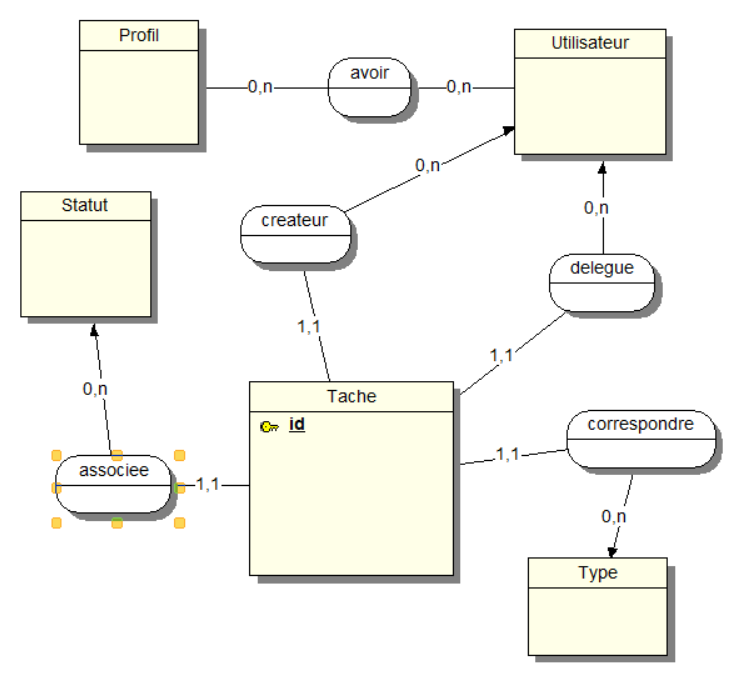

# Gestionnaire de Tâches GTD ("Getting Things Done")

Un GTD est un gestionnaire de tâches qui met en œuvre une méthode de gestion des priorités quotidiennes appelé Getting Things Done [Getting Things Done]( http://fr.wikipedia.org/wiki/Getting_Things_Done).

Il s’agit ici de développer une application GTD multi-utilisateurs.

## Spécifications fonctionnelles

L'application est destinée à être utilisé au sein d'une organisation et doit permettre aux membres de l'organisation de **gérer la liste de leurs tâches à réaliser et de les partager avec les autres membres**.

## Tâche

Une tâche est définie par :

- l'initiateur de la tâche (celui qui l'a créée)
- la date de création de la tâche
- son intitulé
- la date de réalisation de la tâche, ou une date butoir
- déléguée à : éventuellement la personne à qui la tâche est déléguée
- le type de tâche à réaliser (cf. les types de tâches plus bas)
- le statut de la tâche (initialisée, en cours, terminée)
- durée estimée de réalisation de la tâche
- priorité de la tâche (de 1 à 3).

## Types de tâche

- Téléphoner
- Envoyer un mail
- Envoyer un courrier
- Rencontrer
- Rédiger un document
- Aller à
- Planifier une tâche

On définira un *code abrégé* et une *icône* pour chaque type de tâche.

## Utilisateurs

Les utilisateurs doivent s'authentifier pour accéder à l'application (donc être inscrits au préalable).

On distinguera 2 *profils* :

- Administrateur : dispose des droits d’administration en plus des droits « utilisateur »
- Utilisateur.

Une fois authentifié, un profil utilisateur **accède à la liste de ses tâches non terminées**.

Il peut éditer ou supprimer les tâches ou en créer d'autres.

Il doit aussi pouvoir modifier les données d’une tâche directement à partir de la liste.

L'utilisateur visualise également les tâches qui lui ont été déléguées, par contre, *celles-ci ne sont pas modifiables*. Il n'y a que le statut de la tâche qui peut être passé à «**terminée**».

## Règles de gestion pour vous aider dans la modélisation


Un utilisateur peut avoir plusieurs profils.   
(Dans la version précédente, un utilisateur ne pouvait être associé qu'à un seul profil, Vous avez le choix !)   
Une tâche correspond à un et un seul type (tâche).   
Une tâche est créée par un et un seul utilisateur.   
Une tâche peut être est déléguée à un autre utilisateur.   
Une tâche a un et un seul statut.   
Une tâche a une priorité et une seule qui est un entier.   

Travail à réaliser (modélisation de la base de données)

1. Trouver les entités et leurs attributs ainsi que les relations et réaliser le MCD
2. Ecrire ou générer le MPD pour MySql
3. Ajouter un script de jeu de données.
4. **Construire un diagramme de classe pour constater la différence avec un MCD**.
5. Développer le CRUD qui constitue la partie "Administration" de l'application donc uniquement accessible au profil « Admin ».
6. Développer l'application pour le profil « Utilisateur ».

**les points 4, 5 et 6 seront abordés ultérieurement lors des acquis de nouvelles compétences.**

## Solution partielle

### MCD basique



Attention, ci-dessous, il y a un Bug, un utilisateur est associé à un seul profil... comment le corriger ? Que peut-on faire ?

### MPD (script SQL)

```sql
create table profil
(
  id int auto_increment primary key,
  libelle varchar(50) null
) ENGINE=InnoDB;

create table statut
(
  id int auto_increment  primary key,
  libelle varchar(50) null
)ENGINE=InnoDB;

create table type
(
  id int auto_increment primary key,
  libelle varchar(50) null,
  abrege  varchar(10) null
)ENGINE=InnoDB;

create table utilisateur
(
  id int auto_increment primary key,
  prenom varchar(50)  null,
  nom    varchar(50)  null,
  login  varchar(50)  null,
  mdp    varchar(150) null,
  profil int          not null,
  constraint FK_profil foreign key (profil) references profil (id)
)ENGINE=InnoDB;

create table tache
(
  id  int auto_increment primary key,
  date_creation datetime    not null,
  intitule      varchar(255) not null,
  date_fin      datetime     null,
  priorite      int          not null,
  type          int          not null,
  createur      int          not null,
  delegue       int          null,
  statut        int          not null,
  constraint FK_createur
    foreign key (createur) references utilisateur (id),
  constraint FK_delegue
    foreign key (delegue) references utilisateur (id),
  constraint FK_statut
    foreign key (statut) references statut (id),
  constraint FK_tache
    foreign key (type) references type (id)
)ENGINE=InnoDB;

create index idx_createur
  on tache (createur);

create index idx_delegue
  on tache (delegue);

create index idx_statut
  on tache (statut);

create index idx_typetache
  on tache (type);

create index idx_profil
  on utilisateur (profil);
```
