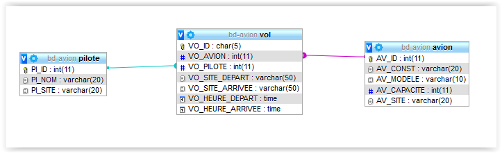

# Découverte du SQL et pratique

Après une introduction sur les concepts du Structure Query Langage, le SQL, vous allez pouvoir vous plonger dans le 
[cours de base en SQL](./cours/cours-sql.md)

Ce cours aborde tous les concepts important pour savoir construire des requêtes. Il contient 31 exercices sur la base de données **bd-avion**.

**Pour ce cours nous avons besoin de faire quelques [installations](installation/installation.md).**

Voici les liens vers le script de création des tables et des enregistrements.

- [Script de création de la base de données bd-avion](./pratique/script-création-bd-avion.sql)
- [Liste des 31 requêtes à écrire et tester](./pratique/TP-31-Requêtes-sur-la-BD-Avion.pdf)

## Pratique de base

### Schéma de la base de données

Dans cette base de données, il y a 3 tables :

- Pilote
- Avion
- Vol

Un Vol a obligatoirement un Avion et un Pilote (enfin, on espère !) 



### Script SQL de la structure des tables

```sql
CREATE TABLE IF NOT EXISTS `avion` (  
  `AV_ID` int(11) NOT NULL,  
  `AV_CONST` varchar(20) DEFAULT NULL,  
  `AV_MODELE` varchar(10) DEFAULT NULL,  
  `AV_CAPACITE` int(11) DEFAULT NULL,  
  `AV_SITE` varchar(20) DEFAULT NULL,  
  UNIQUE KEY `AV_ID` (`AV_ID`)  
) ENGINE=InnoDB DEFAULT CHARSET=utf8;  

CREATE TABLE IF NOT EXISTS `pilote` (  
  `PI_ID` int(11) NOT NULL,  
  `PI_NOM` varchar(20) DEFAULT NULL,  
  `PI_SITE` varchar(20) DEFAULT NULL,  
  UNIQUE KEY `PI_ID` (`PI_ID`)  
) ENGINE=InnoDB DEFAULT CHARSET=utf8;  

CREATE TABLE IF NOT EXISTS `vol` (  
  `VO_AVION` int(11) NOT NULL,  
  `VO_PILOTE` int(11) NOT NULL,  
  `VO_SITE_DEPART` varchar(50) DEFAULT NULL,  
  `VO_SITE_ARRIVEE` varchar(50) DEFAULT NULL,  
  `VO_HEURE_DEPART` time DEFAULT NULL,  
  `VO_HEURE_ARRIVEE` time DEFAULT NULL,  
  UNIQUE KEY `VO_ID` (`VO_ID`),  
  KEY `fk_vol_pilote_id` (`VO_PILOTE`),  
  KEY `fk_vol_avion_id` (`VO_AVION`)  
) ENGINE=InnoDB DEFAULT CHARSET=utf8;  
```

### Liste des 31 requêtes à écrire et tester

1. liste de tous les numéros d’avions
2. Liste des noms des pilotes
3. Liste des marques d’avions (sans doublon)
4. Liste des vols pour Nice
5. Liste des avions qui ont plus de 200 places
6. Liste des avions AIRBUS localisés à Toulouse
7. Liste des avions AIRBUS allant à Paris
8. Liste des vols Paris-Nice et Toulouse-Paris
9. Liste des avions Airbus et Boeing
10. Liste des Airbus ou des avions de plus de 200 places
11. Liste des avions AIRBUS qui ne sont pas localisés à Toulouse
12. Liste des Airbus qui ne vont pas à Paris
13. Liste des avions pour Paris qui ne sont pas des Airbus
14. Liste de tous les vols avec le nom des avions
15. Type et capacité des avions en service (donc des avions qui volent !)
16. Liste des avions AIRBUS allant à Paris
17. Nom des pilotes en service
18. Nom des avions (BOEING) ayant une même capacité (auto-jointure)
19. Nombre d’avions de chaque marque
20. Nombre de pilotes différents pour chaque avion en service

21. Nombre de vols différents pour chaque pilote (regroupé par nom)
22. Pilotes (ordre croissant des numéros) assurant plus d’un vol (Afficher: Numéro et nom des pilotes,  nombre de vols)
23. Nombre de vols assurés au départ de Nice ou de Paris par chaque pilote (Afficher: Numéros des pilotes, ville de départ et nombre de vols)
24. Nombre de vols assurés au départ ou à l'arrivée de Nice par chaque pilote (Afficher: Numéros des pilotes,  nombre de vols)
25. Liste des vols dont la ville de départ correspond à la ville où est localisé l'avion
26. Liste des avions de capacité égale ou supérieure à la moyenne
27. Capacité mini et maxi des BOEING
28. Capacité moyenne des avions localisés à Paris avec 2 chiffres après la virgule
29. Capacité moyenne des avions par marque
30. Capacité totale des avions de la table avion
31. Affichage de l’heure système avec les secondes

### Solution pour les 31 requêtes

[Les solutions](pratique/solutions/README.md)

Certaines requêtes peuvent être simplifiées. On vous laisse chercher et tester...

## Travaux pratiques avec SELECT et CRUD

[TP avec SQL](autres-exercices-sql/travaux-pratiques-sql.md)

## Ressources Web

### Supports & sites pour s'entrainer

* [sql.sh](http://sql.sh/) pour revoir les concepts SQL.
* [w3schools](https://www.w3schools.com/sql/) pour s'entraîner
* [sqlbolt.com](https://sqlbolt.com/)
* [SQL_Tutorial](https://sqlzoo.net/wiki/SQL_Tutorial)

### Remplir vos tables

Il existe des sites pour générer du code afin de remplir vos tables MySQL sans devoir écrire des tonnes de requêtes d'insertion.

[Utiliser le site Mockaroo](https://www.mockaroo.com/)

Auteur : **Philippe Bouget**