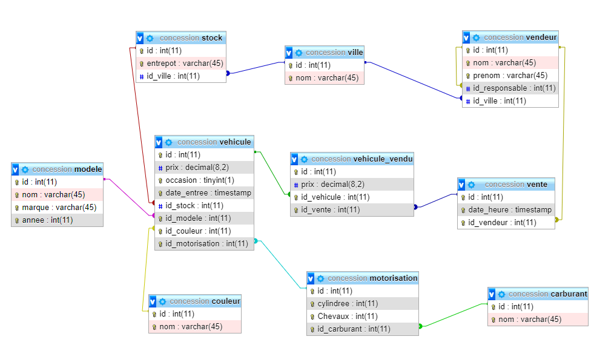

# Travaux pratiques Select & CRUD

##  Base de données **Gestion Concessionnaire Auto**

Les scripts SQL du schéma et des données sont détaillés ci-dessous.

## Base de données

* [schema](conception/schema.sql)
* [data](data/data.sql)

## Remarques

* Vous trouverez ici, une série d'exercices à résoudre (avec des requêtes simples puis plus complexes).
* Utilisez un client MySql comme Workbench ou DataGrip pour écrire et exécuter vos requêtes.  
* Pour chaque exercice, vous avez une solution proposée.  
* Ces exercices de révisions font le tour de ce qu'il faut connaître en SQL.
* Si dans votre vie professionnelle, vous devez écrire des requêtes SQL, regardez s'il n'existe pas un cas similaire ici.

A vous de jouer...

## Encore des SELECT

1. Afficher toutes les données des vendeurs (sans faire de jointure)
2. Afficher le nom et le prénom de tous les vendeurs  
3. Afficher le prénom de tous les vendeurs  
4. Afficher le prénom de tous les vendeurs sans doublon (une seule ligne par prénom)
5. Afficher les données des vendeurs et de sa ville rattachée
6. Afficher le nom, prénom et la ville des vendeurs
7. Afficher le nom, prénom et la ville des vendeurs en affichant en entête de colonne : nom, prénom, ville  
8. Afficher le nom, prénom et nom du responsable des vendeurs  
9. Afficher la liste des véhicules rouges  
10. Afficher des véhicules rouges et des véhicules verts  
11. Afficher des véhicules en stock  
12. Afficher des véhicules en stock, ayant une couleur contenant le lettre u  
13. Afficher des véhicules en stock à Nantes  
14. Rechercher le carburant essence.  
15. Écrire une requête recherchant un unique vendeur  
16. Écrire une requête recherchant une unique motorisation  
17. Écrire une requête recherchant un unique véhicule  
18. Afficher des modèles et de leur différent prix pour les véhicules essences et des véhicules rouges. 
(Indication : le SELECT des véhicules rouges est différent du SELECT des véhicules essence).  
19. Afficher de tous les véhicules avec toutes leurs caractéristiques  
20. Afficher de tous les véhicules avec toutes leurs caractéristiques, sans afficher les id  
21. Afficher de tous les véhicules avec toutes leurs caractéristiques, sans afficher les id, et en utilisant les alias pour les colonnes  
22. Afficher des véhicules vendus avec leurs caractéristiques et le nom du vendeur
23. Afficherte des véhicules en vente
24. Afficher des motorisations triées par carburant, puissance, cylindrée.  
25. Inventaire du stock : nombre de véhicules par stock/marque/modèle.  
26. Afficher des stocks et du prix du vehicule le plus cher dans chaque stock (sans afficher le véhicule).  
27. Pour chaque stock, afficher la marque ayant le vehicule le moins cher, ainsi que sa valeur. (Cet exercice est plus difficile).

## Un peu de CRUD 

1. Ajouter un nouveau vendeur.  
2. Mettre à jour le nom d'un vendeur.  
3. Affecter tous les vendeurs de la ville de Nantes à la ville de Saint-Nazaire.  
4. Supprimer le vendeur ayant l'id 8.