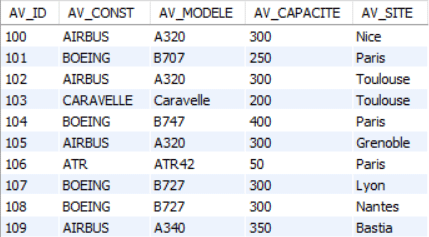
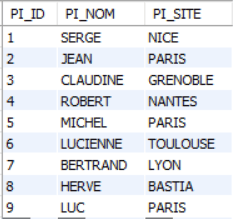
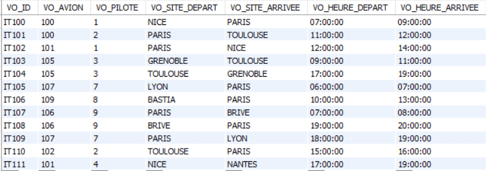
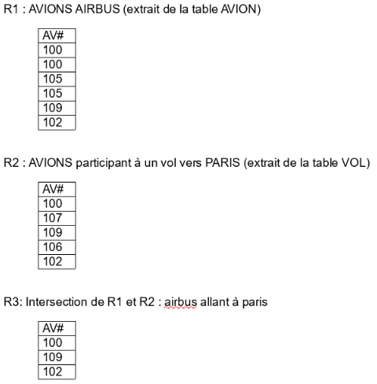
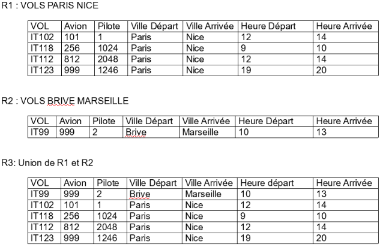
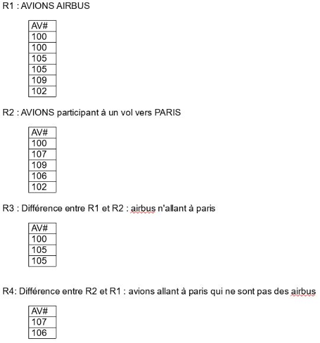
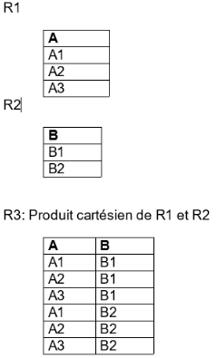
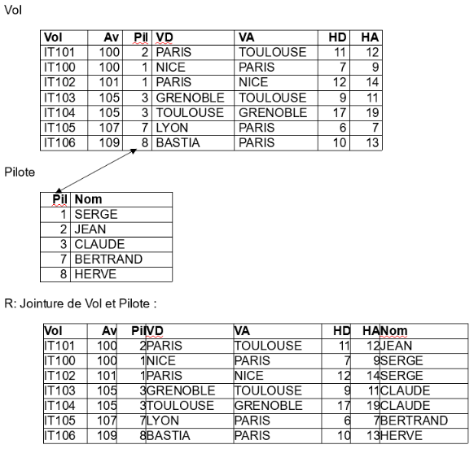
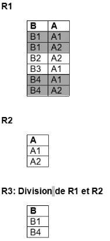
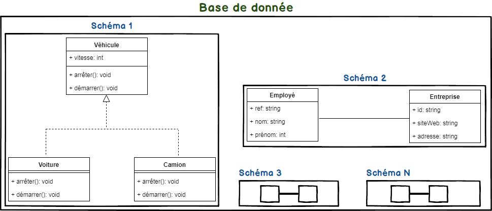

# LANGAGE SQL

   

**SOMMAIRE DU COURS**   
   
1. Introduction   
1.1. Historique   
1.2. Définition   

2. Concepts des SGBD relationnels  
2.1. Structure  des données  
2.2. Les Règles (ou contraintes) d'intégrité

3. Algèbre relationnelle  
3.1. Base de travail  
3.2. Opérateurs unaires relationnels  
3.3. Opérateurs ensemblistes   
3.4. Opérateurs binaires relationnels

4. Règles de syntaxe

5. La sélection des données  
5.1. L’ordre SELECT   
5.2. Sélection simple   
5.3. Projection   
5.4. Restriction (sélection avec restriction)   
5.5. Intersection   
5.6. Union   
5.7. Différence   
5.8. Jointure   
5.9. Opérateurs de partitionnement)   
5.10. Les sous-interrogations (SELECT imbriqués)   
5.11. Fonctions intégrées   
5.12. Les structures arborescentes   

6. Les manipulations de données  
6.1. L’ordre INSERT   
6.2. L’ordre DELETE   
6.3. L’ordre UPDATE   
6.4. Validation des modifications   

7. Langage de description des données (LDD)   
7.0. Notions de Schéma et Database
7.1. Création d'une table   
7.2. Création d'une vue   
7.3. Création de synonymes   
7.4. Création d’un index   
7.5. Modification de structure   
7.6. Ajout d'une colonne   
7.7. Modification de la structure d'une table   
7.8. Suppression d'une colonne   
7.9. Suppression des objets   
7.10. Renommer des objets   
7.11. Commentaires - description   

## 1 Introduction

1.1. Historique
--------------

S.Q.L. est un ***langage structuré*** permettant d’interroger et de modifier les données contenues dans une base de données relationnelle.

S.Q.L. signifie ***Structured Query Language*** (langage structuré d’interrogation). Il est issu de SEQUEL : Structured English Query
Language.

C’est le premier langage pour les S.G.B.D Relationnels. Il a été
développé par IBM en 1970 pour système R, son 1er SGBDR.

S.Q.L. a été reconnu par l’ANSI (Association de Normalisation des
Systèmes d’Information) puis imposé comme norme. Il n’existe pas de S.G.B.D.R sans S.Q.L.

Malheureusement, malgré la norme S.Q.L., il existe plusieurs dialectes. Les différences entre ces différents dialectes sont minimes et tous respectent un minimum commun : c’est ce que nous allons étudier dans ce
cours.

1.2. Définition 
--------------

**S.Q.L**. est un langage relationnel qui permet d’effectuer les tâches
suivantes :

- Définir et modifier la structure de la base de données
- Interroger et modifier de manière non procédurale (c’est à dire interactive) la base de données
- Contrôler la sécurité et l’intégrité de la base.

S.Q.L. est un langage interactif, cependant, il peut aussi être intégré
dans un langage de programmation pour le développement d’applications.

## 2 Concepts des SGBD relationnels   

2.1. Structure  des données  
---------------------------

Rappelons comment peut être défini simplement le modèle relationnel.   

Une base de données relationnelle se présente comme **un ensemble de relations** que l’on appelle couramment des **tables**. Toute relation a un **schéma** qui décrit sa structure. Le schéma est composé d'un ensemble  **d'attributs** (on utilise souvent le terme de **colonnes**) dont un
sous-ensemble constitue la **clé**. La clé permet d'identifier les autres attributs de la relation. Les valeurs des attributs sont atomiques, c'est-à-dire non décomposables, et appartiennent au même domaine.

Cependant, pour être capable de manipuler correctement les données d'une base relationnelle, des définitions plus précises et rigoureuses sont nécessaires. En fait, c'est à partir de la **théorie des ensembles**, base formelle sur laquelle repose le modèle relationnel, que se construisent les différents concepts.

### a) La notion de domaine  

Le premier concept à définir est celui qui permet de préciser les
**ensembles de départ**, ou **domaines**.

Un domaine représente **l'ensemble des valeurs admissibles** pour un
composant d'une relation. Il est caractérisé par un **nom**.

Comme tout ensemble, un domaine peut être défini en **extension**
(c'est-à-dire en donnant la liste exhaustive de toutes les valeurs qui le composent), ou en **intension** (en définissant une propriété caractéristique du domaine, d’ailleurs on parle aussi de **définition**).

Par exemple, il est identique de parler de l'ensemble {1,3,5,7,9} ou de l'ensemble {entiers impairs positifs et inférieurs à 10}.

Ce concept de domaine est primordial pour assurer un contrôle lors de la manipulation de la base : toute valeur n'appartenant pas au même domaine de définition doit se voir rejetée.

### b) La notion de relation (ou tables)  

Pour appréhender facilement cette notion, nous allons prendre l’exemple
suivant :

si l'on considère le domaine **COULEUR = { rouge, vert, jaune }** 
 et le domaine **FORME = { cube, sphère, cône }**, le produit cartésien des deux domaines est composé des neuf tuples (ou enregistrements) qui sont :

**{ cube rouge, cube vert, cube jaune, sphère rouge, sphère verte,...}**.

Au sens mathématique de Codd, **la relation (ou table) peut être définie comme un sous-ensemble, caractérisé par un nom, du produit cartésien d'une liste de domaines**.

On utilise généralement une représentation commode sous forme d'une table à deux dimensions, où **chaque ligne correspond à un tuple **(enregistrement)** **alors que chaque colonne correspond à un domaine** du produit cartésien utilisé.

Dans la liste des domaines, un même domaine peut bien sûr apparaître plusieurs fois.

Par exemple, nous pouvons composer la relation suivante :

cube rouge,  
cube jaune,   
sphère rouge,   
sphère vert,   
sphère jaune,   
cône rouge,   
qui matérialise le fait que tous les objets ne sont pas construits dans
toutes les couleurs.

### c) La notion d'attribut  

Le concept d'attribut a été introduit pour expliquer le **rôle joué par un domaine** dans une relation : il **permet de distinguer les différentes colonnes, tout en permettant plusieurs colonnes du même domaine**. Un attribut est une colonne d'une relation caractérisée par
un nom.

Par exemple, une relation VOL peut être constituée d'un n° de vol, d'une ville de départ, d'une ville d'arrivée. Vous remarquerez que ces deux derniers attributs appartiennent au même domaine "**villes desservies par un aéroport**".

Remarque :

Les tuples correspondent à un ensemble de valeurs prises par les
attributs d'une table pour représenter une entité, un objet ou un lien entre les objets du monde réel. Pour un objet donné, et à un instant donné, nous pouvons ne pas disposer de la totalité des informations permettant la description de cet objet ou de ce lien. Autrement dit, les valeurs de quelques attributs peuvent avoir des valeurs "inconnues" :

elles sont dites NULLES (cela s’écrit **NULL**).

2.2. Les Règles (ou contraintes) d'intégrité   
--------------------------------------------

**Les règles d'intégrité sont les assertions que doivent vérifier toutes les données stockées dans une base**. Certaines de ces contraintes sont qualifiées de "**structurelles**" : elles sont inhérentes au modèle, c'est-à-dire nécessaires à sa mise en œuvre, à son bon fonctionnement.

D'autres peuvent apparaître comme étant des règles de
"**comportement**", propres au schéma particulier d'un système
d'information, d'un type d'application.

En fait, le modèle relationnel impose a priori une règle structurelle, **l'unicité des clés**. Il est courant d'y ajouter deux types de règles d'intégrité supplémentaires, les **contraintes de référence** et les **contraintes d'entité,** ceci afin d'obtenir les règles d'intégrité
**minimum** supportées par le modèle relationnel. Pour être parfaitement proche des recommandations de Codd, il conviendrait d'y adjoindre la **contrainte d'intégrité de domaine,** celle-ci concerne le **contrôlesyntaxique** et **sémantique** d'une donnée quelconque en se référant au type de définition du domaine.

### a) Unicité de clé  

Par définition, une relation est un ensemble de tuples. **Un ensemble n'ayant pas d'élément en double**, il ne peut donc exister deux fois le
même tuple dans une relation. Afin d'identifier les tuples d'une
relation sans en fournir toutes les valeurs, on utilise la notion de
clé.

**La clé est l'ensemble d'attributs minimum dont la connaissance des
valeurs permet d'identifier, de manière unique, un tuple de la relation
considérée**.

**Toute relation doit posséder au moins une clé**. Dans le cas où il en
existe plusieurs (généralement des clés candidates), on en choisit une
de manière arbitraire, qui est appelée **clé primaire** (PRIMARY KEY ou
PK en SQL). La détermination d'une clé au sein de la relation nécessite
une réflexion importante : il s'agit de prévoir toutes les extensions
possibles de la relation et de s'assurer que l'ensemble des attributs
retenus pour constituer la clé permettra toujours l'identification d'un
tuple unique !

### b) Intégrité référentielle  

Ce type de contrainte apparaît clairement dès lors que l'on réfléchit
aux principes de conception d'un modèle relationnel. Celui-ci est
utilisé pour conceptualiser des **entités** du monde réel (qui sont les
objets ayant une existence propre ou créer pour des besoins de gestion),
et des **associations** entre ces objets.

En terme de base de données, une entité correspond à un enregistrement dans une table, qui comporte la clé de l'entité
(identifiant) et ses caractéristiques (sous forme d'attributs). Une
association est également modélisée par une relation : celle-ci doit
comporter les clés des entités participantes (pour assurer son unicité)
ainsi que les caractéristiques propres à l'association.

On distingue en fait deux catégories de relations :

- les relations indépendantes ou **statiques** (matérialisant des entités)
- les relations dépendantes ou **dynamiques** (matérialisant des
associations). Cette dépendance est caractérisée par la présence de
**clés étrangères** (FOREIGN KEY ou FK), c'est-à-dire **d'attributs qui
sont clés primaires dans d'autres relations**.

**La contrainte de référence est une contrainte d'intégrité** qui,
portant sur une relation R1, consiste à imposer que la valeur d'un
groupe d'attributs de R1 apparaisse comme valeur de clé primaire dans
une (ou plusieurs) autre (s) relation (s).

Voici un exemple :

Considérons un système d'information partielle concernant la gestion
commerciale d'une entreprise. On peut imaginer les relations suivantes :

Les 2 entités :

**CLIENT** [ __n° client__, références bancaires, adresse de livraison,...]   

 **PRODUIT** [ __n° produit__, désignation, code TVA, unité de
conditionnement,...]

et la relation :

**COMMANDE-ENREGISTREE** [ **n° client**, **n° produit**, quantité commandée...]

où les attributs **n° client** et **n° produit** sont des clés étrangères.

Cette intégrité référentielle doit induire certains contrôles
automatiques de la part d'un SGBDR. Ainsi, on ne peut pas mémoriser,
dans la relation COMMANDE\_ENREGISTREE, de ligne comportant un numéro
client inexistant dans la relation CLIENT ou un numéro produit inconnu
dans la relation PRODUIT.

### c) Intégrité d'entité (ou de relation)  

Lors de l'insertion d’enregistrements dans une relation, il arrive
fréquemment qu'un attribut soit inconnu ou vide de sens, sous certaines
conditions, on est alors conduit à introduire dans la relation une
valeur conventionnelle, dite **NULL** (à ne pas confondre avec
l'initialisation à zéro ou à blanc d'un attribut numérique ou
alphabétique !).

Il est bien évident que tout attribut dans une relation ne peut pas
prendre une valeur NULL. En effet, l'existence d'une clé unique, par
exemple, impose la connaissance de la clé pour pouvoir vérifier que
cette valeur de clé n'existe pas déjà.

La contrainte d'entité (ou de relation) est une contrainte d'intégrité
imposant que tout attribut qui participe à une clé primaire soit non
NULL.

## 3. Algèbre relationnelle  

L'algèbre relationnelle est un concept mathématique de relation de la théorie des ensembles.

L'algèbre relationnelle a été inventée en 1970 par Edgar Frank Codd, le directeur de recherche du centre IBM de San José. Elle est constituée d'un ensemble d'opérations formelles sur les relations.

Les opérations relationnelles permettent de créer une nouvelle relation (table) à partir d'opérations élémentaires sur d'autres tables (par exemple l'union, l'intersection, ou encore la différence).

Les principes de l'algèbre relationnelle sont beaucoup utilisés de nos
jours par les SGDB pour la gestion des bases de données relationnelles.

Ce chapitre présente les opérateurs utilisés en algèbre relationnelle.

### 3.1. Base de travail
-------------------

Tous les exemples et exercices dans ce cours concerneront la base de données suivante :

Vous pouvez accéder à la DESCRIPTION (structure de la table) en tapant
la commande suivante : **DESC** avion ou **DESC** vol ou **DESC** pilote

Cette commande vous donne la liste des ATTRIBUTS et leur TYPE sous forme
tabulaire.

**AVION**(**av_id**, av_const, av_modele, av_capacite, av_site)

**PILOTE**(**pi_id**, pi_nom, pi_site)

**VOL**(**vo_id**,vo_pilote,vo_avion,vo_site_depart,vo_site_arrivee,vo_heure_depart, vo_heure_arrivee)

----

**TABLE AVION (appelée aussi Relation AVION) :**

av_id : numéro d’avion

av_const : marque de l’avion

av_modele : type d’avion

av_capacite : capacite en nombre de passagers

av_site : ville où est basé l’avion



**TABLE PILOTE**

pi_id : numéro du pilote

pi_nom : nom du pilote

pi_site : site du pilote



**TABLE VOL**

vo_id : numéro du vol

vo_avion : numéro de l’avion

vo_pilote : numéro du pilote

vo_site_depart : ville départ

vo_site_arrivee : ville d’arrivée

vo_heure_depart : heure de départ

vo_heure_arrivee : heure d’arrivée



3.2. Opérateurs unaires relationnels   
-----------------------------------

Les opérateurs ***unaires*** sont les opérateurs qui ne font intervenir
qu’***une*** ***seule table***.

### a) Sélection  

Elle opère un ***découpage horizontal*** de la table.

**Certains enregistrements et tous les attributs.**

Exemples :

- liste des avions avec toutes les informations
- liste des vols pour Nice
- liste des avions qui ont plus de 200 places

### b) Projection  

Elle opère un ***découpage vertical*** de la table.

Exemples :

- liste de tous les numéros d’avions
- liste des noms des pilotes
- liste des marques d’avions

3.3. Opérateurs ensemblistes  
---------------------------

### a) Intersection  

Est utilisé pour relier 2 tables unicompatibles, c’est à dire ayant le
même nombre d’attributs et des attributs respectifs définis sur le même
domaine.

Pour l’intersection il faut une ***structure identique***.


note : sur l'image AV# correspond à la clef primaire.

Exemples :

- Liste des avions AIRBUS localisés à Toulouse
- Liste des avions AIRBUS allant à Paris 

### b) Union

Est utilisé pour relier 2 tables unicompatibles, c’est à dire ayant ***le même nombre d’attributs*** et des attributs respectifs définis sur le même domaine : il faut une ***structure identique***.



Exemples:

- liste des vols Paris-Nice et Toulouse-Paris
- liste des avions Airbus et Boeing
- liste des Airbus ou des avions de plus de 200 places

### c) Différence

Est utilisé pour relier 2 tables unicompatibles, c’est à dire ayant le même nombre d’attributs et des attributs respectifs définis sur le même domaine.



3.4. Opérateurs binaires relationnels
------------------------------------

Les opérateurs binaires sont ceux qui font intervenir deux tables.

### a) Le produit cartésien  

Il consiste à rassembler deux tables en une seule.



### b) La jointure

La **jointure** consiste à rechercher entre ***deux tables ayant un attribut commun*** (même type et même domaine de définition) tous les tuples (enregistrements) pour lesquels ces attributs ont la ***même valeur***.

La jointure entre les tables VOL et PILOTE consiste à rechercher toutes les informations du pilote de chaque avion. Concrètement elle réalise la concaténation des tuples (ou n-uplets) de la table Avion avec la table Pilote chaque fois que **vo_pilote = pi_id**.



Dans notre exemple, la jointure est possible par l’attribut vo_pilote présent dans vol et pi_id présent dans Pilote.

### c) La division  



La division consiste à trouver la liste des valeurs d’un attribut de ***R1 tel qu’il existe un tuple dans R1 pour chaque valeur de R2*** pour l’attribut correspondant.

Exemples :

- liste des pilotes qui conduisent tous les avions
- liste des avions qui vont dans toutes les villes

## 4. Exemple d'écritures différentes pour les jointures

Il existe plusieurs sortes de jointure, résumées par ce schéma :
 

## 5. La sélection des données

5.1. L’ordre SELECT
------------------

Le SELECT sert à interroger les données et à les présenter triées et/ou regroupées suivant certains critères. En voici la syntaxe « officielle » ;

**SELECT** * ou ALL avec **DISTINCT** ou **DISTINCTROW**

**FROM** table1 **AS** alias ou pas, table2 **AS** alias ou pas

**WHERE** condition

**GROUP BY** expr, expr ... **HAVING** condition

**UNION** ou **INTERSECT** ou **MINUS** SELECT ...

ou 

**INNER JOIN** ou  **LEFT JOIN**  

**ORDER BY** expr **ASC** ou **DESC**,

5.2. Sélection simple
--------------------

Il s’agit de retrouver tous les enregistrements.

Exemple : afficher tous les vols

```sql
SELECT * FROM VOL
```

5.3. Projection
--------------

***Il s’agit de n’afficher que certains attributs dans une table pour
tous les enregistrements de cette table .***

```sql
SELECT col1, col2, ..., coln
FROM table;
```

Exemple : lister les numéros de vols

```sql
SELECT vo_id
FROM VOL;
```

S'il existe des doublons à la suite d'une projection, ils seront
éliminés en théorie (théorie des bases de données relationnelles). Pour les éliminer dans une requête SQL, il faudra utiliser la clause **DISTINCT** ou **DISTINCTROW** suivant le SGBD.

**Exemple :** liste des marques d’avions :

```sql
SELECT av_const
FROM AVION;
```

les même marques vont apparaître plusieurs fois sauf avec l’écriture suivante :

```sql
SELECT DISTINCT av_const
FROM AVION;
```

**Exercices:**

n°1 liste de tous les numéros d’avions

n°2 liste des noms des pilotes

n°3 liste des marques d’avions

5.4. Restriction (sélection avec restriction)
--------------------------------------------

Il s’agit de retrouver les enregistrements qui vérifient certains
critères. Le résultat de la restriction est une nouvelle table
comportant le ***même nombre de colonnes que la table de départ et un nombre de lignes inférieur ou égal***.

```sql
SELECT ...
FROM table
WHERE prédicat
```

Le Prédicat est le résultat de la comparaison de deux expressions au moyen d'un opérateur de comparaison :

**EXPRESSION OPÉRATEUR EXPRESSION**

L’expression peut contenir :

- des noms de colonne,
- des constantes
- des expressions arithmétiques :  +  -  *  /   (  ) 

Les opérateurs peuvent être :

- \>, <, =, <>, <=, >= pour les comparaisons
- BETWEEN ... AND : entre ... et
- IN  et NOT IN : expriment l’appartenance (ou non) d’un tuple à l’ensemble résultat du SELECT imbriqué
- LIKE suivi d’une expression représentant un ensemble de valeurs. Dans ces expressions

    - **%** désigne un ensemble de caractères,
    - **_** remplace une lettre.

- EXISTS et NOT EXISTS : expriment l’appartenance (ou non) d’un tuple à l’ensemble résultat du SELECT imbriqué
- IS NULL et IS NOT NULL : testent si un attribut possède ou non une valeur
- ANY : au moins 1 …
- ALL ou * : tous …-

**Exemples**

Tous les vols qui arrivent à 19 heures

```sql
SELECT *
FROM VOL
WHERE vo_heure_arrivee = 19;
```
Nom des pilotes dont la 2° lettre est un S

```sql
SELECT pi_nom
FROM PILOTE
WHERE pi_nom **LIKE** '_S%'
```

Nom des pilotes en service

```sql
SELECT pi_nom
FROM VOL, PILOTE
WHERE PILOTE.pi_id = VOL.pi_id
```

Utilisation de **OR** et **AND**

On peut utiliser les mots "***OU***" et "***ET***" pour exprimer des conditions de sélection combinant plusieurs critères de sélection. Il s'agit de combiner des **intersections** et des **unions** à l'aide des opérateurs OR et AND.

- Priorité du `AND` sur le `OR`
- utilisation conseillée des parenthèses.
- L'opérateur `NOT` permet d'inverser le sens du prédicat.
- Pas de limite dans le nombre de prédicats ajoutés.

**Exemples**

Tous les vols qui partent à 17h et arrivent à 19h

```sql 
SELECT *
FROM VOL
WHERE vo_heure_arrivee = 19 AND vo_heure_depart=17;
```

Tous les vols qui partent à 17h ou 18h

```sql
SELECT *
FROM VOL
WHERE vo_heure_depart = 17 OR vo_heure_arrivee=18;
```

**Exercices:**

n°4 liste des vols pour Nice

n°5 liste des avions qui ont plus de 200 places

5.5. Intersection
----------------

Cette opération consiste à **rechercher les lignes communes entre 2 tables de même structure ou dans la même table**.

La table résultat comportera autant de lignes qu'il y aura de lignes identiques dans les deux tables de départ.

Exemples :

​1) Liste des avions AIRBUS de plus de 200 places (1 table)

```sql
(SELECT av_id FROM AVION
WHERE av_const = 'AIRBUS')

INTERSECT

(SELECT av_id FROM AVION
WHERE av_capacite > 200);
```

>Attention, **INTERSECT** élimine les doublons s'il y en a !

qui peut aussi s’écrire :

```sql
SELECT * FROM AVION
WHERE av_const = 'AIRBUS'
AND av_capacite IN(SELECT av_capacite FROM AVION WHERE av_capacite > 200);
```

Ou encore puisque on reste sur la même table :

```sql
SELECT av_id FROM AVION
WHERE av_const = 'AIRBUS'
AND av_capacite > 200;
```

​2) Liste des avions BOEING allant à Nice (2 tables) :

La commande `INTERSECT` fonctionne sous Oracle mais pas avec MySQL.

```sql
(SELECT av_id FROM AVION WHERE av_const = 'BOEING')

INTERSECT

(SELECT av_id FROM VOL WHERE VA = 'NICE');
```

pour MySQL il faut écrire la requête de la manière suivante :

```sql
SELECT * FROM AVION
WHERE av_const = 'BOEING'
AND av_id IN(SELECT av_id FROM VOL WHERE VA = 'NICE');
```

C’est à dire trouver tous les avions dont le numéro appartient à l’ensemble des numéros d’avions des vols à destination de Nice.

**Exercices :**

n°6 Liste des avions AIRBUS localisés à Toulouse

n°7 Liste des avions AIRBUS allant à Paris

5.6. Union
---------

Cette opération consiste à ***réunir deux ou plusieurs tables de même structure***.

Les doublons, s'il en existe, sont éliminés.

La table résultat comportera autant de lignes qu'il existe de lignes différentes dans les tables unies.

**Exemples :**

Liste des avions de marque BOEING ou de moins de 250 places (UNION)

```sql
(SELECT av_id, av_modele, av_const FROM AVION WHERE av_const = 'BOEING')

UNION

(SELECT av_id, av_modele, av_const FROM AVION WHERE av_capacite < 250)
```

Qui peut aussi s’écrire puisque on reste sur la même table:

```sql 
SELECT * FROM AVION
WHERE av_const = 'BOEING' OR av_capacite < 250
```

Ou bien:

```sql
SELECT av_id, av_modele, av_const FROM AVION
WHERE av_const = 'AIRBUS'

OR av_capacite

IN ( SELECT av_capacite FROM AVION WHERE av_capacite > 200 )
```

**Exercices:**

n°8 liste des vols Paris-Nice et Toulouse-Paris

n°9 liste des avions Airbus et Boeing

n°10 liste des Airbus ou des avions de plus de 200 places

5.7. Différence
--------------

Cette opération consiste à ***rechercher les lignes qui existent dans une table et pas dans une autre table de même structure ou de structure différente***.

Le nombre de lignes de la table résultat sera égal à la différence entre les nombres de lignes des deux tables de départ.

Exemples :

Liste des avions BOEING ne partant pas de Nice (DIFFERENCE) :

Utilisation du mot-clé : `MINUS` n'est plus supporté par MySQL !

```sql
(SELECT av_id FROM AVION WHERE av_const = 'BOEING')

MINUS

(SELECT av_id FROM VOL WHERE vo_site_depart = 'NICE')
```

pour MySQL, on peut l’écrire comme ceci ci-dessous :

```sql
SELECT * FROM AVION

WHERE av_const = 'BOEING'

AND av_id NOT IN

(SELECT VO_AVION FROM VOL WHERE vo_site_depart = 'NICE');

```

C’est à dire trouver tous les avions dont le numéro n’appartient pas à l’ensemble des numéros d’avions des vols partants de Nice.

**Exercices :**

n°11 liste des Airbus qui ne sont pas localisés à Toulouse

n°12 liste des Airbus qui ne vont pas à Paris

n°13 liste des avions pour Paris qui ne sont pas des Airbus

5.8. Jointure
------------

La **jointure** consiste à ***rechercher entre deux tables ayant un attribut commun*** (même type et même domaine de définition) ***tous les tuples (lignes) pour lesquels ces attributs ont la même valeur***.

Pour représenter la jointure il y a 2 méthodes :

- Ensembliste qui réalise l’intersection de deux ensembles (plusieurs select)
- Prédicative qui vérifie l’égalité de deux attributs (un seul select)

### a) Méthode ensembliste  

```sql
(premier ensemble)

SELECT liste d’attributs

FROM table1

WHERE attribut de jointure

IN

(deuxième ensemble)

(SELECT attribut de jointure

FROM table2

WHERE condition)
```

***Le SELECT qui suit le IN est celui qui est exécuté le premier***. Le résultat est un ensemble de valeurs de l’attribut de jointure. On extrait ensuite de table1 tous les enregistrements dont la valeur de cet attribut appartient à l’ensemble.

**Exemples :**

Nom des pilotes assurant un vol au départ de Paris :

```sql
SELECT pi_nom FROM PILOTE

WHERE pi_id IN (SELECT vo_pilote FROM VOL

WHERE vo_site_depart= 'PARIS');
```

Nom des pilotes conduisant un Airbus :

```sql

SELECT pi_nom FROM PILOTE

WHERE pi_id IN
 (SELECT vo_pilote FROM VOL

WHERE av_id IN
 (SELECT av_id FROM AVION

    WHERE av_const = 'AIRBUS'));
```

### b) Méthode prédicative

Il y a ***un seul SELECT pour toute la requête***.

***La liste de toutes les tables concernées apparaît après le FROM***

La traduction de la jointure se fait par la condition de jointure
(égalité entre 2 attributs)

**Exemples :**

Nom des pilotes assurant un vol au départ de Paris :

```sql
SELECT pi_nom FROM PILOTE, VOL

WHERE pilote.pi_id = vol.vo_pilote

AND vo_site_depart='PARIS';
```

Nom des pilotes conduisant un Airbus :

```sql
SELECT DISTINCT pi_nom FROM PILOTE, VOL, AVION

WHERE PILOTE.pi_id = VOL.vo_pilote

AND AVION.av_id = VOL.vo_avion

AND av_const = 'AIRBUS';
```

**Exercices :**

n°14 Liste de tous les vols avec l'affchage des Modèle des avions

n°15 Type et capacité des avions en service (avions qui volent)

n°16 Liste des avions qui ne sont pas des AIRBUS allant à Paris

n°17 Nom des pilotes en service

### c) Auto-jointure

L’auto-jointure est la ***jointure entre une table et elle-même***, pour sélectionner des enregistrements correspondant à d’autres enregistrement de la même table. Pour effectuer ce type de requête , il faut créer un ou plusieurs **SYNONYMES** ou **ALIAS**.

**Comment créer un synonyme ?**

Il suffit d’écrire après la commande **FROM,** le nom de la table, un espace et le nouveau nom (le synonyme) que nous allons utiliser puis une virgule, à nouveau le nom de la table, un espace et un autre nom de synonyme. On aurait pu ne créer qu’un seul synonyme. C’est comme si on utilisait 2 tables différentes contenant une même structure.

**Exemple :**

```sql
SELECT usine.numero, usine.siege, usine2.lieu

FROM usine, usine usine2

WHERE usine.siege = usine2.numero;
```

Dans cette requête ci-dessus, on crée un synonyme de la table usine pour rechercher les usines qui sont des sièges. Donc, là on compare le numéro d’usine avec le numéro du siège de l’usine.

**Exercices :**

n°18 Nom des avions BOEING ayant même capacité (auto-jointure)

### d) Notion de produit cartésien   

Si on cherche à rapprocher 2 tables sans donner de condition de jointure (égalité ou inégalité sur un attribut), on réalise un PRODUIT CARTESIEN, **c'est à dire qu'à chaque ligne de la première table, on fait correspondre toutes les lignes de la deuxième table**.

Si une table comporte 1000 lignes et l'autre 500 (ce qui est assez peu), la table résultat comportera 500 000 lignes ce qui est considérable et risque de perturber le système (temps de réponse de la machine, place occupée, gêne pour les autres utilisateurs).

Il sera donc important de veiller très attentivement aux conditions de jointure exprimées dans les requêtes.

Remarque : **on pourra bien sûr associer une projection et une restriction à une jointure, c'est d'ailleurs ce que l'on fait le plus souvent**.

Un produit cartésien entre une table contenant 1000 enregistrements et une autre table contenant 500 enregistrements donnerait une table finale de 500000 enregistrements si aucune restriction n’est associée.

5.9. Opérateurs de partitionnement
---------------------------------

### a) GROUP BY  

Ce mot clé permet d’effectuer des regroupements sur lesquels s’opèrent les fonctions intégrées. Attention, **l'attribut apparaissant après le group by doit être l'un des attributs affichés**. **Il y a un attribut de regroupement et un attribut sur lequel s’applique la fonction**.

Exemples :

Le mot cl é Group By permet d’appliquer des fonctions de groupe décrites un peu plus loin dans le cours :

On veut connaître le montant total des salaires des employés par
service. On veut donc faire un regroupement par Service et effectuer une somme des salaires des employés :

```sql
SELECT numero_service, SUM(salaire)

FROM employe

GROUP BY numero_service
```

Autre exemple :

On veut connaître le montant total des bénéfices par type de produit :

```sql
SELECT type_produit, SUM(benefice)

FROM usine

GROUP BY type_produit
```

Remarque importante : **Si l’on souhaite afficher plusieurs colonnes qui n’ont rien à voir avec le regroupement, il faut les afficher après le select et aussi après le GROUP BY.**

**Exemple :**

```sql
SELECT nom, prenom, count(présent)

FROM employe

GROUP BY nom, prenom
```

**Exercices :**

n°19 Nombre d’avions de chaque marque

n°20 Nombre de pilotes différents pour chaque avion en service

n°21 Nombre de vols différents pour chaque pilotes (regroupé par nom)

### b) HAVING (permet de sélectionner certains groupes)  

Le mot clé **HAVING** associé au GROUP BY permet d’exprimer des conditions sur les regroupements :

**Exemple :**

Voici une requête pour afficher le nombre d’employé par service comprenant plus de 50 employés uniquement :

```sql
SELECT numero_service, count(*)

FROM employe

GROUP BY numero_service

HAVING count(*) >50
```

On peut aussi ajouter un WHERE après le FROM. (where adresse='paris') :

**Exercices :**

n°22 Pilotes (ordre croissant des numéros) assurant plus d’un vol
(Afficher: Numéro et nom des pilotes, nombre de vols)

n°23 Nombre de vols assurés au départ de Nice ou de Paris par chaque pilote (Afficher: Numéros des pilotes et nombre de vols)

n°24 Nombre de vols assurés au départ ou à l'arrivée de Nice par chaque pilote (Afficher: Numéros des pilotes, nombre de vols)

5.10. Les sous-interrogations (SELECT imbriqués)
-----------------------------------------------

Le select imbriqué est nécessaire chaque fois que l'on a besoin d'un résultat issu de la base pour tester un prédicat. Il peut généralement être remplacé par une jointure. Le select imbriqué offre souvent une meilleure lisibilité que la jointure, et il est souvent beaucoup plus performant.

```sql
SELECT ... FROM table

WHERE col opérateur (SELECT ... FROM table WHERE ...)
```

***16 niveaux*** de sous-interrogation sont possibles.

Une sous-interrogation ne ramenant rien génère une erreur.

La sous-interrogation est indépendante de l'interrogation principale.

Le noyau évalue la sous-interrogation **puis** l'interrogation
principale avec le résultat trouvé.

### a) la sous-interrogation simple  

```sql
SELECT ... FROM table

WHERE col IN (SELECT ... FROM table WHERE ...)
```

**Exemples :**

Nom des pilotes assurant un vol au départ de Paris (sous-interrogation)

```sql
Select pi_nom From pilote

Where pi_id in

(select vo_pilote from vol where vo_site_depart = `PARIS`)
```

On obtient le même résultat avec une jointure:

```sql
Select pi_nom from pilote, vol

Where pilote.pi_id=vol.vo_pilote and vo_site_depart = 'PARIS'
```

5.10.1 Utilisation des jointures pour éviter les imbrications de sous requêtes.

Types de jointures

Il y a plusieurs méthodes pour associer 2 tables ensemble. Voici la liste des différentes techniques qui sont utilisées :

- **INNER JOIN** : Nous voulons les noms des pilotes en services (associé(e)s à un vol). Cette commande est aussi nommée **EQUIJOIN*. **Elle retourne tous les enregistrements s'il y a au moins une ligne dans chaque colonne correspondant à la condition !**

```sql
SELECT distinct pilote.PI_NOM
FROM pilote
INNER JOIN vol ON pilote.PI_ID = vol.VO_PILOTE;
```

- **CROSS JOIN** : retourne le produit cartésien de 2 tables (jointure croisée)

Nous voulons associer tous les enregistrements de la table pilote à  ceux de la table avion

```sql
SELECT *
FROM pilote
CROSS JOIN avion;
```

On peut ajouter ORDER BY pi_nom pour afficher les 10 avions par pilote, ce qui fait bien 90 enregistrements.

- **LEFT JOIN** : Retourne tous les enregistrements de la première table, celle de gauche, même si la condition n’est pas vérifiée pour l’autre table.

Si nous souhaitons afficher tous les pilotes et savoir ceux qui ne sont pas en services( qui ne volent pas)

```sql
SELECT *
FROM pilote
LEFT JOIN vol ON pilote.PI_ID = vol.VO_PILOTE;
```

Tous les pilotes seront affichés y compris ceux et celles qui ne volent pas. Des colonnes avec des valeurs nulles apparaîtront forcément.

- **RIGHT JOIN** : retourne tous les enregistrements de la seconde table, celle de droite, même si la condition n’est pas vérifiée dans l’autre table.

Exemple d’une requête qui affiche tous les vols y compris les avions qui ne volent pas.

Les avions n°103, n°104 et 108 n’ont jamais volés !

```sql
SELECT *
FROM vol
RIGHT JOIN avion ON vol.VO_AVION = avion.AV_ID;
```

- **FULL JOIN** :  Retourne les résultats quand la condition est vraie dans au moins l’une des table.

On veut retourner tous les pilotes qui ont ou pas volé.
Pas de chance, FULL n’est pas reconnue, à vérifier.

- **SELF JOIN** (auto-jointure) : permet de faire une auto-jointure simplement.
Il faudrait que la table nécessite une relation réflexive.
À trouver…

- **NATURAL JOIN** : Jointure dite *naturelle* entre 2 tables car il y a au moins une colonne portant le même nom dans les 2 tables.

- **UNION JOIN** : jointure d’union

Source : [Lien vers l'article sur les jointures](https://sql.sh/cours/jointures)  

### b) Opérateur EXISTS  

```sql
SELECT ... FROM table

WHERE EXISTS (SELECT ... FROM table) ;
```

- Utilisable avec la sous-interrogation.

- Opérateur Booléen, vrai si la sous-interrogation qui suit ramène au moins une ligne.

- NOT EXISTS en inverse le sens.

Exemples :

Nom des pilotes en service (jointure)

```sql
select pi_nom from pilote

where EXISTS

(select pilote.pi_id from vol where vol.vo_pilote = pilote.pi_id);

```

On obtient le même résultat avec une jointure:

```sql
select distinct pi_nom

from vol, pilote

where pilote.pi_id = vol.pi_id ;
```

ou avec l'opérateur IN :

```sql
select pi_nom from pilote

where pi_id IN (select pi_id from vol);
```

Nom des pilotes n’ayant aucun vol

```sql
select pi_nom from pilote

where NOT EXISTS

(select pi_id from vol where vol.pi_id = pilote.pi_id);

```

On obtient le même résultat avec l'opérateur IN :

```sql
select pi_nom from pilote

where pi_id NOT IN (select pi_id from vol)
```

### c) Utilisation de IN, ANY, ALL

On doit, lors d'une sous-interrogation, et si celle-ci est susceptible de ramener plusieurs lignes, ajouter les opérateurs ANY ou ALL aux opérateurs habituels de comparaison : \>, \<, =, !=,\>=, \<=

- **IN** et **NOT IN** évaluent la présence ou l'absence d'une valeur parmi les éléments ramenées par la sous interrogation. La condition est vraie si la comparaison est VRAIE pour une des valeurs retournées par la sous-requête.

- \> **ANY**, \< **ANY**, \>= **ANY**, etc… servent à comparer à l'un quelconque des éléments ramenés par la sous-interrogation. La condition est vraie si la comparaison est VRAIE pour AU MOINS une des valeurs retournées. On peut utiliser **SOME** qui est un synonyme de **ANY**.

- \> **ALL**, \< **ALL**, \>= **ALL**, etc… servent à comparer à tous les éléments ramenés par la sous-interrogation. La condition est vraie si la comparaison est VRAIE pour CHACUNE des valeurs retournées.

**Exemples :**

Liste des avions ou de l’avion de plus grande capacité:

```sql
select * from avion

where av_capacite > = all

(select av_capacite from avion);
```

Avion dont la av_capaciteacité est inférieure à celle de tous les autres avions:

```sql
select * from avion

where av_capacite <= all

(select av_capacite from avion) ;
```

5.11. Fonctions intégrées
------------------------

Des fonctions intégrées peuvent être combinées à la liste des attributs.

- **SUM**() : Somme des valeurs de l’attribut pour les enregistrements
sélectionnés

- **MIN**() : Minimum des valeurs de l’attribut pour les enregistrements
sélectionnés

- **MAX**() : Maximum des valeurs de l’attribut pour les enregistrements
sélectionnés

- **AVG**() : Moyenne des valeurs de l’attribut pour les enregistrements
sélectionnés

- **COUNT**() : Nombre d’enregistrements sélectionnés. On peut écrire
- **count**(\*) qui retournera le nombre de lignes satisfaisant la
requête.

(Les 5 précédentes fonctions sont utilisables dans un **GROUP BY**)

- **TO\_NUMBER**(uneValeur,formatOptionnel) : conversion d’une chaîne de
caractères (CHAR ou VARCHAR) en nombre

- **TO\_CHAR**(uneDate,format) : conversion d’un nombre ou d'une date en
chaîne de caractères de type VARCHAR2.

- **TO\_DATE**(uneChaîne,format) : conversion d'une chaîne de caractères
en date en précisant le format de la date.

- **SYSDATE** : retourne la date et l’heure système récupérées dans la
table **DUAL**

- **UPPER(**char**)**: transforme une chaîne de caractères en majuscules

- **LOWER(**char**)**: transforme une chaîne de caractères en minuscules

- **TRUNC**(n,m) : retourne la valeur n tronquée à m positions décimales.
Si m est négatif, la troncature se fait avant le point décimal.

- **\|\|** : concaténation de chaînes de caractères

**GREATEST**(valeur1, valeur2, valeur3, …) : donne la plus grande des
valeurs des arguments.

**LEAST**(valeur1, valeur2, valeur3, …) : donne la plus petite des
valeurs des arguments.

**ROUND**(nombre) : arrondi un nombre.

**NVL**(exp1,exp2) : retourne exp2 si exp1 est null sinon exp1.\

**Exercices :**

n°25 Liste des vols dont la ville de départ correspond à la ville où est localisé l'avion

n°26 Avions de av_capacité égale ou supérieure à la moyenne.

n°27 capacité mini et maxi des BOEING.

n°28 capacité moyenne des avions localisés à Paris avec 2 chiffres après la virgule

n°29 capacité moyenne des avions par marque.

n°30 capacité totale des avions.

n°31 Affichage de l'heure système avec les secondes.

6 Manipulations de données
==========================

6.1. L’ordre INSERT
------------------

Permet d’***ajouter*** ***un enregistrement*** dans une table.

```sql
INSERT INTO table (col1,.., coln)

VALUES (val1,..., valn)
```

ou

```sql
INSERT
INTO table
VALUES (val1,..., valn)
```

Exemple :

```sql
INSERT
INTO AVION
VALUES (110, 'AIRBUS', 'A320', 320,'NICE');
```

6.2. L’ordre DELETE
------------------

Permet de ***supprimer un enregistrement d’une table***.

```sql
DELETE FROM table WHERE prédicat
```

**ATTENTION ! Si pas de clause where, la table est vidée de son
contenu**

Exemple :

```sql
DELETE

FROM AVION

WHERE av_capacite<100;
```

6.3. L’ordre UPDATE
------------------

Permet de ***modifier les valeurs de certains attributs d’un ou
plusieurs enregistrements dans une table***.

```sql
UPDATE table
SET col1 = {expression1 | select},
Col2 = ..
WHERE prédicat
```

Exemple : modifier le **av_capacité** de tous les avions basés à Nice

```sql
UPDATE AVION

SET av_capacite=av_capacite*1,1

WHERE av_site='NICE';
```

6.4. Validation des modifications
--------------------------------

Dans un souci d'intégrité des données, le SGBD n'enregistre pas
immédiatement, de façon définitive, l'ensemble des mises à jour
apportées à la base.

Le principe est le suivant : ***Tout est validé ou Tout est annulé**

Comment s'effectue la validation ?

- ***COMMIT***

Comment s'effectue l'annulation ?

- ***ROLLBACK***
- Panne système
- Erreur

7 Langage de description des données (LDD)
------------------------------------------

7.0. Notions de Schéma

* Une base de données peut être décrite comme un ensemble de données structurées généralement stockées dans des systèmes informatiques. La structure d’une base de données est obtenue en organisant correctement les données à l’aide d’un modèle de base de données.
* Le terme «schéma» signifie «un plan ou une forme» et peut être défini comme la terminologie utilisée pour modéliser ou créer une structure logique utilisant les données pouvant être stockées dans une base de données. Techniquement parlant, un schéma de base de données est la structure sous-jacente décrite et prise en charge par le système de gestion de base de données utilisé pour stocker les enregistrements.

>Un schéma contient un groupe de tables.
>Une base de données contient un groupe de schémas



Outre la modularisation des objets de la base, il existe deux autres intérêts majeurs à la création des SCHEMA SQL :

1) Possibilité d’attribuer des privilèges à des utilisateurs au niveau du SCHEMA. Cela évite d’avoir à en créer pour chaque objet et chaque utilisateur et de revenir régulièrement sur le sujet à chaque nouvel ajout.

2) Lorsque l’on créé des objets au sein du schéma, le modélisateur de la base n’a pas à se soucier de l’ordre logique de création des objets. Il peut ainsi commencer par créer une vue alors que même la table référencée par la vue n’existe pas encore.

La définition des données permet la description de tous les objets manipulés par le SGBDR. Ceux-ci peuvent être des **objets logiques** (tables, synonymes, vues) ou des objets physiques concernant la représentation et le stockage physique des données (dépendant de la base choisie).

7.1. Création d'une table  

Consiste à définir le **nom de la table**, les **noms des colonnes** qui la composent et leur **type**. Peut se faire sous deux formes :

### a) création d'une table vide  

```sql
CREATE TABLE nomDeLaTable

( nomDeColonne1 typeDeColonne1 [taille] [NOT NULL]

[CONSTRAINT nom contrainte de colonne],

nomDeColonne2 typeDeColonne2 [taille] [NOT NULL] ,

[CONSTRAINT nom contrainte de colonne],

nomDeColonne3 typeDeColonne3 [taille] [NOT NULL] ,

[CONSTRAINT nom contrainte de colonne],

...

nomDeColonneN typeDeColonneN [taille] [NOT NULL]

[CONSTRAINT nom contrainte de colonne],

[CONSTRAINT nom contrainte de table]);
```

nomDeLaTable doit être un nom ***unique***, pour un ***utilisateur*** donné, permettant une identification précise de la table à créer.

La définition d'une colonne consiste à préciser successivement son nom (unique pour une table donnée), son type, éventuellement sa **taille**.
Il est également possible de définir des **contraintes d'intégrité** en mentionnant la possibilité d'accepter, ou non, des valeurs non renseignées (NULL) dans la colonne. La syntaxe est toujours la suivante :

**NomDeLaColonne SonType SaTaille LesContraintesDIntégrité**

**Les principaux types de données sont** :

- **CHAR** (n) chaîne de n caractères (n \< 240)

- **VARCHAR**(n) chaîne de caractères de longueur variable (n\<16383)

- **VARCHAR2**(n) idem

- **DATE** date (Par défaut, le format standard est ‘DD-MM-YY’)

- **LONG** très grande chaîne de caractères de taille variable

(jusqu'à 65535 caractères) une colonne au maximum de type LONG par table  il existe des restrictions dans l'utilisation !

- **NUMBER** (n [,m]) nombre de taille n (valeur maxi de n = 105)

si nombre entier, ne pas préciser m si décimal, comporte n chiffres dont m décimales

- **SMALLINT** Entier signé de 16 bits (-32768 à 32757)

- **INTEGER** Entier signé de 32 bits (-2E31 à 2E31-1)

- **FLOAT** Nombre à virgule flottante

- **TIME** Heure sous la forme 12:54:24.85

- **TIMESTAMP** Date et Heure

Pour chaque colonne que l'on crée, il faut préciser le type de données que le champ va contenir. Celui-ci peut être un des types suivants:

L'option **NOT NULL**, placée immédiatement après le type de donnée permet de préciser au système que la saisie de ce champ est obligatoire.

**Les contraintes de colonnes peuvent être** :

PRIMARY KEY ou UNIQUE NOT NULL : Clé primaire

REFERENCES NomTable(colonne) : contraintes d'intégrité référentielle (clé étrangère)

ON DELETE CASCADE : impose le respect de l'intégrité référentielle
(supprime les enregistrements dépendant de la clé primaire).

**Les contraintes de tables peuvent être** :

PRIMARY KEY (col1, col2...) ou UNIQUE NOT NULL : Clé primaire

FOREIGN KEY (col1, col2...) REFERENCES table(col1, col2...) :
contraintes d'intégrité référentielle (clé étrangère)

CHECK (condition) : conditions d'intégrité à respecter dans la table ex
: valeur d'une colonne inférieure à un seuil.....

**Comment ajouter une contrainte ?**

On peut ajouter des contraintes lors de la définition des tables, elles
concernent les notions de :

- clé primaire,
- clés étrangères
- contrainte de saisie

Généralement, ces contraintes sont ajoutées en fin de déclaration de la table de la manière suivante :

Pour déclarer une colonne comme clé primaire :

**CONSTRAINT** nomDeLaContrainte **PRIMARY KEY** (NomDeLaColonne)

Pour déclarer 2 colonnes comme clé primaire :

**CONSTRAINT** nomDeLaContrainte **PRIMARY KEY** (NomDeLaColonne1,
NomDeLaColonne2)

Pour déclarer une colonne comme clé étrangère :

Ici, NomDeLaColonneCléEtrangère sera liée à NomDeLaColonneCléPrimaire de
la NomTableLiée, cette contrainte permettra de préciser quels
traitements seront réalisés par l’application en cas de suppression de
la clé externe pointée.

Rappel des options possibles :

**CASCADE** : entraîne la suppression de toutes les lignes faisant
référence à la clé

**SET DEFAULT** : met une valeur par défaut dans la colonne

**SET NULL** : met une valeur vide dans cette colonne

Syntaxe :

**CONSTRAINT** nomDeLaContrainte **FOREIGN KEY**
(NomDeLaColonneCléEtrangère)

**REFERENCES** NomTableLiée (NomDeLaColonneCléPrimaire)

**ON DELETE CASCADE** ;

On peut ajouter les options **SET DEFAULT** et **SET NULL**  à la
dernière ligne si nécessaire.

**Contrainte de saisie  (CHECK):**

La contrainte de saisie permet d’imposer qu’une condition soit vérifiée
par les valeurs des colonnes avant d’ajouter une nouvelle ligne à la
table :

syntaxe :

**CONSTRAINT** NomDeLaContrainte **CHECK** (condition)

Exemple d’une contrainte appelée saisieNotes qui nous oblige à saisir
une notre comprise entre 0 et 20 :

**CONSTRAINT** saisieNotes **CHECK**(note **BETWEEN** 0 **AND** 20)

Exemple d’une contrainte SaisieCouleur qui nous oblige à saisir parmi 3
couleurs possibles :

**CONSTRAINT** saisieCouleur **CHECK**(couleur IN
(‘Bleu’,’Blanc’,’Rouge’))

**Limites à la création de tables** :

- 65535 tables maximum dans la base

- 254 colonnes maximum par table

- 1 colonne maximum de type LONG par table

- 30 caractères maximum pour un nom de table ou de colonne

- un nom de table ou de colonne commence par un caractère alphabétique

Exemples :

```sql
CREATE TABLE PILOTE

(pi_id NUMBER(3) NOT NULL UNIQUE,

pi_nom CHAR(12),

pi_site CHAR(20));


CREATE TABLE AVION

(av_id NUMBER(3) NOT NULL,

av_const CHAR(12),

av_modele CHAR(12),

av_capacite NUMBER(3),

av_site CHAR(20),

CONSTRAINT cle_primaire_avion PRIMARY KEY (av_id));


CREATE TABLE VOL

(vo_id CHAR(5) NOT NULL,

av_id NUMBER(3) NOT NULL REFERENCES AVION(av_id) ON DELETE CASCADE,

pi_id NUMBER(3) NOT NULL REFERENCES PILOTE(pi_id) ,

vo_site_depart CHAR(20),

VA CHAR(20),

HD NUMBER(3,1),

HA NUMBER(3,1),

UNIQUE (vo_id));
```

La contrainte d’intégrité **NOT NULL** spécifie qu’une colonne doit
forcément avoir une valeur.

La contrainte d’intégrité **UNIQUE** spécifie une (ou plusieurs)
colonne(s) comme clé unique.

### b) création d'une nouvelle table en y insérant des données  

**CREATE TABLE** nom\_table[ ( )] **AS** *requête* ;

La requête est une opération de sélection (empruntée au langage de
manipulation des données) qui indique les colonnes d'origine, les tables auxquelles elles appartiennent et éventuellement des critères de sélection.

Dans cette forme de création de table, la ***spécification des colonnes
n'est pas obligatoire*** :

- Si elle est présente, elle se limite à nommer les colonnes et indiquer éventuellement l'interdiction de valeurs nulles. A l'inverse, le type et la taille sont forcément hérités des colonnes citées dans la requête dans l'ordre de leur apparition. Le nombre de colonnes citées doit être équivalent à celui des colonnes sélectionnées dans la requête.

- Si aucun nom de colonne n'est mentionné, la nouvelle table aura comme noms de colonnes ceux indiqués dans la requête.

Exemple :

**CREATE TABLE** MaTable

**AS SELECT** nom, prenom, salaire

**FROM** employes ;

Nous aurons une table MaTable comprenant 3 colonnes ;

7.2. Création d'une vue
----------------------

Le concept de vue fait partie intégrante du processus de sécurité; il
***permet de contrôler l'accès aux données en limitant l'accès à des
"parties" d'une ou plusieurs tables***. Ces vues sont parfois qualifiées
de tables virtuelles, ou tables dérivées, au contraire des tables de la
base dont elles sont dérivées. Les vues sont en effet des
"pseudo-tables", seule leur définition est conservée dans le
dictionnaire des données, leur contenu propre n'étant stocké nulle part.

La création d'une vue ressemble à celle d'une table; la syntaxe de
l'ordre de création est très proche de celui de création de table (2ème
solution) vu précédemment. Il s'agit en effet de "sélectionner" par une
requête l'ensemble des lignes et des colonnes des tables "sources" pour
constituer la vue (table "cible").

**CREATE VIEW** nom\_vue **AS** requête ;

Exemples

```sql
CREATE VIEW VOL_NICE

(vo_id, pi_id,av_id, vo_site_depart, VA, HD, HA)

AS SELECT vo_id, pi_id,av_id, vo_site_depart, VA, HD, HA

FROM VOL

WHERE vo_site_depart=’NICE’;
```

Il est possible d'utiliser une vue comme une table, les modifications
étant répercutées sur la table d'origine, avec néanmoins les
restrictions suivantes :

- On peut supprimer des enregistrements d'une table à travers une vue (à condition de respecter les contraintes d'intégrité et que la vue ne porte que sur une seule table)

- On peut modifier les enregistrements d'une table à travers une vue (mêmes contraintes)

- On peut insérer des enregistrements dans une table à travers une vue ( à condition que tous les champs obligatoires soient visibles à travers la vue et que la vue ne porte que sur une seule table)

7.3. Création de synonymes
-------------------------

Permet d'attribuer à une table ou à une vue créée précédemment un (ou
plusieurs) nom (s) supplémentaire (s), appelé (s) synonyme (s), tout en conservant le nom initial. Cette possibilité est intéressante pour ***simplifier des noms qui deviennent volumineux***, par exemple lorsqu'ils doivent être préfixés du nom du propriétaire des objets.

Exemple :

```sql 
CREATE SYNONYM bilan

FOR SERV3_COMPTA.BILANFISC ;
```

"bilan" est plus facile de mémoriser que "SERV3_COMPTA.BILANFISC" !

7.4.Création d’un index
-----------------------

La création d’index sert à améliorer les performances lors de recherche dans la table sur cet attribut (vo_site_depart dans VOL ou PIL\# dans PILOTE)

Exemple :

CREATE INDEX VILLE\_D ON VOL (vo_site_depart);

CREATE UNIQUE INDEX CLE ON PILOTE (pi_id);

La création d'un index unique sur la (les) colonne(s) permet d’empêcher l'insertion de 2 lignes identiques dans une table.

Les index concernant les clés primaires et secondaires sont créés
automatiquement lors du CREATE TABLE.

**Il faut indexer les colonnes** :

- servant souvent de clé d'accès

- de jointure sur une autre table

- qui ont un Identifiant unique

Mais, il ne faut pas indexer les colonnes souvent modifiées !

7.5. Modification de structure
-----------------------------

La commande ***ALTER*** ne s'applique qu'à un type d'objet : les tables. Elle est **impossible à utiliser pour les vues ou les synonymes !**

7.6. Ajout d'une colonne
-----------------------

**ALTER TABLE** nom-table **ADD** (définition de colonne) ;

où définition de colonne revêt la même forme que dans la commande
CREATE. La, ou les colonnes ajoutées le sont à droite de la table et
comportent à cet instant exclusivement des valeurs NULL. Dans la
définition de colonnes, il n'est donc possible de spécifier l'option NOT
NULL que si la table ne comporte encore aucune ligne.

Exemples :

**ALTER TABLE** PILOTE **ADD** SALAIRE NUMBER;

7.7. Modification de la structure d'une table
--------------------------------------------

On peut :

- augmenter la taille d'une colonne : toujours possible !

- diminuer la taille d'une colonne : seulement si la colonne ne contient que des valeurs NULL.

- même remarque concernant la modification du type.

- supprimer l'interdiction de valeurs NULL : toujours possibles.

ALTER TABLE nom-table MODIFY (définition de colonne) ;

7.8. Suppression d'une colonne
-----------------------------

La clause **ALTER** permet la modification des colonnes d'un table.
Associée avec la clause **DROP COLUMN**, elle permet de supprimer des
colonnes. La syntaxe est la suivante :

**ALTER TABLE** Nom\_de\_la\_table

**DROP COLUMN** Nom\_de\_la\_colonne

Il faut noter que la suppression de colonnes n'est possible que dans le
cas où :

- La colonne ne fait pas partie d'une vue
- La colonne ne fait pas partie d'un index

7.9. Suppression des objets
--------------------------

Les objets peuvent être devenus inutiles (exemple : tables provisoires, dites de travail, créées pour les besoins de traitements intermédiaires,
dont la conservation dans le système d'information ne présente aucun intérêt).

DROP TABLE nom\_table;

provoque l'effacement de la structure de la table dans le dictionnaire
de données, mais aussi la perte de tout son contenu d'informations qui
devient irrécupérable !

Cet ordre entraîne la suppression automatique des synonymes
correspondants.

Attention ! Du fait de la suppression, les vues qui faisaient référence
à cette table deviennent obsolètes; il faut les redéfinir en tenant
compte de la suppression opérée.

Il va sans dire que cette commande, tout aussi rapide qu'efficace, est à manipuler avec **beaucoup de précautions** !!

A l'inverse de l'ordre ALTER, il est possible d'effectuer des opérations de suppression sur des vues ou des synonymes.

Exemples :

```sql
DROP TABLE VOL;

DROP INDEX CLE;
```

La clause *DROP* lorsqu'elle est utilisée sur une table élimine les
données ainsi que la structure de la table. **Il est possible de
supprimer uniquement les données en conservant la structure de la
table** grâce à la clause **TRUNCATE**.

La suppression des données d'une table se fait avec la syntaxe suivante :

**TRUNCATE TABLE** Nom\_de\_la\_table ;

7.10. Renommer des objets
------------------------

Oracle autorise également les utilisateurs à rebaptiser une table après
sa création.

**RENAME** ancien\_nom **TO** nouveau\_nom ;

Dans ce cas également, il convient d'être prudent et d'apporter, avant
de lancer cette manipulation, toutes modifications utiles aux
applicatifs et aux vues qui font référence à cette table !

7.11. Commentaires - description
-------------------------------

### a) Ajout de commentaires  

Si vous désirez **documenter votre dictionnaire** de données en
fournissant, par exemple, un descriptif sommaire de vos tables, vous
avez à votre disposition l'ordre COMMENT.

Exemple :

```sql
COMMENT ON TABLE CLIENT IS ‘table d'apprentissage du LDD’
```

viendra associer ce libellé explicatif à la table CLIENT que vous avez créée précédemment.

La même possibilité existe au niveau des colonnes.

**COMMENT** ON **COLUMN** client.nocli **IS** ‘n° de compte auxiliaire de la compta géné’.

N'oubliez pas que, plus une base de données est volumineuse, plus la
présence de commentaires devient nécessaire.

### b) Description de la structure

Pour vérifier vos compétences en frappe, donc la qualité du résultat
(!), vous pouvez visualiser la structure de la table que vous venez de créer :

**DESC** CLIENT ; (abréviation de Describe)

Auteur : **Philippe Bouget**