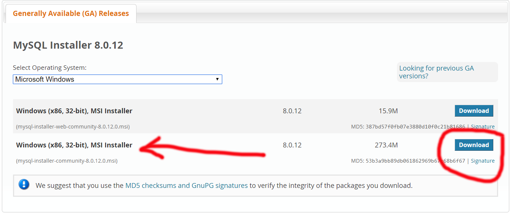
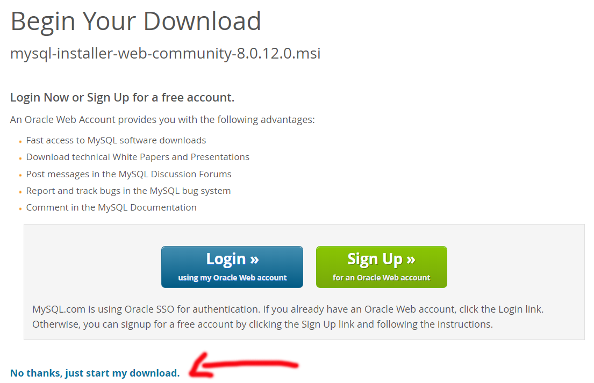
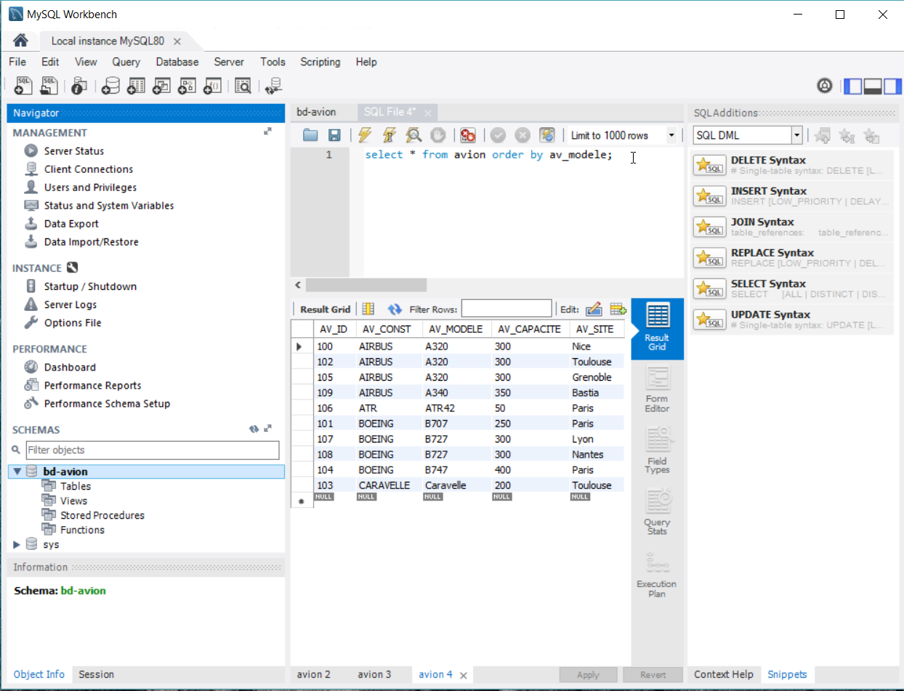
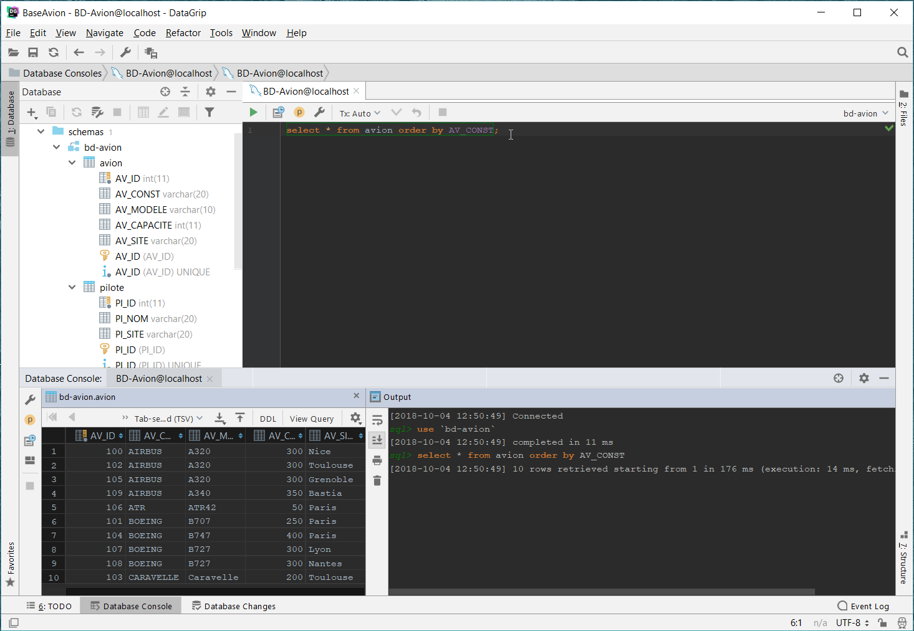
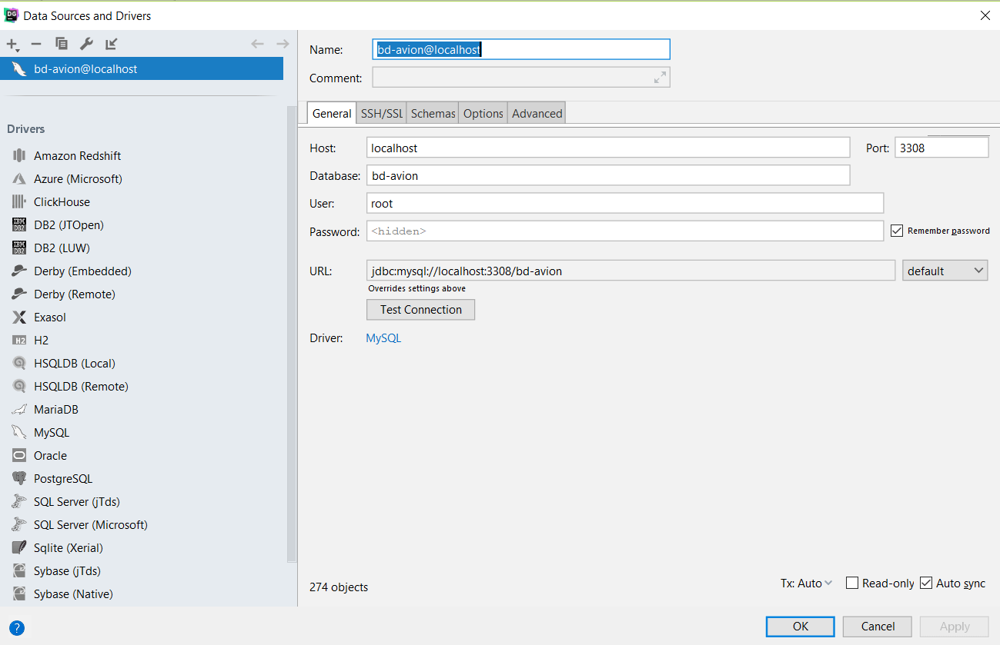

# Les installations pour le cours SQL

## Installation de MySQL (base de données)

Pour apprendre le langage SQL, il nous faut installer un SGBD (Système de Gestion de Base de Données). Nous avons décidé d'utiliser le plus utilisé sur les hébergeurs de site Web, MySQL version 8.0.2. Il se peut que le numéro de version à télécharger soit différent.

Cepandant, il vous faut vérifier si un MySQL avec une version antérieure n'a pas déjà été installé sur votre machine qui a déjà été utilisé par un ancien(ne) apprenant(e). L'idéal après l'installation de MySQL 8 consiste à lancer l'utilitaire **MySQL Notifier 1.1.8** et d'y accéder pas la barre de tâche pour vérifier quelles sont les versions actives de MySQL pour le cas échéant, les arrêter et lancer la dernière version.

Lien de téléchargement du fichier **mysql-installer-community-8.0.18.0.msi** ( taille du fichier = 273 Mo):

[Download MySQL Installer pour windows](https://dev.mysql.com/downloads/installer/)

Voici la page sur laquelle vous arrivez :

Vous pouvez cliquer sur **No thanks, just start my download**, vous n'êtes pas obligé(e) de saisir votre adresse mail.

Voici un lien vers une [vidéo pour l'installation de MySQL](http://www.tomshardware.co.uk/faq/id-3682255/install-mysql-windows.html).

L'outil visuel MySQL Workbench 8.O.18 est automatiquement installé. Il vous permettra de créer une base de données, des tables et d'effectuer des requêtes.

[Documentation sur MySQL 8.0](https://dev.mysql.com/doc/refman/8.0/en/)

Exemple de fenêtre MySQL Workbench :

## Installation de DataGrip (JetBrains)

Vous avez tous reçu par courriel un fichier contenant un code. Ce dernier vous permet d'installer et d'utiliser gratuitement tous les produits de la société JetBrains pendnat un an.

Pour pouvoir exécuter des requêtes, visualiser la structure des tables et voir les résultats, le logiciel Datagrip est bien pratique et je le préfère à MySQL Workbench. Ce logiciel permet d'accéder à toutes les bases de données.

Exemple de fenêtre DataGrip :

Paramètrage de la connexion vers MySQL.

## MySQL Community

[Page de téléchargement de MySQL](https://dev.mysql.com/downloads/)