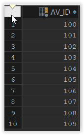
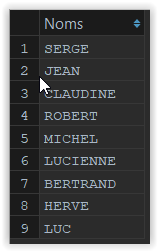
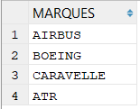

# Proposition de solutions des requêtes SELECT sur BD-AVION

1) Liste de tous les numéros d’avions

```sql
select AV_ID
from avion;
```

Résultat :



2) Liste des noms des pilotes

```sql 
SELECT PI_NOM NOM
FROM pilote;
```

Résultat obtenu :



3) Liste des marques d’avions (sans doublon)

```sql 
SELECT DISTINCTROW AV_CONST as 'MARQUES'
FROM avion;
```

Résultats :



4) Liste des vols pour Nice

```sql
SELECT *
FROM vol
WHERE VO_SITE_ARRIVEE ='NICE';
```
Résultat : 1 ligne avec toutes les colonnes

le fait d'avoir mis l'astérisque après le SELECT affiche toutes les colonnes de la table VOL. 

5) Liste des avions qui ont plus de 200 places

```sql
SELECT *
FROM avion
WHERE AV_CAPACITE >= 200;
```

résultats : 9 avions

6) Liste des avions AIRBUS localisés à Toulouse

```sql
SELECT *
FROM avion
WHERE av_const='airbus'
  AND av_site='toulouse';
```

Résultat : 1 ligne (102, AIRBUS A320)

7) Liste des avions AIRBUS allant à Paris

```sql
SELECT AV_ID, AV_MODELE, AV_SITE
FROM avion
WHERE AV_CONST = 'AIRBUS' AND  AV_ID in
(
 SELECT vo_avion
 FROM vol
 WHERE vo_site_arrivee= 'paris'
);
```

Résultat : 3 lignes AIRBUS (les 100, 102 et 109)

8) Liste des vols Paris-Nice et Toulouse-Paris

```sql
SELECT *
FROM vol
WHERE (vo_site_depart='PARIS' AND vo_site_arrivee='NICE')
 OR
(vo_site_depart='TOULOUSE' AND vo_site_arrivee='PARIS');
```

résultat : 2 vol (IT102 et IT110)

9) Liste des avions Airbus et Boeing

```sql
SELECT *
FROM avion
WHERE av_const='AIRBUS' OR av_const='BOEING';
```

Résultat : 8 (4 Airbus et 4 Boeing)

10) Liste des Airbus ou des avions de plus de 200 places

```sql
SELECT *
FROM avion
WHERE av_const='airbus' or av_capacite>=200;
```

Résultat : 9 avions

11) Liste des avions AIRBUS qui ne sont pas localisés à Toulouse

```sql
SELECT *
FROM avion
WHERE av_const='airbus' AND av_site<>'toulouse';
```

Résultat : 3 avions.

12) Liste des Airbus qui ne vont pas à Paris

```sql
SELECT *
FROM avion, vol
WHERE av_id=vo_avion
 AND av_const='AIRBUS'
 AND vo_site_arrivee<>'PARIS';
 ```

Résultat : 3 Airbus.

13) Liste des avions pour Paris qui ne sont pas des Airbus

```sql
SELECT *
from avion, vol
where av_id=vo_avion
 and av_const<>'airbus'
 and vo_site_arrivee='paris';
 ```

Résultat : 2 avions.

14) Liste de tous les vols avec le nom des avions

```sql
select vo_id as Vol, av_const as Constructeur, av_modele as Modele
from avion, vol
where av_id=vo_avion;
```

Résultat : 12 avions

même requête avec INNER JOIN :

```sql
select vo_id as Vol, av_const Constructeur, av_modele Modele
FROM vol
INNER JOIN avion ON av_id=vo_avion ;
```

15) Type et capacité des avions en service (donc des avions qui volent !)

```sql 
select av_modele, av_capacite
from avion,vol
where av_id=vo_avion;
```

16) Liste des avions qui ne sont pas des AIRBUS allant à Paris

```sql
select *
from avion,vol
where av_id=vo_avion
  and av_const<>'airbus'
  and vo_site_arrivee='paris';
  ```

Résultat : 2 avions.

```sql
107	BOEING	B727
106	ATR	ATR42
```

17) Nom des pilotes en service

```sql 
select distinct pi_id, pi_nom
from pilote, vol
where pi_id=vo_pilote;
```

résultat : 7 pilotes

18) Nom des avions (BOEING) ayant une même capacité (auto-jointure)

```sql
select a1.av_id,  a1.av_capacite, a2.av_id, a2.av_capacite
from avion as a1, avion as a2
where a1.av_capacite=a2.av_capacite
and
 a1.av_const='BOEING'
and
 a2.av_const='BOEING'
and
 a1.av_id <> a2.av_id;
 ```

Résultat : 2 avions (les numéros 108 et 109)

19) Nombre d’avions de chaque marque

```sql
Select av_modele as MARQUES, count(*) nombre
from avion
group by av_modele ;
```

20) Nombre de pilotes différents pour chaque avion en service

```sql 
SELECT  tableVol.vo_avion, count(*) 'Nombre pilotes'
FROM
 (
 	SELECT distinct vo_avion, vo_pilote
 	from vol
 ) AS tableVol
GROUP BY tableVol.vo_avion;
```

Résultats : 7 lignes

21) Nombre de vols différents pour chaque pilote (regroupé par nom)

```sql
SELECT vo_pilote, pi_nom, count(*) 'Nombre de vol'
FROM vol, pilote
WHERE vo_pilote=pi_id
GROUP BY pi_nom;
```

résultats : 7 pilotes

22) Pilotes (ordre croissant des numéros) assurant plus d’un vol (Afficher: Numéro et nom des pilotes,  nombre de vols)

```sql
SELECT vo_pilote, pi_nom, count(*)
FROM vol, pilote
WHERE vo_pilote=pi_id
GROUP BY vo_pilote, pi_nom
having count(*) > 1
ORDER BY vo_pilote;
```

Résultat : 5 pilotes avec 2 vols chacun(e).


23)  Nombre de vols assurés au départ de Nice ou de Paris par chaque pilote (Afficher: Numéros des pilotes, ville de départ et nombre de vols)

```sql
SELECT vo_pilote, pi_nom, count(*), vol.VO_SITE_DEPART
FROM vol, pilote
WHERE vo_pilote=pi_id
  AND (vo_site_depart='NICE'
         OR vo_site_depart='PARIS')
GROUP BY vo_pilote, pi_nom;
```

résultat : 5 pilotes et 6 vols.

24) Nombre de vols assurés au départ ou à l'arrivée de Nice par chaque pilote (Afficher: Numéros des pilotes,  nombre de vols, ville départ, ville arrivée)

```sql
SELECT vo_pilote, pi_nom, count(*), VO_SITE_DEPART, VO_SITE_ARRIVEE
FROM vol, pilote
WHERE vo_pilote=pi_id
  AND (vo_site_depart='NICE' OR vo_site_arrivee='NICE')
GROUP BY vo_pilote, pi_nom;
```

résultats : 2 vols avec NICE pour ville de départ et d’arrivée.

25) Liste des vols dont la ville de départ correspond à la ville où est localisé l'avion

```sql
SELECT VO_ID, VO_SITE_DEPART, AV_SITE
FROM vol, avion
WHERE vo_avion=av_id
  AND vo_site_depart=av_site;
```

Résultats : 7 vols

26) Liste des avions de capacité égale ou supérieure à la moyenne

```sql
select AV_ID, AV_CONST, AV_CAPACITE
FROM avion
WHERE av_capacite >= (select avg(av_capacite)
FROM avion);
```

Résultat : 7 avions.


27) Capacité mini et maxi des BOEING

```sql
SELECT 'BOEING' modele, MIN(av_capacite) min , MAX(av_capacite) maxi
FROM avion
WHERE av_const='BOEING';
```

résultat : min = 250 et 400.

28) Capacité moyenne des avions localisés à Paris (affichée avec 2 chiffres après la virgule)

```sql
SELECT ROUND(AVG(av_capacite),2)
FROM avion
WHERE av_site="paris";
```

résultat : 233,33

29) Capacité moyenne des avions par marque

```sql
select av_const marque, avg(av_capacite) moyenne
FROM avion
GROUP BY av_const;
```

Résultats : 4 lignes pour chaque avion


30) Capacité totale des avions de la table avion

```sql
SELECT SUM(av_capacite)
FROM avion;
```

résultat : 2750

31) Affichage de l’heure système avec les secondes

```sql
select sysdate();
```