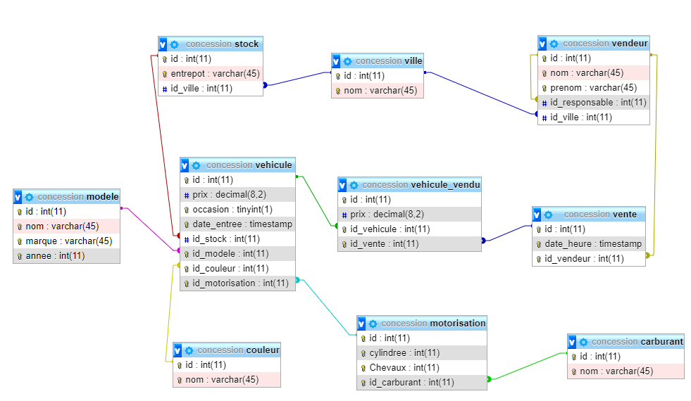

# Travaux pratiques SQL

## Révision des notions abordées

Pour interroger une base de données relationnelle, vous avez découvert le langage SQL. 
Vous allez vous entraîner en effectuant différentes requêtes sur une BD existante.  
Vous utiliserez le SGBDR MySQL   
Le schéma et les données sont détaillés ci-dessous.

## Instructions qui seront utilisées

* SELECT
* DISTINCT
* WHERE
* AND, OR, IN
* INNER JOIN
* LEFT JOIN
* AS
* UNION 
* ORDER BY
* GROUP BY 
* SELECT imbriqué
* INSERT
* UPDATE
* DELETE

## Base de données

* [Schema de la BD](schema.sql)
* [Données à ajouter](data/data.sql)

## Notes

* Vous trouverez ici, une série d'exercices à résoudre (avec des requêtes simples puis plus complexes).

* Utilisez un client MySql comme DataGrip pour écrire et exécuter vos requêtes.  
* Pour chaque exercice, vous avez une solution proposée.  
* Ces exercices de révisions font le tour de ce qu'il faut connaître en SQL.
* Si dans votre vie professionnelle, vous devez écrire des requêtes SQL, regardez s'il n'existe pas un cas similaire ici.

## Supports

* [sql.sh](http://sql.sh/) pour revoir les concepts SQL. 
* [w3schools](https://www.w3schools.com/sql/) pour s'entraîner

## SELECT

### Support

* [sql.sh](http://sql.sh/cours/select)
* [w3schools](https://www.w3schools.com/sql/sql_select.asp)

### A votre tour

* Lire toutes les données des vendeurs (sans faire de jointure)  
=> [solution](sql/selectVendeur1.sql) 
* Lire le nom et le prénom de tous les vendeurs  
=> [solution](sql/selectVendeur2.sql) 

## SELECT DISTINCT

### Support

* [sql.sh](http://sql.sh/cours/distinct)
* [w3schools](https://www.w3schools.com/sql/sql_distinct.asp)

### A votre tour

* Lire le prénom de tous les vendeurs  
=> [solution](sql/selectVendeur3.sql) 
* Lire le prénom de tous les vendeurs et afficher une seule ligne par prénom  
=> [solution](sql/selectVendeur4.sql) 

## Les jointures

Il existe plusieurs sortes de jointures résumées par ce schéma :
   
Vous devez savoir écrire les jointures INNER JOIN et LEFT JOIN.  

## Jointure simple (INNER JOIN par défaut)

### Support

* [sql.sh](http://sql.sh/cours/jointures/inner-join)
* [w3schools](https://www.w3schools.com/sql/sql_join_inner.asp)

### A votre tour

* Lire les données des vendeurs et de sa ville rattachée  
=> [solution](sql/selectVendeur5.sql) 

* Lire le nom, prénom et ville des vendeurs  
=> [solution](sql/selectVendeur6.sql) 

## Jointure optionnelle gauche (LEFT JOIN)

### Support

* [sql.sh](http://sql.sh/cours/jointures/left-join)
* [w3schools](https://www.w3schools.com/sql/sql_join_left.asp)

### A votre tour

* Lire le nom, prénom et la ville des vendeurs
=> [solution](sql/selectVendeur7.sql) 

## Alias

### Support

* [sql.sh](http://sql.sh/cours/alias)
* [w3schools](https://www.w3schools.com/sql/sql_alias.asp)

### A votre tour

* Lire le nom, prénom et la ville des vendeurs en affichant en entête de colonne : nom, prénom, ville  
=> [solution](sql/selectVendeur8.sql) 
* Lire le nom, prénom et nom du responsable des vendeurs  
=> [solution](sql/selectVendeur9.sql) 

## SELECT avec WHERE

### Support

* [sql.sh](http://sql.sh/cours/where)
* [w3schools](https://www.w3schools.com/sql/sql_where.asp)

### A votre tour

* Liste des véhicules rouges  
=> [solution](sql/vehiculeRouge.sql) 
* Liste des véhicules rouges et des véhicules verts  
=> [solution 1](sql/vehiculeRougeEtVert1.sql)  
=> [solution 2](sql/vehiculeRougeEtVert2.sql) 
=> [solution 3](sql/vehiculeRougeEtVert3.sql) 
* Liste des véhicules en stock  
=> [solution 1](sql/vehiculeStock1.sql)  
=> [solution 2](sql/vehiculeStock2.sql) 
* Liste des véhicules en stock, ayant une couleur contenant le lettre u  
=> [solution](sql/vehiculeCouleurEnStock.sql) 
* Liste des véhicules en stock à Nantes  
=> [solution 1](sql/vehiculeNantes1.sql)   
=> [solution 2](sql/vehiculeNantes2.sql) 

## SELECT avec la clef unique

### Support

#### Historique

Depuis quelques années, les développeurs utilisent un id généré automatiquement comme clef primaire. 

C'est un id technique, très pratique pour la propagation des clefs étrangères.  

Il y a quelques années, la clef primaire d'une table était composée de plusieurs champs (mais pas n'importe lesquels). 
Il s'agissait des champs qui rendent un **enregistrement unique**. 
En effet, comme nous le verrons dans le cours sur la modélisation d'une base de données (UML et MCD), en 3ème forme normale, elle ne contient pas de données en double. Cette pratique est toujours d'actualité.  

#### Inconvénient de l'id technique auto-générée

L'id, en tant que clef primaire, a un terrible inconvénient : le doublon. L'id est technique, donc l'utilisateur ne le connaît pas. 
Comment empêcher un utilisateur de créer des doublons dans une base ?  
Solution : créer une nouvelle clef qui :

* est unique
* est composée des différents champs respectant cette unicité.  

Note : Si cette clef ne contient qu'un seul champ, il suffit d'ajouter la contrainte UNIQUE sur le champ (ou colonne). 
MySql génère automatiquement une clef unique.

Par exemple, le vendeur est identifié par son nom et son prénom. 
Ici par convention, la clef unique est nommée **uk_UNIQUE**. A vous de choisir votre convention.  
Malheureusement, cette clef n'est pas obligatoire. Si vous l'oubliez, vous aurez des enregistrements en double dans la base.  

#### Lire un enregistrement sur sa clef unique

Pour trouver un enregistrement, il suffit de lire la table en renseignant après le **WHERE** les champs de cette clef.

### A vous

* Rechercher le carburant essence.  
=> [solution](sql/uk_carburant.sql) 
* Écrire une requête recherchant un unique vendeur  
=> [solution](sql/uk_vendeur.sql) 
* Écrire une requête recherchant une unique motorisation  
=> [solution](sql/uk_motorisation.sql) 
* Écrire une requête recherchant un unique véhicule  
=> [solution](sql/uk_vehicule.sql) 

## UNION

### Support

* [sql.sh](http://sql.sh/cours/alias)
* [w3schools](https://www.w3schools.com/sql/sql_union.asp)

### A votre tour

* Liste des modèles et de leur différent prix pour les véhicules essences et des véhicules rouges. 
Indication : le SELECT des véhicules rouges est différent du SELECT des véhicules essence.  
=> [solution](sql/vehiculeRougeUnionEssence.sql) 

## Entraînement avec SELECT

* liste de tous les véhicules avec toutes leurs caractéristiques  
=> [solution](sql/listeVehicule1.sql) 
* liste de tous les véhicules avec toutes leurs caractéristiques, sans afficher les id  
=> [solution](sql/listeVehicule2.sql) 
* liste de tous les véhicules avec toutes leurs caractéristiques, sans afficher les id, et en utilisant les alias pour les colonnes  
=> [solution](sql/listeVehicule3.sql) 
* Liste des véhicules vendus avec leurs caractéristiques et le nom du vendeur
=> [solution](sql/vehiculeVendu.sql) 
* Liste des véhicules en vente
=> [solution](sql/vehiculeNonVendu.sql) 

## ORDER BY

### Support

* [sql.sh](http://sql.sh/cours/order-by)
* [w3schools](https://www.w3schools.com/sql/sql_orderby.asp)

### A votre tour

* Liste des motorisations triées par carburant, puissance, cylindrée.  
=> [solution](sql/orderMotorisation.sql) 

## GROUP BY

### Support

* [sql.sh](http://sql.sh/cours/group-by)
* [w3schools](https://www.w3schools.com/sql/sql_groupby.asp)

### A votre tour

* Inventaire du stock : nombre de véhicules par stock/marque/modèle.  
=> [solution](sql/groupStock.sql) 
* Liste des stocks et du prix du vehicule le plus cher dans chaque stock (sans afficher le véhicule).  
=> [solution](sql/stockVehiculeCher.sql) 

## Requête imbriquée (sous SELECT)

### Support

* [sql.sh](http://sql.sh/cours/sous-requete)
* [OC](https://openclassrooms.com/courses/administrez-vos-bases-de-donnees-avec-mysql/sous-requetes)

### Note

Le sous-select (ou requête imbriquées) dans la condition WHERE est une pratique de moins en moins utilisée. Il faut toutefois la connaître. Ce type de requête nécessite beaucoup de ressources de la part du SGBD. Donc si vous avez des soucis de performance (temps de réponse très longs), regardez en priorité le temps de réponse de vos requêtes SQL qui contiennent un sous-select.  
Elle peut être remplacée par une jointure ou un sous select dans le FROM.  

### requêtes imbriquées dans la clause FROM

### A votre tour

* Pour chaque stock, afficher la marque ayant le vehicule le moins cher, ainsi que sa valeur.  
Cet exercice est plus difficile.
=> [solution](sql/stockVehiculeLeMoinsCher.sql) 

## INSERT INTO

### Support

* [sql.sh](http://sql.sh/cours/http://sql.sh/cours/insert-into)
* [w3schools](https://www.w3schools.com/sql/sql_insert.asp)

### A votre tour

* Créer un nouveau vendeur.  
=> [solution](sql/insertVendeur.sql) 

## UPDATE

### Support

* [sql.sh](http://sql.sh/cours/http://sql.sh/cours/update)
* [w3schools](https://www.w3schools.com/sql/sql_update.asp)

### A votre tour

* Mettez à jour le nom d'un vendeur.  
=> [solution](sql/updateNomVendeur.sql) 
* Affecter tous les vendeurs de la ville de Nantes à la ville de Saint-Nazaire.  
=> [solution](sql/updateVilleVendeur.sql) 

## DELETE

### Support

* [sql.sh](http://sql.sh/cours/http://sql.sh/cours/delete)
* [w3schools](https://www.w3schools.com/sql/sql_delete.asp)

### A votre tour

* Supprimer le vendeur ayant l'id 8.  
=> [solution](sql/deleteVendeur.sql) 

## Transaction

### Support

* [tuto](support/transaction.md)
* [doc MySql](https://dev.mysql.com/doc/refman/8.0/en/sql-syntax-transactions.html)

### A votre tour

1. Avec un client SQL (Workbench ou Datagrip par exemple), écrivez un script et exécuter le.
    * Basculer l'autocommit à faux (ou START TRANSACTION)
    * faites plusieurs mises à jour (create ou update)
    * vérifier sur un autre client les mises à jour.
    * faites un rollback et vérifier les données dans la base.  
2. recommencer en faisant un commit.
3. Faites un commit au milieu des instructions.
4. faites un rollback au milieu des instructions.
5. lancer le script sans commit et fermer le client sql.
6. Faites tous les tests qui vous viennent à l'esprit.  

voici un [fichier exemple](sql/transaction.sql) 

## Découverte des variables

Il est possible d'utiliser des variables dans les requêtes SQL.

Il existe des variables :

* **locales** : contenues dans des procédures stockées (notion non vue ici)
* de **session** (ou utilisateur): identifiées par **@**
* **globales** : identifiées par **@@** 

Ces variables permettent d'écrire des scripts SQL plus complexes et plus lisibles. 
Nous pouvons aussi les utiliser pour écrire des jeux d'essai cohérents pour tester notre application.

### Support

* [oncletom.io](https://oncletom.io/2007/utilisation-variables-mysql/)
* [dev.mysql.com](https://dev.mysql.com/doc/refman/5.7/en/user-variables.html)
* [dev.mysql.com](https://dev.mysql.com/doc/refman/5.7/en/set-variable.html)

### A votre tour

* Renseigner une variable avec le valeur "Leclerc", et afficher tous les vendeurs ayant ce nom.    
=> [solution](sql/varVendeur1.sql) 
* Récupérer l'id du vendeur "Leclerc" dans une variable et l'afficher.   
=> [solution](sql/varVendeur2.sql) 
* En affectant la valeur "Le" à la variable @nom, afficher tous les vendeurs commençant par ce mot.   
=> [solution](sql/varVendeur3.sql)

## Script pour créer des jeux de données

Voici quelques scripts pour alimenter la base avec un jeu de données cohérent. 

Certains scripts utilisent les procédures stockées. Ces scripts sont complexes et sont présents dans le but de vous montrer ce que peuvent faire des procédures stockées. En aucun cas, il vous est demandé d'écrire des procédures stockées. Simplement de les comprendre et de savoir à quoi elles servent.

* Script pour créer un véhicule à partir de variables.  
=> [solution 1](sql/insertVehicule1.sql)  
=> [solution 2](sql/insertVehicule2.sql)
* Script d'enregistrement d'une vente entre un véhicule et un vendeur.  
=> [solution](sql/vente1.sql)
* Script d'enregistrement d'une vente de plusieurs véhicules en utilisant les procédures stockées.  
=> [solution](sql/vente2.sql)
* Script d'enregistrement d'une vente de plusieurs véhicules. Création des véhicules dans la base si inexistant.  
=> [solution](sql/vente3.sql)
