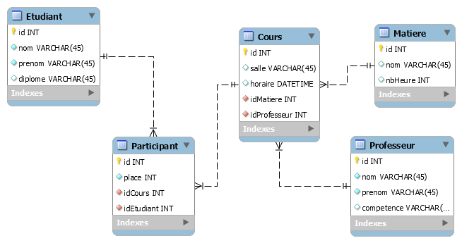

# Modélisation avec MERISE

## La méthode Merise

Vous avez peut-être entendu parlé de Merise, et plus particulièrement du MCD, MLD et MPD. Merise une méthode d'analyse, de conception et de gestion de projet informatique. C'est une méthode ancienne qui est toujours très prisée par certains concepteurs. Cette méthode est très orientée données. Il est de plus en plus fréquent d'utiliser le diagramme des classes du langage UML lors d'un développement objet. Cependant, vous devez connaitre et être capable d'écrire un MCD, un MLD et un MPD.

### Le MCD

C'est le Modèle Conceptuel de Données. L'équivalent UML est le diagramme des classes du MOO.  
Dans le MCD, on parle d'entités et de relations. L'entité c'est la classe du MOO, représentée par un rectangle. 
La relation correspond à l'association dans le MOO. Elle est représentée par une forme ovoïde.
En Merise, nous avons des **cardinalités** que nous appelons **multiplicités** en UML.  
L'entité a un identifiant et des propriétés. La relation est un verbe et peut avoir des attributs.

[Construire un MCD](MCD.md)  

### Le MLD

Le Modèle Logique de Données est la transformation du MCD en ensemble de tables.  
Une entité devient une table. Un identifiant devient la clef primaire. Une propriété devient un champ.  
A ce niveau là apparaît la clef étrangère.

[Construire un MLD](MLD.md)  
[Complément sur les cardinalités](MCD-cardinalites.md) 

### Le MPD

Le Modèle Physique de Données est la transformation du MLD dans le format d'une base de données. Le résultat final sera un script SQL qui permettra de créer la base dans le SGBDR. Il y a un MPD par modèle de base (Oracle, PostgreSQL, MySql).

## Outils

### MySql Workbench

MySql Workbench utilise un "Physical schema" ou "EER Diagram". Ce n'est pas un modèle Merise. Il s'approche d'un modèle physique (MPD)

### physical schema

Pour simplifier, on dira que le "physical schema" est la base de données qui contient les tables. L'interface graphique permet de créer des tables, des champs, de relier les tables entre elles, etc...

### EER Diagram

EER comme Enhanced Entity–Relationship (entité association étendu).  
Il s'agit d'un modèle graphique. L'outil EER Diagram permet de créer graphiquement une base. **Attention, c'est un mélange de MLD et MCD** !

Pour créer une base de données, on passe soit par le MCD-MLD-MPD de Merise, soit par le diagramme de classe UML. L'identification des entités se fait de la même manière. On peut donc appliquer les règles de Merise en faisant bien attention à l'inversion des multiplicités (UML) beaucoup plus facile à écrire que les cardinalités d'un MCD. 



Lorsque l'on a fini la modélisation, on génère le script [SQL](img/cours.sql). C'est ce script que l'on va exécuter pour créer physiquement la base (physical schema).

Voici une partie du script correspondant au schéma ci-dessus :

```sql
CREATE TABLE IF NOT EXISTS `mydb`.`Etudiant` (
  `id` INT NOT NULL AUTO_INCREMENT,
  `nom` VARCHAR(45) NOT NULL,
  `prenom` VARCHAR(45) NOT NULL,
  `diplome` VARCHAR(45) NULL,
  PRIMARY KEY (`id`))
ENGINE = InnoDB;

CREATE TABLE IF NOT EXISTS `mydb`.`Matiere` (
  `id` INT NOT NULL AUTO_INCREMENT,
  `nom` VARCHAR(45) NULL,
  `nbHeure` INT NULL,
  PRIMARY KEY (`id`))
ENGINE = InnoDB;

CREATE TABLE IF NOT EXISTS `mydb`.`Professeur` (
  `id` INT NOT NULL AUTO_INCREMENT,
  `nom` VARCHAR(45) NOT NULL,
  `prenom` VARCHAR(45) NOT NULL,
  `competence` VARCHAR(45) NULL,
  PRIMARY KEY (`id`))
ENGINE = InnoDB;

CREATE TABLE IF NOT EXISTS `mydb`.`Cours` (
  `id` INT NOT NULL AUTO_INCREMENT,
  `salle` VARCHAR(45) NULL,
  `horaire` DATETIME NULL,
  `idMatiere` INT NOT NULL,
  `idProfesseur` INT NOT NULL,
  PRIMARY KEY (`id`),
  INDEX `fk_Cours_Matiere_idx` (`idMatiere` ASC),
  INDEX `fk_Cours_Professeur1_idx` (`idProfesseur` ASC),
  CONSTRAINT `fk_Cours_Matiere`
    FOREIGN KEY (`idMatiere`)
    REFERENCES `mydb`.`Matiere` (`id`)
    ON DELETE NO ACTION
    ON UPDATE NO ACTION,
  CONSTRAINT `fk_Cours_Professeur1`
    FOREIGN KEY (`idProfesseur`)
    REFERENCES `mydb`.`Professeur` (`id`)
    ON DELETE NO ACTION
    ON UPDATE NO ACTION)
ENGINE = InnoDB;

CREATE TABLE IF NOT EXISTS `mydb`.`Participant` (
  `id` INT NOT NULL AUTO_INCREMENT,
  `place` INT NOT NULL,
  `idCours` INT NOT NULL,
  `idEtudiant` INT NOT NULL,
  PRIMARY KEY (`id`),
  INDEX `fk_Participant_Cours1_idx` (`idCours` ASC),
  INDEX `fk_Participant_Etudiant1_idx` (`idEtudiant` ASC),
  CONSTRAINT `fk_Participant_Cours1`
    FOREIGN KEY (`idCours`)
    REFERENCES `mydb`.`Cours` (`id`)
    ON DELETE NO ACTION
    ON UPDATE NO ACTION,
  CONSTRAINT `fk_Participant_Etudiant1`
    FOREIGN KEY (`idEtudiant`)
    REFERENCES `mydb`.`Etudiant` (`id`)
    ON DELETE NO ACTION
    ON UPDATE NO ACTION)
ENGINE = InnoDB;
```

Pratiquez !

[Auto-école](pratique/auto-ecole.md)

[Solution pour l'auto-école](solution/README.md)

[GTD-Gestionnaire de Tâches](pratique/gestionnaire-de-tache-GTD.md)

Auteur : **Philippe Bouget**
