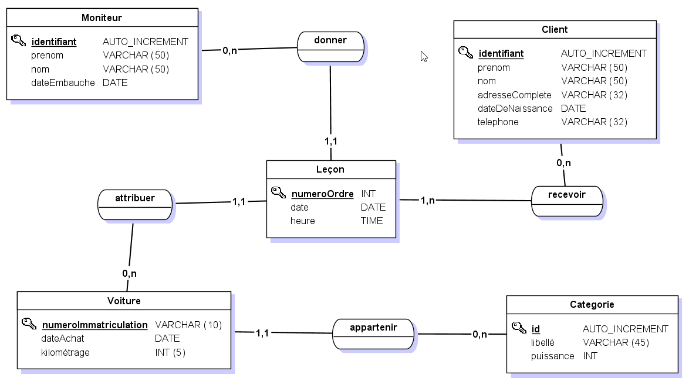
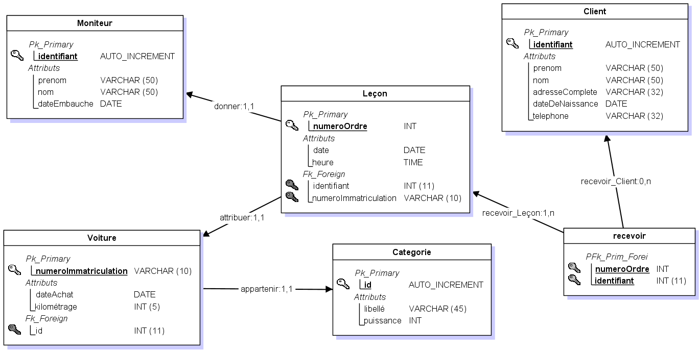

# Solutions MCD - MLD - MPD

## Auto-école

### MCD (Modèle Conceptuel de Données)



### MLD (Modèle Logique de Données)



### MPD (Modèle Physique de Données)

```sql
#------------------------------------------------------------
# Table: Client
#------------------------------------------------------------

CREATE TABLE Client(
        identifiant     Int  Auto_increment  NOT NULL ,
        prenom          Varchar (50) NOT NULL ,
        nom             Varchar (50) NOT NULL ,
        adresseComplete Varchar (32) NOT NULL ,
        dateDeNaissance Date NOT NULL ,
        telephone       Varchar (32) NOT NULL
	,CONSTRAINT Client_PK PRIMARY KEY (identifiant)
)ENGINE=InnoDB;


#------------------------------------------------------------
# Table: Moniteur
#------------------------------------------------------------

CREATE TABLE Moniteur(
        identifiant  Int  Auto_increment  NOT NULL ,
        prenom       Varchar (50) NOT NULL ,
        nom          Varchar (50) NOT NULL ,
        dateEmbauche Date NOT NULL
	,CONSTRAINT Moniteur_PK PRIMARY KEY (identifiant)
)ENGINE=InnoDB;


#------------------------------------------------------------
# Table: Categorie
#------------------------------------------------------------

CREATE TABLE Categorie(
        id        Int  Auto_increment  NOT NULL ,
        libelle   Varchar (45) NOT NULL ,
        puissance Int NOT NULL
	,CONSTRAINT Categorie_PK PRIMARY KEY (id)
)ENGINE=InnoDB;


#------------------------------------------------------------
# Table: Voiture
#------------------------------------------------------------

CREATE TABLE Voiture(
        numeroImmatriculation Varchar (10) NOT NULL ,
        dateAchat             Date NOT NULL ,
        kilometrage           Int NOT NULL ,
        id                    Int NOT NULL
	,CONSTRAINT Voiture_PK PRIMARY KEY (numeroImmatriculation)

	,CONSTRAINT Voiture_Categorie_FK FOREIGN KEY (id) REFERENCES Categorie(id)
)ENGINE=InnoDB;


#------------------------------------------------------------
# Table: Leçon
#------------------------------------------------------------

CREATE TABLE Lecon(
        numeroOrdre           Int NOT NULL ,
        date                  Date NOT NULL ,
        heure                 Time NOT NULL ,
        identifiant           Int NOT NULL ,
        numeroImmatriculation Varchar (10) NOT NULL
	,CONSTRAINT Lecon_PK PRIMARY KEY (numeroOrdre)

	,CONSTRAINT Lecon_Moniteur_FK FOREIGN KEY (identifiant) REFERENCES Moniteur(identifiant)
	,CONSTRAINT Lecon_Voiture0_FK FOREIGN KEY (numeroImmatriculation) REFERENCES Voiture(numeroImmatriculation)
)ENGINE=InnoDB;


#------------------------------------------------------------
# Table: recevoir
#------------------------------------------------------------

CREATE TABLE recevoir(
        numeroOrdre Int NOT NULL ,
        identifiant Int NOT NULL
	,CONSTRAINT recevoir_PK PRIMARY KEY (numeroOrdre,identifiant)

	,CONSTRAINT recevoir_Lecon_FK FOREIGN KEY (numeroOrdre) REFERENCES Lecon(numeroOrdre)
	,CONSTRAINT recevoir_Client0_FK FOREIGN KEY (identifiant) REFERENCES Client(identifiant)
)ENGINE=InnoDB;
```
Auteur : **Philippe Bouget**