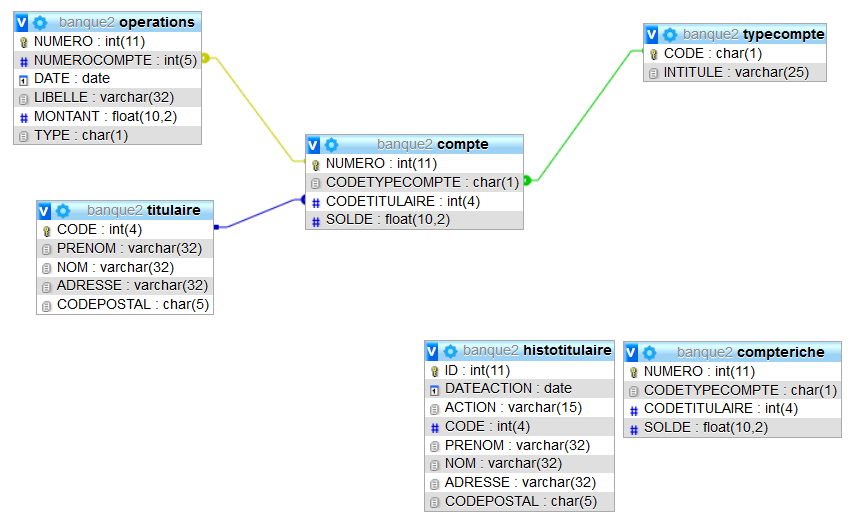

# SQL avancé avec MySQL : Mise en pratique

Nous allons découvrir un langage côté MySQL pour créer des :

* Procédure stockée
* Trigger (déclencheur)
* Transaction (avec java Spring)

## Voici les tables sur lesquelles nous allons travailler



Règles de gestion :

> Un **Compte** est associé à un et un seul **Titulaire**

> Un **Compte** correspond à un seul **Type** de compte

> Un **Compte** peut avoir aucune ou plusieurs **Opérations**

> Une **Opération** de virement d'un **Compte** à un autre **Compte** doit se faire si et seulement si le compte débiteur a un solde suffisant. Si ce n'est pas le cas, la transaction ne pourra pas se réaliser !

## Base de données sous MySQL

Vous devez créer une base de données vierge nommée : **banque**

## Script SQL pour créer nos 4 tables

```sql
CREATE TABLE `titulaire` (
  `CODE` int(4) NOT NULL,
  `PRENOM` varchar(32) NOT NULL,
  `NOM` varchar(32) NOT NULL,
  `ADRESSE` varchar(32) DEFAULT NULL,
  `CODEPOSTAL` char(5) DEFAULT NULL,
  PRIMARY KEY (`CODE`)
) ENGINE=InnoDB DEFAULT CHARSET=utf8;

INSERT INTO `titulaire` (`CODE`, `PRENOM`, `NOM`, `ADRESSE`, `CODEPOSTAL`) VALUES
(1000, 'Philippe', 'Bouget', '52 rue de la Java', '75013'),
(1001, 'Mireille', 'Kupper', '22 rue Loin de Paris', '91000'),
(1002, 'Juliette', 'Barats', '13 rue de la Bureautique', '75011'),
(1003, 'Malika', 'Chabira', '23 rue de l\'insertion', '7018'),
(1004, 'Josselin', 'Tobelem', '18 rue de SpringBoot', '93000'),
(1005, 'Jonathan', 'Siffert', '22 rue des Projets', '93000');

CREATE TABLE `typecompte` (
  `CODE` char(1) NOT NULL,
  `INTITULE` varchar(25) NOT NULL,
  PRIMARY KEY (`CODE`)
) ENGINE=InnoDB DEFAULT CHARSET=utf8;


INSERT INTO `typecompte` (`CODE`, `INTITULE`) VALUES
('C', 'Compte courant'),
('E', 'Compte épargne'),
('L', 'Compte épargne Logement');

CREATE TABLE `compte` (
  `NUMERO` int(5) NOT NULL,
  `CODETYPECOMPTE` char(1) NOT NULL,
  `CODETITULAIRE` int(4) NOT NULL,
  `SOLDE` float(10,2) NOT NULL,
  PRIMARY KEY (`NUMERO`),
  FOREIGN KEY (`CODETYPECOMPTE`)
    REFERENCES `typecompte` (`CODE`),
  FOREIGN KEY (`CODETITULAIRE`)
   REFERENCES `titulaire` (`CODE`)
   ON DELETE CASCADE
) ENGINE=InnoDB DEFAULT CHARSET=utf8;

INSERT INTO `compte` (`NUMERO`, `CODETYPECOMPTE`, `CODETITULAIRE`, `SOLDE`) VALUES
(10000, 'C', 1000, 3500.00),
(10001, 'C', 1001, 7000.00),
(10002, 'C', 1002, 2800.00),
(10003, 'C', 1003, 15200.00),
(10005, 'C', 1004, 60000.00),
(10006, 'C', 1005, 140000.00),
(10007, 'L', 1000, 100.00),
(10008, 'L', 1001, 100.00),
(10009, 'L', 1002, 200.00);

CREATE TABLE `operations` (
  `NUMERO` int(11) NOT NULL AUTO_INCREMENT,
  `NUMEROCOMPTE` int(5) NOT NULL,
  `DATE` date NOT NULL,
  `LIBELLE` varchar(32) NOT NULL,
  `MONTANT` float(10,2) NOT NULL,
  `TYPE` char(1) NOT NULL,
  PRIMARY KEY (`NUMERO`),
  FOREIGN KEY (`NUMEROCOMPTE`)
    REFERENCES `COMPTE` (`NUMERO`)
    ON DELETE CASCADE
) ENGINE=InnoDB AUTO_INCREMENT=8 DEFAULT CHARSET=utf8;

INSERT INTO `operations` (`NUMERO`, `NUMEROCOMPTE`, `DATE`, `LIBELLE`, `MONTANT`, `TYPE`) VALUES
(1, 10000, '2018-10-01', 'Dépôt', 3500.00, '+'),
(2, 10001, '2018-10-18', 'Salaire', 7000.00, '+'),
(3, 10002, '2018-11-02', 'Dépôt', 2800.00, '+'),
(4, 10003, '2018-10-09', 'Salaire ', 15200.00, '+'),
(5, 10005, '2018-12-19', 'Dépôt', 150.00, '+'),
(6, 10006, '2018-12-19', 'Dépôt', 507.00, '+'),
(7, 10001, '2018-08-10', 'Dépôt ouverture', 2050.00, '+');

```

## 1 Procédures Stockées

### 1.1 le Cadeau de la banque

La banque décide de fêter la nouvelle année en partageant ses gains avec les anciens clients. Pour cela, elle ajoutera une somme sur tous les comptes des clients ayant effectués des opérations antérieures au 31/10/2018 et dont le montant du versement était supérieur à 2000 euros (valeur constante).

La directrice Elise vous demande d'écrire et de lancer une **procédure stockée** nommée **proc_cadeau** permettant d'ajouter 19 euros (pour chaque opération trouvée)pour tous les comptes concernés et d'effectuer automatiquement la modification sur le solde du compte des clients. Il faut prévoir de réutiliser cette procédure l'an prochain et considérer que le montant du cadeau et la date peuvent changer !

## 2 Triggers

## 2.1 Duplication de données dans une autre table sous condition

Créer une table identique à celle de **compte** que vous nommerez **compteriche**. Vous pouvez ne pas activer les clefs étrangères codetypecompte et codetitulaire pour cette table.

```sql
CREATE TABLE IF NOT EXISTS `compteriche` (
  `NUMERO` int(11) NOT NULL,
  `CODETYPECOMPTE` char(1) NOT NULL,
  `CODETITULAIRE` int(4) NOT NULL,
  `SOLDE` float(10,2) NOT NULL,
  PRIMARY KEY (`NUMERO`)
) ENGINE=InnoDB DEFAULT CHARSET=utf8;
```

La directrice vous demande d'écrire un Trigger qui permet lors de chaque ouverture de compte courant dont la somme est supérieure à 10000 euros :

- enregistrer l'**opération d'ouverture** de compte à la date du jour (table opération)
- dupliquer la totalité des informations de ce nouveau compte dans la table **compteriche** si celui-ci rempli la condition.  

## 2.2 Historisation automatique avec le Trigger : **histotitulaire**

On vous demande de mettre en place un trigger qui permet après chaque mise à jour des informations d'un Titulaire, de conserver les anciennes données dans la table en y ajoutant la date du jour de la modification et le type d'action. Ici, l'action sera égale à "MAJ" pour mise à jour.

Voici le script de la Table :

```sql
CREATE TABLE `histotitulaire` (
  `ID` int NOT NULL AUTO_INCREMENT,
  `DATEACTION` datetime NOT NULL,
  `ACTION` varchar(15) DEFAULT NULL,
  `CODE` int(4) NOT NULL,
  `PRENOM` varchar(32) NOT NULL,
  `NOM` varchar(32) NOT NULL,
  `ADRESSE` varchar(32) DEFAULT NULL,
  `CODEPOSTAL` char(5) DEFAULT NULL,
  PRIMARY KEY (`ID`)
) ENGINE=InnoDB DEFAULT CHARSET=utf8;
```

## 3 Transactions

Voici un lien vers une démo d'appli qui utilise la transaction avant la mise en pratique.

Comme vous pouvez le constater, comme le moteur **MyISAM** ne permet pas la gestion des clefs étrangères, on utilise le moteur **InnoDB**.

> Remarques : Les tables qui utilisent le moteur **MyISAM** sont non transactionnelles et par conséquent, ne supportent pas les transactions. Les tables qui utilisent le moteur **InnoDB** sont *transactionnelles* et supportent les transactions.

[Demo Transaction](transactions-spring/demo.md)

Grâce à votre code java, vous allez effectuer une connexion à la base de données **banque** et réaliser les opérations suivantes sous la forme d'une Transaction pour respecter les contraintes ACID.

* Effectuer un virement de 3000 euros du compte n°1002 de Juliette vers le compte n°1005 de Jonathan.
* Effectuer un virement de 140 euros du compte n°1010 vers le compte n°1004.

Vous avez un tutoriel sur OpenClassroom qui est bien écrit et peut vous aider et aussi des explications détaillées ci-dessous.

[Tuto sur openclassroom sur les Transactions](https://openclassrooms.com/fr/courses/1959476-administrez-vos-bases-de-donnees-avec-mysql/1970063-transactions)

### Généralités

Une transaction est un bloc d'instructions de mise à jour dans la base de données.

C'est une suite de requêtes `INSERT`, `UPDATE` ou `DELETE` qui ne sera validée définitivement qu'à la fin du bloc.

On commence une transaction par l'instruction `START TRANSACTION`, et c'est l'instruction `COMMIT` qui valide cette transaction.

Il est possible d'annuler une transaction en cours grâce à l'instruction `ROLLBACK`.  

### Propriétés d'une transaction

L'acronyme `ACID` désigne les quatre attributs fondamentaux d'un gestionnaire de transaction :

* **Atomicité** : la transaction est entière c'est tout ou rien
* **Cohérence** : une transaction crée un nouvel état de données. En cas de panne, on retourne à l'état précédent comme si rien ne s'était passé.
* **Isolation** : une transaction en cours est isolée par rapport aux autres.
* **Durabilité** : les données restent disponibles après la transaction.

### Autocommit

Par défaut, une base de données est en **autocommit**. C'est à dire que chaque instruction de mise à jour est définitive dans la base.

La transaction se résume en une seule ligne.

L'instruction `START TRANSACTION` bascule l'autocommit à **false** (faux).  
Une autre manière de faire une transaction, c'est de basculer l'autocommit à false avec la syntaxe suivante : (`SET autocommit=0`).

Dans ce cas, la transaction démarre à la première mise à jour. La validation définitive est toujours avec le `COMMIT`.  
C'est souvent de cette façon qu'on gère les transactions dans un programme java ou php.  

### Moteur de stockage

Les bases de données fonctionnent avec des moteurs différents. On ne choisit pas son moteur sous Oracle ou Postgres.

Par contre avec MySql, nous avons le choix entre **InnoDB** et **MylSAM**. MylSAM ne gère pas les transactions (ni la gestion des clefs étrangères d'ailleurs).  

### Fonctionnement

>Lorsque l'on commence une transaction, toutes les mises à jour mettent la base dans un **état transitoire**.

Cet état n'est visible que de la session en cours. Si un autre client se connecte sur la base, il ne voit pas cette transaction.

Si cette transaction échoue la base revient à l'état précédent.  
On peut comparer cela à une zone tampon, ou à une branche sous git.  

### Transactions avec Spring

#### Annotation

Comme d'habitude, Spring utilise une annotation : `@Transactional`.  
Les transactions se font au niveau du service.

>Il suffit de mettre cette annotation au niveau de la méthode pour que cette méthode démarre et valide la transaction. Si une exception survient dans cette méthode, automatiquement un rollback est effectué sur la transaction en cours.  
Si tout ce passe bien, un commit est effectué à la fin de la méthode.

#### gestionnaire de transaction

La transaction a besoin d'un gestionnaire de transaction.

>Ce gestionnaire sera différent selon qu'on utilise du **jdbc**, du **jpa**, ou autre. Heureusement avec Spring Boot, il n'y a pas besoin de configurer ce gestionnaire.

Il faut simplement ajouter la dépendance **Spring Data JPA** comme ci-dessous :

```xml
<dependency>  
    <groupId>org.springframework.boot</groupId>
    <artifactId>spring-boot-starter-data-jpa</artifactId>
</dependency>
```

#### La propagation

Nous allons voir la propagation du contexte transactionnel.

Spring a ajouté un niveau supplémentaire : la **transaction logique**.

>Une méthode avec l'annotation **@Transactional** peut appeler une autre méthode **@Transactional**. Ceci déclenche une sous-transaction.

Que faut-il faire dans ce cas pour garder les propriétés ACID de la transaction ?

Continuer dans la même transaction ? Faire une nouvelle transaction ?

>2 méthodes de propagation sont intéressantes :

* `@Transactional(propagation=Propagation.REQUIRED)` (par défaut)
  
* `@Transactional(propagation=Propagation.REQUIRES_NEW)` (créer une nouvelle transaction physique)

 Lisez le paragraphe *propagation du contexte transactionnel* de ce [tuto](https://openclassrooms.com/courses/simplifiez-le-developpement-dapplications-java-avec-spring/gerer-les-transactions-avec-spring-tx) pour bien comprendre la différence avant de vous lancer dans le TP pour effectuer l'exercice sur le virement.

## Transactions et notions de verrous

### Notion de @Transactionnal **isolation**

Vous pouvez déclarer le niveau d'isolation que vous souhaitez utiliser avec cette propriété. Elle permet de gérer la pose des verrous.

Les options sont :

* DEFAULT
* READ_UNCOMMITTED
* READ_COMMITTED
* REPEATABLE_READ
* SERIALIZABLE

L'option par défaut et la plus pratique consiste à utiliser **Isolation.DEFAULT** pour déléguer le paramètre à la base de données.

Cette propriété s'applique uniquement aux transactions nouvellement démarrées, elle ne fonctionne donc qu'avec Propagation.REQUIRED et Propagation.REQUIRED_NEW

L'exemple ci-dessous définit le niveau d'isolement sur READ_COMMITTED

 >Lorsque vous effectuer 2 opérations de virement au même moment, que faire ?

Une première solution pour résoudre ces incohérences est de **poser un verrou sur une table** (en écriture ou en lecture, suivant le cas) avant d’effectuer toute séquence d’opération réalisant une transaction sur cette table.

Un seul verrou en écriture peut être détenu à un moment donné, et un verrou en lecture ne peut être détenu en même temps qu’un verrou en écriture.

### Manuellement, voici ce que cela implique

Les ordres pertinents sont :

```sql
LOCK TABLES table1 READ, table2 READ, ...;
LOCK TABLES table1 WRITE, table2 WRITE, ...;
UNLOCK TABLES;
```

>Attention : **LOCK TABLES** commence par relâcher tous les verrous existants.

Ajouter des verrous aux endroits appropriés (il n’est pas toujours possible de choisir les endroits les plus appropriés : une limitation technique de MySQL empêche de poser des verrous à l’intérieur d’une procédure stockée). Lesquels des trois problèmes signalés précédemment sont-ils résolus ?

- Utiliser des verrous globaux est une solution peu satisfaisante, car cela peut immobiliser toute une table, et, comme on l’a vu, non suffisante. Pour faire mieux, **il faut utiliser un moteur de gestion de transaction**. MySQL dispose d’un tel moteur, mais celui-ci ne fonctionne qu’avec le moteur de stockage **InnoDB**, qui n’est pas le moteur de stockage par défaut de MySQL (celui-ci s’appelle MyISAM, et présente d’autres avantages, notamment de rapidité). Pour changer le moteur de stockage d’une table, on peut utiliser la commande :

```sql
ALTER TABLE nom_table ENGINE=InnoDB;
```

Les transactions fonctionnent de la manière suivante :

– Le début d’une transaction est indiqué par l’ordre **START TRANSACTION;**
– Tout ordre de mise à jour effectué à l’intérieur d’une transaction demande un verrou sur la ou les lignes correspondantes
– Un verrou explicite peut être demandé sur une ligne donnée en ajoutant l’indication **FOR UPDATE à la fin d’un ordre SELECT**
– Les verrous sont relâchés à la fin d’une transaction, soit par un ordre **COMMIT qui valide la transaction**, soit par un ordre **ROLLBACK qui annule l’ensemble de la transaction**. Une panne ou une erreur d’exécution ont le même effet qu’un ROLLBACK. Utiliser le système transactionnel de MySQL pour résoudre les trois incohérences constatées précédemment.

>Le **moteur InnoDB** possède en fait plusieurs modes de gestion des transactions que nous avons déjà cités plus haut :

- READ UNCOMMITTED (tous les phénomènes de lecture peuvent se produire)
- READ COMMITTED (des lectures non répétables et fantômes peuvent se produire)
- REPEATABLE READ (seules des lectures fantômes peuvent se produire)
- SERIALIZABLE (tous les phénomènes de lecture ne se produisent pas)

Ces modes peuvent être choisis avant le début d’une transaction, avec l’ordre **SET TRANSACTION ISOLATION LEVEL**.

Pour comprendre les différences, expérimentez ces quatres modes. Quels avantages voyez-vous à chacun de ces modes ?

Découvrez la [documentation de Spring](https://docs.spring.io/spring-framework/docs/4.2.x/spring-framework-reference/html/transaction.html)