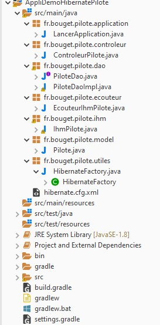

# Accès BD avec Hibernate

## Structure du projet à mettre en place



## Configuration du fichier **hibernate.cfg.xml**

```xml
<?xml version='1.0' encoding='utf-8'?>
<!DOCTYPE hibernate-configuration PUBLIC
"-//Hibernate/Hibernate Configuration DTD 3.0//EN"
"http://www.hibernate.org/dtd/hibernate-configuration-3.0.dtd">
 
<hibernate-configuration>
 
  <session-factory>
      <!-- Database connection settings -->
      <property name="connection.driver_class">com.mysql.cj.jdbc.Driver</property>
      <property name="connection.url">jdbc:mysql://localhost:3306/bd-avion?serverTimezone=UTC</property>
      <property name="connection.username">test</property>
      <property name="connection.password">test</property>
 
      <!-- JDBC connection pool -->
      <property name="connection.pool_size">1</property>
 
      <!-- SQL dialect -->
      <property name="dialect">org.hibernate.dialect.MySQL5InnoDBDialect</property>
      <property name="current_session_context_class">thread</property>
      <property name="cache.provider_class">org.hibernate.cache.internal.NoCacheProvider</property>
      <property name="show_sql">true</property>
      <property name="hibernate.transaction.auto_close_session">true</property>
 
      <mapping class="fr.bouget.pilote.model.Pilote" />
  
  </session-factory>
 
</hibernate-configuration>

```

Placer ce fichier dans le répertoire **src/main/java** de votre projet Gradle.

### Contenu de **build.gradle**

```java
/*
 * This file was generated by the Gradle 'init' task.
 *
 * This generated file contains a sample Java Library project to get you started.
 * For more details take a look at the Java Libraries chapter in the Gradle
 * user guide available at https://docs.gradle.org/5.0/userguide/java_library_plugin.html
 */

plugins {
    // Apply the java-library plugin to add support for Java Library
    id 'java-library'
}

repositories {
    // Use jcenter for resolving your dependencies.
    // You can declare any Maven/Ivy/file repository here.
    jcenter()
}

dependencies {
    // This dependency is exported to consumers, that is to say found on their compile classpath.
    api 'org.apache.commons:commons-math3:3.6.1'
    compile group: 'org.hibernate', name: 'hibernate-core', version: '5.4.23.Final'
    compile group: 'mysql', name: 'mysql-connector-java', version: '8.0.22'
//	runtimeOnly 'mysql:mysql-connector-java'

    // This dependency is used internally, and not exposed to consumers on their own compile classpath.
    implementation 'com.google.guava:guava:26.0-jre'

    // Use JUnit test framework
    testImplementation 'junit:junit:4.12'
}

```

### Classe SessionFactory pour la connexion et les transactions

```java
package fr.bouget.pilote.utiles;

import org.hibernate.SessionFactory;
import org.hibernate.boot.Metadata;
import org.hibernate.boot.MetadataSources;
import org.hibernate.boot.registry.StandardServiceRegistryBuilder;
import org.hibernate.service.ServiceRegistry;

public class HibernateFactory {

	    private static final SessionFactory sessionFactory = buildSessionFactory();

	    // Hibernate version 5:
	    private static SessionFactory buildSessionFactory() {
	        try {
	            // Création du ServiceRegistry grâce à "hibernate.cfg.xml"
	            ServiceRegistry serviceRegistry = new StandardServiceRegistryBuilder()
	                    .configure("hibernate.cfg.xml")
	                    .build();

	            Metadata metadata = new MetadataSources(serviceRegistry).getMetadataBuilder().build();
	            return metadata.getSessionFactoryBuilder().build();
	        } catch (Throwable ex) {
	         
	            System.err.println("Erreur d'initialisation de la SessionFactory" + ex);
	            throw new ExceptionInInitializerError(ex);
	        }
	    }
	 
	    public static SessionFactory getSessionFactory() {
	        return sessionFactory;
	    }
	 
	    public static void shutdown() {
	        // Fermeture du chache et des pools de connexion
	        getSessionFactory().close();
	    }
	 
	}
```

### Classe Pilote - PiloteDaO - PiloteDaoImpl

- Entity : **Pilote.java**

```java
package fr.bouget.pilote.model;

import java.io.Serializable;

import javax.persistence.Column;
import javax.persistence.Entity;
import javax.persistence.Id;
import javax.persistence.Table;

@Entity
@Table(name="pilote")
public class Pilote implements Serializable {
	private static final long serialVersionUID = 1L;

	@Id
	@Column(name="ID")
	private Integer id;
	
	@Column(name="NOM")
	private String nom;
	
	@Column(name="SITE")
	private String site;

	public Pilote() {super();}

	/**
	 * Constructeur
	 * @param id
	 * @param nom
	 * @param site
	 */
	public Pilote(int id, String nom, String site) {
		super();
		this.id = id;
		this.nom = nom;
		this.site = site;
	}

	public Pilote(String nom, String site) {
		this(0, nom, site);
	}

	

	public Integer getId() {
		return id;
	}

	public void setId(Integer id) {
		this.id = id;
	}

	/**
	 * @return the nom
	 */
	public String getNom() {
		return nom;
	}

	/**
	 * @param nom the nom to set
	 */
	public void setNom(String nom) {
		this.nom = nom.toUpperCase();
	}

	/**
	 * @return the site
	 */
	public String getSite() {
		return site;
	}

	/**
	 * @param site the site to set
	 */
	public void setSite(String site) {
		this.site = site.toUpperCase();;
	}

	/* (non-Javadoc)
	 * @see java.lang.Object#toString()
	 */
	@Override
	public String toString() {
		return this.getNom();
	}
}

```

- Interface : **PiloteDao.java**

```java
package fr.bouget.pilote.dao;

import java.util.List;

import fr.bouget.pilote.model.Pilote;

/**
 * @author Philippe
 *
 */
public interface PiloteDao {

	Pilote findByNom(String nom);
	List<Pilote> findAll();
	int addPilote(Pilote pilote);
	int removePilote(Pilote pilote);
	int updatePilote(Pilote pilote);
	int count();
}


```

- Classe d'implémentation des méthodes de l'Interface : **PiloteDaoImpl.java**

```java
package fr.bouget.pilote.dao;

import java.util.List;

import org.hibernate.Session;
import org.hibernate.SessionFactory;
import org.hibernate.query.Query;

import fr.bouget.pilote.model.Pilote;
import fr.bouget.pilote.utiles.HibernateFactory;


/**
 * @author Philippe
 * Demo avec Hibernate et une seule table
 *
 */
public class PiloteDaoImpl  implements PiloteDao {

	private final String SELECT_PILOTE_PAR_NOM = "SELECT p FROM Pilote p WHERE PI_NOM =:nom";
	private final String SELECT_ALL = "SELECT p FROM Pilote p";
	private final String SELECT_COUNT = "SELECT MAX(p.PI_ID) FROM Pilote p";
	private SessionFactory factory = HibernateFactory.getSessionFactory();
	private Session session = factory.getCurrentSession();


	@SuppressWarnings("unchecked")
	@Override
	public Pilote findByNom(String nom){

		Pilote pilote = null;
		try
		{
			session.getTransaction().begin();
			Query<Pilote> requete = session.createQuery(SELECT_PILOTE_PAR_NOM);
			requete.setParameter("nom", nom);
			pilote = requete.getSingleResult();
		}
		catch (Exception e)
		{
			e.printStackTrace();
			session.getTransaction().rollback(); // on annule
		}
		return pilote;

	}

	@Override
	public List<Pilote> findAll()
	{
		List<Pilote> pilotes = null;
		try
		{
			session.getTransaction().begin();
			Query<Pilote> requete = session.createQuery(SELECT_ALL);
			pilotes = requete.getResultList();
			session.getTransaction().commit();
		}
		catch (Exception e)
		{
			e.printStackTrace();
			session.getTransaction().rollback(); // on annule
		}
		return pilotes;
	}

	@Override
	/**
	 * Méthode pour ajouter un pilote
	 * par MySQL.
	 */
	public int addPilote(Pilote pilote) {

		int resultat = 0;
		try
		{
			session.getTransaction().begin();
			session.persist(pilote);
			resultat=1;
		}
		catch (Exception e)
		{
			e.printStackTrace();
			session.getTransaction().rollback(); // on annule
		}
		return resultat;
	}
	
	@Override
	/**
	 * Méthode pour supprimer un pilote en base de données
	 */
	public int removePilote(Pilote pilote) {

		int resultat = 0;
		try
		{
			session.getTransaction().begin();
			session.remove(pilote);
			resultat=1;
		}
		catch (Exception e)
		{
			e.printStackTrace();
			session.getTransaction().rollback(); // on annule
		}
		return resultat;
	}

	@Override
	/**
	 * Méthode pour mettre à jour des informations d'un pilote
	 * en connaissant sa clef auto-générée.
	 */
	public int updatePilote(Pilote pilote) {
		
		int resultat = 0;
		try
		{
			session.getTransaction().begin();
			session.saveOrUpdate(pilote);
			resultat=1;
		}
		catch (Exception e)
		{
			e.printStackTrace();
			session.getTransaction().rollback(); // on annule
		}
		return resultat;
	}


	/**
	 * 
	 * @return
	 */
	@Override
	public int count() {
		
		int nombre = 0;
		try
		{
			session.getTransaction().begin();
			Query<Integer> requete = session.createQuery(SELECT_COUNT);
			nombre = requete.getSingleResult();
		}
		catch (Exception e)
		{
			e.printStackTrace();
			session.getTransaction().rollback(); // on annule
		}
		return nombre;
	}

}

```

## Tester le fonctionnement dans votre méthode main()

```java
// on instancie la classe d'implémentation de l'interface
PiloteDao piloteDao = new PiloteDaoImpl(); 

// on récupère une liste d'objets Pilote
List<Pilote> pilotes = piloteDao.findAll();
		for (Pilote pilote : pilotes) {
			System.out.println(pilote.getNom());
		}
```

>Rien d'autre à faire ! Enfin si, avoir une table **pilote** avec quelques enregistrements

```sql
CREATE TABLE IF NOT EXISTS `pilote` (
  `ID` int(11) NOT NULL AUTO_INCREMENT,
  `NOM` varchar(20) DEFAULT NULL,
  `SITE` varchar(20) DEFAULT NULL,
  UNIQUE KEY `PI_ID` (`ID`)
) ENGINE=InnoDB AUTO_INCREMENT=49 DEFAULT CHARSET=utf8;

INSERT INTO `pilote` (`ID`, `NOM`, `SITE`) VALUES
(1, 'SERGE', 'NICE'),
(2, 'JEAN', 'PARIS'),
(3, 'CLAUDINE', 'GRENOBLE'),
(4, 'ROBERT', 'NANTES'),
(5, 'MICHEL', 'PARIS'),
(6, 'LUCIENNE', 'TOULOUSE'),
(7, 'BERTRAND', 'LYON'),
(8, 'HERVE', 'BASTIA'),
(9, 'LUC', 'PARIS'),
(10, 'GASPARD', 'PARIS'),
(12, 'ELODIE', 'BREST');

```
