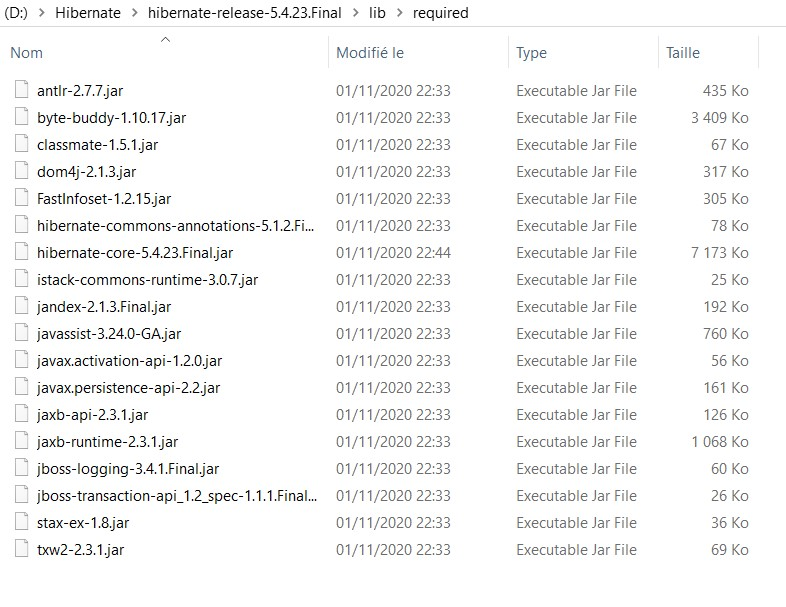

# Implementation JPA Hibernate avec Eclipse

## Récupérer le JAR sur maven repository

[https://mvnrepository.com/open-source/jpa-implementations](https://mvnrepository.com/open-source/jpa-implementations)

## Hibernate

- Contenu du répertoire Hibernate **required**

## Créer un projet JPA sous Eclipse pour générer vos entités depuis vos tables.

## Nous allons travailler sur la création d'une application simple AppliDemiPilote

