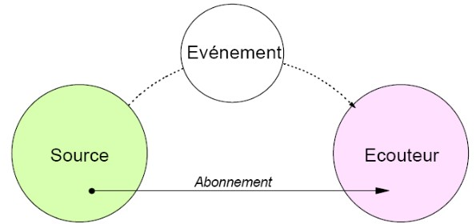
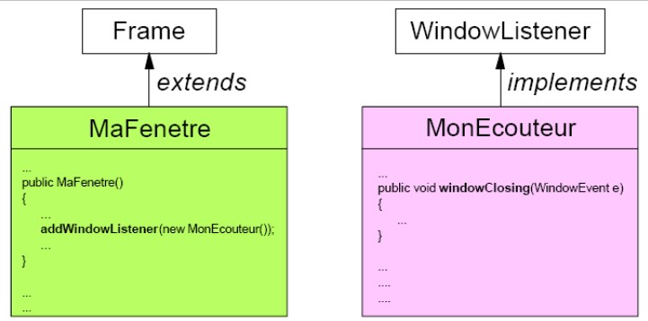
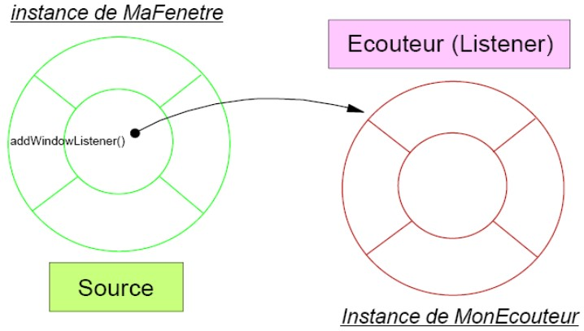
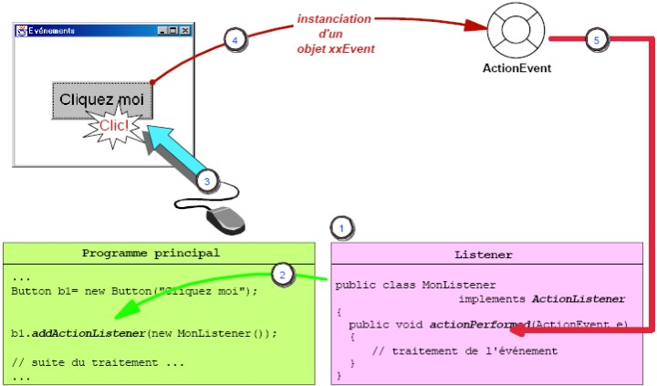

# Java et les événements : que des bonnes choses !

## Modèle par délégation

Ce chapitre permet de découvrir le modèle de gestion des événements par délégation. Nous apprendrons à créer un « _veilleur_ » appelé généralement **listener** , ce qui permettra de concevoir des *programmes évolués qui réagissent aux actions de l'utilisateur !*

Nous allons étudier les points suivants :

- Expliquer les concepts du modèle de gestion des événements par délégation.
- Créer des classes **écouteurs** (Listener) pour répondre aux événements.
- Enregistrer les classes Listener auprès de composants sources.
- Capturer les événements et effectuer les traitements appropriés.

>La gestion des événements est la faculté pour votre programme de réagir à son environnement. La plus séduisante des interfaces graphiques est inutilisable si l'utilisateur ne peut pas interagir avec elle.

### **Qu'est-ce qu'un événement ?**

>Un **événement** est quelque chose qui survient pendant le fonctionnement de votre application.

Cette définition peut paraître un simpliste, mais elle est réaliste. Parmi les exemples que l'on peut citer, il y a le «  **clic**  » souris, l'utilisation du **clavier** , la **sélection** d'un bouton ou d'une zone de saisie. Un événement peut aussi être généré par une application ou le système d'exploitation lui-même, par exemple lors d'une connexion réseau. Java, comme de nombreux langages informatiques, est capable d'interpréter de tels événements. L'autre façon de voir un événement, est de considérer qu'il s'agit d'une action que votre code est capable de recevoir et à laquelle il sait répondre.

**Pour décrire un événement avec lequel Java peut travailler, il faut se poser les questions suivantes :**

> Qu'est-ce qui a causé l'événement ? Etait-ce un Bouton (JButton), un Champ texte (JTextField), ou l'appui sur une touche du clavier ?

> Quelle est la nature précise de l'événement ? Est-ce l'appui du bouton de la souris ou son relâchement ? La souris a-t-elle été cliquée une fois ou est-ce un double clic ?

> Y a-t-il d'autres informations concernant cet événement ? Si l'on a cliqué, quelles sont les coordonnées ? S'il s'agit d'une saisie clavier, une autre touche était-elle appuyée en même temps (touche ALT, CTRL,...) ?

Lorsque survient un événement, du fait qu'il s'agit d'un langage Orienté Objet, **la JVM crée un objet Evénement (de classe xxEvent**). Cet objet contient toutes les informations nécessaires pour gérer correctement cet événement :

- la **source de l'événement** (le Composant qui a généré l'objet événement)

- **l'identifiant de l'événement** (ex : mouseDown ou MouseUp), qui permet de distinguer les événements les uns des autres.

- d'autres informations qui dépendent de la **nature de l'événement** (ex : le libellé du bouton qui a généré l'événement).



### Modèle d'événement par délégation

>Le modèle par délégation s'appuie sur le concept de sources d'événements et de listeners (écouteurs, veilleurs, handleurs d'événements ...).

> Les sources d'événements sont les objets (JComponent) qui générent les événements.

> Les **Listeners** sont des classes qui sont à l'écoute et qui traitent les événements générés par les sources d'événements. Ces classes doivent implémenter des *interfaces* **Listener'**. Il est nécessaire de bien comprendre la façon dont les objets sources d'événements et les listeners interagissent dans le modèle par délégation.

Ci-dessous, vous trouverez quelques références sur les Composants, les objets Event, les Listeners, qui sont utilisés dans le modèle par délégation. Voici certaines des questions à se poser par rapport au modèle par délégation :

- Comment la source de l'événement génère l'objet événement ?

- Comment la source de l'événement sait où envoyer l'objet événement ?

- Comment un Listener se prépare t-il à recevoir l'événement ?

- Que fait le Listener, une fois l'événement reçu ?

Les paragraphes suivants vont répondre de façon systèmatique à ces différentes questions.

**Génération de l'objet événement :**

>_L'objet événement est généré automatiquement_. 

Quand on clique sur un JButton, un objet événement est potentiellement instancié. Quand on déplace la souris, un événement est aussi potentiellement généré. Bien que vous puissiez générer vos propres événements cela n'est pas nécessaire avec les Composants AWT/SWING.

> Le modèle par délégation génère différents types d'événements, en fonction de la source.

Par exemple les fenêtres génèrent des **WindowEvents** et les **JButton** génèrent des **ActionEvents**.

Quand vous savez quels objets génèrent quels événements, vous vous posez la question suivante :

> Comment la source de l'événement sait où envoyer l'instance de l'événement, afin d'exécuter le traitement approprié ?

**Envoi de l'objet événement au Listener :**

>L'objet événement créé par l'objet source doit être envoyé à un objet Listener.

- Comment sait-il à quel Listener envoyer l'objet événement ?

- Ensuite, que se passe t-il, si plusieurs Listeners sont disponibles ?

>**La source de l'événement doit s'abonner auprès du Listener auquel elle souhaite confier la gestion des événements**.

Ce schéma se retrouve finalement fréquemment dans la vie courante. Regardez l'exemple suivant, dans lequel vous jouez le rôle d'un "veilleur" (Listener), en train d'attendre un certain événement :

Exemple :

Si vous (l'écouteur), souhaitez recevoir régulièrement un magazine (qui dans notre exemple représente l'événement), que devez-vous faire ? Vous demanderez à l'éditeur de vous enregistrer dans son mailing.

>En langage Java, vous devez vous enregistrer auprès de la source. Ensuite, lorsque l'éditeur publie un nouveau numéro du magazine, vous en recevez automatiquement une copie. Java gère ce processus de la même manière.

Vous devez cependant comprendre, que cette analogie n'est pas aussi stricte que ne l'est Java. En effet, notre éditeur est prêt à envoyer son magazine à toute personne qui accepte de le payer.

>Java n'est pas aussi libéral, puisqu'il ne peut envoyer ces objets événements qu'à des Listeners spécifiquement conçus pour des événements bien précis.

**Préparation du Listener à recevoir des événements :**

La classe destinée a recevoir les événements doit adhérer à un contrat très stricte. La façon d'imposer ce contrat consiste à implémenter des interfaces: Rappelez-vous qu' **une interface permet d'imposer un contrat entre cette interface et la classe qui l'implémente**. Elle **permet de s'assurer de la présence de toutes les méthodes définies dans l'interface**.

Dans l'exemple suivant, nous verrons comment appliquer nos connaissances sur les interfaces :



Vous avez remarqué que lorsqu'on crée une JFrame, cette dernière ne se ferme pas si l'on clique sur la case de fermeture. Il est possible de résoudre ce problème en se posant les questions suivantes :

- **Quelle est la source de l'événement ?**

Si vous tentez de fermer une fenêtre et qu'il s'agit d'un objet de classe JFrame, la source de l'événement est donc une _JFrame_.

- **Quel est le type de l'événement généré ?**

On peut essayer de deviner, mais le mieux est de consulter l'API. D'après la documentation, la classe JFrame crée des événements de type _WindowEvent_.

- **Quels sont les types d'objets capables de recevoir les WindowEvents ?**

Souvenez-vous que **WindowListener** est une des nombreuses *interfaces* capables de recevoir certains événements. D'après la documentation de l'API Java les objets qui implémentent l'interface **_WindowListener_** sont capables de recevoir les événements *WindowEvent*.

Voici la solution :

Après avoir répondu aux questions précédentes, nous avons toutes les informations nécessaires à la conception de notre classe Listener :

```java
import java.awt.event.\*;

public class MonEcouteur implements WindowListener {

public void window0pened(WindowEvent e) {}
public void windowClosing(WindowEvent e)
{
    JFrame f (JFrame) e. getSource(); // étape 1
    f.setVisible(false); // étape 2
    f.dispose() ; // étape 3
    System.exit(0); // étape 4

}

public void windowClosed(WindowEvent e) {}
public void windowIconified(WindowEvent e) {}
public void windowDeiconified(WindowEvent e){}
public void windowActivated(WindowEvent e){}
public void windowDeactivated(WindowEvent e) {}
}
```

**Remarques :**

>L'implémentaion d'une interface **oblige à implémenter toutes les méthodes de cette interface, même si elles ne font rien**.

JLes 4 instructions précédentes sont communément utilisées comme façon de fermer une fenêtre et son application. Voici une explication détaillée de ces différentes étapes :

_Etape 1 :_

**JFrame f e.getSource()** : L'une des informations contenue dans l'objet événement est l'objet source de cet événement (La référence de l'objet JFrame).

_Etape 2 :_

**setVisible(false)** : La fenêtre en cours étant visible, cette instruction permet d'enlever la fenêtre de l'écran.

_Etape 3 :_

**dispose()** : Bien que la fenêtre soit maintenant invisible, celle-ci est toujours référencée dans la JVM. Cette instruction permet donc de supprimer la référence de l'objet fenêtre.

_Etape 4 :_

**System.exit(0)** : Permet d'arrêter la JVM. Soyez certain de bien vouloir cela.

Maintenant qu'un Listener est prêt à répondre correctement aux événements WindowEvent, il faut encore enregistrer ce Listener auprès de la source des événements.



Maintenant qu'une JFrame est affichée, *il faut enregistrer l'instance du listener auprès de l'instance de la fenêtre* MaFenetre (la source).

> Notez la méthode utilisée pour cet enregistrement. Cette technique est utilisée à chaque fois que l'on ajoute un listener. Si vous deviez créer un listener devant recevoir les événements de type WindowEvent, celui-ci devrait implémenter l'interface WindowListener. La méthode permettant d'enregistrer le Listener auprès de la source serait alors addWindowListener().

Il s'agit d'une des nombreuses méthodes d'enregistrement des listener auprès des sources d'événements. **Ces méthodes sont toujours de la forme addXxxxListener().**

Exemple de code :
```java
public class MaFenetre extends JFrame
{
    MonEcouteur ecouteur;
    MaFenetre()
    {
        preparelnterface();
    }
    private void preparelnterface()
    {
        this.ecouteur = new MonEcouteur();
        this.addWindowListener(ecouteur);
        this.setSize(200,200);
        this.setVisible(true);
    }
    public static void main(String[] args)
    {
        MaFenetre fenetre = new MaFenetre();
    }
}
```

Résumé et illustration de la gestion des événements :



_Première étape :_

- Dans un premier temps il faut prévoir un Listener.

En fonction du type de source pour les événements, on choisit l'interface que la classe listener devra implémenter. Par exemple, pour un Bouton, le type d'événement attendu est **ActionEvent**, l'interface fournie par Oracle se nomme **ActionListener**. Cette interface définit une méthode, qu'il faut implémenter dans notre écouteur.

_Deuxième étape :_

- Enregistrer le Listener auprès de la source de l'événement (le bouton).

On peut dire aussi que le listener s'enregistre auprès de la source de l'événement.

_Troisième étape :_

On provoque un événement en cliquant sur le bouton.

_Quatrième étape :_

La source de l'événement instancie un objet **xxxEvent** (ici un **ActionEvent**). Cet objet contient toutes les informations nécessaires concernant l'événement.

_Cinquième étape :_

Cet événement est transmis à l'écouteur auquel la source de l'événement est abonnée. Ensuite la méthode qui correspond à l'événement est automatiquement exécutée.

Dans ce chapitre, nous avons étudié les modèles utilisés par Java pour la gestion d'événements. Nous avons présenté le modèle par délégation et détaillé toutes les étapes de sa mise en oeuvre. Nous avons vu que l'écouteur pouvait exister dans une classe séparée. Dans la suite du cours, nous verrons comment implémenter directement le listener à l'intérieur de la classe dans laquelle on l'utilise.

**Classes Adapters et classe internes**

- Gérer les événements liés aux fenêtres.
- Utiliser les classes de type **xxxAdapter** pour la gestion des événements.
- Utiliser les classes locales pour la gestion des événements.

**Capturer les événements WindowEvent :**

> L'écouteur qui gère les événements WindowEvent doit implémenter toutes les méthodes de l'interface WindowListener.

Exemple de code :

```java
public class MonEcouteur implements java.awt.event.WindowListener
 {
    public void windowClosing (WindowEvent we)
    {
        traitementEvenement();
    }
    public void windowOpened(WindowEvent we) {}
    public void windowClosed(WindowEvent we) {}
    public void windowIconified(WindowEvent we) {}
    public void windowDeiconified(WindowEvent we) {}
    public void windowActivated(WindowEvent we) {}
    public void windowDeactivated(WindowEvent we) {}
 }
```

Heuresement, l'interface **ActionListener** que nous utilisons fréquemment ne définit que la méthode **actionPerformed()**, contrairement à l'interface **WindowListener** définit **7 méthodes** , dont une seule nous est utile !

>Dans notre exemple, notre écouteur doit obligatoirement implémenter ces 7 méthodes. Bien que ce ne soit pas très difficile d'implémenter les 6 méthodes qui ne font rien, cela n'est pas très élégant.

Si en plus on devait récupérer des événements **KeyEvent** et **MouseEvent**, il faudrait ajouter les méthodes des interfaces **KeyListener** et **MouseListener**, dont certaines seraient tout aussi inutiles. Les outils de développement un peu évolués sont bien entendu capables de générer automatiquement ces méthodes vides.

>Heureusement, il y a une solution grâce au design pattern Adapteur !

**Utilisez une classe Adapter :**

Une classe peut être conçue pour gérer les événements liés aux fenêtres (WindowEvent), par exemple en étendant la classe WindowAdapter.

La classe ci-dessous hérite du type **WindowListener** ainsi que des méthodes "vides" de la classe **WindowAdapter**. Seule la méthode qui nous intéresse **windowClosing()** est alors redéfinie :

```java
public class MonEcouteur extends WindowAdapter
{
    // seule cette méthode est redéfinie
    public void windowClosing (WindowEvent we)
    {
        System.exit(0);
    }
}
```

Comme vous pouvez le constater dans le code ci-dessus, la classe **MonEcouteur hérite de la classe WindowAdapter** qui permet de redéfinir uniquement la ou les méthodes dont nous avons besoin sans devoir redéfinir systématiquement toutes les autres méthodes si nous avions implémenter l'interface **windowsListener**.

>Remarques : Java fournit une série de classes « Adapter » telles que **WindowAdapter**, **MouseAdapter**, **KeyAdapter**,...

Ces classes contiennent toutes les méthodes vides de l'interface listener correspondante.

> Elles implémentent le type nécessaire, par exemple par l'instruction : **implements WindowListener**.

>Les **classes Adapters** sont une alternative intéressante lorsque les listeners sont implémentés dans des classes séparées du programme principal. Il est possible de passer des informations utiles au moment de la fermeture à la classe « MonEcouteur » (ex : le message à afficher au moment de quitter), ou il se peut que le listener « MonEcouteur » ait besoin d'appeler la méthode finTraitement() de l'application.

Dans la classe de notre application, il faudra écrire l'abonnement au listener « MonEcouteur » comme ceci :

```java
MonEcouteur ve = new MonEcouteur(this);
this.addWindowListener(ve);
```

Il sera nécessaire de passer à l'écouteur une référence sur l'application ou sur l'objet de l'application. La façon de procéder consiste à prévoir un constructeur à la classe « MonEcouteur », qui puisse recevoir sous forme de paramètre des données de l'application, ainsi qu'une variable d'instance pour mémoriser ces informations.

Exemple :

```java
public class MonEcouteur extends WindowAdapter
{
    MaFenetre maReferenceDeFenetre;
    public MonEcouteur(MaFenetre fen)
    {
        maReferenceDeFenetre = fen;
    }
    public void windowClosing(WindowEvent we)
    {
    // ici on appelle une méthode accessible via l'adresse de l'objet MaFenetre :
        maReferenceDeFenetre.traitementFinal();
    }
}

**Utiliser une classe interne :**

Il y a une autre solution dans la gestion des événements. Elle consiste à définir le listener dans une classe interne, comme ci-dessous :

```java
addWindowListener
 (
    new WindowAdapter()
    // début de la classe locale
    {
        public void windowClosing(WindowEvent we)
        {
            finTraitement();
        }
    }
    // fin de la classe locale
);
// fin du addWindowListener()
```

Dans les exemples précédents, le modificateur d'accès de la méthode **finTraitement()** *avait dû être modifié de private à protected afin que cette méthode puisse être appelée depuis la classe « MonEcouteur »*.

>Si l'on utilise une classe interne, la méthode finTraitement() peut à nouveau être déclarée private. Elle est accessible depuis les classes internes de la classe « MaFenetre ».

Cette sorte de classe interne, connue sous le nom de classe «  **anonyme**  » interne, paraît difficile à comprendre au premier abord. **ll n'y a pas l'instruction de déclaration de la classe et donc pas de nom de classe**. La classe **WindowAdapter** est la classe « parente » de la classe interne anonyme (si l'on avait mis le nom de l'interface au lieu d'un nom de classe, la classe interne aurait dû implémenter cette interface). La classe interne se reconnait par l'accolade ouvrante **{** là où l'on attendait un **)** après le « **new WindowAdapter()** ». Le code de la classe interne se trouve ensuite entre les 2 accolades.

Le mot clé **new** provoque l'instanciation de la classe interne au moment de l'exécution et sa référence est renvoyée comme paramètre de la méthode **addWindowListener()**. Au moment de la compilation un fichier nommé « MaFenetre$1.class » est créé pour cette classe interne. Si l'on a une autre classe interne dans la même classe, son fichier se nommera "MaFenetre$2.class".

Une fois encore un objet séparé est enregistré pour recevoir les **WindowEvents**. Notre classe « MaFenetre » (l'application) ne déclare pas qu'elle implémente WindowListener. **Elle n'implémente aucune des méthodes de l'interface WindowListener, ce rôle est tenu par la classe interne**.

### Résumé de ce chapitre

Dans ce chapitre nous avons présenté trois conceptions d'interception des événements de l'interface graphique utilisateur :

1. interface xxxListener
2. classe xxxAdapter
3. classe interne
