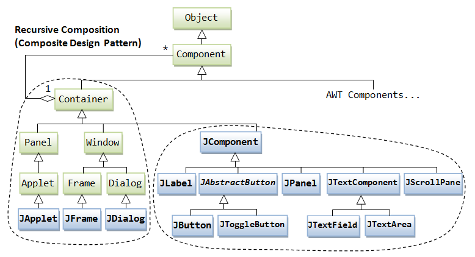
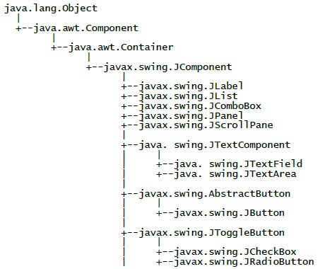

# Java Swing

## Les interfaces utilisateurs en Java


## Les Composants java


## Avertissement

Ce document présente les principales entités graphiques nécessaires à la construction d'une IHM (Interface Homme-Machine) en Java. Les applications étudiées dans ce cours sont de type SDI (Simple Document Interface). Elles ne comporteront qu'une seule fenêtre incluant uniquement les contrôles simples, que l'on rencontre le plus couramment.

## Avant propos

 L'interface est peut-être la partie la plus importante d'une application mais elle est aussi celle que l'on remarque le plus. Pour les utilisateurs, elle représente l'application et certains ne doivent même pas savoir qu'un programme est exécuté en arrière-plan.

Lorsque le développeur.euse crée.e une application, il doit prendre certaines décisions concernant l'interface (le style d'interface simple document ou multi-documents, le nombre de fenêtres, les commandes à inclure dans les menus, les barres d'outils à prévoir pour reproduire des fonctions de menu,...etc).

Cependant, on doit tenir compte de l'expérience de l'utilisateur (UX). Une application doit avoir :

- une conception simple et intuitive.
- multi-langue si besoin.
- répondre au besoin de l'utilisateur final.

La création d'une interface utilisateur doit être considérée comme un **processus itératif**

>Il est rare de parvenir à la perfection dès la première tentative.

Le premier chapitre présente les composants nécessaires à la conception d'une application avec l'API Java Swing, ainsi que le processus de création d'une interface.

## **Table des matières**

Les bibliothèques graphiques de l'API

Abstract Window Toolkit (AWT)

API Swing

API JavaFX

Hiérarchie des classes

Architecture d'une application Swing

Proposition d'architecture

Réflexions techniques

Tour d'horizon des contrôles simples

Ajout des contrôles à la fenêtre application

Les panneaux

Les contrôles toujours associés à un panneau

Propriétés communes des composants

Agencement des contrôles

Les différentes stratégies de positionnement

Critères de choix

Un petit exercice Agencement des Controles

Gestion des évènements

Les événements Java

Mise en place d'un écouteur

Autre exemple

[Démarche générale

Autre type d'écouteur

Optimisation du code source

La classe Timer

Interface utilisateur complet

La barre de menus

La barre d'outils

La barre d'état

Les fenêtres prédéfinies

La boîte à propos

Sous-classement des contrôles

Séparation classes UI et classes métier

Modèle MVC

Application Editeur de texte

Règle de conception de l'interface utilisateur

Positionnement des contrôles

Cohérence entre les éléments de l'interface

Annexes

Correction de l'exercice sur l'agencement des contrôles

Astuce pour l'accessibilité aux braillistes

#
### **Les bibliothèques graphiques de l'API**

Il existe 3 bibliothèques graphiques pour Java :

- AWT (Abstract Window Toolkit)
- SWING (API Java) évoluée
- JavaFX (API non intégrée par défaut)

## AWT : Abstract Window Toolkit

L'Abstract Window Toolkit est historiquement la première qui a été proposée, dès le JDK 1.0. La particularité de l'AWT, est que **Java fait appel au système d'exploitation sous-jacent pour afficher les composants graphiques**. Pour cette raison, l'affichage de l'interface utilisateur d'une application peut diverger sensiblement: chaque système d'exploitation dessine à sa manière un bouton. L'AWT garantira que la fonctionnalité recherchée sera dans tous les cas fournie mais elle sera présentée différemment.

Or Java se veut être 100% indépendant de la plate-forme utilisée. Pour cette raison, une nouvelle API nommée SWING a été définie.

## API Swing

Des objets purs Java !

**Swing a donc été mis en place pour assurer 100% de portabilité** (même un pixel doit avoir la même couleur). Pour assurer cette portabilité, un composant graphique est dessiné non plus par l'OS (Operating System), mais par Java, ce qui en terme de temps d'exécution a un cout !

Swing est présenté comme étant écrit uniquement en Java. La JVM doit être capable d'interagir avec l'OS pour pouvoir tracer un point. Or c'est ce que font les classes de base de l'AWT (telles que _Component_, _Container_, ...).

>En conséquence, **tous les composants de Swing dérivent d'une classe de l'AWT**.

Les mécanismes de gestion d'évènements et de positionnent des composants de l'AWT restent utilisable avec Swing. Certaines classes déjà utilisées avec l'AWT sont donc toujours d'actualité. Une application Swing doit importer des packages spécifiques mais aussi certains packages de l'AWT. Tout source utilisant Swing commence par :

```java
import javax.swing.*; // composants graphiques

import java.awt.*; // composants natifs

import java.awt.event.*; // événements ou écouteurs

```

Swing est bien plus riche que l'AWT. Même si un composant n'existe pas en natif sur l'OS, rien ne vous empêche de le redessiner à nouveau. **Les classes qui font appel aux fonctions systèmes de la machine sous-jacente sont appelées communément des composants lourds**. Elles utilisent du code natif. C'est le cas d'un nombre réduit de classes comme celles qui conceptualisent les fenêtres. **Les composants légers sont eux écrits en java pur**. C'est le cas par exemple des contrôles qui ne sont pas dessinés par l'OS mais par du code Java. Ces contrôles auront toujours le même aspect et seront toujours disponibles quelle que soit la machine.

## API JavaFX

Cette API n'est plus intégrée par défaut à Java. JavaFX est considérée comme une API permettant de réaliser des **applications dites riches** qui rassemblent les avantages à la fois des applications Client/Serveur et des applications du Web. Les objectifs étant les suivants :

- Expérience utilisateur riche (UX User eXpérience) : de jolis composants !
- Facilité de déploiement
- Ergonomie

Les applications riches peuvent être regroupées 2 catégories :

- RIA : Rich Internet Applications (applications web)
- RDA : Rich Desktop Applications (applications de bureau)

JavaFX actuellement en **version 15** est devenu un projet open source **[https://openjfx.io/](https://openjfx.io/)** qui permet de développer des apllication riches de type Desktop, Mobile, et embarquée. Ce projet date de 2007/2008.

>Quel est l'intérêt de cette API Open Source ?

- Son intégration avec Java
- Fonctionne avec la machine virtuelle Java (JVM) de la plate-forme SE ou ME
- Open Source donc gratuit contrairement à d'autres API payantes.

## Hiérarchie des classes : Découverte des composants de l'API Swing

>La bibliothèque Swing est constituée d'une hiérarchie de classes. Chaque entité de l'interface graphique est associée à une classe inscrite dans une hiérarchie de classes liées par des liens d'héritage.



### Exemple d'IHM avec Swing


#### JFrame

La classe **JFrame** est associée à la fenêtre principale de l'application. Elle comprend :

- une barre de titre
- une bordure permettant le re-dimensionnement
- les boutons standards de fermeture, d'agrandissement et de mise en icône.
- elle peut contenir une barre de menu, une barre d'outils et/ou une barre d'état.


#### JDialog

La classe **JDialog** est associée à une boite de dialogue en général ouverte en **mode modal** ou **non modal** par la fenêtre application. Elle contient des contrôles tous dérivés directement ou indirectement de **JComponent** (liste, bouton, label, …).


contient 2 composants :

- **JLabel** (étiquette)
- **JButton** (bouton)

#### Notions de couches

L'une comme l'autre fenêtre est composée d'objets panneaux (au sens de la composition UML) instances d'une sous-classe de _Container_.

Un premier panneau appelé **layeredPane** (de classe _JLayeredPane_) représente la zone utile de la fenêtre. Elle est elle-même composée d'une barre de menu (de classe _JMenuBar_) et une zone client appelée _contentPane_ (de classe _JPanel_) conteneur pour les contrôles éventuels.


#
### **Architecture d'une application Swing**

## Proposition d'architecture

Une application graphique Java sera constituée d'au moins deux classes dont l'une sera dérivée des classes Swing.


Toute application sera constituée d'une :

- **Classe Application** : Contenant la méthode statique main(), _point d'entrée_ de l'application qui définit le _look and feel_ et _crée un seul objet instance de la classe application_.

```java
public class Application {
	public static void main(String args[])
	{
		try {
			UIManager.setLookAndFeel( UIManager.getCrossPlatformLookAndFeelClassName());
		} catch(Exception e) { }
		new Application ();
	}
}
```

 Le constructeur de la classe crée un objet _FenêtrePrincipale_ et définit son état avec éventuellement sa position à l'écran.
 
```java
public Application ()
{
	FenetrePrincipale frame = new FenetrePrincipale();
	frame.setVisible(true);
}
}
```

-**Classe Fenêtre Principale** : Classe dérivée de _JFrame_. C'est la fenêtre principale de l'application. _JFrame_ est une classe représentant une fenêtre évoluée qui peut s'afficher sur le bureau.
Elle possède une barre de titre et peut être réduite, mise en icône ou fermée par des boutons.

Elle recevra des contrôles et possèdera éventuellement une barre de menu ou une barre d'état.

Cette classe aura toujours la structure suivante:

```java
public class FenetrePrincipale extends JFrame {
	// Champs privés: Réferences d'objets contrôles, menus,...
	public FenetrePrincipale()
	{
		this.setDefaultCloseOperation(EXIT_ON_CLOSE);
		// Définition de l'état initial de la fenêtre,
		initControles ();
	}
	private void initControls ()
	{
		// Définition de l'état initial des contrôles
		// Positionnement des controles
	}
	// Gestion des événements
}
```

 Elle comportera des champs privés, un pour chaque contrôle (bouton, étiquette, zone de texte,...) ou composant (barre de menu, barre d'état,...) qu'elle contiendra. Le constructeur définit l'état initial de la fenêtre principale (barre de titre, style de bordure,...) puis appelle une méthode privée qui initialise les objets éventuellement contenus.

## Réflexions techniques

### Programmation objet et interface graphique

>Il est important de préciser qu'a toute entité graphique de l'interface utilisateur (fenêtre, menu, boutons, contrôles,...) sera associée un objet, instance d'une classe Swing. Tout appel de méthode sur un objet Swing agira sur l'état de l'objet et aura un effet visuel sur l'entité graphique associée.

### Le look and feel

Le dessin d'un composant Swing est pris en charge par des classes java. Une application Swing peut donc avoir le même rendu graphique (_look and feel_) quel que soit le système d'exploitation de la plate-forme sur laquelle s'exécute l'application. C'est pour cette raison qu'une application java peut utiliser un contrôle même si celui-ci n'est pas disponible dans l'API graphique du système d'exploitation. Java gère un _Pluggable look and feel_ (Le rendu graphique est pris en charge par des classes à part).

Certains _L&F_ ont été pré-définis comme celui spécifique aux applications java (_metal_) ou celui de Windows, _Motif_, et il est relativement aisé de re-définir son propre _L&F_

La méthode statique _main_ de la classe application utilise la méthode statique _setLookAndFeel_ de la classe _UIManager_ pour imposer le _L&F_ désiré. Ci-dessous les méthodes imposent le _L&F metal_

Pas toujours joli tout ça !


```java
UIManager.setLookAndFeel(UIManager.getCrossPlatformLookAndFeelClassName());
JFrame.setDefaultLookAndFeelDecorated(true) ;
```

Il est possible aussi de faire en sorte qu'une application prenne automatiquement le _L&F_ de la plate-forme sur laquelle elle s'exécute.

```java
UIManager.setLookAndFeel(UIManager.getSystemLookAndFeelClassName());
```


 Sous réserve qu'il soit disponible, rien ne s'oppose à choisir un _L&F_ quelconque (Motif,...)

```java
UIManager.setLookAndFeel("com.sun.java.swing.plaf.motif.MotifLookAndFeel");
```

Un changement de _L&F_ n'impacte ni la nature, ni le positionnement des composants, mais *seulement le rendu visuel des composants*

### Ouverture et fermeture d'une fenêtre

La création d'une instance de la classe _FenetrePrincipale_ a pour effet de créer un objet fenêtre en mémoire.

> Attention : Cette fenêtre n'est pas visible.

_C'est le rôle de la méthode **setVisible(true)** de la rendre visible_. Par défaut, une demande de fermeture de la fenêtre rend la fenêtre invisible. La méthode **setDefaultCloseOperation()** modifie le mode de fermeture.

> Attention : Avec l'argument EXIT\_ON\_CLOSE la fermeture de la fenêtre provoque la terminaison de l'application !

Quelques méthodes utilisables

Le constructeur de la classe FenetrePrincipale définit l'état de la fenêtre application. Quelques méthodes sont souvent utilisées.
Par exemple:

- **setSize(**) : Fixe la taille de la fenêtre
- **setTitle()** : Définit le libellé de la barre de titre
- **setCursor()** : Impose un curseur particulier
- **setLocation()** : Positionne la fenêtre par rapport au bureau
- **setResizable()** :Autorise ou non à retailler la fenêtre

### Découverte d'une première application

L'application contient un _JPanel_ (zone rectangulaire dans laquelle il est possible de dessiner) dont la couleur de fond sera blanche. Elle occupe toute la partie utile (zone client) de la fenêtre principale. Dans cette zone graphique l'application dessine un carré jaune et un cercle rouge.


Soit une classe zone de dessin. Une zone de dessin est un **JPanel** avec un rectangle jaune et un cercle rouge.

```java
public class ZoneDessin extends JPanel
{
  public ZoneDessin ()
  {
    this.setBackground(Color.white);
  }
}
```

La fenêtre application doit créer un objet *ZoneDessin* et l'ajouter **add()** dans la zone client. La méthode **getContentPane()** permet d'obtenir une référence sur la zone client.

```java
public FenetrePrincipale()
{
  this.setSize(300,200);
  this.setTitle("Application de dessin");
  this.setDefaultCloseOperation(EXIT_ON_CLOSE);
  JPanel zoneClient = (JPanel) this.getContentPane();
  zoneClient.add (new ZoneDessin ());
}
```

Chaque fois que la fenêtre application change de taille ou qu'une fenêtre se superpose sur la fenêtre application, **la fenêtre et toutes les entités graphiques qu'elle contient doivent être re-dessinée**. Lorsqu'une entité est re-dessinée, Swing appelle la méthode **paintComponent()** sur l'objet associé. Cette méthode va être re-définie dans la classe ZoneDessin pour que soient effectuées les opérations de dessin spécifiques.

```java
public class ZoneDessin extends JPanel
{
  public void paintComponent(Graphics g)
  {
    super. paintComponent (g);
    g.setColor(Color.yellow);
    g.fillRect(5,5,30,30);
    g.setColor(Color.red);
    g.fillOval(15,15,30,30);
  }
}
```

Les opérations de dessins sont des actions de bas niveau. Il n'existe donc aucune méthode permettant de dessiner directement dans un composant graphique. Ces opérations ne seront possibles que via un contexte graphique associé au composant et géré par Swing. La méthode **paintComponent()** le fourni en argument. L'argument _g_ de classe _Graphics_ va permettre tous les tracés graphiques.

- setColor() : Fixe la couleur du tracé
- drawRect() : Trace un rectangle (ou un carré) vide
- drawLine() : Trace une ligne
- drawOval() : Trace un ovale (ou un cercle)
- drawImage() : Affiche une image
- drawString() : Affiche du texte
- fillRect() : Trace un rectangle plein
- fillOval() : Trace un ovale plein
- setFont() : Définit la fonte

#

### **Les composants Swing**

Le but de ce chapitre est de présenter rapidement les principaux **composants** Swing désignant les **contrôles** qui permettent une interaction classique entre l' utilisateur et le logiciel et les **panneaux** qui regroupent ou contiennent des contrôles. Chaque composant est associé à une classe spécifique placée dans la hiérarchie des classes Swing. Chaque composant de l'Interface Utilisateur de l'application sera un objet, instance d'une de ces classes sur lequel il sera possible d'appliquer un grand nombre de méthodes (définies en direct dans la classe ou héritées des classes parents).

#### Hiérarchie des classes


#### Composants avec rendu visuel


#### Arborescence des classes



Dans une application, ces composants vont être posés sur la zone client de la fenêtre principale, ils seront en très grand nombre. Ils correspondront parfois à des objets locaux dans des méthodes de la classe FenetrePrincipale et parfois à des champs de cette même classe. Il est conseillé de respecter une convention de nommage qui permette, dans le source java, de différencier du premier coup d'œil, les composants des objets  applicatifs . Le nom de chaque composants est préfixé par 3 lettres qui rappèlent sa classe (donc sa nature).

- **JLabel** : Etiquette ou image pouvant être préfixée **lbl**xxx, **pic**xxx (lblAuteur, picLogo)
- **JTextField**, **JTextArea** : Zone de saisie de texte pouvant être préfixée **txt**xxx (txtNom, txtPrenom)
- **JButton** : Bouton simple pouvant être préfixé  **cmd**xxx (cmdAnnuler, cmdOK)
- **JCheckBox** : Case à cocher pouvant être préfixée  **chk**xxx (chkValide)
- **JRadioButton** : Bouton radio pouvant être préfixé **opt**xxx (optArial, optTMS)
- **JList** : Liste déroulante pouvant être préfixée  **lst**xxx (lstAgence)
- **JComboBox** : Boîte combo pouvant être préfixée  **cbo**xxx (cboVille)
- **JScrollPane**, **JPanel** : Panneaux pouvant être préfixée  **pan** xxx (panHaut, panBas)

## Tour d'horizon des contrôles simples

**_JLabel_** - L'étiquette

Un Jlabel permet d'afficher un texte fixe et/ou une image. Il ne réagit pas aux sollicitations de l' utilisateur. Il est purement décoratif et sert à décrire les autres contrôles de l'interface utilisateur. Il correspond à un objet instance de la classe _JLabel_ dont le texte est prédéfini lors de l'appel du constructeur.

```java
 JLabel lblDescription = new JLabel ("Texte du JLabel");
```

Le texte peut-être modifié à l'exécution :


```java
  lblDescr.setText ("Label simple avec image");
```  

Une image peut être ajoutée comme ceci :

```java
lblDescr.setIcon(new ImageIcon("boulerouge.gif"));
```

>Nota : L'image et le libellé peuvent être définis directement lors de l'appel du constructeur.

Ce même contrôle peut servir à afficher une image seule :


```java
 JLabel logo = new JLabel (new ImageIcon("javalogo.gif"));
 ```
 
Le texte peut-être écrit au format HTML :


```java 
JLabel lblDescr = new JLabel ();
lblDescr.setText ( JLabel lblDescr = new JLabel ();
lblDescr.setText ("<html>Mon label <p>a <I>moi</I></html>");
```

**_JTextField_** – La zone de texte simple

Ce contrôle permet la saisie d'informations de type texte sur une seule ligne.


>Il est possible depuis l'application de lire l'information tapée par l' utilisateur.

```java
 TextField txtNom = new TextField();
 String valeur = txtNom.getText();
 ```

 ou de forcer une valeur à afficher :
 
 ```java
 txtNom.setText("Jean DUBOIS");
 ```

ou de changer les attributs de la zone de texte :

```java
txtNom.setColumns(15); // Fixe la longueur de la zone de saisie
txtNom.setEditable(false); // Empêche l'écriture dans la zone
```

Notons que la classe _JPasswordField_ dérivée de _JTextField_ est plus appropriée pour assurer la saisie des mots de passe.

**_JButton_** – Le bouton

Le bouton permet de déclencher un traitement. Il possède un libellé et éventuellement une icône et un raccourci.


Bouton simple :

```java
JButton cmdDepart1 = new JButton ("Départ");
```

Bouton initialement grisé, avec image :

```java
JButton cmdDepart2 = new JButton ("Départ");
cmdDepart2.setIcon(new ImageIcon("boulerouge.gif"));
cmdDepart2.setEnabled(false);
```

Bouton avec icône et accélérateur (**Alt+D** simule un clic sur le bouton) :

```java
JButton cmdDepart3 = new JButton("Départ");
cmdDepart3.setMnemonic('D');
```

**_JCheckBox_** – La case à cocher


 La case à cocher permet à l' utilisateur de sélectionner une option vraie/fausse ou active/inactive. Elle est constituée d'une case et d'un libellé. Le libellé et l'état initial peuvent être définis lors de l'appel du constructeur à la création de l'instance.
 
```java
JCheckBox chkOpt1 = new JCheckBox("Option #1");
JCheckBox chkOpt2 = new JCheckBox("Option #2");
chkOpt2.setSelected(true);
```

Des méthodes peuvent être respectivement utilisées pour cocher/décocher la case ou connaître son état :

- **setSelected()**
- **isSelected()**

**_JComboBox_** – La boîte combo

La boîte combo permet de proposer une liste de valeurs possibles au sein desquelles l'utilisateur effectue son choix. Elle est composée d'un bouton ou d'une zone de texte associée à une liste déroulante qui apparaît sur demande de l'utilisateur.

>Si la boîte est de type éditable, la zone de texte permet à l'utilisateur d'effectuer un choix autre que ceux proposés.

Boîte _JComboBox_ simple :


```java
String [] choix = {"Entrée", "Viande","Légume","Fromage", "Dessert"};
JComboBox cboChoix = new JComboBox ();
for (int i = 0; i<choix.length; i++) cboChoix.addItem(choix[i]);
```

Boite _JComboBox_ *éditable* (3 éléments maximum visibles) :


```java
cboChoix = new JComboBox ();
cboChoix.setEditable(true);
cboChoix.setMaximumRowCount(3);
```

L'application peut faire évoluer le nombre d'éléments de la liste par les méthodes :

- **removeItem()**
- **removeItemAt()**
- **addItem()**

On peut connaître le nombre d'éléments de la liste et savoir quel élément a été sélectionné avec les méthodes ci-dessous :

- **getItemCount()**
- **getSelectedItem()**

## Ajout des contrôles à la fenêtre application

Ce chapitre propose une démarche rigoureuse pour coder correctement une classe IHM correspondant à la fenêtre Principale. Celle qui est proposée ici est librement inspirée de l'approche utilisée par les outils RAD du marché.

**Règle 1**  : Tous les contrôles de l'interface seront une instance d'une classe Swing.
**Règle 2**  : Tous les composants dont l'aspect varie ou qui seront sollicités par l'utilisateur seront définis comme des champs privés de la classe Fenêtre Principale.
**Règle 3**  : Les composants doivent être crées et initialisés en même temps que la fenêtre principale, c'est la raison pour laquelle les initialisations sont regroupées dans une méthode privée initControles() appelée par le constructeur de la classe.

Exemple de staructure de la classe :

```java
public class FenetrePrincipale extends JFrame
{
// Champs privés: Référence vers les contrôles et instanciation
public FenetrePrincipale ()
{
// Initialisation de la fenêtre
initControles();
}
private void initControles ()
{
// Définition de l'état initial des contrôles
}
}
```

Exemple d'application


 Cette application dispose de 3 contrôles: un label purement décoratif qui ne variera jamais :

- une boîte combo (on souhaite connaître la valeur choisie)
- un bouton simple (qui déclenchera par la suite une action).

Déclaration d'une référence et création de 2 objets pour les contrôles  actifs :

```java
private JButton cmdOK = new JButton("OK");
private JComboBox cboChoix = new JComboBox();
```

Les 3 contrôles vont être ajoutés dans la zone client de la fenêtre principale. Il faut donc obtenir une référence vers cette zone client et lui ajouter (_add_) 3 instances :

- l'une anonyme (JLabel)
- les 2 autres explicites (JCombo et JButton).

Les 3 contrôles seront  organisés l'un à côté de l'autre par un **layout manager** qui définit la politique d'organisation des contrôles (ceci sera étudié dans le chapitre ultérieur).

```java
private void initControles()
{
  JPanel zoneClient = (JPanel) this.getContentPane();
  zoneClient.setLayout(new FlowLayout());
```

Le _JLabel_ est un objet anonyme ajouté à la zone client :

```java
zoneClient.add( new JLabel("Votre nom"));
```

Initialisation et ajout à la zone client d'une boîte _JComboBox_ éditable :

```java
String [] choix = {"DUPOND Jean","DOE John","MARTIN Marie","DURAND Jules"};
for (int i = 0; i<choix.length; i++) cboChoix.addItem(choix[i]);
cboChoix.setEditable(true);
cboChoix.setMaximumRowCount(3);
zoneClient.add (cboChoix);
```

Initialisation et ajout à la zone client d'un bouton graphique :

```java
cmdOK.setIcon(new ImageIcon("boulerouge.gif"));
cmdOK.setMnemonic('O');
zoneClient.add (cmdOK);
```

## Les panneaux

Un panneau est un conteneur (**containers**), composant particulier, en général transparent (il est possible de changer sa couleur de fond). Il est chargé de contenir des contrôles. Les panneaux servent à :

1. regrouper des contrôles pour mieux les positionner dans une fenêtre.
2. regrouper visuellement des contrôles.
3. ajouter des barres de défilement aux composants  scrollables.

### Les panneaux déjà rencontrés – _JFrame_ et _ContentPane_

>La fenêtre principale pouvant regrouper des contrôles est elle-même un conteneur.

Elle est composée de plusieurs panneaux superposés. Tout d'abord un panneau de classe _JLayeredPane_ qui recouvre toute la surface de la fenêtre. Sur ce dernier sont posés 2 autres panneaux :

- une barre de menu (_JMenuBar_)
- un espace appelé "zone client" (_ContentPane_) sur laquelle sont posés les contrôles.


Pour information, le tout est recouvert d'un panneau transparent (_Glass Pane_) que l'on n'utilisera pas. L'ensemble de ces 4 panneaux forme un _JRootPane_.

### Regroupement des contrôles dans un _JPanel_

>La méthode **getContentPane()** fournit une référence sur la zone client. C'est un objet, instance de la classe _JPanel_.

Il est possible de regrouper les contrôles dans des panneaux, eux aussi de classe _JPanel_ soit pour encadrer graphiquement un groupe de contrôles, soit pour positionner globalement un groupe de contrôles comme nous le verrons dans le prochain chapitre. Le principe est simple :

>il faut ajouter les contrôles aux panneaux puis ajouter les panneaux à la zone client.


Le JButton et JComboBox sont toujours des contrôles sollicités par l'utilisateur donc :

```java
private JButton cmdOK = new JButton( OK );
private JComboBox cboChoix = new JComboBox();
```

Le JLabel et la JComboBox sont réunis dans un panneau avec bordure et titre. On écrit une méthode _private_ nommée _initControles()_ qui contiendra :

1. L'initialisation éventuelle de l'aspect des contrôles :

```java
String [] choix = {"DUPOND Jean","DOE John","MARTIN Marie","DURAND Jules"};
for (int i = 0; i<choix.length; i++)
{
  cboChoix.addItem(choix[i]);
}
cmdOK.setIcon(new ImageIcon("boulerouge.png"));
```

2. Création d'un panneau avec bordure :

JPanel pan = new JPanel();

```java
JPanel panneau = new JPanel();
panneau.setBorder(BorderFactory.createTitledBorder("Choisissez un nom"));
```

3. Ajout de la _JComboBox_ et du _JLabel_ au _JPanel_ :

```java
panneau.add( new JLabel("Nom"));
panneau.add (cboChoix, null);
```

4. Ajout du JPanel, du logo et du JButton à la zone client :

```java
zoneClient.add ( new JLabel(new ImageIcon("javalogo.png")));
zoneClient.add (panneau);
zoneClient.add (cmdOK);
```

### Autres panneaux spécifiques

**JScrollPane** : conteneur permettant d'ajouter des barres de défilement à un seul contrôle  scrollable  (implémentant l'interface _Scrollable_) comme une liste (_JList_) et une zone de texte multi-lignes (_JTextArea_).

**JTabbedPane** :  groupe de panneaux qui se superposent et que l'on peut mettre individuellement au premier plan avec des onglets.

**JSplitPane** :  panneau séparable en 2 zones horizontales ou verticales dont la surface peut varier dynamiquement, la surface totale restant constante.

**JDesktopPane** :  conteneur de haut niveau se comportant comme un bureau de système d'exploitation. Il contient des fenêtres avec barre de titre et bouton d'agrandissement. Ce conteneur permet de réaliser des applications _MDI_ (Multiple Documents Interface).

## Les contrôles toujours associés à un panneau


**_JTextArea_** – La zone de texte multi-lignes

Ce contrôle ressemble à la zone de texte simple, il permet en plus à l'utilisateur de saisir un texte long sur plusieurs lignes. Le texte peut même être plus important que ce qui est visible. Dans ce cas le défilement est pris en charge par un _JScrollPane_.


Le contrôle de classe _JTextArea_ est ajouté à un panneau de classe _JScrollPane_ qui est lui-même ajouté à la zone client. La zone de texte sera certainement sollicitée par l'utilisateur :

```java
private JTextArea txtMsg = new JTextArea ();
```

### Etapes

1. Initialisation de la zone de texte (nombre de lignes et de colonnes visibles) :

```java
txtMsg.setColumns(10);
txtMsg.setRows(3);
```

2. Création d'un panneau permettant le défilement et l'association de la zone de texte, pis ajout de ce panneau à la zone client.

```java
JScrollPane panMsg = new JScrollPane(txtMsg);
zoneClient.add(panMsg);
```

>Pour facilité la lecture de l'information, il est parfois préférable de ne visualiser que la barre de défilement verticale, le texte, horizontalement, étant automatiquement renvoyé à la ligne avec la méthode **setLineWrap(true)** avec une coupure entre 2 mots avec la méthode **setWrapStyleWord(true)** :


```java
txtMsg.setLineWrap(true);
txtMsg.setWrapStyleWord(true);
```

**_JRadioButton_** – Les boutons radio


Un bouton radio n'est jamais seul ! Une application dispose toujours d'un groupe de plusieurs boutons radio permettant de choisir une option parmi d'autres (un seul peut être sélectionné à la fois). Il y a 2 concepts important à retenir :


Les objets boutons radio (_JRadioButton_) sont toujours ajoutés à un groupe de boutons (_ButtonGroup_) pour assurer la dynamique de sélection. Les boutons sont visuellement regroupés, c'est à dire qu'ils sont souvent placés dans un panneau avec titre et bordure.


Code correspondant :

Notre méthode d'initialisation contiendra :

1. Initialisation des boutons radio :

```java
// déclaration et initialisation
private JRadioButton optPomme = new JRadioButton("Pomme");
private JRadioButton optOrange = new JRadioButton("Orange");
private JRadioButton optCitron = new JRadioButton("Citron");

optPomme.setSelected(true); // Sélctionné par défaut
optPomme.setMnemonic('P'); // Raccourcis clavier
optOrange.setMnemonic('O');
optCitron.setMnemonic('C');
```

2. Ajout des boutons radio au groupe pour assurer la dynamique :

```java
ButtonGroup grpOption = new ButtonGroup();
grpOption.add (optPomme);
grpOption.add (optOrange);
grpOption.add (optCitron);
```

3. Ajout des boutons radio à un panneau avec bordure et titre, puis ajout de celui-ci à la zone client :

```java
JPanel panOption = new JPanel ();
panOption.setBorder(BorderFactory.createTitledBorder("Fruit possible"));
panOption.add (optPomme);
panOption.add (optOrange);
panOption.add (optCitron);
zoneClient.add (panOption);
```

>La méthode **isSelected()** permettra de savoir si un bouton radio est ou non sélectionné.

**_JList_** – La liste simple


JList_ est un contrôle qui permet d'afficher une liste de plusieurs éléments, l' utilisateur pouvant choisir un ou plusieurs éléments suivant le mode de sélection.

>Souvent le nombre d'éléments de la liste est plus grand que le nombre des éléments affichés, c'est la raison pour laquelle une liste simple est en général associée à un panneau de classe _JScollPane_.

La **JList** s'instanciera de la façon suivante :

```java
private JList lstNom = new JList();
```

Les étapes :

1. Initialisation des éléments de la liste, le nombre d'éléments visibles et la sélection par défaut du premier élément :

```java
String [] noms = {"DUPOND Jean","DOE John","MARTIN Marie","DURAND Jules"};
lstNom.setListData(noms); // Association de la liste au tableau
lstNom.setVisibleRowCount(3); // Nbre d'éléments visibles
lstNom.setSelectedIndex(1); // Selection par défaut
```

>En fait, le tableau de chaînes est le modèle de la liste. La liste est une vue (ou vision) du modèle. La méthode **setListData()** associe le modèle à la vue. Le  modèle  de la liste peut aussi être une instance de la classe _Vector._ ou -ArrayList_.

Ce mode d'utilisation de la liste ne peut convenir que dans le cas où les éléments de la liste ne changent pas.

Fonctionnement :

1. Création d'un panneau permettant le défilement et l'association de la liste. Puis l'ajout du panneau à la zone client.

```java
JScrollPane panNom = new JScrollPane(lstNom);
zoneClient.add(panNom);
```

Ajout ou retrait d'éléments :

Lorsque le contenu de la liste varie dynamiquement, il est préférable d'associer à la liste un modèle par défaut chargé du stockage des données. Ce modèle est une instance de la classe _DefaultListModel_ qui implémente un _Vector_ ou une _ArrayList_. ainsi, enlever ou supprimer un élément (du modèle) aura un effet sur le contrôle _JList_ associé (la vue).

Création de la liste et de son modèle :

- Le modèle est connecté à la vue
- l'ajout d'un élément au modèle sera visualisé dans la liste

```java
DefaultListModel listData = new DefaultListModel(); // Création du modèle
JList lstMess = new JList(listData); // Association du modèle à la liste
```

Association d'un panneau permettant le défilement (à la vue) :

```java
JScrollPane panTable = new JScrollPane (lstMess);
zoneClient.add(panTable, BorderLayout.CENTER);
```

Ajout dynamiquement d'un élément (au modèle) :

```java
listData.addElement("www.elanformation.fr");
```

Suppression (au modèle) de l'élément sélectionné (dans la vue) :

```java
int index = lstMess.getSelectedIndex(); // on récupère l'élément sélectionné
if (index!=-1) listData.remove(index);
```

Choix du mode de sélection :

La méthode **setSelectionMode()** permet de définir le mode de sélection. Elle reçoit en argument une des 3 constantes (champs publics statics) de l'interface _ListSelectionModel_.

- **SINGLE\_SELECTION** : Un seul élément peut être sélectionné à la fois. La sélection d'un élément entraîne la désélection du précédent.


- **SINGLE\_INTERVAL\_SELECTION**  : Sélection multiple d'éléments contigus. La sélection s'effectue à l'aide de la touche Shift (Maj).


- **MULTIPLE\_INTERVAL\_SELECTION** : Sélection multiple de n'importe quelle combinaison d'éléments. La sélection s'effectue à l'aide des touches Shift (maj) et Ctrl. C'est le mode par défaut.


Exemple, l'instruction ci-dessous force le mode de sélection simple :

```java
lstNom.setSelectionMode(ListSelectionModel.SINGLE_SELECTION);
```

>**getSelectedIndex()** et **getSelectedValue()** peuvent être utilisées sur une liste simple pour connaître l'élément sélectionné par l'utilisateur. Pour une liste à sélection multiple il faut utiliser **getSelectedIndices()** et **getSelectedValues()**.

**_JTable_** – Utilisation simple d'une table

Une table ressemble à une liste avec plusieurs colonnes. C'est une instance de la classe _JTable_ qui est associée à un modèle, instance de classe _DefaultTableModel_.


Création d'une table associée à un modèle de 4 colonnes et 0 ligne :

```java
String [] cols = {"De", "Email", "Sujet", "Taille"};
DefaultTableModel listData = new DefaultTableModel(cols, 0);
JTable tblMess = new JTable(listData);
```

Association d'un panneau permettant le défilement :

```java
JScrollPane panTable = new JScrollPane (tblMess);
zoneClient.add(panTable, BorderLayout.CENTER);
```

Ajout dynamiquement d'une ligne au modèle (la table enregistre la modification automatiquement) :

```java
Object [] mess = {"JC Rigal", "jcrigal@free.fr",
"hello world", new Integer(12)};
listData.addRow(mess);
```

Suppression de la ligne sélectionnée :

```java
int index = tblMess.getSelectedRow();
if (index!=-1) listData.removeRow(index);
```

**_JTabbedPane_** – Le panneau à onglets

 Ce contrôle sert à superposer des panneaux qu'il sera possible de mettre au premier plan avec des onglets, souvent placés en haut.
 
 La mise en œuvre consiste à suivre les étapes suivantes :

1. Créer autant de panneaux, instances de la classe _JPanel,_ que nécessaire.
2. Ajouter à chacun d'eux, leurs contrôles.
3. Accrocher les panneaux au panneau à onglets.
4. Ajouter le panneau à onglets à la fenêtre principale.


Exemple de code :

```java
private JTabbedPane tabPrincipal = new JTabbedPane ();

private void initControles()
{
  JPanel zoneClient = (JPanel) this.getContentPane();
  JPanel panInfo = new JPanel(); //(1)
  panInfo.add(new JLabel("Votre nom")); //(2)
  panInfo.add(new JTextField(10)); //(2)
  tabPrincipal.addTab("Informations", panInfo); //(3)
  
  JPanel panErreur = new JPanel(); //(1)
  panErreur.add(new JLabel("Erreurs")); //(2)
  tabPrincipal.addTab("Erreurs", panErreur); //(3)

  zoneClient.add(tabPrincipal); // (4)
}
```

## Propriétés communes des composants (**JComponent**)

La classe _JComponent_ regroupe les propriétés communes à tous les composants Swing. Tous ces composants ont donc un comportement commun :

- Il est possible de les rendre actifs ou inactifs (on dit aussi grisés), autorisant, ou non, les actions de l'utilisateur. Cet état est fixé par la méthode **setEnabled()**
- Les contrôles peuvent être visibles ou invisibles. Cet état est fixé par la méthode **setVisible()**
- La couleur du texte et la couleur du fond d'un composant peuvent être imposées par, respectivement **setForeground()** et **setBackground()**. Ces méthodes reçoivent comme argument une constante définie dans la classe _Color_(Color.red, Color.green,...).
Ces 2 méthodes ne doivent être utilisées que dans des cas exceptionnels. Tous les composants ont des couleurs de fond (gris, blanc ou transparent) et de texte (noir) standard que les utilisateurs connaissent bien.
- Il est souvent utile d'associer aux contrôles une bulle d'aide (_tool tip_) qui apparaît lorsque l'utilisateur laisse le pointeur de la souris sur le composant. La méthode **setToolTipText()** permet de définir la bulle d'aide. Elle reçoit en argument le libellé de la bulle.
- 3 méthodes permettent d'assurer les dimensions et/ou la position d'un composant. Il s'agit de **setLocation()**, **setSize()** et **setBounds()**.
- Le focus peut être donné à un contrôle par la méthode **requestFocus()**. Lorsqu'un contrôle à la focus toutes les actions clavier sont interceptées par le contrôle.

#
### **Agencement des contrôles**

Visuellement, une interface graphique est une fenêtre (_JFrame_), un conteneur, sur laquelle est placée une combinaison de contrôles (des composants) de type _JTextArea_, _JLabel_,..., et de panneaux eux aussi conteneurs pour d'autres contrôles et autres panneaux.

>Une difficulté importante que doit résoudre le développeur.euse est le positionnement de ces composants les uns par rapport aux autres. Il doit aussi définir l'agencement visuel des composants par les conteneurs.

Cette particularité, en Java, consiste à associer aux conteneurs un **layout manager** (gestionnaire de positionnement) particulier, objet chargé d'assurer une stratégie de positionnement. Notons bien qu'un composant est contenu dans un conteneur et que ce dernier s'attache les services d'un **layout manager** pour le positionnement dont il a la charge. Les différentes stratégies de positionnement prennent en compte la taille et la position des composants qui lui sont confiées. Le layout manager va essayer de fixer la taille réelle (_size_) du composant à une valeur la plus proche possible de sa taille idéale (_preferedSize_)

- JLabel : La taille du texte du JLabel et/ou éventuellement de son image
- JTextField : Le contenu du texte ou le nombre de colonnes imposé par **setColumns()**
- JTextArea : Le contenu du texte ou le nombre de lignes imposé par **setRows()** et de colonnes imposé par **setColumns()**
- JButton : La longueur du libellé et/ou éventuellement de son image
- JCheckBox : La taille du texte + la taille de la coche
- JRadioButton : La taille du texte + la taille du bouton radio
- JList : La taille du plus grand élément et le nombre d'éléments. Si elle est scrollable ce sera le nombre d'éléments visibles imposé par **setVisibleRowCount()**
- JComboBox : La taille du plus grand élément et le nombre d'éléments visibles dans la fenêtre pop-up imposé par **setMaximumRowCount()**
- JPanel : La taille idéale des composants qu'il contient

Ce mode de positionnement des contrôles est volontairement différent de celui proposé par les outils RAD où les contrôles ont une taille et un positionnement fixe et absolu définit par l'application. Ce dernier mode, bien qu'il existe aussi avec Swing, génère parfois des problèmes d'alignement ou de répartition des espaces. Ceci est dû aux caractéristiques de l'écran de la machine, à la taille de la fenêtre de l'application, à la configuration de la carte graphique,...

>Les layout managers garantissent la portabilité visuelle  de l'interface utilisateur de l'application quelles que soient les caractéristiques de la machine et du système d'exploitation.

## Les différentes stratégies de positionnement

>L'impact des layout managers sur le code est très faible. Associer un layout manager particulier à un conteneur se code toujours de la même façon.

```java
objetContainer.setLayout (new xxxLayout());
```

Par conséquent, voici un exemple de code dans le constructeur de la classe fenêtre sous la forme :

```java
this.getContentPane().setLayout(new FlowLayout());
```

ou dans une méthode privée **initControles()** de la classe fenêtre, associée à la zone client :

```java
zoneClient.setLayout(new FlowLayout());
```

ou à un panneau de classe _JPanel_ :

```java
panBas.setLayout(new BorderLayout());
```

Les 3 Layout Managers de base qui vont être étudiés ont été définis dans le package _java.awt._ Ils peuvent être utilisés sans problème avec des composants Swing.

#### **_FlowLayout_** (gestionnaire de flux)

Ce type de gestionnaire est principalement utilisé pour organiser le positionnement des boutons ou autres composants simples.

>C'est le layout manager par défaut des objets panneaux (_JPanel_).

Il range les composants sur une ligne de la gauche vers la droite au fur et à mesure de l'ajout au conteneur, en utilisant leur taille idéale (_preferedSize_). Si un composant ne peut être placé, il passe à la ligne suivante. Les composants d'une même ligne sont centrés (par défaut) par rapport au conteneur. Si les dimensions du conteneur sont modifiées, les composants sont réarrangés.

Exemple de code :

```java
JPanel zoneClient = (JPanel) this.getContentPane();
zoneClient.setLayout(new FlowLayout());
for (int i = 0; i<3; i++) {
  zoneClient.add (new JButton("Bouton #" + i));
}
```
Voici le rendu :


Avec un tel layout, les composants auront toujours leur taille idéale :

- Si le conteneur est trop petit le layout tronquera les composants.
- Si le conteneur est trop grand il agrandira les espaces au début et à la fin de chaque ligne.


La seule possibilité de paramétrage de ce type de layout est l'alignement à gauche, à droite ou au centre (par défaut) des composants qui lui sont associés.

Le constructeur reçoit en argument une constante définissant le type d'alignement. La constante **FlowLayout.RIGHT** peut aussi être utilisée pour aligner à droite ou à gauche **FlowLayout.LEFT** :

```java
zoneClient.setLayout( new FlowLayout(FlowLayout.LEFT));
```


La distance par défaut inter-composant peut aussi être modifiée (_Hgap_ et _Vgap_) grâce au 3ème constructeur qui reçoit 3 arguments :

```java
zoneClient.setLayout(new FlowLayout(FlowLayout.LEFT, 20, 20));
```

#### **_GridLayout_** (gestionnaire de grille)

Ce layout manager organise le conteneur comme une grille de _nbl_ lignes et _nbc_ colonnes suivant les arguments passés au constructeur. La surface du conteneur est découpée en **_nbl_ X _nbc_** rectangles égaux. Les composants utilisent tous cette surface élémentaire sans tenir compte de leur dimension idéale.

> Attention : L'ordre d'ajout des composants est primordial (les composants sont ajoutés de gauche à droite et de haut en bas).


Code correspondant :

```java
JPanel zoneClient = (JPanel) this.getContentPane();
zoneClient.setLayout(new GridLayout(2,3));
for (int i = 0; i<5; i++) { zoneClient.add (new JButton ("Bouton #" + i)); }
```

> Remarque : Si le nombre de composants ajoutés excède nbL X nbC (soit dans notre exemple 2 X 3 = 6) le nombre de lignes est conservé et le nombre de colonnes est adapté. Par exemple, si 15 composants sont ajoutés à la zone client ci-dessus, **le GridLayout adapte le nombre de colonne à 8**.

La distance par défaut inter-composant peut aussi être modifiée (_Hgap_ et _Vgap_) grâce au constructeur pouvant recevoir 4 arguments.

```java
zoneClient.setLayout(new GridLayout(2, 3, 20, 20));
```

#### **_BorderLayout_** 

Ce type de gestionnaire de positionnement décompose le conteneur en 5 régions baptisées **NORTH**, **SOUTH**, **EAST**, **WEST** et **CENTER**.

>Chaque région doit contenir un et un seul composant !

>C'est le layout manager par défaut de la zone client (_Content\_Pane_) de la fenêtre principale.

L'ordre d'ajout des composants n'a aucune d'importance. Cependant, il est nécessaire d'utiliser une autre version de la méthode **add()** qui spécifie le composant à ajouter et la contrainte de placement (chaîne de caractères).


>Chaque région est donc identifiée par une constante définie dans la classe _BorderLayout_.

Exemple :

```java
zoneClient.setLayout(new BorderLayout()); // on associé le BorderLayout (pas forcément nécessaire car par défaut)
zoneClient.add (new JButton ( Nord ), BorderLayout.NORTH); // on place le bouton au Nord
```

Règles à connaître :

- Les régions **NORTH** et **SOUTH** ont comme hauteur la hauteur idéale du composant ajouté. Leur largeur est identique à celle du conteneur.
- Les régions **WEST** est **EAST** ont comme largeur la largeur idéale du composant ajouté. Leur hauteur occupe la place maximum.
- La région **CENTER** occupe toute la place restante.


La distance par défaut inter-composant peut aussi être modifiée (_Hgap_ et _Vgap_) grâce au second constructeur à 2 arguments.

```java
zoneClient.setLayout(new BorderLayout(10, 10));
```

#### **_Le BoxLayout_** (le gestionnaire de boîte)

>Ce type de layout manager est spécifique à Swing.

- Il permet d'aligner les composants horizontalement ou verticalement.
- Pour toutes les directions, les composants sont arrangés dans l'ordre d'ajout au conteneur et resteront alignés quelque soit la taille de celui-ci. Si les composants sont arrangés horizontalement et qu'ils n'ont pas la même hauteur préférée **le _BoxLayout_ adapte la hauteur à celle du plus haut**.
- Si les composants sont arrangés verticalement et qu'ils n'ont pas la même largeur préférée **le _BoxLayout_ adapte la largeur à celle du plus large**.

Soit par exemple l'application ci-dessous où les contrôles sont placés dans 2 layout managers verticaux, eux-mêmes placés dans un layout manager horizontal placé au sud de la zone client.


Le panneau gauche est associé à un _BoxLayout_ vertical. Vous noterez que le layout manager doit obtenir une référence vers le panneau dont il doit gérer les contrôles.

```java
JPanel panGauche = new JPanel();
panGauche.setLayout(new BoxLayout(panGauche, BoxLayout.Y_AXIS ));
panGauche.add( new JLabel("Nom "));
panGauche.add( new JLabel("Adresse postale "));
```


Idem pour le panneau de droite :

```java
JPanel panDroite = new JPanel();
panDroite.setLayout(new BoxLayout(panDroite, BoxLayout.Y_AXIS ));
panDroite.add( new JTextField());
panDroite.add( new JTextField());
```


Les 2 panneaux *panGauche* et *panDroit* sont ajoutés à un _BoxLayout_ vertical :

```java
JPanel panComplet = new JPanel();
panComplet.setLayout(new BoxLayout(panComplet, BoxLayout.X_AXIS ));
panComplet.add( panGauche);
panComplet.add( panDroite);
```

Le tout est ajouté au **sud** de la **zone client** :

```java
zoneClient.add( panComplet, BorderLayout.SOUTH);
```

- **X\_AXIS** met les composants les uns derrière les autres.
- **Y\_AXIS** met les composants les uns au dessus des autres.

### Absence de layout manager

Dans le cas ou la fenêtre principale n'est pas re-dimensionnable et que le nombre de composant n'est pas important, il est possible de ne pas utiliser les services d'un gestionnaire de positionnement des composants (layout manager quelconque).

```java
zoneClient.setLayout(null);
```

Dans ce cas les composants seront placés en spécifiant leur position avec la méthode **setLocation()**, leur taille avec **setSize()** ou les deux à la fois **setBounds()** exprimées en _pixels_ dans un repère dont l'origine (0,0) est placée en haut et à gauche (du conteneur de la zone client).


Les zones de texte restent consultables :

```java
private JTextField txtNom = new JTextField();
private JTextField txtPrenom = new JTextField();
```

*Comment empêcher le redimensionnement de la fenêtre principale ?*

```java
public FenetrePrincipale()
{
this.setSize(300,100);
this.setResizable(false);
initControles();
}
```
Voici le code de la fenêtre en exemple :

```java
zoneClient.setLayout(null);
JLabel lblNom = new JLabel ("Votre nom");
lblNom.setBounds (5,5,100,20);
zoneClient.add (lblNom);
JLabel lblPrenom = new JLabel ("Votre prénom");
lblPrenom.setBounds (5,30,100,20);
zoneClient.add (lblPrenom);
txtNom.setBounds (100,5,100,20);
zoneClient.add (txtNom);
txtPrenom.setBounds (100,30,100,20);
zoneClient.add (txtPrenom);
```

## Critères de choix (du gestionnaire de positionnement)

La quasi-totalité des interfaces utilisateur (GUI) peuvent être obtenues en posant les contrôles dans des panneaux, chaque panneau ayant sa propre stratégie d'organisation (une des quatre précédemment décrites). Ces panneaux pouvant à leur tour être posés dans d'autres panneaux et ainsi de suite.

La seule façon rationnelle de définir rapidement une interface utilisateur avec Swing est :

1. Dessiner sur une feuille de papier l'interface souhaitée ou sur un tableur.
2. Identifier les zones géographiques des différents contrôles.
3. Déduire les panneaux et leur stratégie d'organisation.

#
### Exemple simple à réaliser

Réalisez une interface utilisateur d'un éditeur de texte composée de **3 boutons graphiques** (Ouvrir, Fermer et Aide) de taille fixe et d'une **zone de texte avec ascenseur dont les dimensions évolueront lorsque la fenêtre application sera redimensionnée**.

On identifie rapidement 3 zones :

- la zone client,
- la zone supérieur dont la hauteur ne doit pas varier
- la zone inférieure contenant une zone de texte scrollable dont la taille est asservie à celle de la fenêtre.


Les 3 boutons de classe _JButton_ doivent conserver leur taille idéale fixée par la taille de leur l'image. La zone supérieure doit donc être un panneau de classe _JPanel_ associé à un _FlowLayout_ alignant à gauche puisque c'est le seul qui conserve la taille idéale des contrôles qu'il contient. La hauteur idéale du panneau haut sera celle des boutons.

La zone inférieure sera un panneau de classe _JScrollPane_ associé à une _JTextArea_ puisqu'elle doit avoir une barre de défilement.

Les 2 panneaux seront ajoutés à la zone cliente. Une région de cette zone devant évoluer seuls un _GridLayout_ ou un _BorderLayout_ peuvent être utilisés. Comme le _GridLayout_ découperait la zone client en 2 parties égales, ce n'est pas l'effet recherché. Nous choisirons donc un _BorderLayout_ avec la zone supérieure au **Nord** et la zone inférieure au **centre** (c'est d'ailleurs le layout par défaut de la zone client)


Les 3 boutons et la zone de texte seront manipulés par l'utilisateur donc :

```java
private JButton cmdOpen = new JButton(new ImageIcon ("openFile.png"));
private JButton cmdClose = new JButton(new ImageIcon ("closeFile.png"));
private JButton cmdHelp = new JButton(new ImageIcon ("help.png"));
private JTextArea txtTexte = new JTextArea();
```

La méthode d'initialisation contiendra la création des panneaux et l'ajout de ceux-ci à la zone client :

```java
JPanel zoneClient = (JPanel) this.getContentPane();
zoneClient.setLayout(new BorderLayout()); // Pour le fun
JPanel panHaut = new JPanel (new FlowLayout(FlowLayout.LEFT));
panHaut.add (cmdOpen);
panHaut.add (cmdClose);
panHaut.add (cmdHelp);
zoneClient.add (panHaut, BorderLayout.NORTH);
JScrollPane panEdit = new JScrollPane(txtTexte);
zoneClient.add (panEdit, BorderLayout.CENTER);
```

## Un petit exercice avec agencement des Controles (composants)

Ecrire une application ayant l'interface utilisateur décrite ci-dessous. La fenêtre application comporte 3 zones :

La partie supérieure de hauteur constante comprend :

- un JLabel (une étiquette) qui affiche le mot : Explorer
- une boîte JComboBox qui occupe le maximum de largeur
- une barre d'outils de 3 boutons graphiques (ouvrirFichier, fermerFichier, aidezMoi).

Chaque bouton graphique est associé à une image :

- ouvrirFichier.png pour le bouton ouvrirFichier
- fermerFichier.png pour le bouton fermerFichier
- aidezMoi.png pour le bouton aidezMoi

1. La partie médiane est une zone de texte multi-lignes (JTextArea) qui occupe le maximum d'espace en largeur avec un ascenseur (JScrollPane vertical toujours apparent)

2. La partie inférieure est constituée elle-même de 3 zones sur 2 lignes :

première ligne :

- une JLabel (étiquette) qui affiche « Nom : »,
- une zone de saisie du type JTtextField qui prend le maximum de largeur
- un JButton (bouton) ouvrir

deuxième ligne :

- une étiquette qui affiche « type : »,
- une JComboBox qui prend toute la largeur
- un bouton Quitter


Voci le rendu final attendu :


C'est bien joli tout ça ! Mais va falloir rendre notre interface interactive !

#
### **Gestion des évènements**

La **programmation d'interface utilisateur graphique** GUI **repose sur une approche événementielle**. Chaque action de l'utilisateur (clic de souris, déplacement de la souris, action sur un bouton, saisie dans une zone de texte,...) déclenche un **événement**. Si l'application doit avoir un comportement particulier en réponse à cette action il faut associer à cet événement un traitement.

Deux difficultés seront à traiter par le développeur.euse :

- **méthodologique** : Identifier les traitements que l'application doit effectuer pour pouvoir définir **quelle action déclenche quel traitement**. Cette difficulté est commune à toutes les interfaces utilisateur graphique.
- **technique** : Connaître les mécanismes de codage permettant l'association d'un événement avec une portion de code. Chaque technologie est différente, il faut ré-apprendre des concepts nouveaux pour chaque langage et chaque API (Swing, JavaFX,...). 

L'objectif de ce chapitre est d'étudier les aspects techniques de la programmation Java/Swing c'est à dire :

1. Qu'est-ce qu'un événement Java ?
2. Comment récupérer des événements spécifiques ?
3. Comment déclencher une méthode particulière en réponse à ces événements ?

L'application qui va être décrite dans les paragraphes suivants consiste à afficher le message _"Hello World"_  dans la zone de texte en réponse à un clic sur le bouton OK. Lorsque la zone de texte prend le focus, elle s'efface automatiquement.


## Les événements Java


En réponse à une action de l' utilisateur, un objet Java va être créé. **C'est le composant qui a détecté l'action qui va créer cet objet**. 
>L'objet est une instance d'une classe d'événement spécifique (une classe d'événement pour chaque type d'interaction). La classe de l'objet sera différente suivant qu'il s'agit d'un clic sur un bouton, d'un clic sur un menu ou d'un déplacement de souris au-dessus d'une image.

Les événements les plus fréquents sont (événement / cause possible) :

- **FocusEvent** : Changement de focus sur un composant
- **MouseEvent** : Clic sur un panneau
- **KeyEvent** : Frappe d'une touche dans une zone de texte
- **WindowEvent** : Agrandissement d'une fenêtre
- **ActionEvent** : Clic sur un bouton
- **ListSelectionEvent** : Sélection d'un élément d'une liste

**L'objet événement pourra être consulté pour connaître le composant qui l'a émis** et avoir un certain nombre de renseignements concernant le contexte d'apparition (position de la souris, valeur de la touche frappée,...)

## Mise en place d'un écouteur (Listener)

Le mécanisme qui va intercepter l'événement pour déclencher le traitement (affichage du message dans la zone de texte) s'appelle un **listener**.

>Un **listener** ou **écouteur** _est une classe java qui doit avoir une fonction spécifique_ (adapté à l'écoute d'un clic, d'une sélection, du focus,...).

Par exemple l'interface **ActionListener** définit les caractéristiques d'un écouteur capable d'intercepter un clic sur un bouton. L'écouteur à mettre en place dans l'application doit être un **ActionListener**.

>Notre écouteur spécifique à notre l'application implémente l'interface **ActionListener** :

```java
class AppActionListener implements ActionListener {

}
```

Cette classe est spécifique à la fenêtre principale, elle ne pourra pas être réutilisée pour une autre application. Elle sera donc incluse dans notre classe FenetrePrincipale. Les classes incluses (_inner class_) sont définies au même niveau d'imbrication que les méthodes.

**Implémenter une interface oblige à re-définir sa ou ses méthodes**. Dans notre cas, on doit re-définir la méthode **actionPerformed(ActionEvent e)**

```java
class AppActionListener implements ActionListener {

public void actionPerformed(ActionEvent e)
  {
    // Traitement à exécuter

  }
}
```

Pour que la méthode **actionPerformed()** soit appelée lors d'un clic sur le bouton, **il faut l'associer au listener du bouton _cmdOK_**. Le _listener_ doit s' **abonner** à l'événement auprès du bouton, même si la manière de l'écrire laisse supposer le contraire !

L'abonnement s'effectue de la façon suivante :

```java
cmdOK.addActionListener(new AppActionListener());
```

Les boutons appellent la méthode **actionPerformed()** de tous les _listeners_ abonnés lorsqu'ils reçoivent un clic. On utilise ici le terme de **notification**.

Le traitement à exécuter (affichage du message dans la zone de texte) pourrait très bien être écrit directement dans la méthode **actionPerformed()**.

```java
class AppActionListener implements ActionListener {
public void actionPerformed(ActionEvent e)
  {
    txtTexte.setText("Hello World");
  }
}
```

Cette forme ci-dessus, bien que correcte, est déconseillée car il est préférable de bien séparer dans le code, les méthodes applicatives (ce que doit faire l'application) des méthodes techniques (mécanisme de programmation avec Swing).

Il est préférable de présenter le code ainsi :

```java
class AppActionListener implements ActionListener {
public void actionPerformed(ActionEvent e)
  {
    if (e.getSource() == cmdOK) cmdOK_click(); // on appelle la méthode privée qui doit faire son boulot !
  }
}
private void cmdOK_click()
  {
    txtTexte.setText("Hello World");
  }
```

- **actionPerformed()**  est une méthode technique. Ce même écouteur peut s'abonner à un autre composant. On vérifie quel composant a envoyé la notification et on déclenche le traitement spécifique.
- **cmdOk\_Click()**  est une méthode applicative. Elle est privée car spécifique à la classe FenetrePrincipale. Par convention elle porte un nom significatif où apparaît clairement le nom du composant d'origine et le nom de l'événement propagé (elle fait quoi sur quoi ?)

## Autre exemple

Le second traitement consiste à effacer la zone de texte lorsqu'elle prend le focus. Il faut lui abonner un écouteur capable de détecter le changement de focus. Il s'agit de **FocusListener**.

```java
txtTexte.addFocusListener(new AppFocusListener());
```

L'écouteur à mettre en place hérite de _FocusListener_. Il faudra redéfinir 2 méthodes :

- l'une qui est appelée en réponse à la prise du focus
- l'autre à la perte du focus.

```java
class AppFocusListener implements FocusListener {
public void focusGained(FocusEvent e) {...}
public void focusLost(FocusEvent e) {...}
}
```

Dans l'exemple, seule la prise de focus **focusGained()** déclenche un traitement. L'autre méthode **focusLost()** doit avoir un bloc d'instruction vide !

```java
class AppFocusListener implements FocusListener {
public void focusGained(FocusEvent e)
  {
  if (e.getSource() == txtTexte) txtTexte_focus(); // appelle la méthode privée
  }
  public void focusLost(FocusEvent e) {}
}

private void txtTexte_focus()
  {
  txtTexte.setText("");
  }
```

### Code complet

Fonctionnement


```java

import java.awt.FlowLayout;
import java.awt.event.ActionEvent;
import java.awt.event.ActionListener;
import java.awt.event.FocusEvent;
import java.awt.event.FocusListener;

import javax.swing.JButton;
import javax.swing.JFrame;
import javax.swing.JPanel;
import javax.swing.JTextField;

public class FenetrePrincipale extends JFrame
{
	private JTextField txtTexte = new JTextField(20);
	private JButton cmdOK = new JButton("OK");
	public FenetrePrincipale()
	{
		initControles();
	}
	
	private void initControles()
	{
		JPanel zoneClient = (JPanel) this.getContentPane();
		zoneClient.setLayout (new FlowLayout());
		zoneClient.add (txtTexte);
		zoneClient.add (cmdOK);
		cmdOK.addActionListener(new AppActionListener()); // Abonnements
		txtTexte.addFocusListener(new AppFocusListener());
	}
	// Mise en place des listeners
	class AppActionListener implements ActionListener {
		public void actionPerformed(ActionEvent e)
		{
			if (e.getSource() == cmdOK) cmdOK_click();
		}
	}
	
	class AppFocusListener implements FocusListener {
		public void focusGained(FocusEvent e)
		{
			if (e.getSource() == txtTexte) txtTexte_focus();
		}
		public void focusLost(FocusEvent e) {}
	}
	
	private void cmdOK_click()
	{
		txtTexte.setText("Hello World");
	}
	
	private void txtTexte_focus()
	{
		txtTexte.setText("");
	}
}
```

#
## Démarche pour la mise en place des écouteurs

Il est important de raisonner en terme de traitement et de se poser 3 questions.

### Question 1

**Pour un traitement donné à exécuter, quel composant déclenche ce traitement ?**

En réponse à cette question, la classe du composant est identifiée et les différentes versions des méthodes addXXXListener() renseignent sur les types de _listener_ qu'il est possible d'abonner.

Le tableau ci-dessous reprend les principaux _listeners_ (en gras ceux qui sont spécifiques aux composants et en maigre ceux qui sont définis dans la classe _Component_ donc disponibles pour tous les composants)

- JLabel  FocusListener, KeyListener, MouseListener, MouseMotionListener
- JTextField  **ActionListener, CaretListener,** FocusListener, KeyListener, MouseListener, MouseMotionListener
- JTextArea  **CaretListener,** FocusListener, KeyListener, MouseListener, MouseMotionListener
- JButton, JCheckBox, JRadioButton  **ActionListener, ChangeListener,** FocusListener, KeyListener, MouseListener, MouseMotionListener
- JList  **ListSelectionListener,** FocusListener, KeyListener, MouseListener, MouseMotionListener
- JComboBox  **ActionListener, ItemListener, PopupMenuListener,** FocusListener, KeyListener, MouseListener, MouseMotionListener
- JFrame, JDialog  WindowListener 

### Question 2

**Quelle type d'action l'utilisateur effectue-t-il sur le composant ?**

Sur le composant, l' utilisateur déplace-t-il la souris, modifie-t-il le focus, sélectionne-t-il un élément ?

Parmi les classes _listener_ utilisables une seule est adaptée. Le tableau ci-dessous reprend les principales fonctionnalités des _listeners_ les plus utilisés :

- **FocusListener**  : La perte ou prise du focus par le composant
- **KeyListener*** : Une action clavier (appuie, relâchement) lorsque le composant a le focus
- **MouseListener** : L'apparition et disparition de la souris sur le composant ou clic sur les boutons
- **MouseMotionListener** : Le déplacement de la souris sur le composant
- **ActionListener** : L'action sur un contrôle
- **ChangeListener** : Au changement d'état (enfoncé et relâché) d'un bouton, bouton radio, une case à cocher ou à la sélection d'un élément de menu
- **CaretListener** : Au déplacement du curseur dans une zone de texte
- **ListSelectionListener** : Au changement de sélection dans une liste
- **ItemListener** : A la sélection ou la dé-sélection d'un élément de combo.
- **PopupMenuListener** : Au changement d'état de la fenêtre pop-up d'une combo
- **WindowListener** : La perte, la prise du focus par la fenêtre ou a son changement d'état (agrandissement, mise en icône, …)

Lorsque l'interface est choisie, il suffit d'écrire la classe incluse qui implémente l'interface et redéfinit ses méthodes :

```java
class AppXxxListener extends XxxListener {
public void methode1 (...) { }
public void methode2(...) { }
}
```

L'abonnement peut ainsi être effectué :

```java
leComposant.addXxxListener(new AppXxxListener());
```

### Question 3

**Quelle action précise l' utilisateur effectue-t-il sur le composant ?**

En réponse à cette question, une méthode de l'interface est identifiée (chaque méthode correspond à une action précise, prise de focus, enfoncement d'un bouton,etc...). C'est elle qui contiendra le code d'appel de la méthode applicative :

```java
public void methodeN (XxxEvent e)
{
if (e.getSource() == leComposant) methode_applicative();
}
```

> Nota : La méthode applicative n'est pas forcément située dans la classe FenetrePrincipale. Ce peut-être une méthode particulière de la hiérarchie des classes de l'application.

## Autres types d'écouteurs

Un écouteur est logiquement une classe de type Interface Java. Implémenter une interface oblige à re-définir systématiquement toutes les méthodes qui la composent. Certaines interfaces comme  _FocusListener_, _ActionListener_ n'ont qu'une ou 2 méthodes. Par contre, d'autres en ont un très grand nombre comme pour _WindowListener_ ou  _MouseListener_. Si seules une ou 2 méthodes déclenchent une méthode applicative il faudra re-définir malgré tout les autres méthodes en leur associant un bloc vide !

Heureusement, il existe un design pattern ou modèle de conception qui nous simplifie la vie !

>C'est la raison pour laquelle Swing offre des **Adapters**, classes concrètes qui implémentent certaines interfaces _listener_. Les écouteurs de l'application pourront ainsi hériter des classes concrètes _XxxAdapter_ et ne re-définir que les méthodes nécessaires.

Le tableau ci-dessous donne la correspondance entre le _XxxListener_ (Interface) et son _XxxAdapter_ (classe concrète) disponible avec Swing :

- FocusListener : FocusAdapter
- KeyListener : KeyAdapter
- MouseListener : MouseAdapter
- MouseMotionListener : MouseMotionAdapter
- WindowListener : WindowAdapter

>Si vous voulez connaître tous les codes des touches du clavier c'est pas ici :
[https://docs.oracle.com/javase/9/docs/api/java/awt/event/KeyEvent.html](https://docs.oracle.com/javase/9/docs/api/java/awt/event/KeyEvent.html)

> Remarque : les classes Adapter sont très faciles à identifier par rapport aux interfaces **Listener** !

Par exemple: Effacer la zone de texte lorsque l'application est mise en icône.

- **Abonnement**

```java
 this.addWindowListener(new AppWindowAdapter ());
 ```

- **Ecouteur**

```java
class AppWindowAdapter extends WindowAdapter {
   public void windowIconified(WindowEvent e)
    {
      fenetrePrincipale_iconified();
    }
}
```

- **Applicatif**

```java
 private void fenetrePrincipale_iconified()
  {
    txtTexte.setText(  );
  } 
```

> Remarque : ici, la méthode **windowIconified()** ne teste pas l'origine de l'événement. En effet, les événements récupérés par _WindowListener_ ne peuvent provenir que de la fenêtre principale.

## Optimisation du code source technique

La démarche qui vient d'être étudiée semble lourde surtout pour coder une application simple. Cette démarche trouve son intérêt lors du développement d'applications réelles disposant d'un nombre important de contrôles, chacun étant susceptible de propager des événements qui déclenchent des traitements applicatifs. Pour ne pas alourdir le code il est préférable de ne pas trop multiplier les écouteurs.

### Cas lorsque plusieurs composants génèrent le même type d'événement

Faisons évoluer l'application précédente en rajoutant une JComboBox contenant des messages prédéfinis à afficher dans la zone de texte suite à une sélection :


La JComboBox utilise aussi une méthode **actionPerformed()** lorsqu'une sélection est effectuée. Il sera donc possible ici d'abonner la JComboBox au même écouteur que pour le bouton.

```java
cboChoix.addActionListener(new AppActionListener());
```

La même méthode sera appelée en réponse à un clic sur le bouton OK ou en réponse à une sélection de la JComboBox. Le test du composant émetteur permettra de lancer l'une ou l'autre des méthodes applicatives :

```java
class AppActionListener implements ActionListener {
  public void actionPerformed(ActionEvent e)
  {
    if (e.getSource() == cmdOK) cmdOK_click();
    if (e.getSource() == cboChoix) cboChoix_click();
  }
  }
  private void cboChoix_click()
  {
    txtTexte.setText(cboChoix.getSelectedItem().toString());
  }
```

### Des événements différents déclenchent le même traitement

Cette particularité est très fréquente avec les interfaces graphiques. Par exemple la sauvegarde d'un document peut être effectuée depuis un menu ou un bouton de la barre d'outil ou bien à la fermeture de l'application !

Avec la démarche proposée la mise en œuvre est évidente et ne nécessite pas d'exemple. Les écouteurs nécessaires sont créés et les méthodes re-définies. Chacune d'elles appellera la même méthode applicative.

## La classe Timer

La classe **Timer** fait partie du package javax.swing mais n'est pas un composant graphique. **Les instances de cette classe sont capables d'envoyer un événement _ActionEvent_ à intervalle régulier**. Il est ainsi possible de déclencher régulièrement un traitement sans action physique de l'utilisateur (interrogation régulière d'une base de données, affichage d'une information,...).

Exemple : Toutes les secondes (1000 ms) un message pourra être envoyé et récupéré par un listener instance de la classe AppActionListener.


```java
private Timer tmWarning = new Timer (1000, new AppActionListener);
//Mise en route du timer
tmWarning.start();

//Récupération de l'événement généré
class AppActionListener implements ActionListener {
public void actionPerformed(ActionEvent e)
  {
    Object source = e.getSource();
    if (source == tmWarning ) tmWarning_time();
  }
}

//Traitement exécuté toutes les secondes (ici un simple bip sonore)
private void tmWarning_time()
  {
  Toolkit.getDefaultToolkit ().beep();
  }
```

#
### **GUI approfondie**

L'objectif de ce chapitre est de présenter d'autres composants couramment utilisés dans les applications :

- Barre de menu
- Brre d'état
- Barre d'outils
- Boîtes de dialogue simples (A propos)

## **_JMenuBar_** Barre de menus

_Une barre de menu est une liste horizontale de chaînes de caractères_ ouvrant une fenêtre déroulante (pop-up). Cette dernière contient des éléments permettant de déclencher des actions lorsqu'ils sont sélectionnés. Les éléments peuvent être grisés et/ou cochés. Si un élément d'un menu ouvre une boîte de dialogue il se termine par 3 points. Une cascade de menu (sous-menu) est signalée par un triangle. Le dernier élément du menu le plus à gauche permet de quitter l'application. Le menu le plus à droite est le menu d'aide qui contient obligatoirement l'élément "A propos..." .

En standard, les éléments d'un menu peuvent être sélectionnés par la souris mais aussi par l'action combinée de la touche _Alt_ et d'une lettre.

C'est un raccourcis clavier (_Mnemonic_). Dans le libellé de l'élément, la lettre soulignée indique à l'utilisateur la touche concernée. Il est aussi possible de définir des accélérateurs (_Accelerator_) ou *combinaison de touches*, qui permettent de sélectionner un élément sans dérouler le menu. Si un accélérateur est associé à un élément il est spécifié dans le libellé de l'élément.


La fenêtre principale a la possibilité d'ajouter, en plus de la zone client, une seule barre de menu à la _layeredPan_. Celle-ci est toujours placée comme panneau supérieur. Une barre de menu est une instance de _JMenuBar_. Elle est composée de menus, instances de _JMenu_ eux-mêmes composés d'éléments instances de _JItemMenu_.

Elément de classe **_JMenuItem_**

Un menu (_JMenu_) et un élément (_JMenuItem_) sont en fait des boutons, le premier qui déclenche l'ouverture d'une fenêtre pop-up, le second qui est associé à une méthode applicative.

Les éléments de menu déclenchent des actions et vont parfois changer d'état. Il faut donc les définir comme champs privés. Les autres objets pourront être déclarés localement à la méthode d'initialisation des contrôles. Par convention l'élément de libellé *Ouvrir*  dans le menu  *Fichier* sera nommé **mnuFichierOuvrir**.

```java
private JMenuItem mnuFichierNouveau = new JMenuItem("Nouveau", 'N');
private JMenuItem mnuFichierOuvrir = new JMenuItem("Ouvrir ...", 'O');
private JMenuItem mnuFichierQuitter = new JMenuItem("Quitter", 'Q');
```

Ces 3 éléments de menu vont déclencher des traitements en réponse à un clic souris. Un _JMenuItem_ est un _AbstractButton_, il sera donc possible de lui associer un écouteur dérivé de _ActionListener_.

```java
class MenuActionListener implements ActionListener {
public void actionPerformed(ActionEvent e)
  {
    Object source = e.getSource();
    if (source == mnuFichierNouveau) mnuFichierNouveau_click();
    if (source == mnuFichierOuvrir ) mnuFichierOuvrir_click();
    if (source == mnuFichierQuitter) mnuFichierQuitter_click();
  }
}
```

Le code de création d'une barre de menu est généralement linéaire et très long, Il est conseillé d'une part d'avoir une approche de programmation rigoureuse et d'autre part de regrouper ce code dans une méthode privée spécifique **initMenu()** appelée depuis le constructeur.

```java
public FenetrePrincipale()
{
  // initialisation de la fenêtre
  initMenu();
  initControles();
}
```

1. Création de la barre de menu (**la barre de menu n'est pas ajoutée à la _contentPane_ mais à la fenêtre**)

```java
private void initMenu()
{
  JMenuBar mbPrincipale = new JMenuBar ();
  this.setJMenuBar(mbPrincipale);
```

2. Création des menus et ajout à la barre de menu

```java
JMenu mnuFichier = new JMenu ("Fichier");
mnuFichier.setMnemonic('F'); // Ajout du raccourcis clavier
mbPrincipale.add(mnuFichier);
JMenu mnuEdition = new JMenu ("?");
mnuAide.setMnemonic ('?');
mbPrincipale.add(mnuAide);
```

3. Initialisation des éléments, affectation de l'état initial (accélérateur, grisé,...) et ajout au menu.

```java
mnuFichierNouveau.setAccelerator(KeyStroke.getKeyStroke("alt F2"));
mnuFichierNouveau.addActionListener(new MenuActionListener()); // ABONNEMENT
mnuFichier.add (mnuFichierNouveau);
mnuFichierOuvrir.setEnabled(false); // Le menu est grisé
mnuFichierOuvrir.addActionListener(new MenuActionListener()); // ABONNEMENT
mnuFichier.add (mnuFichierOuvrir);
mnuFichier.addSeparator();
// etc pour tous les éléments
}
```

4. Implémenter toutes les méthodes applicatives.

```java
private void mnuFichierQuitter_click()
  {
  System.exit(0);
  }
// etc pour toutes les méthodes

```

## **_JToolBar_** La barre d'outils

Une barre d'outils (_JToolBar_) est un composant (_JComponent_) contenant des boutons graphiques (_JButton_) associés à certains éléments du menu (les plus utilisés). C'est la raison pour laquelle la barre d'outils est souvent placée sous la barre de menu (dans la partie Nord de la zone client qui a un _layout_ par défaut de classe _BorderLayout)_.

Les images des boutons peuvent être au format GIF, JPEG et PNG et doivent être de taille identique (en général 16x16 pixels). Il est conseillé d'associer une bulle d'aide à chaque bouton.


### Conseil pratique

Les boutons de la barre d'outils déclenchent les mêmes actions que certains éléments de menu. Il est fortement conseillé de coder d'abord le menu (aspect et dynamique) puis, seulement ensuite, de coder la barre d'outils. Ceci permettra que le clic sur un bouton notifie la même méthode applicative que l'élément correspondant.

### Mise en œuvre

Les boutons génèrent des événements donc :

```java
private JButton cmdToolNouveau = new JButton (new ImageIcon("new.gif"));
private JButton cmdToolOuvrir = new JButton (new ImageIcon("open.gif"));
private JButton cmdToolAide = new JButton (new ImageIcon("help.gif"));
```

Après l'initialisation du menu, création d'une barre et ajout au nord de la zone client :

```java
private void initMenu()
{
  JMenuBar mbPrincipale = new JMenuBar ();
  this.setJMenuBar(mbPrincipale);
  // initialisation du menu
  JToolBar tbPrincipale = new JToolBar ();
  zoneClient.add (tbPrincipale, BorderLayout.NORTH);
```

Initialisation des boutons et abonnement pour chacun du même écouteur que pour les éléments du menu :

```java
cmdToolNouveau.setToolTipText("Nouveau");
cmdToolNouveau.addActionListener(new MenuActionListener());
tbPrincipale.add(cmdToolNouveau);
// etc pour tous les boutons
}
```

Mise à jour de la re-définition de la méthode **actionPerformed()** pour déclencher les mêmes méthodes applicatives que les éléments correspondant :

```java
class MenuActionListener implements ActionListener {
  public void actionPerformed(ActionEvent e)
  {
    Object source = e.getSource();
    if (source == cmdToolNouveau) mnuFichierNouveau_click();
    if (source == cmdToolOuvrir) mnuFichierOuvrir_click();
    if (source == mnuFichierNouveau ) mnuFichierNouveau_click();
    if (source == mnuFichierOuvrir) mnuFichierOuvrir_click();
    if (source == mnuFichierQuitter) mnuFichierQuitter_click();
  }
}
```

### Précisions supplémentaires

Le séparateur est obtenu par la méthode **addSeparator()** appelée entre l'ajout du second et du troisième bouton.

```java
tbPrincipale.addSeparator();
```

Par défaut la barre d'outil est flottante, c'est à dire que l'utilisateur peut l'accrocher sur l'un des 4 cotés de son conteneur (en général la zone client).


Si cette particularité n'est pas souhaitée elle peut être invalidée par **tbPrincipale.setFloatable(false);**

## Barre d'état

La barre d'état est un panneau contenant de simples étiquettes (_JLabel_) avec bordure creuse ou en relief, placée dans la partie SOUTH de la zone client. Elle est utilisée pour afficher des informations d'état pour l'utilisateur (renseignement, message d'erreur,...). Souvent elle est utilisée pour afficher un message d'aide sur l'utilisation des éléments de menu. Ce message s'affiche dès que l'élément est sélectionné.


La barre d'état est un objet dont le contenu est modifié. (utiliser ce constructeur pour obtenir une hauteur idéale correcte) :

```java
private JLabel statusBar= new JLabel("  ");
```

La barre d'état est ajoutée à la partie **SOUTH** de la zone client :

```java
private void initControles()
{
JPanel zoneClient = (JPanel) this.getContentPane();
statusBar.setBorder(BorderFactory.createLoweredBevelBorder()); // choix du type de bordure
zoneClient.add(statusBar, BorderLayout.SOUTH); // placé au sud du composant
```

Lorsque la souris passe sur l'élément de menu, un événement de classe **_MouseEvent_** est propagé.

Il faut donc créer un écouteur qui hérite de la classe **_MouseAdapter_** pour intercepter cet événement (il est préférable de prendre ici l'_adapter_ plutôt que le _listener_ car on ne traite que 2 méthodes sur 5). Ensuite, il faut effectuer l'abonnement des éléments à l'écouteur :

```java
mnuFichierNouveau.addChangeListener(new MenuMouseAdapter());
mnuFichierOuvrir.addChangeListener (new MenuMouseAdapter());
mnuFichierQuitter.addChangeListener(new MenuMouseAdapter());
}
```

Création de la classe écouteur et re-définition de 2 méthodes :

```java
class MenuMouseAdapter extends MouseAdapter {
public void mouseEntered(MouseEvent e)
  {
    Object source = e.getSource();
    if (source == mnuFichierNouveau )
      statusBar.setText("Nouveau fichier");
    if (source == mnuFichierOuvrir)
      statusBar.setText("Ouvrir un fichier");
    if (source == mnuFichierQuitter)
      statusBar.setText("Quitter l'application");
  }
public void mouseExited(MouseEvent e)
  {
    statusBar.setText(" ");
  }
}
```

#
## Fenêtres prédéfinies

Il existe des fenêtres particulières qui permettent à l'utilisateur de saisir des informations. Celles-ci doivent avoir le même *Look and Feel* que le reste des fenêtres de l'application. Par exemple, la méthode **_main()_** doit comporter l'instruction suivante dans le cas du LookAndFeel *Metal*.

```java
JDialog.setDefaultLookAndFeelDecorated(true);
```

Il en existe 2 types de fenêtres prédéfinies.

### Les boîtes de message : JOptionPane.showMessageDialog()

Ce sont des fenêtres qui affichent un message et attendent une réponse simple de l'utilisateur (OK, OUI, NON, ANNULER,...). Elles comprennent un titre, une ou plusieurs lignes de texte, un ou plusieurs boutons et une icône. La classe **_JOptionPane_** contient des méthodes statiques permettant l'ouverture de telle boîte.

#### Boîte d'information

La méthode **showMessageDialog()** permet d'ouvrir une simple boîte d'information :

```java
JOptionPane.showMessageDialog(this, "Erreur de saisie", "Erreur",
JOptionPane.ERROR_MESSAGE);
```


- Les icônes possibles


#### Boîte de confirmation : JOptionPane.showConfirmDialog()

La méthode **showConfirmDialog()** attend un choix de l'utilisateur (OUI, NON ou ANNULER).

```java
int reponse = JOptionPane.showConfirmDialog(this, "Fin de l'application", "Voulez-vous quitter l'application", JOptionPane.YES_NO_OPTION);
```


Le type de boutons peut être aussi **YES\_NO\_CANCEL\_OPTION**

La méthode retourne une des constantes suivantes (champs statiques de la classe _JOptionPane_) :

- **YES\_OPTION**
- **NO\_OPTION**
- **CANCEL\_ OPTION**

### Boîtes de dialogue prédéfinies

Il existe 2 boîtes de dialogue prédéfinies **_JColorChooser_** et **_JFileChooser_** qui héritent de _JComponent_ et permettent respectivement de choisir une couleur et un fichier.

- **JColorChooser** :

Cette classe dispose d'une méthode statique pour ouvrir la boîte en mode modal (L'instruction est bloquante tant que l'utilisateur n'a pas cliqué sur le bouton **OK** ou **ANNULER**).

La méthode reçoit en paramètres :

- La référence sur la fenêtre parente
- Le titre de la boîte de dialogue
- La couleur par défaut

```java
Color maCouleur = JColorChooser.showDialog(this, "Choisissez une couleur de fond", Color.white);
```

Exemple :


La méthode retourne un objet de type **Color** ou **null** si l'utilisateur a cliqué sur *ANNULER*.

- **JFileChooser** :


Cette classe permet d'ouvrir ou sauvegarder un fichier suivant la méthode utilisée.

Il faut créer une instance de cette classe, appliquer une méthode pour l'ouverture en mode modal puis enfin appeler une méthode  _getter_ pour récupérer l'information sélectionnée.

Création de l'objet (Le constructeur reçoit le répertoire choisit à l'ouverture) :

```java
JFileChooser dialog = new JFileChooser("C:/user");
```

Ouverture en mode modal de la boîte (mode d'ouverture de fichier). La méthode reçoit la référence vers la fenêtre parente et retourne une constante différente suivant que la boîte a été fermée par OK ou ANNULER (*showOpenDialog*).

```java
int retour = dialog.showOpenDialog(this);
```

Pour une ouverture en mode **sauvegarde** (*showSaveDialog*)  :

```java
int retour = dialog.showSaveDialog(this);
```

Si la boîte est fermée par *OK* il faut récupérer le fichier sélectionné (de type **_File_**)

```java
if (retour == JFileChooser.APPROVE_OPTION)
{
  File fichier = dialog.getSelectedFile();
}
```

Utilisation d'un filtre : Il est possible d'associer un filtre permettant de sélectionner seulement les fichiers répondant à un critère. Dans l'exemple de la fenêtre **JFileChooser** ci-avant n'affiche que les répertoires et les fichiers avec l'extension **.msg**.

Un filtre est une classe qui hérite de la classe abstraite **_FileFilter_** dans laquelle 2 méthodes sont redéfinies. La première méthode définit les critères de visualisation, la seconde le libellé dans la boîte JComboBox "Fichiers du type". Cette classe peut être implémentée comme une _inner class_ dans la fenêtre principale.

```java
class MessageFilter extends FileFilter {
  public boolean accept(File fichier)
  {
    return fichier.isDirectory() || fichier.getName().endsWith(".msg");
  }
  public String getDescription()
  {
    return "Fichier message (*.msg)";
  }
}
```

Le filtre doit être ajouté à la boite (il est possible d'ajouter plusieurs filtres) :

```java
JFileChooser dialog = new JFileChooser ("C:/user");
dialog.addChoosableFileFilter(new MessageFilter());
```

## La boîte à propos

Il est possible de définir des boîtes de dialogue spécifiques à l'application qui permettent une saisie particulière d'informations. Elles héritent de la classe **_JDialog_** et peuvent être :

- **modale** : Lorsqu'une boîte modale est ouverte **l'utilisateur ne peut plus activer une fenêtre de l'application tant que la boîte n'est pas fermée**. C'est le cas par exemple de la boîte **_ouvrir_** du menu _Fichier_ des éditeurs de texte ou de la boîte **_A propos._**. Par contre l'utilisateur peut toujours activer les fenêtres d'une autre application.

- **non modale** : Une boîte non modale permet à l'utilisateur de se déplacer entre la boîte et les autres fenêtres de l'application. C'est en général le cas de la boîte **_Rechercher_** du menu **_Edition_** des éditeurs de texte.

Etudions simplement une boîte de dialogue que toute application doit posséder. Il s'agit de la boîte  **A Propos**, ouverte en réponse à un clic sur l'élément  "A Propos..."  du menu de droite.

Cette boîte est de type modal et de taille fixe. L'utilisateur ne dispose que d'un bouton OK. Elle ne comporte que des contrôles statiques de renseignement pour l'utilisateur :

- Description
- Copyright
- Numéro de version
- Icône de l'application


Le nombre de contrôles et leur disposition sont les mêmes quelque soit l'application. Seul change leur contenu. C'est l'occasion d'en faire un composant logiciel réutilisable. Ce sera donc une classe indépendante qui hérite de **_JDialog_** dont la structure sera proche de celle de la fenêtre principale.

```java
public class APropos extends JDialog
{
  // reférence vers les Controles
  public APropos(JFrame parent, String titre)
    {
      super(parent, "A Propos de " + titre, true);
      // Initialisation de la boîte de dialogue
      initControles();
    }
  // Autres méthodes
}
```

public class APropos extends JDialog

Dans notre cas de la boîte **A Propos** est modale.

Elle sera ouverte en mode modal dans une procédure d'événement de la fenêtre principale de la façon suivante :

```java
private void mnuAideAPropos_click()
  {
    APropos dialog = new APropos(this, "WebMail");
    // Initialisations
    dialog.show();
  }
```

La méthode **show()** rend la boîte visible et la place au premier plan. Cette instruction est bloquante tant que la boîte de dialogue n'est pas fermée.

### Code complet de notre boîte

La boîte hérite de **_JDialog_** et implémente **_ActionListener_** pour gérer le bouton OK (cette façon de gérer les événements évite la classe interne)

```java
import java.awt.BorderLayout;
import java.awt.FlowLayout;
import java.awt.GridLayout;
import java.awt.Point;
import java.awt.event.ActionEvent;
import java.awt.event.ActionListener;

import javax.swing.BorderFactory;
import javax.swing.ImageIcon;
import javax.swing.JButton;
import javax.swing.JDialog;
import javax.swing.JLabel;
import javax.swing.JPanel;

public class APropos extends JDialog implements ActionListener

{
	//Plusieurs méthodes vont accéder aux contrôles donc:
	private JLabel lblDescription = new JLabel ();
	private JLabel lblCopyright = new JLabel ();
	private JLabel lblVersion = new JLabel () ;
	private JLabel lblIcone = new JLabel ();
	private JButton cmdOK = new JButton ("OK" );
```

Le constructeur initialise la boîte (titre, modale, position, non re-dimensionnement) et fait en sorte que la mémoire utilisée soit récupérée à la fermeture.

```java
public APropos(JFrame parent, String titre)
	{
		super(parent,  "A Propos de "  + titre, true);
		Point loc = parent.getLocation();
		this.setLocation((int) loc.getX()+50,(int)loc.getY()+100);
		this.setResizable(false);
		this.setDefaultCloseOperation(DISPOSE_ON_CLOSE );
		initControles();
	}
```

Les contrôles sont initialisés et ajoutés aux panneaux. Les panneaux sont eux-mêmes ajoutés à la zone client :

```java
private void initControles()
	{
		JPanel zoneClient = (JPanel) this.getContentPane();
		zoneClient.setBorder(BorderFactory.createEmptyBorder(10,10,10,10));
		JPanel panDroite = new JPanel (new GridLayout(3,1,10,10));
		panDroite.add (lblDescription);
		panDroite.add (lblCopyright);
		panDroite.add (lblVersion);
		JPanel panHaut = new JPanel(new FlowLayout(FlowLayout.CENTER, 20, 0));
		panHaut.add (lblIcone);
		panHaut.add (panDroite);
		JPanel panBas = new JPanel (); // FlowLayout par défaut
		cmdOK.addActionListener(this); // Voir plus bas
		panBas.add(cmdOK);
		zoneClient.add (panHaut, BorderLayout.NORTH);
		zoneClient.add (panBas, BorderLayout.SOUTH);
	}
```

Pour éviter une classe incluse, il est possible de faire en sorte que la classe **APropos** implémente, elle-même, l'interface **_ActionListener_**. Elle est donc ainsi capable de récupérer l'événement **_ActionEvent_**, et devient elle-même un écouteur. C'est la raison pour laquelle le bouton est associé à l'écouteur **_this_**. En réponse à un clic sur le bouton OK la boîte est fermée et vidée de la mémoire, comme défini dans le constructeur :

```java
public void actionPerformed(ActionEvent e)
	{
		if (e.getSource() == cmdOK) this.dispose();
	}
```

Pour rendre la classe réutilisable il faut prévoir des **_setters_** publics permettant de définir la description, la version, le copyright et l'icône qui seront affichés dans les contrôles. Remarquons l'instruction **this.pack()** qui permet d'ajuster la taille de la boîte de dialogue en fonction de la taille idéale des contrôles (dépendant du contenu) :

```java
public void setDescription (String texte)

	{

		lblDescription.setText(texte);

		this.pack();

	}

	public void setVersion (String texte)

	{

		lblVersion.setText(texte);

		this.pack();

	}

	public void setCopyright (String texte)

	{

		lblCopyright.setText(texte);

		this.pack();

	}

	public void setIcone (String url)

	{

		lblIcone.setIcon(new ImageIcon(url));

		this.pack();

	}
```

### Code complet de l'ouverture de la boîte

Création d'une instance de la classe **APropos**, appel des **_setters_** pour fixer la valeur des contrôles et ouverture de la boîte :

```java
public static void main(String args[]) {
		
	APropos dlg =  new APropos(this,  "WebMail" );
  dlg.setDescription( "Envoi de mails à un destinataire" );
	dlg.setCopyright( "JC Rigal (c) 2020" );
	dlg.setVersion( "Version 1.0" );
	dlg.setIcone("MailLogo.gif" );
	dlg.show();
}
```

#
## Sous-classement des contrôles : Utilisation d'un JavaBean

Ce chapitre correspond à une approche ultra simplifiée du concept de **JavaBean** sur lequel repose tous les composants Swing.

>Un composant JavaBean est un composant réutilisable qui, s'il est graphique, peut être intégré à la barre d'outils d'environnement de développement de type RAD comme JBuilder, NetBeans ou autre IDE. Un composant JavaBean à ses champs propres, ses méthodes et propage des événements spécifiques à des listeners spécialisés.

Il existe de nombreux exemples dans l'API Swing, de classes conceptualisant des contrôles spéciaux, héritées d'autres classes plus générales. Ainsi, un **_JPasswordField_** est un **_JTextField_** spécifique qui affiche des \* rendant la saisie des caractères non visible. Le **_JTextField_** standard à été sous-classé pour répondre à un besoin particulier. Il est possible d'étendre cette particularité à certains contrôles de l'application. Par exemple une application de supervision pourrait avoir besoin d'un **_JVoyant_** considéré comme un **_JTextField_** non éditable avec une bordure et un fond qui passe en couleur ou en blanc suivant son état, allumé ou éteint.

```java
public class JVoyant extends JTextField
{
  private Color m_colOn;
  private Color m_colOff;

  public Voyant(Color couleur)
  {
    m_colOn = couleur;
    m_colOff = this.getBackground(); // couleur de fond actuelle
    this.setPreferredSize(new Dimension (50,20));
    this.setEditable(false);
    this.setBorder(BorderFactory.createLoweredBevelBorder());
  }
  public void setOn()
  {
   this.setBackground(m_colOn); // on initialise la couleur avec celle choisie
  }
  public void setOff()
  {
    this.setBackground(m_colOff); // on remet la couleur de fond
  }
}
```

Dans l'application les **_JVoyant_** seront utilisés comme n'importe quel contrôle Swing :

```java
JVoyant v1 = new JVoyant(Color.RED);
v1.setToolTipText("Alarme"); // méthode héritée
if (...) v1.setOn(); // on ajoute les conditions correspondantes
```

Ces contrôles dérivés peuvent disposer de leur propre politique de gestion interne des événements. Ainsi le **_JVoyant_** peut disposer d'un objet de classe **_Timer_** assurant le clignotement du voyant.

```java
public class Voyant extends JTextField
{
  ...
  private Timer tempo = new Timer(300, new AppActionListener());
  public void setBlink()
  {
    tempo.start();
  }
class AppActionListener implements ActionListener {
    public void actionPerformed(ActionEvent e)
    {
      if (e.getSource() == tempo) tempo_time();
    }
  }
  private void tempo_time()
  {
    this.setBackground(this.getBackground()== m_colOff ? m_colOn : m_colOff );
  }
}
```

#
### **Séparation classes UI et classes métier**

Le but de ce chapitre va au-delà du contexte initial d'étude car il aborde des recommandations d'architecture pour une application quelconque. Celles-ci s'appliquent parfaitement aux applications SDI utilisant une interface utilisateur basée sur Swing.

## Modèle MVC

Le **Model-View-Controller** (MVC) est un modèle de conception logicielle largement répandu qui a été créé dans les années 1980 par Xerox PARC pour Smalltalk-80. Il est recommandé comme modèle pour la plate-forme JavaEE et est devenu un standard pour les développeurs.euses.

>MVC est un modèle de conception (Design Pattern) qui **impose la séparation entre les données, les traitements et la présentation**. C'est pour cette raison que l'application est divisée en trois composants fondamentaux :

- Modèle (Model)
- Vue (View)
- Contrôleur (Controller)

Chaque composant joue un rôle bien défini.


**Vue**

Elle correspond à l'interface avec laquelle l'utilisateur interagit. Dans notre cas il s'agit d'une ou plusieurs classes **UI** (User Interface) utilisant des composants Swing. **Aucun traitement n'est effectué dans la vue** (hormis ceux correspondant à la  mécanique  de l'interface).

>Elle sert uniquement à afficher les données et permettre à l'utilisateur d'agir sur ces données.

**Modèle**

Il représente les données et les règles métier. **C'est dans ce composant que s'effectuent les traitements**. Les bases de données en font partie, de même que des objets "métier". Les données renvoyées par le modèle sont indépendantes de la présentation, c'est-à-dire que **le modèle ne réalise aucune mise en forme**. Les données d'un seul modèle peuvent ainsi être affichées dans plusieurs vue.

**Controleur**

Il interprète les requêtes de l'utilisateur et appelle les méthodes du modèle et de la vue, nécessaires pour répondre à la requête. Ainsi, lorsque l'utilisateur clique sur un contrôle, le contrôleur intercepte la requête et détermine quelle portion du modèle et quelle portion de la ou des vues doivent êtres associés.

## Application Editeur de texte

L'application présentée est un éditeur de texte simplifié ou seules les fonctionnalités **Nouveau**, **Ouvrir**  et **Sauvegarder**  sont implémentées.


L'application est composée de 2 classes et utilise le package **_java.io_** pour accéder à des fichiers textes :


La classe Application crée la vue et le contrôleur.

>L'objet instance de la classe *FenetrePrincipale* doit avoir une référence sur l'objet instance de la classe *DemandeMgr* pour pouvoir appeler les méthodes.


```java
public class Application
{
  public Application ()
  {
    DemandeMgr controleur = new DemandeMgr ();
    FenetrePrincipale frame = new FenetrePrincipale(controleur);
  }
  public static void main(String args[]) . . .
}
```

Le constructeur de la classe **FenetrePrincipale** est légèrement différent des exemples précédents.

>Il doit mémoriser une référence sur le contrôleur.

```java
public class FenetrePrincipale extends JFrame
{
  // Création des objets composants
  private DemandeMgr monControleur;
  public FenetrePrincipale(DemandeMgr monControleur)
  {
    this.monControleur = monControleur;
    // Intitialisation de la fenêtre
    initMenu();
    initControles();
}
```

Les méthodes applicatives ne contiennent que du  code Swing et appellent les méthodes de la classe contrôleur en leur passant en argument le contrôle sur lequel elles doivent agir.

```java
private void mnuFichierOuvrir_click()
{
  JFileChooser dlg = new JFileChooser();
  if (dlg.showOpenDialog(this) == JFileChooser.APPROVE_OPTION)
    this.monControleur.ouvrir(txtTexte, dlg.getSelectedFile());
}
  private void mnuFichierSauver_click()
  {
    JFileChooser dlg = new JFileChooser();
    if (dlg.showSaveDialog(this) == JFileChooser.APPROVE_OPTION)
      this.monControleur.sauvegarder(txtTexte, dlg.getSelectedFile());
  }
}
```

La classe contrôleur **DemandeMgr** contient des méthodes publiques assurant la prise en compte des actions de l'utilisateur (appelées par les méthodes applicatives de **FenetrePrincipale**), l'extraction des informations du modèle (objets de classe _PrintWriter_ et _BufferedReader_) et la mise à jour de la vue (_JTextArea_).

```java
public final class DemandeMgr
{
  public DemandeMgr()  {  }
  public void sauvegarder (JTextArea txt, File f)
  {
    try
    {
      PrintWriter WModele = new PrintWriter (new FileWriter (f));
      WModele.print(txt.getText());
      WModele.close();
    } catch (IOException e) {}
  }
  public void ouvrir (JTextArea txt, File f)
  {
  try {
    BufferedReader RModele = new BufferedReader (new FileReader (f));
    txt.setText("");
    while (RModele.ready())
    {
      txt.append(RModele.readLine() + "\n");
    }
    RModele.close();
    } catch (IOException e) {}
  }
}
```

#
### **Règle de conception de l'interface utilisateur**

La composition ou la présentation d'une _JFrame_ ne doit pas nuire à son caractère esthétique qui a aussi un impact considérable sur la fonctionnalité d'une application. La composition comprend des facteurs déterminants tels que :

- le positionnement des contrôles
- la cohérence entre les éléments
- l'accessibilité
- l'utilisation d'espaces vierges
- simplicité dans la conception.

La simplicité est sans doute un des principes les plus importants à respecter lors de la création d'une interface. Si celle-ci semble complexe au niveau des applications, c'est qu'elle l'est réellement. Pour créer une interface conviviale, il faut prendre le temps de réfléchir au préalable à sa conception. De même, d'un point de vue esthétique, une conception nette et simple est toujours préférable.

## Positionnement des contrôles (Composants)

Tous les éléments ne sont pas d'une importance équivalente dans la plupart des interfaces. Une conception soigneuse est indispensable pour que l'utilisateur puisse immédiatement repérer les éléments les plus importants. Les éléments importants ou souvent utilisés doivent être placés bien en vue, alors que les éléments moins importants peuvent être relégués à des emplacements moins visibles.

La plupart des langues se lisent de gauche à droite et de haut en bas par rapport à une page. Il en est de même sur un écran d'ordinateur, une tablette ou un smartphone.

>Comme **les yeux sont d'abord attirés par la partie supérieure gauche de l'écran**, **l'élément le plus important doit être placé à cet endroit**.

Par exemple, si les informations d'une fiche de saisie concernent un client, le champ du nom doit apparaître à un endroit pertinent (donc visible). Les boutons OK ou Suivant doivent être placés dans la partie inférieure droite de l'écran car l'utilisateur n'y accédera que lorsqu'il aura terminé de traiter la fiche.

Il est aussi **important de regrouper les éléments et les contrôles**. Il faut les regrouper d'une façon logique, selon leurs fonctions ou leurs relations. Comme leurs fonctions sont liées, les boutons permettant de consulter une base de données doivent être regroupés visuellement, et non dispersés sur l'écran. La même règle s'applique aux informations: les champs de noms et d'adresses sont généralement regroupés, car ils sont étroitement liés. Dans la plupart des cas, il est possible d'utiliser des panneaux avec bordures de classe **_JTitleBorder_** pour souligner les relations entre les contrôles.

## Cohérence entre les éléments de l'interface

La cohérence est une vertu dans la conception d'une interface utilisateur. Une présentation cohérente contribue à l'harmonie d'une application qui doit constituer un ensemble coordonné. Le manque de cohérence peut rendre une application confuse, chaotique et désorganisée. L'utilisateur peut alors en conclure que l'application est d'une qualité médiocre et il doutera de sa fiabilité.

Pour obtenir une cohérence visuelle, il est conseillé de définir une stratégie de conception et des conventions de styles avant de passer à la création. Certains éléments tels que les types de contrôles, les normes de dimensionnement et de regroupement de contrôles et les choix de polices doivent être définis à l'avance.

>l'API **javax.swing** offre une vaste gamme de contrôles. Vous ne devez pas tenter de tous les utiliser !

Sélectionnez plutôt un sous-ensemble de contrôles qui s'adapte le mieux à l'application. Les contrôles de zone de liste, de zone de liste éditable, de grille et d'arborescence peuvent tous servir à présenter des listes d'informations, mais il est préférable de se limiter à un seul style dans la mesure du possible.

Essayez également d'utiliser les contrôles de façon appropriée. Alors qu'un contrôle **_JTextField_** peut être défini en lecture seule et servir à afficher du texte, un contrôle **_JLabel_** est généralement plus approprié à cette usage. La cohérence entre les différentes fenêtres de l'application est également primordiale. Il est préférable de sélectionner un style et le conserver pour toutes les fenêtre de l'application.

### Utilisation d'espaces vierges

L'utilisation d'espaces vierges peut contribuer à mettre en valeur des éléments et à améliorer les fonctionnalités de l'interface. Un espace vierge n'est pas nécessairement un espace blanc ! Il peut aussi s'agir de l'intervalle entre les contrôles et autour d'eux. Si une fenêtre contient trop de contrôles, l'interface risque de devenir confuse et la recherche d'un champ ou d'un contrôle peut s'avérer fastidieuse. N'hésitez pas à utiliser des espaces vierges pour mettre en valeur les éléments.

Un intervalle constant entre les contrôles et l'alignement des éléments verticaux et horizontaux rend l'application plus lisible, exactement comme un magazine où le texte est disposé en colonnes égales, avec un espacement homogène entre les lignes.

### Couleurs et images

L'utilisation de couleurs dans l'interface peut améliorer son aspect visuel, mais ne pas en abuser. Le choix des couleurs est très subjectif; le goût de l'utilisateur ne correspond pas forcément à celui du développeur.euse. Ne pas oublier que la couleur peut évoquer de vives émotions et, pour les applications internationales, certaines couleurs peuvent avoir une signification culturelle. Il est donc conseillé d'utiliser des couleurs traditionnelles, douces et neutres.

Le choix des couleurs peut aussi être influencé par les utilisateurs auxquels s'adresse l'application, ainsi que par le ton ou l'esprit à transmettre. Des couleurs vives rouge, vert et jaune peuvent être utilisées pour attirer l'attention sur une zone importante ou la mettre en valeur.

En règle générale, il faut limiter le nombre de couleurs dans l'application et se tenir à la palette des 16 couleurs standard (ou 256)car le dégradé peut entraîner la disparition de certaines couleurs si l'application est exécutée sur un écran 16 couleurs. Ne pas oublier les personnes daltoniennes qui ne peuvent distinguer les différentes combinaisons des couleurs de base telles que le rouge et le vert. Par exemple, il leur est impossible de lire un texte en caractères rouges sur un fond vert.

### Images et icônes

Les images et les icônes peuvent aussi ajouter un attrait visuel à l'application. Mais, une fois encore, elles doivent être utilisées avec parcimonie et prudence. Les images peuvent transmettre des informations concises sans qu'il soit nécessaire d'ajouter un texte, mais elles sont souvent perçues différemment selon la culture des utilisateurs.

Les barres d'outils avec des icônes représentant diverses fonctions s'avèrent très utiles dans une interface, mais si l'utilisateur ne peut identifier la fonction représentée par l'icône, elles peuvent ralentir sa productivité. Par exemple, beaucoup d'applications utilisent une feuille de papier avec un angle replié pour représenter l'icône _Nouveau fichier_. Il peut exister une meilleure métaphore pour cette fonction, mais l'utilisateur peut être troublé si elle est représentée différemment.

Il est aussi important de tenir compte de la signification culturelle des images. Beaucoup de programmes utilisent l'image d'une boîte aux lettres de style rural avec un drapeau pour représenter les fonctions de courrier. Ce type de boîte aux lettres étant utilisé essentiellement aux Etats-Unis, il est possible que les utilisateurs d'autres pays ou d'une autre culture ne comprennent pas la signification de cette icône.

#
### **Annexes**

## Correction de l'exercice sur l'agencement des contrôles


```java
/**
* @author Bouget
* Version 1.0
Liste des composants / type de gestionnaire de positionnement :
  panCentre / JScrollPane
  panBasDroit, panBasGauche, panBasMilieu / GridLayout
  panTool / FlowLayout
  zoneClient / BorderLayout
  panHaut / BorderLayout
  panBas / BorderLayout
*/

import java.awt.BorderLayout;
import java.awt.FlowLayout;
import java.awt.GridLayout;
import javax.swing.BorderFactory;
import javax.swing.ImageIcon;
import javax.swing.JButton;
import javax.swing.JComboBox;
import javax.swing.JFrame;
import javax.swing.JLabel;
import javax.swing.JPanel;
import javax.swing.JScrollPane;
import javax.swing.JTextArea;
import javax.swing.JTextField;
public class FenetrePrincipale extends JFrame
{
  private JButton cmdOuvrirIcon = new JButton(new ImageIcon("ouvrirFichier.png"));
  private JButton cmdFermerIcon = new JButton(new ImageIcon("fermerFichier.png"));
  private JButton cmdAidezMoi = new JButton(new ImageIcon ("aide.png"));
  private JButton cmdOuvrir = new JButton("Ouvrir");
  private JButton cmdAnnuler = new JButton("Annuler");
  private JTextArea txtTexte = new JTextArea();
  private JTextField txtNom = new JTextField();
  private JComboBox cboExplorer = new JComboBox();
  private JComboBox cboType = new JComboBox();
    public FenetrePrincipale()
    {
      this.setSize(500,300);
      this.setTitle("Exemple Editeur de texte");
      this.setDefaultCloseOperation(EXIT_ON_CLOSE);
      // appelle du programme d'initialisation des composants :
      initControles();
    }
    private void initControles()
    {
      cmdOuvrirIcon.setToolTipText("Permet d'ouvrir un fichier");
      cmdFermerIcon.setToolTipText("Permet de fermer un fichier");
      cmdAidezMoi.setToolTipText("affichez l'aide ! (mais y en a pas !)");
      cmdOuvrir.setToolTipText("Ouvrir !");
      cmdAnnuler.setToolTipText("Annuler tout !");
      cboExplorer.setEditable(true);
      cboType.setEditable(true);
      JPanel zoneClient = (JPanel) this.getContentPane();
      zoneClient.setLayout(new BorderLayout(10,10));
      zoneClient.setBorder(BorderFactory.createEmptyBorder(5,5,5,5));
      // panneau des boutons outils :
      JPanel panTool = new JPanel (new FlowLayout(FlowLayout.CENTER, 0, 0));
      panTool.add (cmdOuvrirIcon);
      panTool.add (cmdFermerIcon);
      panTool.add (cmdAidezMoi);
      // panneau du haut comprenant la combo et le panneau boutons outils
      JPanel panHaut = new JPanel (new BorderLayout(5,5));
      panHaut.add(new JLabel("Explorer"), BorderLayout.WEST);
      panHaut.add(cboExplorer, BorderLayout.CENTER);
      panHaut.add(panTool, BorderLayout.EAST);
      // panneau du centre avec la zone de texte Area :
      JScrollPane panCentre = new JScrollPane (txtTexte);
      // barre verticale toujours présente
      panCentre.setVerticalScrollBarPolicy(JScrollPane.VERTICAL_SCROLLBAR_ALWAYS);
      JPanel panBas = new JPanel (new BorderLayout(10,10));
      JPanel panBasGauche = new JPanel (new GridLayout(2,1,10,10));
      panBasGauche.add (new JLabel ("Nom :"));
      panBasGauche.add (new JLabel ("Type :"));
      panBas.add (panBasGauche, BorderLayout.WEST);
      JPanel panBasDroit = new JPanel (new GridLayout(2,1,10,10));
      panBasDroit.add (cmdOuvrir);
      panBasDroit.add (cmdAnnuler);
      panBas.add (panBasDroit, BorderLayout.EAST);
      JPanel panBasMilieu = new JPanel (new GridLayout(2,1,10,10));
      panBasMilieu.add (txtNom);
      panBasMilieu.add (cboType);
      panBas.add (panBasMilieu, BorderLayout.CENTER);
      zoneClient.add (panHaut, BorderLayout.NORTH);
      zoneClient.add (panCentre, BorderLayout.CENTER);
      zoneClient.add (panBas, BorderLayout.SOUTH);
    }
    public static void main(String args[])
    {
      (new FenetrePrincipale()).setVisible(true);
    }
}

```

## Astuce pour que les développeurs.euses braillistes

Se déplacer dans une JTextArea :

Pour pouvoir utiliser les touches de Tab, Shift-Tab, etc avec un composant JTextArea, il faut créer une classe qui hérite de JTextArea et redéfinir une seule méthode, **IsManagingFocus()** pour l'obliger à renvoyer false afin que ce composant ne gère pas automatiquement les touches habituelles pour se déplacer dans une fenêtre :

```java
public class JTextAreaMoi extends JTextArea
  {
  public Boolean isManagingFocus()
  {
   Return false;
  }
}
```
## Liens pour en savoir plus sur Swing et JavaFX

### Documentation Oracle

https://docs.oracle.com/javase/7/docs/api/javax/swing/package-summary.html

https://docs.oracle.com/javase/tutorial/uiswing/

https://www.oracle.com/java/technologies/a-swing-architecture.html

### Tutoriel en anglais

https://www.javatpoint.com/java-swing

## Installer JavaFX pour Eclipse

https://o7planning.org/fr/10619/installation-de-e-fx-clipse-sur-eclipse

https://www.eclipse.org/efxclipse/releases.html

version à prendre :

http://download.eclipse.org/efxclipse/updates-released/3.3.0/site

## Installer JavaFX Scene Builder

**JavaFX Scene Builder** est un outil de mise en page visuelle qui permet aux développeurs.euses de concevoir rapidement les IHM de l'application JavaFX, *sans codage*. Vous faites glisser et déposer des composants UI dans une zone de travail, vous modifiez leurs propriétés, vous pouvez appliquer des feuilles de style (CSS) et le code FXML pour le Layout qu'ils créent est automatiquement généré en arrière-plan.

>Le résultat est un fichier **FXML** qui peut ensuite être combiné avec un projet Java en liant l'interface utilisateur à la logique de l'application.

Vous pouvez télécharger Scene Builder et exécuter le programme suivant sous windows :

https://o7planning.org/fr/10621/installez-javafx-scene-builder-dans-eclipse

lien : https://www.oracle.com/java/technologies/javafxscenebuilder-1x-archive-downloads.html

javafx_scenebuilder-2_0-windows.msi

Formateur Informatique Indépendant
Philippe Bouget
Cours Java Swing
Mise à jour le 26/10/2020