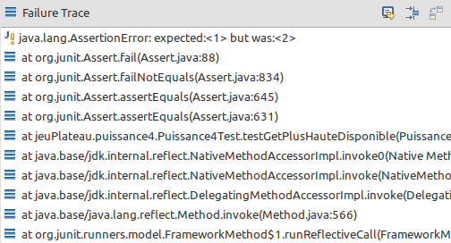

# JUnit 5

## Un framework de tests

  La plate-forme JUnit sert de base au lancement des **frameworks de test** sur la JVM. Il définit également l'**API TestEngine** pour le développement d'un framework de test qui s'exécute sur la plate-forme. De plus, la plate-forme fournit un lanceur de console pour lancer la plate-forme à partir de la ligne de commande et un lanceur basé sur JUnit 4 pour exécuter n'importe quel **TestEngine** sur la plate-forme dans un environnement basé sur JUnit 4. Une prise en charge de premier ordre de la plate-forme JUnit existe également dans les EDI populaires (voir **IntelliJ IDEA, Eclipse**, NetBeans et Visual Studio Code) et les outils de compilation (voir **Gradle, Maven** et Ant).

*Traduit avec [www.DeepL.com/Translator](www.DeepL.com/Translator)*

#### Versions

JUnit 5, la dernière version, fonctionne avec Java 8 ou plus.

JUnit 4 est encore utilisé.

De petites différences de syntaxe existent entre la version 4 et version 5.

#### Structure des tests et couverture

Pour organiser le code, un projet possède généralement deux sources :


Pour chaque classe du projet à tester, on va créer une classe portant le même nom avec le suffixe Test. Il faut la même structure de package dans les 2 environnements.

```
RelevesNotes.java -> RelevesNotesTest.java
```

On va aussi créer pour chaque méthode de la classe à tester une (ou des) méthode(s) dans la classe de test.

>Le but est de couvrir la majorité du code, c'est-à-dire que d'une part chaque méthode non triviale soit testée (*les getters sont généralement des méthodes triviales*) et d'autre part, quà l'intérieur d'une méthode testée, on couvre tous les cas pouvant se produire.

Dans l'exemple ci-dessous, il y a 5 cas à tester :

```java
public static Cellule cellule(String cell) {
		x = ++x % xMax;

    if(cell.startsWith("C")) {
			int size = Integer.parseInt(cell.substring(1));
			fourmiList = new ArrayList<Fourmi>(size);

			for (int i = 0; i<size; i++) {
				fourmiList.add(new Fourmi(x, y));
			}

			return new Cellule(true, size);
		}
		else if (cell.equals("0")) {
			return new Cellule();
		}
		else if (cell.equals("-1")) {
			return new Cellule(false);
		}
		else if (cell.matches("[0-9]*")) {
			return new Cellule(Integer.parseInt(cell));
		}
		else {
			throw new UnsupportedOperationException("code cellule inconnu : "+cell);
		}
	}
```

#### Zoom sur les Asserts

JUnit propose une API (des fonctions en java) pour effectuer des tests. La principale fonction est **assert()**.

Au début du fichier de test, on importe les fonctions utilisées :

```java
import org.junit.Test;
import static org.junit.Assert.*;
```

>Tous les tests fonctionnent à peu près de la même façon, on veut que dans un état donné, le code produise un résultat attendu. On compare donc ce résultat attendu (**expected**) avec le résultat obtenu en appelant la méthode à tester (**actual**).

Il faut dont d'abord initialiser les variables pour arriver à l'état que l'on souhaite (ce qui impose parfois de refactorer un peu le code à tester) avant de pouvoir lancer le test.

>Les méthodes de test sont `public`, `void` et ne prennent pas de paramètres.

- **assertEquals** primitives (double..), objets

> Il faut comparer un résultat de même type que celui produit par le retour de la méthode à tester :

```java
@Test
public void testGetPlusHauteDisponible() { // la méthode renvoie à tester renvoie un int
  Puissance4 app = new Puissance4();
      char[][] plateau = {
          {' ','X',' ',' ',' ',' ', ' '},
          {' ','O',' ',' ',' ',' ', ' '},
          {' ','O',' ',' ',' ',' ', ' '},
          {'O','X',' ',' ',' ',' ', ' '},
          {'X','O',' ',' ',' ',' ', ' '},
          {'O','X','X',' ',' ',' ', ' '}
          };
      app.init(plateau);

      assertEquals(2, app.getPlusHauteDisponible(0)); // on commence à compter d'en haut
      assertEquals(4, app.getPlusHauteDisponible(2));
      assertEquals(5, app.getPlusHauteDisponible(3));

}
```

- **assertTrue**

```java
@Test
public void testColonnePleine() { // la méthode à tester renvoie un boolean
  Puissance4 app = new Puissance4();
      char[][] plateau = {
          {' ','X',' ',' ',' ',' ', ' '},
          {' ','O',' ',' ',' ',' ', ' '},
          {' ','O',' ','O',' ',' ', ' '},
          {'O','X','O',' ',' ',' ', ' '},
          {'X','O',' ',' ',' ',' ', ' '},
          {'O','X',' ',' ',' ',' ', ' '}
          };
      app.init(plateau);

      assertFalse(app.colonnePleine(0));
      assertTrue(app.colonnePleine(1));
}
```

> Dans l'exemple précédent, on a couvert plusieurs cas dans une même méthode. On pourrait aussi faire deux méthodes de test séparées.

- **exception**

> on utilise `assertThrows` pour attendre un type d'exception particulier.

```java
@Test
	void testMinimumListeVide() {
		Assertions.assertThrows(NoSuchElementException.class, () -> {
			releveVide.min();
		});
	}
```

[Autres exemples sur la documentation officielle](https://junit.org/junit5/docs/current/user-guide/#writing-tests-assertions)

#### Annotations

Les annotation permettent d'ajouter des metas informations sur des méthodes :  
[https://www.javatpoint.com/java-annotation](https://www.javatpoint.com/java-annotation)

L'api JUnit contient quelques annotations qu'il faut utiliser pour que les tests soient exécutés :  

- @Test : à mettre devant chaque méthode de test
- @BeforeAll : pour initialiser les variables

[Autres annotations sur la documentation officielle](https://junit.org/junit5/docs/current/user-guide/#writing-tests-annotations).

#### Intégration avec eclipse/gradle

JUnit n'est pas nativement intégrée dans java, il faut donc l'ajouter aux dépendances du projet.

On peut le faire directement dans les propriétés du projet, ou mieux dans le **build.gradle** :

```java
dependencies {
    // Use JUnit Jupiter API for testing.
    testImplementation 'org.junit.jupiter:junit-jupiter-api:5.4.2'

    // Use JUnit Jupiter Engine for testing.
    testRuntimeOnly 'org.junit.jupiter:junit-jupiter-engine:5.4.2'
}
```

Pour exécuter une classe de test, il faut selectionner **run as... junit test case**.

On peut alors visualiser (eclipse, IntelliJ, ...) les résultats graphiquement :


Les resultats (pour les non *daltoniens*) sont de 3 couleurs :

- green(succès)
- blue(echec)
- red(erreur d'exécution).

Si on clique sur un test, on obtient le détail (ce qui était attendu et ce que l'on a obtenu) :



## La méthode TDD

La méthode TDD, c'est écrire les tests dès le début puis coder pour que les tests passent. Voici les étapes d'un cycle de développement en tdd :

1. Write a test
2. Run all tests
3. Write the implementation code
4. Run all tests
5. Refactor

[Plus de détail ici](https://technologyconversations.com/2014/09/30/test-driven-development-tdd/).


Voici d'autres sources :

[https://howtodoinjava.com/junit5/junit-5-assertions-examples/](https://howtodoinjava.com/junit5/junit-5-assertions-examples/)