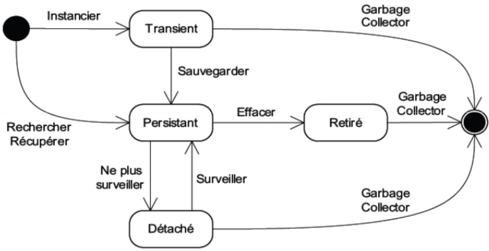
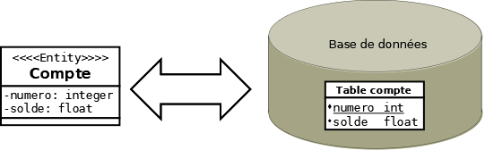
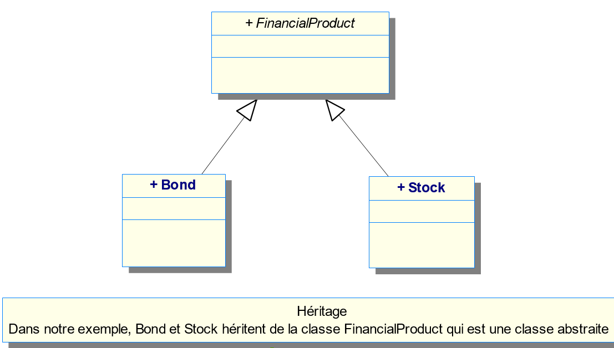

# Cours sur le Mapping par annotation JPA/Hibernate

>Le Mapping par annotation est pratiquement le même avec les EJB Entity de Java qu'avec le Framework Hibernate que vous allez découvrir.

Ce cours ne concerne que les Entities et les relations !



## Entity et Mapping (ORM)

Les Entity Beans ont été créés pour simplifier la gestion des données au niveau d'une application, mais aussi pour faciliter la sauvegarde en base de données. Plus concrètement, **ces Entities Beans vous permettent de prendre en charge la persistance des données de votre application dans une ou plusieurs sources de données, tout en gardant les relations entre celles-ci**.

Ces composants établissent donc la relation entre votre application et vos bases de données. Contrairement aux Session Beans, **les données d'un Entity Bean sont conservées, même après l'arrêt de l'application**.

Les données de l'application sont typiquement : des utilisateurs, des factures, des produits, des adresses... Dans le monde Java, et plus généralement dans le monde objet, il est commun d'utiliser des classes pour chacun des types d'objets utilisés. On parle souvent d'objet métier ou entité (Entity) pour représenter les caractéristiques de ces objets.

>Le mapping (relier) correspond à la liaison entre les données et l'application via un objet. On parle souvent de mapping objet/relationnel lorsque l'on connecte, de cette manière, une base de données relationnelle avec une application objet écrite en java (par exemple).

Pour simplifier, un Entity Bean correspond le plus souvent à une ou plusieurs tables de la base de données. On peut donner la définition suivante du mapping :

**Liaison automatique des propriétés d’un objet et d’une table de données permettant de sauvegarder et recharger facilement les informations d’une instance de l’objet**.



### Propriétés de l’Entity Bean

Chaque `propriété` de cet objet est liée à un `champ` de la table. Chaque `instance` de cet objet représente généralement un `enregistrement` de la table. Toutefois, *il est possible qu'un Entity Bean soit réparti sur plusieurs tables*.

À l'inverse, une table dans une base de données regroupe un ensemble de champs. Ces champs représentent soit des informations directement liées à la table, soit des liens vers d'autres tables. Toutes ces informations ne sont pas pour autant des propriétés directes de l'objet en question.

**Les Entity Beans suivent le même principe et doivent tous posséder un identifiant unique (clé primaire)**. Un Entity Bean CompteBancaire, par exemple, peut être identifié à partir de son numéro de compte nommé *numero*. Cet identifiant unique permet à l'application de retrouver les données de l'Entity Bean associé.

Un Entity Bean Client est, par exemple, caractérisé par des propriétés telles que :

- nom,
- prénom,
- email,
- téléphone,...

On appelle ces propriétés : **champs persistants**.

>Ces propriétés sont mappées (liées) aux champs de la table associée. Durant l'exécution du programme, le conteneur EJB pour JavaEE ou le conteneur de Spring synchronise automatiquement l'état de ces propriétés avec la base de données.

**Comme une table, un Entity Bean possède des champs relationnels**. Toutefois, *une grande différence existe*.

- Un champ relationnel est représenté, dans un Entity Bean, par une **propriété dont le type est un autre Entity Bean**. On parle d'agrégation (en POO).
- A l'opposé, une **table est liée à une autre table par une clé étrangère**.

### 4 relations possibles entre les `Entity`

- **One To One** (un à un) : si un utilisateur ne peut avoir qu'un seul et unique CompteBancaire alors la relation entre l'utilisateur et son compte est de type « One To One ».

- **One To Many** (un à plusieurs) et **Many To One** (plusieurs à un) : un utilisateur peut avoir plusieurs portefeuilles alors qu'un portefeuille est détenu par un seul utilisateur. La relation entre Portefeuille et Utilisateur est de type «	Many To One » et la relation entre Utilisateur et Portefeuille est de type « One To Many ».

- **Many To Many** (plusieurs à plusieurs) : un utilisateur a plusieurs loisirs (hobby) et un loisir peut être partagé avec plusieurs utilisateurs. Dans ce cas, la relation est de type « Many To Many » entre utilisateur et loisir.

>Les Entity Beans sont exécutés dans le conteneur EJB pour JavaEE qui apporte aux développeurs de nombreux services facilitant le travail du développeur. Idem pour Spring avec Hibernate.

**Le principal service est la gestion de la persistance qui gère l'ensemble des accès aux données dans la mémoire ou dans les sources de données**. L'utilisation de ce service, et donc des Entities, procure de multiples avantages comparés à l'accès direct à la base de donnée avec JDBC.

>Cette solution apporte un mécanisme simple pour l'accès et la modification des données. En effet, il est plus facile, pour modifier le prénom d'un utilisateur au sein de votre application, d'appeler la méthode **utilisateur.setPrenom("nouveau prénom")** que d'exécuter une requête SQL brute.

Les Entity sont devenus un standard dans l'univers **JavaEE** et des divers frameworks comme **Hibernate**. Le code est clair et plus facilement réutilisable.

#### Comment construire un Entity ?

La simplicité de développement est en partie due à l'introduction des **annotations** que vous retrouvez lors de l'utilisation d'Hibernate et de Spring Boot. Nous allons voir que les spécifications définissent des comportements par défaut qui sont généralement corrects pour une majeure partie des applications.

- En JavaEE, il faut utiliser un **Session Bean** pour __gérer l'accès aux données__ grâce à l’implémentation d’une interface java qui contiendra les méthodes correspondant aux services (fonctionnalités) à fournir aux différents clients.
- Avec Hibernate-Spring, on utilise des `Interfaces` avec des annotations de type **@Repository** ou **@RepositoryRestResource** qui héritent soit de **JpaRepository<>**, soit de **CrudReposiroty**.

>Remarque : Il est impossible d'accéder directement à une entity depuis une application cliente.

Cette évolution est, avant tout, le fruit de la communauté. C'est par l'essor des frameworks, tels Hibernate, iBatis ou Toplink et EclipseLink que le mapping objet/relationnel a pu se développer et finalement devenir un standard.

Créer la classe de l’Entity

Cette classe est le premier élément à définir. Les « Entity » sont des **POJO** (Plain Old Java Object). De ce fait, la création d'un Entity **Genre.java** se résume à la création d'une classe Genre dont voici un exemple de code ci-dessous :

```java
package beansEntites;
import java.util.HashSet;
import java.util.Set;
import javax.persistence.CascadeType;
import javax.persistence.Column;
import javax.persistence.Entity;
import javax.persistence.FetchType;
import javax.persistence.Id;
import javax.persistence.OneToMany;
import javax.persistence.Table;

/**
 * Exemple Entity
 * Cette entité correspond à la table GENRE
 * (Elle correspond à la description d'une table)
 * @author Philippe Bouget
 */
@Entity(name='Genre')
@Table(name = "GENRE", schema = "maBaseDeDonnées", uniqueConstraints = {})
public class Genre implements java.io.Serializable
{
	// Champs persistants de la table et relation

	private String code;
	private String libelle;
	private Set<Film> films = new HashSet<Film>(0);

	/**
	 *  Constructeur sans argument
	 */ 
	public Genre()
	{}

	/**
	 *  constructeur avec 2 arguments
	 */
	public Genre(String codgenre, String libgenre) {
		this(codgenre,libgenre, null);
	}

	/**
	 *  constructeur avec 3 arguments
	 */
	public Genre(String codgenre, String libgenre, Set<Film> films) {
		this.codgenre = codgenre;
		this.libgenre = libgenre;
		this.films = films;
	}

	// Méthodes accesseurs de propriétés
	@Id
	@Column(name = "CODE", unique = true, nullable = false, insertable = true, updatable = false, length = 2)
	public String getCodgenre() {
		return this.codgenre;
	}

	public void setCodgenre(String codgenre) {
		this.codgenre = codgenre;
	}

	@Column(name = "LIBELLE", unique = false, nullable = false, insertable = true, updatable = true, length = 25)
	public String getLibgenre() {
		return this.libgenre;
	}

	public void setLibgenre(String libgenre) {
		this.libgenre = libgenre;
	}

	@OneToMany(cascade = { CascadeType.ALL }, fetch = FetchType.LAZY, mappedBy = "genre")
	public Set<Film> getFilms() {
		return this.films;
	}

	public void setFilms(Set<Film> films) {
		this.films = films;
	}

}
```

Voici la description MySQL de la Table GENRE :

```sql
CODE NOT NULL CHAR(2) PRIMARY KEY,
LIBELLE NOT NULL VARCHAR(25)
```

Comme vous pouvez le constater dans le code de la classe de l’Entity, il apparaît un tableau de type SET pouvant contenir des objets de type **FILM**. Comme nous le verrons ultérieurement, **on tient compte des relations entre les différentes Tables de la base de données**.

Voici la description de la table FILM liée à GENRE :

```sql
NOFILM NOT NULL NUMBER(3)
TITRE NOT NULL CHAR(30)
DUREE DATE
ANNEE NUMBER(4)
PAYS VARCHAR(20)
CODE_GENRE CHAR(2)
CODE_PARUTION CHAR(2)
```

On constate ici, que le **CODE_GENRE** apparaît dans la table **FILM**.

**Un Film appartient à un et un seul Genre**.

L'état persistant de l'entité est représenté par les variables d'instances de la classe qui correspondent aux propriétés du POJO. Ces variables peuvent être privées (private), protégées (protected) ou non spécifiées. Les clients ne peuvent alors pas accéder directement aux variables et doivent utiliser les accesseurs (getter and setter) ou d'autres méthodes métiers de la classe.

La classe doit respecter les règles suivantes :

- Cette classe peut être abstraite (**abstract**) ou concrète.
- La classe peut aussi bien hériter d'une classe entité que d'une classe non-entité, et inversement.
- Les méthodes, les propriétés de la classe et la classe elle-même ne doivent pas être finales.

Si une instance de l'entité a la possibilité d'être envoyée à un client distant, alors la classe doit implémenter java.io.Serializable.

**La classe doit posséder un constructeur sans argument qui peut être public (public) ou protégé (protected). Néanmoins, la classe peut posséder des constructeurs surchargés si la condition précédente est respectée**.

>Note : **le but du constructeur par défaut (sans argument) est de simplifier l'instantiation de la classe par le conteneur**. La gestion dynamique de n'importe quel constructeur est une tâche lourde pour celui-ci sans pour autant être utile. La solution est donc de définir un constructeur commun à tous les Entity Beans : le constructeur par défaut.

### Les annotations

C'est grâce à l'annotation **@Entity** que le conteneur pourra savoir quelles classes il doit considérer en tant qu'Entité. Cette annotation se situe au niveau de la classe et permet de définir, si besoin, le nom de l'entité via l'attribut name. Le nom utilisé doit être unique dans une application. La valeur par défaut utilisée est le nom le la classe ("Genre" dans l'exemple précédent). Ce nom est utilisé pour représenter l'entité dans les requêtes EJB-QL ou JPQL ou HQL, c'est le schéma abstrait de l'Entité.

```java
@Entity(name = "Genre")
public class Genre{
…
}
```

Comme nous l’avons vu, un **Entity est liée à une table en base de données**. Cette liaison s'appelle le **mapping**.

Par défaut, **un Entity Genre est mappée sur la table "Genre"**. Si pour certaines raisons, vous deviez le mapper sur une table possédant un autre nom, vous devrez alors utiliser l'annotation **@Table**. Cette annotation possède différents attributs :

- **name** (requis) : définit le nom de la table à utiliser pour le mapping.
- **catalog** (optionnel) : définit le catalogue utilisé.
- **schema** (optionnel) : définit le schéma utilisé.
- **uniqueConstraints** (optionnel) : définit les contraintes qui seront placées sur la table. Cet attribut est utilisé lorsque le conteneur génère les tables au déploiement et n'affecte en rien l'exécution même de l'entité.

TP : faire l'exercice [**Pinard01**](exercices/pinard01-entity.md) (Entity avec clef par défaut **@Id**)


### Champs persistants

Un champ persistant représente une caractéristique d'un Entity. Un champ persistant est, pour une entité Genre par exemple :

- code
- libellé

N'importe quel champ (variable d'instance) **non static** et non **transient**, d'un Entity est automatiquement considéré comme persistant par le conteneur.

Un jeu d'annotations standard est défini dans la spécification EJB. On peut considérer deux types d'annotations liés au mapping objet/relationnel :

- Annotations liées aux propriétés (attributs),
- Annotations liées aux accesseurs.

Ces deux types d'annotations peuvent se placer de 2 manières :

- Directement sur les champs (type « FIELD »),
- Sur les accesseurs (et plus précisément le getter, type « PROPERTY »).

Vous pouvez constater que nous avons utilisé le type « Property » sur les accesseurs dans notre code de l’entity Genre.

Le type *Field* correspond à l’écriture suivante sur les champs et non plus sur les méthodes dites "accesseurs" :

```java
@Id
@GeneratedValue(strategy=GenerationType.AUTO)
private String codgenre;
@Basic // optionnel
private String libgenre;
…
```

>Par défaut, l'API Persistence considére toute propriété comme un champ persistant. Cela signifie qu'il n'est pas nécessaire d'annoter les propriétés pour les désigner persistantes.

Le conteneur considère par défaut que la propriété est annotée avec **@Basic** avec les valeurs par défaut des attributs suivants :

- **fetch** (FetchType.EAGER par défaut) : définit si le contenu de la propriété doit être chargé à la demande (FetchType.LAZY, "paresseusement" en anglais) ou au moment du chargement de l'entité (FetchType.EAGER, "désireux" en anglais).
- **optional** (true par défaut) : définit si la propriété accepte la valeur **NULL** ou non, cet attribut ne fonctionne pas pour les types primitifs (qui ne peuvent être nuls).

>Il faut penser à préciser les champs non persistants au conteneur. Pour indiquer qu'une propriété ne doit pas être enregistrée dans la table, **il faut annoter son getter avec @Transient** (seulement si cette méthode est de la forme getXxx( )).

### @Temporal (types Date, Time et Timestamp)

Les types **java.util.Date** ou **java.util.Calendar** utilisés pour définir des propriétés dites "temporelles" peuvent être paramétrés pour spécifier le format le plus adéquat à sa mise en persistance. Ceci peut être précisé grâce à l'annotation @Temporal qui prend en paramètre un TemporalType (énumération) dont les valeurs sont les suivantes :

- DATE : utilisé pour la date (java.sql.Date),
- TIME : utilisé pour l'heure (java.sql.Time),
- TIMESTAMP : utilisé pour les temps précis (java.sql.TimeStamp).

Voici un exemple d’utilisation :

```java
@Temporal(TemporalType.DATE)
public Calendar getDateAnniversaire()
 {
return dateAnniversaire;
}
```

### Les énumérations

Depuis le java J2SE 5.0, apparaît un nouveau type de données : les énumérations. Ce type existe depuis plusieurs années au sein des bases de données. Il est enfin possible de les utiliser dans les Entity :

>L'énumération permet de spécifier un ensemble de valeurs possibles pour une propriété.

Par exemple, le sexe d'un Utilisateur n'a que deux valeurs possibles : masculin (MALE) ou féminin (FEMELLE). La solution idéale dans cette situation est bien entendu l'utilisation de l'énumération. La valeur d'une énumération peut être enregistrée soit via une chaîne de caractère soit via un entier. L'annotation **@Enumerated** prend en paramètre un objet **EnumType** qui définit la façon de stocker cette valeur. Les valeurs **EnumType.STRING** ou **EnumType.ORDINAL** sont utilisées respectivement pour l'enregistrement dans une chaîne de caractère ou dans un entier.

Voici un exemple :
```java
private enum SexeType {MALE,FEMELLE);
private SexeType sexe ;

@Enumerated(value=EnumType.STRING)
public SexeType getSexe()
{
return sexe;
}
public setSexe(SexeType sexe)
{
	this.sexe=sexe ;
}
```

### @Column (liée aux colonnes simples)

D'autres annotations permettent de préciser le paramétrage des colonnes (dans la table relationnelle) liées aux propriétés persistantes. Grâce à celles-ci, **il est alors possible de spécifier le type SQL, la longueur du champ et de nombreuses autres propriétés à utiliser pour une propriété persistante**.

C'est l'annotation **@Column** qu'il faudra utiliser pour préciser ces paramétrages SQL. Celle-ci "surdéfinit" les valeurs par défaut déclarées par la spécification EJB. Cette annotation peut s'utiliser conjointement avec les précédentes.

Voici une description des attributs, tous optionnels, de l'annotation @Column :

- **name** : précise le nom de la colonne liée. Le nom de la propriété est utilisé par défaut.
- **unique** : précise si la propriété est une clé unique ou non (la valeur est unique dans la table).
- **nullable** : précise si la colonne accepte des valeurs nulles ou non.
- **insertable** : précise si la valeur doit être incluse lors de l'exécution de la requête SQL INSERT. La valeur par défaut est true.
- **updatable** : précise si la valeur doit être mise à jour lors de l'exécution de la requête SQL UPDATE. La valeur par défaut est true.
- **columnDefinition** : précise le « morceau de code SQL » pour la définition de la colonne dans la base de données. C'est avec cet attribut que l'on peut préciser le type SQL de la colonne.
- **table** : précise la table utilisée pour contenir la colonne. La valeur par défaut est la table principale de l'entité. Cet attribut est utilisé lorsqu'un Entity Bean est mappé à plusieurs tables.
- **length** : précise la longueur que la base de données doit associer à un champ texte. La longueur par défaut est 255. precision : précise le nombre maximum de chiffre que la colonne peut contenir. La précision par défaut est définie par la base de données.
- **scale** : précise le nombre fixe de chiffres après le séparateur décimal (en général le point). Cet attribut n'est utilisable que pour les propriétés décimales (float, double ...). Le nombre de décimal par défaut est défini par la base de données.

>Remarque : les attributs insertable et updatable sont généralement employés lorsque la colonne est utilisée par plusieurs propriétés dans une même entité. Cela se produit lorsqu'une colonne est à la fois une clé primaire et étrangère.

>Autre remarque : concernant le mapping des noms de colonnes avec l'utilisation d'Hibernate, "le nom logique d'une colonne est défini par l'implémentation de **NamingStrategy** d'Hibernate. La stratégie de nommage EJB par défaut utilise le nom de colonne physique comme nom de colonne logique. Notez qu'il peut être différent du nom de la propriété (si le nom de colonne est explicite). A moins que vous surchargiez la stratégie de nommage, vous ne devriez pas vous soucier de ça.

Pour modifier le nommage et éviter des **underscores** par défaut pour le nom des colonnes, il faut forcer le nommage de la manière suivante dans **applications.properties** :

```java
spring.jpa.hibernate.naming.physical-strategy=org.hibernate.boot.model.naming.PhysicalNamingStrategyStandardImpl
```

Il existe aussi cette solution en créant une classe (valable pour Spring Boot) :

```java
package fr.truc.muche;
import org.hibernate.boot.model.naming.Identifier;
import org.hibernate.boot.model.naming.PhysicalNamingStrategyStandardImpl;
import org.hibernate.engine.jdbc.env.spi.JdbcEnvironment;

import java.io.Serializable;
import java.util.Locale;


public class RealNamingStrategyImpl extends org.springframework.boot.orm.jpa.hibernate.SpringPhysicalNamingStrategy implements Serializable {

    public static final PhysicalNamingStrategyImpl INSTANCE = new PhysicalNamingStrategyImpl();

    @Override
    public Identifier toPhysicalTableName(Identifier name, JdbcEnvironment context) {
        return new Identifier(name.getText(), name.isQuoted());
    }

    @Override
    public Identifier toPhysicalColumnName(Identifier name, JdbcEnvironment context) {
        return new Identifier(name.getText(), name.isQuoted());
    }

}
```

Et en ajoutant cette ligne dans **application.properties** :

```java
spring.jpa.properties.hibernate.physical_naming_strategy=<package>.RealNamingStrategyImpl
```
Et si vous souhaitez conserver les **majuscules** pour les noms de colonnes :

```java
public class CustomDatabaseIdentifierNamingStrategy extends org.springframework.boot.orm.jpa.hibernate.SpringPhysicalNamingStrategy implements Serializable {

    public static final long serialVersionUID = 1L;
    public static final CustomDatabaseIdentifierNamingStrategy INSTANCE = new CustomDatabaseIdentifierNamingStrategy();

    @Override
    public Identifier toPhysicalTableName(Identifier name, JdbcEnvironment context) {
        return new Identifier(name.getText().toUpperCase(), true);
    }

    @Override
    public Identifier toPhysicalColumnName(Identifier name, JdbcEnvironment context) {
        return new Identifier(name.getText().toUpperCase(), true);
    }
    protected boolean isCaseInsensitive(JdbcEnvironment jdbcEnvironment) {
    return false;
}
}
```

Exemple d’utilisation :

```java
@Colunn(updatable = true, name = "prixHT", nullable=false, precision=5, scale=2)
public Float getPrix()
{
 return prix;
}
```

### Objets incorporés

Lorsque sont définies les entités d'une application, on souhaite parfois regrouper un sous-ensemble de propriétés autour d'une classe. Par exemple, une entité Personne possède une adresse Adresse (avec les attributs : rue, cp, ville), de la même façon une entité Commande possède également une adresse de livraison. Toutefois, dans un souci de séparation strict, ces adresses doivent se trouver respectivement dans la table Personne ou Commande (suivant l'entité) et non dans une table Adresse annexe.

Il existe plusieurs solutions :

- Une première solution est de définir toutes les composantes de l'adresse dans les classes Personne et Commande. Cependant, cette solution ne respecte pas les principes de la POO.

- La meilleure solution est de créer une classe Adresse (**qui ne sera pas un Entity Bean**), puis de l'utiliser comme un type dans les classes d'entité Personne et Commande. C'est le principe même de l'agrégation. Cette dernière solution a été retenue dans la spécification EJB3 et il est facile de l'implémenter. On appelle ces objets des **embedded objects** (objets incorporés). Ci-après, voici les 3 classes comme exemple :

Classe POJO : Adresse

```java
@Embeddable
public class Adresse implements Serializable
{
@Column (length=32)
private String rue;
@Column(length=5)
private String cp;
@Column (length=32)
public String ville;
/**
Constructeur
*/
public Adresse() {}
public String getRue()
{
return rue;
}
public void setRue(String rue)
{
this.rue = rue;
}
public String getCP() 
{
return cp;
}
public void setCP(String cp)
{
this.cp = cp;
}
public String getVille()
{
return ville;
}
public void setVille(String ville)
{
this.ville=ville;
}
```

Comme vous pouvez le constater, la classe définissant le type personnalisé de propriété doit être annotée avec **@Embeddable**. Il est possible de définir des mappings par défaut pour chacune des propriétés incluses dans cette classe via les annotations de propriétés et/ou de colonnes.

Exemple d’une classe Personne utilisant la classe Adresse :

```java
@Entity
public class Personne
{
@Id
private String prenom;

@Embedded
private Adresse adresse;
/*
constructeur
*/
public Personne(){}
/*
Accesseurs
*/
public Adresse getAdresse() 
{
return adresse; 
}
public void setAdresse(Adresse adresse)
{
this.adresse = addresse;
}
```

Comme vous pouvez le constater, pour utiliser la classe **Adresse**, il faut définir une propriété avec ce type et l'annoter avec **@Embedded**. Cette annotation précise que les composants du type utilisé (ici Adresse) doivent être "incorporés" avec les autres propriétés de l'entité, dans la table associée à l'entité.

Si nous devions intégrer 2 adresses dans une table commande, l’adresse de livraison et l’adresse de facturation, nous pourrions utiliser les annotations **@Embedded**, **@AttributeOverrides** et **@AttributeOverride** pour surdéfinir les noms des colonnes. Voici une partie de code pour les attributs adresse de livraison et de facturation :

```java
@Entity
@Table(name="COMMANDE")
public class Commande {

/*
Adresse de livraison
*/
@Embedded
@AttributeOverrides({
  @AttributeOverride(name="rue",column=@Column(name="livraisonRue")),
  @AttributeOverride(name="cp",column=@Column(name="livraisonCodePostal")),
  @AttributeOverride(name="ville",column=@Column(name="livraisonVille”))
 })
private Adresse adresseLivraison;
/*
Adresse de facturation
*/

@Embedded
@AttributeOverrides({
  @AttributeOverride(name="rue",column=@Column(name="facturationRue")),
  @AttributeOverride(name="cp",column=@Column(name="facturationCodePostal")),
  @AttributeOverride(name="ville",column=@Column(name="facturationVille”))
 })
private Adresse adresseFacturation;
```

### Identificateur unique : clé primaire

**Un Entity doit posséder un champ dont la valeur est unique : appelé identificateur unique ou clé primaire**. Ce champ permet de différencier chaque instance de l'entité des autres. Cette clé primaire doit être définie une seule fois dans toute la hiérarchie de l'Entity Bean.

La notation **@Id** est obligatoire.

Il existe 2 types d'identifiants :

- simple
- composite

On parle d'identifiant simple lorsque celui-ci est composé par un unique champ dont le type est "simple".
Les types simples sont :

- primitifs (int, float, char...)
- enveloppeurs (wrapper, en anglais. Par exemple Integer, Float, Double...)
- String ou Date (java.util.Date ou java.sql.Date).

Remarque : en général, les décimaux (nombres à virgule) ne sont pas utilisés en tant que clé primaire. Les entités utilisant ce type pour la clé primaire risquent de ne pas être portables.

Pour spécifier au conteneur qu'un champ est une clé primaire, il faut annoter celui-ci avec @Id. Dans notre Entity Bean Personne, on pourrait imaginer une clé primaire numérique pour identifier chaque individu :

```java
@Entity
public class Personne implements Serializable
{
private int identifiant;
private String prenom;
@Id
@GeneratedValue(strategy = GenerationType.AUTO) // optionnel
public int getIdentifiant()
{
return identifiant;
}
public void setIdentifiant(int identifiant)
{
this.identifiant = identifiant;
private String prenom;
```

Cet exemple utilise l'annotation **@GeneratedValue** qui permet d'indiquer au conteneur d'utiliser la meilleure solution pour la génération de la clé primaire. Il existe 4 stratégies de génération disponibles :

- AUTO
- IDENTITY
- SEQUENCE
- TABLE

Celles-ci sont définies par l'énumération **javax.persistence.GenerationType**.

Le type **IDENTITY** indique au fournisseur de persistance d'assigner la valeur de la clé primaire en utilisant la colonne identité de la base de données. Sous MySQL, par exemple, la clé primaire auto-générée est marquée avec **AUTO_INCREMENT**.

Le type **SEQUENCE**, comme son nom l'indique, oblige le fournisseur de persistance à utiliser une séquence de la base de données. Celle-ci peut être déclarée au niveau de la classe ou au niveau du package grâce à l'annotation **@SequenceGenerator** et les attributs suivants :

- `name` (requis) : définit un nom unique pour la séquence qui peut être référencée par une ou plusieurs classes (suivant le niveau utilisé pour la déclaration de l'annotation).
- `sequenceName` (optionnel) : définit le nom de l'objet séquence de la base de données qui sera utilisé pour récupérer les valeurs des clés primaires liées.
- `initialValue` (optionnel) : définit la valeur à laquelle doit démarrer la séquence.
- `allocationSize` (optionnel) : définit le nombre utilisé pour l'incrémentation de la séquence lorsque le fournisseur de persistance y accède. Attention la valeur par défaut pour l'attribut allocationSize est 50.

Ce type de génération est utile lorsque la base de données offre un système natif de séquence et qu'il est conseillé de l'utiliser par le fournisseur de celle-ci.

Le type TABLE indique au fournisseur de persistance d'utiliser une table annexe pour générer les clés primaires numériques. Ce cas d'utilisation est le plus rare.

L'annotation **@TableGenerator** permet de préciser les paramètres de création de la table annexe de génération. Voici le détail des attributs de celle-ci :

- `name` : définit un nom pour cette définition de table annexe.
- `table` : définit le nom de la table dans la base de données.
- `pkColumnName` : spécifie le nom de la colonne qui identifie la clé primaire spécifique pour laquelle la clé est générée.
- `valueColumnName` : spécifie le nom de la colonne qui contient le compteur de la clé primaire.
- `pkColumnValue` : spécifie la colonne de la clé primaire liée.
- `allocationSize` : définit le nombre d'incrémentations effectuées lorsque le fournisseur demande à la table une nouvelle valeur. Cela permet au fournisseur d'utiliser un système de cache afin de ne pas demander une nouvelle valeur à chaque demande d'un nouvel identifiant.

>Le type **AUTO** indique au fournisseur de persistance d'utiliser la meilleure stratégie (entre IDENTITY, TABLE et SEQUENCE) suivant la base de données utilisée. Le générateur AUTO est le type préféré pour avoir une application portable.

### Identifiant composite (clé primaire composée)

Une clé primaire non « simple » (objet personnalisé...), pour être unique, doit rassembler une combinaison de propriétés. On parle alors de clé primaire composite ou identifiant composite.

La première étape pour utiliser une clé primaire composite est de créer une classe de clé primaire. Cette classe doit :

- Définir les propriétés devant être liées à l'identifiant unique.
- Avoir une visibilité public.
- Avoir un constructeur public sans argument.
- Implémenter l'interface Serializable.
- Surdéfinir les méthodes equals() et hashCode( ). L'implémentation de ces deux méthodes doit correspondre à celle de la base de données. Cela signifie que vos méthodes et la base de données doivent retourner le même résultat (égalité ou inégalité) par rapport à la comparaison de deux clés primaires.
- Déclarer au conteneur une classe de clé primaire composite, via l'annotation **@Embeddable**

Voici un exemple de clé primaire composite :

```java
@Embeddable
public class ContactPK implements Serializable
{
private String prenom;
private String nom;
// Constructeur public sans argument
public ContactPK() {}

public String getPrenom()
{
return prenom;
}
public void setPrenom(String prenom)
{
 this.prenom=prenom;
}
public String getNom()
{
return nom;
}
public void setNom(String nom)
{
this.nom = nom;
}
@Override
public boolean equals(Object obj) {
// vérifie que l'objet passé en paramètre est de type ContactPK
if(obj instanceof ContactPK) 
{
ContactPK pk = (ContactPK) obj;
// vérifie si les prénoms sont égaux
if(this.getPrenom().equals(pk.getPrenom()))
 {
// vérifie si les noms sont égaux
if(this.getNom().equals(pk.getNom()))
{
return true;
}
}
}
return false;
}

@Override
public int hashCode()
{
return (getPrenom() + getNom()).hashCode();
}
}
```

Il existe, ensuite deux façons d'utiliser cette classe au sein d'un Entity Bean. La première, est de définir une propriété avec le type de votre clé primaire. Cette **propriété doit être annotée avec @EmbeddedId** et non **@Id**.

```java
@Entity
public class Contact
{
private ContactPK contactPK;
private String adresse;
protected Contact(){}
public Contact(String prenom, String nom)
{
  ContactPK contactPK = new ContactPK();
  contactPK.setPrenom(prenom);
  contactPK.setNom(nom);
  setContactPK(contactPK);
}
@EmbeddedId
public ContactPK getContactPK()
{
return contactPK;
}
public void setContactPK(ContactPK contactPK)
{
 this.contactPK = contactPK;
}
public String getAdresse() 
{
return adresse;
}
public void setAdresse(String adresse)
{
this.adresse = adresse;
}
```
La seconde façon n'utilise pas explicitement la classe de la clé primaire mais y fait référence via l'annotation **@IdClass**. La classe de l'Entity Bean déclare explicitement les composantes de la clé primaire et chacune de celle-ci est annotée avec @Id.

```java
@Entity
@IdClass(value=ContactPK.class)
public class Contact {
private String prenom;
private String nom;
private String adresse;
public String getAdresse()
{
 return adresse;
}
@Id
public String getPrenom()
{
return prenom;
}
public void setPrenom(String prenom)
{
this.prenom = prenom;
}
@Id
public String getNom() 
{
return prenom;
}
public void setNom(String nom)
{
this.nom = nom;
}
public void setAdresse(String adresse)
{
this.adresse = adresse;
}
}
```

Remarque importante : Cette seconde méthode impose que les noms des propriétés utilisées dans la classe de clé primaire et ceux de la classe de l'entité soient les mêmes.

Dans notre exemple, nous retrouvons prenom et nom dans chacune des deux classes. Exceptée la syntaxe, aucune différence n'existe réellement entre ces deux méthodes. Le mapping avec la base de données est strictement le même. La première méthode semble plus optimale car il n'y a pas redondance d'information entre la classe de clé primaire et celle de l'entité mais vous oblige à travailler avec une clé primaire « complexe ». La deuxième méthode, quant à elle, est cependant plus intuitive et plus transparente. En effet, le développeur n'a pas réellement conscience de la clé primaire composite.

### Travaux pratiques

- Pinard01 (Entity avec clef)
- [Pinard02](exercices/pinard02-entity-clef-auto-generee.md) (Entity avec clef auto-générée avec **IDENTITY**)
- Pinard03 (Entity avec clef composée avec **@IdClass**)
- Pinard04 (Entity avec clef auto-générée avec **@EmbeddedId**)

### Les champs relationnels

Vous avez vu précédemment la définition de propriété persistante. Il s'avère qu'une entité ne travaille généralement pas seule mais qu'elle est reliée à d'autres entités. On parle alors de relations entre entités.

>Pour définir un champ relationnel au sein d'une entité, il suffit de créer une propriété dont le type est une entité (cardinalité 1) ou un ensemble d'entité (cardinalité n).

>Une relation est dite unidirectionnelle si une seule partie connaît la relation.

>Une relation est dite bidirectionnelle si les deux parties la connaissent (la relation).

Pour les relations dont un côté, au moins, est multi-valué (One to Many, Many to One, Many to Many), les types de conteneurs disponibles sont :

- jaya.util.Collection (contient des groupes d’objets)
- java. util.Set (contient des objets différents)
- java.util.List (contient des objets ordonnés pouvant être identique) 
- java.util.Map(contient des clés uniques quelques soient les valeurs) 

#### Annotation @SecondaryTable()

On utilise l’annotation **@SecondaryTable()** pour créer une deuxième table nommée **adresse** alors que nous n’avons qu’une seule entité Client.

Voici le code :

```java

@Entity
@Table(name="CLIENT")
@SecondaryTable(name="ADRESSE",
                pkJoinColumns={@PrimaryKeyJoinColumn(name="ID_ADRESSE")}
)
public class Client implements Serializable {

}

```

On precise le nom de la table avec **name="ADRESSE"** puis on indique la clef primaire ainsi que le nom de la colonne qui contiendra cette clé avec l’annotation :

**pkJoinColumns = { @PrimaryKeyJoinColumn ( name = "ID_ADRESSE" ) }**

Ensuite, il suffit d’indiquer pour chaque propriété de Client celles qui seront affectées dans la table adresse. Voici la syntaxe pour la colonne « voie » :

```java
@Column(name="VOIE", table="ADRESSE")
    public String getVoie() {
        return voie;
    }
```

### One to One (Un à Un)

Une relation « One to One » est utilisée pour lier deux entités uniques indissociables. Par exemple, un corps n'a qu'un seul coeur, ou une personne n'a qu'une seule carte d'identité. Nous supposerons, dans notre exemple, qu'un utilisateur User n'a qu'un seul compte InfoCompte.

Pour associer deux entités avec ce type de relation, il faut utiliser l'annotation **@OneToOne**. Celle-ci reprend les attributs de @Basic, vu précédemment, et propose d'autres attributs optionnels :

- **cascade** : spécifie les opérations à effectuer en cascade (ALL, MERGE, PERSIST,…).
- **mappedBy** : spécifie le champ propriétaire de la relation dans le cas d'une relation bidirectionnelle.
- **targetEntity** : spécifie la classe de l'entité cible. Cet attribut est peu utilisé car l'annotation utilise automatiquement le type de la propriété.

Ce type de relation peut être mappé de 3 manières dans la base de données.

La première solution consiste à utiliser les mêmes valeurs pour les clés primaires des deux entités. Il faut alors préciser ce choix via l'annotation **@PrimaryKeyJoinColumn** (jointure par clé primaire).

Voici l'exemple de la relation unidirectionnelle entre User et InfoCompte avec cette méthode :

```java
@Entity
public class InfoCompte {
 //...
private int id;
private String numeroCarte;
private double montant;
private String IdCompte;
@Id
@GeneratedValue(strategy=GenerationType.AUTO)
public int getId()
{
return id;
}
public void setId(int id)
{
this.id = id;
}
public String getNumeroCarte()
{
return numeroCarte;
}
public void setNumeroCarte(String numeroCarte)
{
this.numeroCarte = numeroCarte;
}
//... 
}
```

Voici la classe User qui est reliée à la classe InfoCompte ci-dessus décrite :

```java
@Entity
public class User 
{
//...
@OneToOne
@PrimaryKeyJoinColumn
public InfoCompte getInfoCompte() 
{return infoCompte;
//... 
}
```

La deuxième solution consiste à utiliser une clé étrangère d'un côté de la relation. Toutefois, il faut noter que la colonne de cette clé doit être marquée comme unique afin de simuler correctement la relation « One to One ». L'annotation à utiliser est @JoinColumn. Elle permet de paramétrer la colonne de jointure à utiliser. L'exemple ci-dessous montre la relation bidirectionnelle :

```java
@Entity
public class User {
private InfoCompte infoCompte ; 
@OneToOne
@JoinColumn(name="IdCompte", referencedColumnName="id")
public InfoCompte getInfoCompte()
{
return infoCompte;
}
//...
}
```
L'annotation **@JoinColumn** ressemble à **@Column** mais possède un attribut supplémentaire optionnel, **referencedColumnName**.

>Celui-ci permet de spécifier le nom de la colonne référencée par la clé étrangère de l'association.

```java
@Entity
public class InfoCompte {
//...
private int id;
private User user;
@OneToOne(mappedBy = "infoCompte")
public User getUser()
{
return user;
}
/ /…
}
```

>L'attribut **mappedBy** déclare que le côté propriétaire est celui détenant la propriété InfoCompte. C'est donc, ici, l'entité User qui détient la relation et a donc le pouvoir de lier un utilisateur à un compte (l'inverse étant impossible).

La dernière solution consiste à utiliser une table d'association des liens entre les deux entités.

Toutefois, la multiplicité **One to One** est respectée si et seulement si une contrainte unique est définie sur chaque clé étrangère. Même si ce cas est plus rare, il est possible de la retrouver dans un système existant que l'on souhaite faire évoluer :

```java
@Entity
public class User {
//...
@OneToOne
@JoinTable(
name = "UserInfoCompte"
joinColumns = @JoinColumn(name="user_fk", unique=true),
inverseJoinColumns=@JoinColumns(name="infoCompte_fk", unique=true)
)
public InfoCompte getInfoCompte() { ... }
}

@Entity
public class InfoCompte
{
//...
@OneToOne(mappedBy = "infoCompte")
public User getUser() {//…}
}
```

Cette technique oblige à écrire plus de lignes, sans pour autant augmenter les performances, voire l'inverse. C'est cependant un cas non négligeable lors de l'utilisation d'une source de données déjà existante.

L'annotation **@JoinTable** permet de configurer la table de jointure pour la relation.
Voici une description des attributs de celle-ci :

- **name** : spécifie le nom de la table de jointure.
- **catalog** : spécifie le catalogue de la table de jointure.
- **schema** : spécifie le schéma de la table de jointure.
- **joinColumns** : spécifie les colonnes (ensemble de @JoinColumn) de la table de jointure qui référencent la ou les clés primaires de l'entité propriétaire de la relation (côté propriétaire).
- **inverseJoinColumns** : spécifie les colonnes (ensemble de @JoinColumn) de la table de jointure qui référencent la ou les clé(s) primaire(s) de l'entité non propriétaire (côté inverse).
- **uniqueConstraints** : spécifie les contraintes uniques à placer dans la table. Cet attribut est utilisé seulement si la génération de la table est activée.

En l'absence de tout paramétrage de l'annotation **@OneToOne**, la liaison entre les deux entités se fera avec une colonne de jointure (deuxième solution) dans l'entité propriétaire.

Le nom de celle-ci sera le résultat de la concaténation du nom de la propriété relationnelle avec le nom de la clé primaire de l'autre entité. Concrètement, dans l'exemple utilisé précédemment, l'entité propriétaire *User* définie la propriété persistante nommée *InfoCompte*, la clé primaire de *InfoCompte* étant *id*, le nom serait *InfoCompte _id*.

### Un à Plusieurs (One To Many) et Plusieurs à Un (Many To One)

Une relation « One To Many », et respectivement « Many To One », est utilisée pour lier à une unique instance d'une entité A, un groupe d'instances d'une entité B. Par exemple, **une personne possède plusieurs comptes bancaires, mais un compte bancaire n'appartient qu'à une et une seule personne**.

Dans nos exemples suivants, un utilisateur peut avoir plusieurs portefeuilles d'actions, mais un portefeuille n'est lié qu'à un seul utilisateur.

Une association « Many To One » est définie sur une propriété avec l'annotation **@ManyToOne**.

Dans le cas d'une relation bidirectionnelle, l'autre côté doit utiliser l'annotation **@OneToMany**. Les attributs de ces deux annotations correspondent à ceux de l'annotation **@OneToOne**.

Extrait de la classe Portefeuille :

```java

@Entity
public class Portefeuille {
//...
private Utilisateur utilisateur;

@ManyToOne
@JoinColumn(name = "utilisateurfk")
public Utilisateur getUtilisateur()
{
return Utilisateur;
}
public void setUtilisateur(Utilisateur utilisateur)
{
this.utilisateur = utilisateur;
}

```

Extrait de la classe Utilisateur (ou User) :

```java
Extrait de la classe Utilisateur :
@Entity
public class Utilisateur implements Serializable
{
//...
private Collection<Portefeuille> portefeuilles;

@OneToMany(mappedBy = "utilisateur")
public Collection<Portefeuille> getPortefeuilles()
{
return portefeuilles;
}
public void setPortefeuilles(Collection< Portefeuille > portefeuilles)
{
this.portefeuilles = portefeuilles;
}

```

L'entité Portefeuille étant la part de la relation ayant une cardinalité de 1, définit une propriété Utilisateur utilisateur. A l'opposé, l'entité Utilisateur, part de la relation à la cardinalité "n" ou "*", déclare une propriété multi-valuée :

```java

Collection<Portefeuille> portefeuilles

```

Remarquez l'utilisation des génériques qui évitent de définir l'entité cible dans la définition de notre relation. Si vous ne souhaitez pas les utiliser, alors il vous faudra spécifier la cible de votre relation via l'attribut **targetEntity** de l'annotation **@OneToMany**.

Remarque : « Many To One » signifie « plusieurs vers un ». Elle est donc utilisée sur une propriété de cardinalité 1.
« One To Many » signifie « un vers plusieurs ». Elle est donc appliquée sur une propriété de cardinalité n (type Collection, par exemple).

### Many To Many (Plusieurs à Plusieurs)

Le dernier type de relation disponible est « Many to Many ». Il peut être utilisé pour lier des instances de deux entités entre elles. Par exemple, entre des articles et des catégories. Un article peut être associé à plusieurs catégories (cardinalité n ou multiplicité *) et une catégorie peut regrouper plusieurs articles (cardinalité n ou multiplicité *).

Pour cela, il suffit d'utiliser des propriétés multi-valuées de chaque côté de la relation (si celle-ci est bidirectionnelle) et de les annoter avec **@ManyToMany**.

>En terme relationnel, cette relation impose l'utilisation d'une table d'association.

Extrait de la classe User :

```java

@Entity
public class User
{
//...
private Collection<Hobby> hobbies;

@ManyToMany
@JoinTable(
name = "USER_HOBBIES",
joinColumns=@JoinColumn(name = "user_id", referencedColumnName = "id"), inverseJoinColumns = @JoinColumn(name = "hobby_id",referencedColumnName = "id"))
public Collection<Hobby> getHobbies()
{
return hobbies;
}
public void setHobbies(Collection<Hobby> hobbies)
{
this.hobbies = hobbies;
}
```

Extrait de la classe Hobby :

```java

@Entity
public class Hobby
{
//...
private Collection<User> users;

@ManyToMany(mappedBy="hobbies")
public Collection<User> getUsers()
{
return users;
}
public void setUsers(Collection<User> users)
{
this.users = users;
}

```

Ici, chaque utilisateur **User** possède un ensemble de hobbies de type **Hobby**. Et inversement, chaque hobby de type Hobby peut être lié à plusieurs utilisateurs de type User.

### Opérations en cascade

Les annotations **@OneToOne**, **@OneToMany**, **@ManyToOne** et **@ManyToMany** possèdent l'attribut **cascade**.

>**Cascade** spécifie les opérations à effectuer en cascade. La cascade signifie qu'une opération appliquée à une entité est propagée aux relations de celle-ci. *Par exemple, lorsqu'un utilisateur est supprimé, son compte l'est également*.

Il existe 4 opérations possibles sur les entités :

- ajout,
- modification,
- suppression,
- rechargement.

Ces opérations sont regroupées dans l'énumération **CascadeType** :

- **CascadeType.PERSIST** : automatise l'enregistrement des entités liées à l'association marquée lors de l'enregistrement de l'entité propriétaire (méthode persist()).
- **CascadeType.MERGE** : automatise l'enregistrement des modifications des entités liées à l'association marquée, lors de l'enregistrement des modifications de l'entité propriétaire (méthode merge( )).
- **CascadeType.REMOVE** : automatise la suppression des entités liées à l'association marquée, lors de la suppression de l'entité propriétaire (méthode remove( )).
- **CascadeType.REFRESH** : automatise le rechargement (côté base de données) des entités liées à l'association marquée, lors du rechargement de l'entité propriétaire (méthode refresh( )).
- **CascadeType.ALL** : utilise les 4 types de cascade.

>Attention : selon la spécification, le type CascadeType.REMOVE ne peut être appliqué qu'aux associations « One to One » ou « One to Many ». L'utilisation de ce type pour d'autres associations n'est pas portable.

Par exemple, sur la relation entre Utilisateur et Portefeuille, il est logique d'enregistrer ou supprimer les portefeuilles lorsque l'utilisateur est respectivement enregistré ou supprimé.

Voici le code correspondant :

```java

@OneToMany(cascade = { CascadeType.REMOVE, CascadeType.PERSIST },
mappedBy = "utilisateur")
public Collection<Portefeuille> getPortefeuilles()
{
return portefeuilles;
}
//…

```

De la même façon, la relation « One to One » entre **User** et **InfoCompte** oblige à sauvegarder, mettre à jour et détruire InfoCompte lorsque ces opérations sont effectuées sur l'instance d’un objet de type User correspondant.
Voici le code correspondant :

```java

@OneToOne(cascade = CascadeType.ALL)
@PrimaryKeyJoinColumn
public InfoCompte getInfoCompte()
{
return infoCompte;
}

```

### Cas particulier : relation « plusieurs à plusieurs » avec des propriétés

Une relation **Many to Many** n'est ni plus ni moins que le regroupement de deux relations **One to Many**. En effet, la relation « Many to Many » utilise une table de jointure simple contenant les clés primaires des deux côtés de la relation.

Que se passe t-il si l'on souhaite ajouter des propriétés à cette relation ? 

Exemple : Lorsqu'une commande regroupe des produits, ceux-ci peuvent aussi être utilisés dans plusieurs commandes. Nous nous retrouvons alors dans le cas d'une relation « Many to Many ». Cependant, il est généralement utile d'ajouter une propriété concernant, par exemple, la quantité du produit désiré.

L'utilisation de l'annotation **@ManyToMany** ne permet pas l'insertion de propriétés annexes à la relation entre les deux objets. **Il est alors nécessaire d'utiliser une double liaison « One to Many » et un Entity Bean intermédiaire**. Dans l’exemple ci-dessous, nous avons les Entity Beans suivants :

- Commande
- Produit
- LignesDeCommande

Voici les codes respectifs :

```java

@Entity
@Table(name="COMMANDE")
public class Commande
{
private int id;
private Date dateCommande;
private Collection<LignesDeCommande> lignesDeCommandes;
@Id
@GeneretedValue(strategy=GenerationType.AUTO)
public int getId()
{
return id;
}
public void setId(int id)
{
this.id = id;
}
public Date getDateCommande()
{
return dateCommande;
}
public void setDateCommande(Date dateCommande)
{
this.dateCommande = dateCommande;
}
@OneToMany(mappedBy = "Commande", cascade = {CascadeType.REMOVE})
public Collection< LignesDeCommande > getLignesDeCommandes()
{
return lignesDeCommandes;
}
public void setLignesDeCommandes(Collection< LignesDeCommande > ldc)
{
this. LignesDeCommande=ldc;
}

```

Extrait de la classe Produit :

```java

@Entity
public class Produit
{
private int id;
private String name;

@Id
@GeneratedValue(strategy=GenerationType.AUTO)
public int getId()
{
return id;
}
public void setId(int id)
{
this.id = id;
}
public String getName()
{
return name;
}
public void setName(String name)
{
this.name=name;
}

```

Les classes Commande et Produit sont des Entities comme nous avons pu les décrire ci-dessus.

L'Entity **LigneDeCommande** est le point central de la relation. Il détient les deux propriétés produit et commande respectivement liées aux Entity Beans Produit et Commande.

>De plus, même si une clé primaire simple auto-générée simplifierait le travail du développeur, il est plus judicieux de travailler avec une clé primaire composite. En effet, le regroupement des clés primaires de Produit et Commande est un bon candidat pour une clé primaire, étant donné qu'une commande ne peut avoir deux fois le même produit (dans ce cas-là il suffit d'incrémenter la quantité).

Nous devons alors créer une classe **LigneDeCommandePk** pour définir cette clé primaire composite. Celle-ci contient deux propriétés commandeId et produitId représentant respectivement les id de Commande et de Produit.

```java

@Embeddable
public class LigneDeCommandePk implements Serializable {
private static final long serialVersionUlD = 1L;
private int commandeId;
private int produitId;
protected LigneDeCommandePk() {}
public LigneDeCommandePk (int commandeId, int produitId)
{
this.commandeId = commandeId;
this.produitId = produitId;
}
public int getCommandeId ()
{
return commandeId;
}
public void setCommandeId(int commandeId)
{
this.commandeId= commandeId;
}
public int getProduitId()
{
return produitId;
}
public void setProduitId (int produitId)
{
this.produitId = produitId;
}
public int hashCode()
{
return commandeId ^ produitId;
}
public boolean equals(Object obj)
{
return (obj instanceOf LigneDeCommandePk && commandeId == produitId);
}
```

Extrait de la classe LigneDeCommande (table d’association) :

```java
@Entity
// ici on précise la classe correspondant à la composition de la clé composite
@IdClass(LigneDeCommandePk.class)
public class LigneDeCommande
{
private Produit produit;
private Commande commande;
// propriété de la relation
private int quantite;
public LigneDeCommande ()
{
public int getQuantite()
{
return quantity;
}
public void setQuantite(int quantite)
{
this.quantite = quantite;
}
@ManyToOne
@JoinColumn(name="commandeId",optional=false,insertable=false,updatable=false)
public Commande getCommande()
{
return commande;
}
public void setCommande(Commande commande)
{
this.commande = commande;
}
@ManyToOne
@JoinColumn(name="produitId", optional=false, insertable=false, updatable=false)
public Produit getProduit()
{
return produit;
}
public void setProduit(Produit produit)
{
this.produit = produit;
}
@Id
public int getProduitId()
{
return getProduit().getId();
}
@Id
public int getCommandeld()
{
return getCommande().getId();
}
public void setCommandeld(int commandeld)
{
getCommande().setId(commandeId):
}
public void setProduitld(int produitId)
{
getProduit().setId(produitId):
}

```

Nous utilisons l'annotation **@IdClass** afin de spécifier la classe de la clé primaire utilisée. Les getters getProduitId() et getCommandeld() surdéfinissent, en quelque sorte, ceux de la classe LigneDeCommandePk. Toutefois, ils retournent respectivement la clé primaire de la commande liée Commande et celle du produit lié Produit.

Problème soulevé :

Les colonnes « commandeId » et « produitId » sont déjà utilisées pour référencer dans les relations «Many to One». Elles sont donc utilisées à la fois comme clé primaire et clé étrangère !

>Le fournisseur d'entités se heurte donc à un problème : assigner la clé primaire et les clés étrangères. **Pour spécifier qu'on ne souhaite pas assigner automatiquement les clés étrangères, il est nécessaire d'affecter la valeur false aux attributs** :

**insertable=false** et **updatable=false** de l'annotation **@JoinColumn**.

### Héritage dans les relations

L'héritage est un nouvel aspect important des EJB. En effet, il s'agit d'une notion essentielle de la programmation objet qui se retrouve dans la quasi-totalité des applications d'aujourd'hui. Toutefois, la représentation relationnelle d'un héritage d'objets n'est pas une chose simple et plusieurs solutions sont possibles.

Voici les 3 types de mappings relationnels possibles :

- Une table unique par hiérarchie de classe.
- Une table par classe concrète.
- Une séparation des champs spécifiques d'une classe fille dans une table séparée de la table parente. Une jonction est alors faite pour instancier la classe fille.

Les exemples de cette partie utiliseront 2 EJB, **Obligation** (Bond) et **Action** (Stock) qui héritent tous deux de l'EJB **ProduitFinancier** (FinancialProduct) (classe abstraite).

Attention ! Une seule clé primaire doit être définie dans une hiérachie. Ici, la clé primaire se trouve dans la classe racine ProduitFinancier ou FinancialProduct.



Nous allons décrire les possibilités de chacune de ces configurations, ainsi que leurs avantages et inconvénients. Le but est de vous donner les éléments vous permettant de faire le meilleur choix selon les différentes situations. Pour chaque cas, nous étudierons les annotations utilisées et la structure relationnelle générée.

#### Une table unique : SINGLE_TABLE

Dans cette stratégie, toutes les classes de la hiérarchie sont mappées dans une même et unique table. Le type d'héritage utilisé est spécifié au niveau de l'EJB racine par l'annotation **@Inheritance**.

```java

@Entity
@Inheritance(strategy=InheritanceType.SINGLE_TABLE) 

@DiscriminatorColumn(
name="typeDeProduitFinancier",
discriminatorType=DiscriminatorType.STRING,
length=10)
public abstract class ProduitFinancier {
private int id;
//...
@Id
@GeneratedValue(strategy=GeneratorType.AUTO)
public int getId(){
return id;
}
//... 
}

```

Le seul attribut de cette annotation est **strategy**. Il permet de spécifier le type de stratégie à utiliser via l'annotation **InheritanceType**. Pour définir un héritage utilisant la stratégie «table unique», c'est la valeur **InheritanceType.SINGLE_TABLE** qui sera utilisée.

Toutefois, cette stratégie requiert une colonne permettant de différencier les types d'entité de la hiérarchie. Il faut utiliser l'annotation **@DiscriminatorColumn** pour préciser les détails de cette colonne. Les attributs de cette annotation sont :

- name : nom de la colonne de discrimination.
- discriminatorType : classe du discriminateur à utiliser défini via l'énumération DiscriminatorType.

Celle-ci possède les attributs suivants :

- CHAR
- INTEGER
- STRING
- length : taille de la colonne pour les discriminateurs à base de chaîne de caractères.
- columnDefinition : fragment SQL à utiliser pour la déclaration de la colonne (utilisé lors de la génération des tables par le conteneur).

Les classes filles concrètes peuvent préciser la valeur discriminatoire grâce à l'annotation **@DiscriminatorValue**. Par défaut, la valeur d'un discriminateur de type STRING contient le nom de la classe de l'Entity. Ainsi, le contenu de la colonne discriminatoire contient « Bond » si l'EJB entité stocké est de type Bond, et « Stock » si son type est Stock. Pour les autres types de discriminateur, le fournisseur utilise une méthode spécifique pour générer une valeur automatique pour l'EJB entité.

```java

@Entity
@DiscriminatorValue("OBLIGATION") // valeur par défaut signifie « Obligation »
public class Obligation extends ProduitFinancier {
private double taux; 	// taux de rendement de l'obligation
private int duréeEnMois; // nombre de mois que dure l'obligation
@Basic
public double getTaux(){
return taux;
}
@Basic
public int getDuréeEnMois(){
return duréeEnMois;
}
//...
}
```

```java

@Entity
@DiscriminatorValue("ACTION") // signifie “action”
public class Action extends ProduitFinancier {
…
}

```

Ci-dessous, voici le contenu de l’unique table au niveau de la base de données (une seule table pour deux entités).

Table ProduitFinancier :

- id (clef primaire)
- typeDeProduitFinancier (permet la discrimination des entités)
- NomProduit
- valeurAchat
- dateAchat
- quantité
- description
- duréeEnMois
- taux

Cette stratégie fournit un gain de performance important, car aucune jointure n'est réalisée. Cependant, les données utilisent plus de place car l'ensemble des colonnes n'est pas toujours rempli (suivant le type de données enregistrées). Ici, taux a une valeur « null » lorsque l'enregistrement correspond à un EJB Entité de type Action.

#### Une table par classe concrète : TABLE_PER_CLASS

La seconde stratégie présentée ici est « une table par classe concrète ». Dans ce cas, chaque classe EJB Entité concrète est liée à sa propre table. Cela signifie que toutes les propriétés de la classe (incluant les propriétés héritées) sont incluses dans la table liée à cette entité.
Concrètement, dans notre exemple, cela signifie que la table «ProduitFinancier» n'est pas créée ni utilisée. Les EJB  entités Obligation et Action qui héritent de la classe ProduitFinancier sont mappés respectivement sur les tables «Obligation» et «Action», chacune de ces tables intégrant les propriétés définies dans ProduitFinancier.

Pour spécifier cette stratégie, il faut spécifier la stratégie définie par :

**InheritanceType.TABLE_PER_CLASS**  à l'annotation @Inheritance.

```java

@Entity
@Inheritance (strategy=InheritanceType.TABLE_PER_CLASS)
public abstract class ProduitFinancier {
//...

```

Les classes filles Action et Obligation héritent simplement de la classe ProduitFinancier :

```java

@Entity
public class Obligation extends ProduitFinancier {
//... }


@Entity
public class Action extends ProduitFinancier
{
//...
}

```

- *Avantage* : lors de l'insertion car l'ajout n'est fait que dans une seule table. De même, la sélection d'un type concret (ici Obligation ou Action) est optimisée. En effet, l'ordre SELECT porte sur une seule table.

- *inconvénient* : lourdeur des requêtes polymorphiques (sélection sur l'ensemble des ProduitFinanciers, par exemple). En effet, la base de données doit utiliser l'instruction SQL «UNION» afin de rassembler les enregistrements situés dans les deux tables.
L'autre inconvénient est la duplication des colonnes dans chacune des tables des EJB entités. Les DBA (DataBase Administrator) n'apprécient pas toujours ce genre de pratique.

#### Tables jointes : JOINED

Dans cette dernière stratégie, la classe racine des entités est représentée par une table. Chaque table fille est liée à la table mère séparée contenant les colonnes spécifiques et communes aux tables filles.

La liaison entre les tables « filles » et la table racine se fait via les clés primaires. En effet, la clé primaire de la classe fille est liée à celle de la classe parente. Ainsi, un enregistrement de la table «Action» ou «Obligation» dont la valeur de la clé primaire est 36 est lié un enregistrement de la table «ProduitFinancier» ayant la valeur 36 pour la clé primaire.

L'héritage est ici déclaré avec la stratégie **InheritanceType.JOINED**.

```java

@Entity
@Inheritance (strategy=InheritanceType.JOINED)
public class ProduitFinancier {
//...
}

```

Les classes filles Action et Obligation n'ont pas besoin d'autre annotation que @Entity :

```java

@Entity
public class Obligation extends ProduitFinancier {
//...
}

@Entity
public class Action extends ProduitFinancier {
/ / . . .
}

```

- *Avantage* : un modèle relationnel clair. C'est en quelque sorte le modèle idéal pour l’administrateur de la base de données (pas de perte de mémoire car toutes les colonnes sont utilisées ! ). Mais c'est aussi de fournir un bon support de la polymorphie. Ainsi, lorsque le client souhaite récupérer toutes les entités EJB de type ProduitFinancier, la requête SQL générée se traduira par un simple «SELECT * FROM ProduitFinancier».

- *inconvénient* : requiert l'utilisation de plusieurs jointures entre les tables lors de la récupération de données. Dans le cas de hiérarchies importantes (grande profondeur de l'héritage) cela peut entraîner de mauvaises performances.

### Persistence des entités

Démonstration lors des exercices avec la notion de **Repository** et d'interface.

[Pour les utilisations en pur EJB3 avec JavaEE cliquez ici](javaee-persistence-ejb3.md)

[PDF sur Hibernate Object Request Mapping](ORM-Java.pdf)

[Liste des TPs pour devenir super fort.e en 2020 !](mapping-orm.md)

[Corrections des TP sur GitHub](https://github.com/pbougetsimplon/springdemos)

Auteur : **Philippe Bouget**