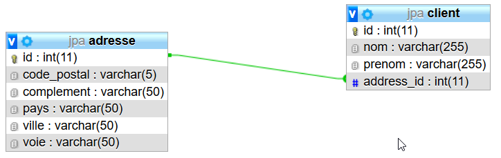
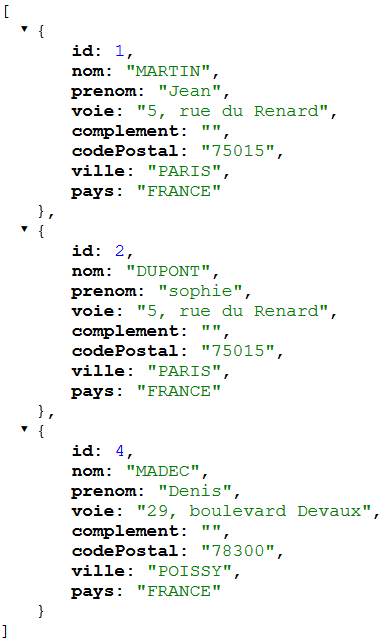

# 5 - ENTITE CLIENT : MAPPING MULTI-TABLES avec **@SecondaryTable** (**client01**)



Terminée la picole, maintenant c'est du sérieux !
Et bientôt, les petites croisières...

Vous allez créér une entité java qui correspondra à 2 tables dans la base de données MySQL.

A FAIRE :

- Créer votre projet SpringBoot **client01** 
- Créer les 3 packages `comme dans` **pinard01**

- Créer une Entité **Client** mappée sur deux tables :

  - **Client** (id, nom(50), prenom(50))
  - **Adresse** (voie(32), complement(32), codePostal(5), ville(45), pays(50))

## Création de la classe Client

Dans le package **model**, créez la classe **Client** qui comportera les attributs suivants :

```java
    private int id;
    private String nom;
    private String prenom;
    private String voie;
    private String complement;
    private String codePostal;
    private String ville;
    private String pays;
```

- La clé primaire `id` sera auto-générée
- La table principale sera appelée `CLIENT`
- La table secondaire sera appelée `ADRESSE`
- Les propriétés **voie, complement, codePostal, ville et pays** seront mappés respectivement sur les colonnes nommées de la table Adresse :

  - VOIE
  - COMPLT
  - VILLE
  - PAYS

- Pour que la table secondaire soit créée dans la base de données, vous devez ajouter les annotations suivantes dans la classe votre classe **Client.java** :

```java
@Table(name="CLIENT")
@SecondaryTable(name="ADRESSE", pkJoinColumns={@PrimaryKeyJoinColumn(name="ID_CLIENT")})

```

- Les champs mappés sur la table adresse devront comporter l’annotation suivante que vous devez adapter :

```java
@Column(length = 32, name="VOIE", table="ADRESSE")
	public String getVoie() {
		return voie;
	}
```

- Créer votre interface **Repository** pour gérer vos clients en héritant de **JpaRepository**.


Voici le code à ajouter dans votre controleur :

```java
@CrossOrigin("*")
@RestController
public class ClientController {

	@Autowired
	private ClientRepository clientRepository;
	
	@GetMapping("/")
	@ResponseBody
	public String home()
	{

		Client martin=new Client("MARTIN","Jean","65, rue de la Republique","","78100","VERSAILLES", "FRANCE");
		martin=clientRepository.saveAndFlush(martin);

		Client dupont=new Client("DUPONT","sophie","5, rue du Renard","","75015","PARIS","FRANCE");
		dupont=clientRepository.saveAndFlush(dupont);

		Client durand=new Client("DURAND","Pierre","20, boulevard Gambetta","","78300","POISSY","FRANCE");
		durand=clientRepository.saveAndFlush(durand);

		Client madec=new Client("MADEC","Denis","29, boulevard Devaux","","78300","POISSY","FRANCE");
		clientRepository.saveAndFlush(madec);

		System.out.println();
		System.out.println("Liste de tous les clients:");
		Collection<Client> liste=clientRepository.findAll();
		this.affiche(liste);

		System.out.println("MARTIN Jean habite desormais avec DUPONT Sophie:");
		martin.setVoie(dupont.getVoie());
		martin.setComplement(dupont.getComplement());
		martin.setCodePostal(dupont.getCodePostal());
		martin.setVille(dupont.getVille());
		martin.setPays(dupont.getPays());
		clientRepository.saveAndFlush(martin);

		System.out.println("DURAND Pierre est decede :");
		clientRepository.delete(durand);

		System.out.println("Liste de tous les clients:");
		this.affiche(clientRepository.findAll());
		
		StringBuilder sb = new StringBuilder();
		sb.append("<h1>Regardez dans votre console et dans votre base de données MySQL <strong>JPA</strong></h1>");
		sb.append("<a href='http://localhost:8080/clients'>Voir la liste des clients enregistrés</a>");
		return  sb.toString();

	}
	
	@GetMapping(value = "/clients")
	public ResponseEntity<?> getAll(){
		List<Client> liste = null;
		try
		{
			liste = clientRepository.findAll();
		} catch (Exception e) {
			return ResponseEntity.status(HttpStatus.NOT_FOUND).body(null);
		}
		
		return ResponseEntity.status(HttpStatus.OK).body(liste);
	}

	/**
	 * Méthode pour affichage dans la console
	 * @param liste
	 */
	private void affiche(Collection<Client> liste)
	{

		for (Client client : liste) {

			System.out.println(client);
		}


	}
```

- Lancez l'application sur le serveur et observez les tables générées dans votre base de données.

Voici ce que vous devez écrire pour lancer votre controleur depuis votre navigateur : 

**http://localhost:8080/**

puis testez : **http://localhost:8080/clients**

vous devez obtenir ceci : 



[Retour vers les autres exercices](mapping-orm.md)