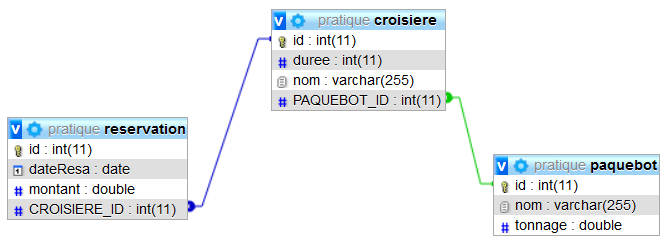

# 10 - @ManyToMany, @OneToMany : ASSOCIATION BIDIRECTIONNELLE DE N VERS 1 (**croisiere02**)

TRAVAIL A REALISER :

- mettre en place une association bidirectionnelle de plusieurs vers un entre **Croisiere** et **Reservation**.

- créer le projet **croisiere02**
- Copier le contenu du projet **croisire01** dans un nouveau projet
- créer la classe **Reservation**

La classe **Reservation** comportera les attributs suivants :

```java
    private int id;
    private double montant;
    private Calendar dateResa;
    private Croisiere croisiere;
```

La clé primaire id sera autogénérée.

L’annotation **@Temporal** sur la méthode **getDateResa()** est nécessaire car il s’agit d’une date.   

```java
@Temporal(value=TemporalType.DATE)
    public Calendar getDateResa() {
        return dateResa;
    }
```

La classe **Croisiere** comportera l’attribut supplémentaire **reservations** :

```java
    private int id;
    private String nom;
    private int duree;
    private Paquebot paquebot;
    private Collection<Reservation> reservations;
```

## Mise en place de l’association bidirectionnelle de plusieurs vers un

L’annotation **@ManyToOne** sur la méthode **getCroisiere()** de Reservation indique la navigabilité de Reservation vers Croisiere.

```java
   //détient l'association
    @ManyToOne(cascade={CascadeType.ALL},fetch=FetchType.EAGER)
    @JoinColumn(name="CROISIERE_ID")
    public Croisiere getCroisiere() {
        return croisiere;
    }
```

L’annotation **@OneToMany** sur la méthode **getReservations()** de Croisiere indique la navigabilité de Croisiere vers Reservation.

```java
@OneToMany(cascade={CascadeType.ALL},fetch=FetchType.EAGER,
mappedBy="croisiere")
    public Collection<Reservation> getReservations() {
        return reservations;
    }
```

L’annotation **@ManyToOne** sur la méthode **getPaquebot()** de Croisiere indique la navigabilité de Croisiere vers Paquebot.

```java
@ManyToOne(cascade={CascadeType.ALL})
   @JoinColumn(name="PAQUEBOT_ID")
    public Paquebot getPaquebot() {
        return paquebot;
    }
```

>Attention ! Si vous omettez l’instruction **cascaceType.ALL**, le message suivant s’affichera dans la console : *object references an unsaved transient instance - save the transient instance before flushing: metier.Reservation**   
(L'objet fait référence à une instance non sauvegardée – sauvez l’instance avant le vidage).


Voici le code à ajouter à votre Servlet Controleur pour ajouter des enregsitrements et créer les tables dans la base de données :

```java
 @RestController
@CrossOrigin("*")
public class ReservationController {

	@Autowired
	private CroisiereRepository croisiereRepo;

	@Autowired
	private PaquebotRepository paquebotRepo;

	@Autowired
	private ReservationRepository reservationRepo;

	@GetMapping("/")
	@ResponseBody
	public String home()
	{
		init();
		StringBuilder sb = new StringBuilder();
		sb.append("<h1>Regardez dans votre base de données MySQL <strong>JPA</strong></h1>");
		sb.append("<p>Vous devez avoir 3 tables dans votre base de données :</p>");
		sb.append("<ul><li><a href='http://localhost:8080/croisieres'>Liste des <strong>croisières</strong> enregistrées</a></li>");
		sb.append("<li><a href='http://localhost:8080/paquebots'>Liste des <strong>paquebots</strong> enregistrés</a></li>");
		sb.append("<li><a href='http://localhost:8080/resas'>Liste des <strong>réservations</strong> enregistrées</a></li></ul>");
		
		sb.append("<ul><li><a href='http://localhost:8080/croisiere/1'>Liste des réservations pour la Mer Egée</a></li>");
		sb.append("<li><a href='http://localhost:8080/croisiere/2'>Liste des réservations pour la Mer Caspied</a></li>");
		sb.append("<li><a href='http://localhost:8080/croisiere/3'>Liste des réservations pour l'Adriatique</a></li></ul>");
		return  sb.toString();
	}

	@GetMapping(value = "/croisieres")
	public ResponseEntity<?> getAllCroisieres(){
		List<Croisiere> liste = null;
		try
		{
			liste = croisiereRepo.findAll();
		} catch (Exception e) {
			return ResponseEntity.status(HttpStatus.NOT_FOUND).body(null);
		}

		return ResponseEntity.status(HttpStatus.OK).body(liste);
	}

	@GetMapping(value = "/paquebots")
	public ResponseEntity<?> getAllPaquebots(){
		List<Paquebot> liste = null;
		try
		{
			liste = paquebotRepo.findAll();
		} catch (Exception e) {
			return ResponseEntity.status(HttpStatus.NOT_FOUND).body(null);
		}

		return ResponseEntity.status(HttpStatus.OK).body(liste);
	}
	
	@GetMapping(value = "/resas")
	public ResponseEntity<?> getAllReservations(){
		List<Reservation> liste = null;
		try
		{
			liste = reservationRepo.findAll();
		} catch (Exception e) {
			return ResponseEntity.status(HttpStatus.NOT_FOUND).body(null);
		}

		return ResponseEntity.status(HttpStatus.OK).body(liste);
	}
	
	@GetMapping(value = "/croisiere/{id}")
	public ResponseEntity<?> getResaParCroisiere(@PathVariable Integer id)
	{
		Collection<Reservation> liste = null;
		Croisiere croisiere = null;
		try
		{
			croisiere = croisiereRepo.getOne(id);
			liste = croisiere.getReservations();
			if (liste.isEmpty()) 
			{
				return ResponseEntity.status(HttpStatus.OK).body("Aucune réservation pour cette croisière "+croisiere.getNom());
			}
			// dans la console pour vérification
			for (Reservation reservation : liste) {
				System.out.println(reservation);
			}
			
		}
		catch (EntityNotFoundException e)
		{
			return ResponseEntity.status(HttpStatus.NOT_FOUND).body(null);
		}

		return ResponseEntity.status(HttpStatus.OK).body(liste);
	}


	/**
	 * Méthode d'initialisation (démo)
	 */
	private void init()
	{
		
		//============ Paquebots =============
		Paquebot p1 = new Paquebot("British Queen", 1860);
		p1 = paquebotRepo.save(p1);

		Paquebot p2 = new Paquebot("Titanic", 46328);
		paquebotRepo.save(p2);
		
		Paquebot p3 = new Paquebot("Oasis of the Seas", 225282);
		p3 = paquebotRepo.save(p3);
		
		//=========== Croisières ==============
		
		Croisiere c1 = new Croisiere("Mer Egée", 15);
		Croisiere c2 = new Croisiere("Mer Caspied", 9);
		Croisiere c3 = new Croisiere("Adriatique", 12);
		c1.setPaquebot(p1);
		c2.setPaquebot(p1);
		c3.setPaquebot(p3);

		croisiereRepo.save(c1);
		croisiereRepo.save(c2);
		croisiereRepo.save(c3);

		//Modification de la durée (moins 2 jours) de la croisière Adriatique
		Croisiere croisiere = croisiereRepo.findByNom("Adriatique");
		if (croisiere != null) {
			croisiere.setDuree(croisiere.getDuree() - 2);
			croisiereRepo.saveAndFlush(croisiere);
		}
		
		// ============== Réservations ================
		
		 // ajout de 6 réservations pour la croisiere Adriatique:
		 ArrayList<Reservation> resa_adriatique=new ArrayList<Reservation>();
         resa_adriatique.add(new Reservation(2400.0,new GregorianCalendar(2020,11,15),c3));
         resa_adriatique.add(new Reservation(11500.0,new GregorianCalendar(2020,1,23),c3));
         resa_adriatique.add(new Reservation(1199.0,new GregorianCalendar(2020,1,5),c3));
         resa_adriatique.add(new Reservation(2867.0,new GregorianCalendar(2020,2,17),c3));
         resa_adriatique.add(new Reservation(890.0,new GregorianCalendar(2020,2,23),c3));
         resa_adriatique.add(new Reservation(2543.0,new GregorianCalendar(2020,2,28),c3));
         c3.setReservations(resa_adriatique);
         croisiereRepo.save(c3);
		
         
         // ajout de 3 réservations pour la croisiere Mer Caspied
         ArrayList<Reservation> resa_caspienne=new ArrayList<Reservation>();
         resa_caspienne.add(new Reservation(2400.0,new GregorianCalendar(2020,10,23),c2));
         resa_caspienne.add(new Reservation(11500.0,new GregorianCalendar(2020,2,27),c2));
         resa_caspienne.add(new Reservation(1199.0,new GregorianCalendar(2020,3,5),c2));
         c2.setReservations(resa_caspienne);
         croisiereRepo.save(c2);
	

	}

}
```
Lancez et allez sur votre navigateur !

- Observez les tables en base de données   



[Retour vers les autres exercices](mapping-orm.md)