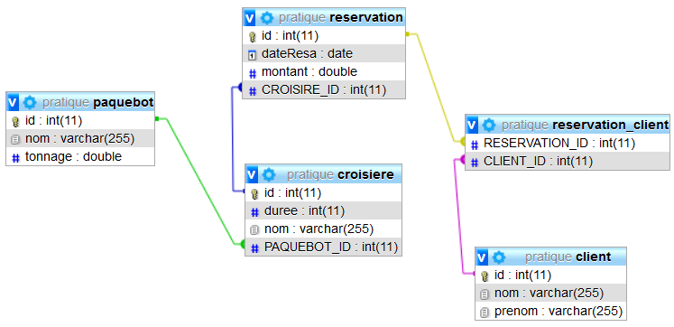

# 11 - @ManyToMany, @OneToMany, @ManyToOne : ASSOCIATION BIDIRECTIONNELLE DE N VERS N (**croisiere03**)

TRAVAIL A REALISER :

Pour ce projet : pas d'initialisation dans le contrôleur, mais juste un fichier **data.sql** dans le dossier **resources** et une ligne à décommenter dans le fichier **application.properties** :

```java
spring.datasource.initialization-mode=always
```

## contenu du fichier data.sql

```sql
-- données pour croisière01 --

INSERT INTO `client` (`id`, `nom`, `prenom`) VALUES
(1, 'Louis', 'Laetitia'),
(2, 'Fournol', 'Didier'),
(3, 'Balcon', 'Sophie'),
(4, 'Deride', 'Tony'),
(5, 'Congard', 'Nicolas');

INSERT INTO `paquebot` (`id`, `nom`, `tonnage`) VALUES
(1, 'British Queen', 1860),
(2, 'Titanic', 46328),
(3, 'Oasis of the Seas', 225282);

INSERT INTO `croisiere` (`id`, `duree`, `nom`, `paquebot_id`) VALUES
(1, 15, 'Mer Egée', 1),
(2, 9, 'Mer Caspied', 1),
(3, 12, 'Adriatique', 3);

INSERT INTO `reservation` (`id`, `date_resa`, `montant`, `croisiere_id`) VALUES
(1, '2020-11-12', 2400, 3),
(2, '2020-01-23', 11500, 3),
(3, '2020-03-04', 1199, 3),
(4, '2020-04-12', 2867, 3),
(5, '2020-02-22', 890, 3),
(6, '2020-02-27', 2543, 3),
(7, '2020-12-22', 2400, 2),
(8, '2020-02-27', 1199, 2),
(9, '2020-02-22', 1199, 2);

INSERT INTO `reservation_client` (`reservation_id`, `client_id`) VALUES
(1, 1),
(2, 1),
(4, 1),
(6, 1),
(8, 1),
(9, 1),
(1, 2),
(2, 2),
(4, 2),
(6, 2),
(8, 2),
(9, 2),
(1, 3),
(2, 3),
(4, 3),
(6, 3),
(8, 3),
(9, 3),
(3, 4),
(5, 4),
(7, 4),
(3, 5),
(5, 5),
(7, 5);

``` 

- mettre en place une association bidirectionnelle de « plusieurs vers un » entre Client et Reservation.

>En ce qui concerne la gestion des dates, utilisez la classe **java.util.Date** et **SimpleDateFormat** pour l’affichage au format « dd/MM/YYYY ». Pour transformer une date de type chaîne en une date au format Date il suffit d’écrire la ligne ci-dessous

```java
SimpleDateFormat dateformat = new SimpleDateFormat("dd/MM/yyyy");
dateformat.parse("15/12/2015");
```

- créer le projet croisiere03
- recopier le contenu de croisiere02
- créer la classe **Client* avec les attributs suivants :

```java
    private int id;
    private String nom;
    private String prenom;
    private Collection<Reservation> reservations;
```

- la clé primaire id sera autogénérée.
- la classe metier.Reservation comportera les attributs suivants :

```java
    private int id;
    private double montant;
    private Date dateResa;
    private Croisiere croisiere;
    private Set<Client> clients;
```

## Mise en place de l’association bidirectionnelle de plusieurs vers plusieurs

L’annotation **@ManyToMany** sur la méthode **getClients()** de Reservation indique la navigabilité de Reservation vers Client.

```java
    // détient la relation
    @ManyToMany(fetch=FetchType.EAGER)
    @JoinTable(name="RESERVATION_CLIENT",
    joinColumns={@JoinColumn(name="RESERVATION_ID")},
		inverseJoinColumns={@JoinColumn(name="CLIENT_ID")})
    public Set<Client> getClients() {
        return clients;
    }
```

L’annotation **@ManyToMany** sur la méthode **getReservations()** de Client indique la navigabilité de Client vers Reservation.

```java
    @ManyToMany(mappedBy="clients")
    public Collection<Reservation> getReservations() {
        return reservations;
    }
```

Voici le code à insérer dans votre servlet Contrôleur pour ajouter des enregistrements et générer les tables dans la base de données :

```java
 @RestController
@CrossOrigin("*")
public class ReservationController {

	@Autowired
	private CroisiereRepository croisiereRepo;

	@Autowired
	private PaquebotRepository paquebotRepo;

	@Autowired
	private ReservationRepository reservationRepo;

	@Autowired
	private ClientRepository clientRepo;

	@GetMapping("/")
	@ResponseBody
	public String home()
	{
		StringBuilder sb = new StringBuilder();
		sb.append("<h1>Regardez dans votre base de données MySQL <strong>JPA</strong></h1>");
		sb.append("<p>Vous devez avoir 5 tables dans votre base de données :</p>");
		sb.append("<ul><li><a href='http://localhost:8080/croisieres'>Liste des <strong>croisières</strong> enregistrées</a></li>");
		sb.append("<li><a href='http://localhost:8080/paquebots'>Liste des <strong>paquebots</strong> enregistrés</a></li>");
		sb.append("<li><a href='http://localhost:8080/resas'>Liste des <strong>réservations</strong> enregistrées</a></li>");
		sb.append("<li><a href='http://localhost:8080/clients'>Liste des <strong>Clients</strong> enregistrés</a></li></ul>");

		sb.append("<ul><li><a href='http://localhost:8080/croisiere/1'>Liste des réservations pour la Mer Egée</a></li>");
		sb.append("<li><a href='http://localhost:8080/croisiere/2'>Liste des réservations pour la Mer Caspied</a></li>");
		sb.append("<li><a href='http://localhost:8080/croisiere/3'>Liste des réservations pour l'Adriatique</a></li></ul>");
		return  sb.toString();
	}

	@GetMapping(value = "/croisieres")
	public ResponseEntity<?> getAllCroisieres(){
		List<Croisiere> liste = null;
		try
		{
			liste = croisiereRepo.findAll();
		} catch (Exception e) {
			return ResponseEntity.status(HttpStatus.NOT_FOUND).body(null);
		}

		return ResponseEntity.status(HttpStatus.OK).body(liste);
	}

	@GetMapping(value = "/paquebots")
	public ResponseEntity<?> getAllPaquebots(){
		List<Paquebot> liste = null;
		try
		{
			liste = paquebotRepo.findAll();
		} catch (Exception e) {
			return ResponseEntity.status(HttpStatus.NOT_FOUND).body(null);
		}

		return ResponseEntity.status(HttpStatus.OK).body(liste);
	}

	@GetMapping(value = "/resas")
	public ResponseEntity<?> getAllReservations(){
		List<Reservation> liste = null;
		try
		{
			liste = reservationRepo.findAll();
		} catch (Exception e)
		{
			return ResponseEntity.status(HttpStatus.NOT_FOUND).body(null);
		}

		return ResponseEntity.status(HttpStatus.OK).body(liste);
	}

	@GetMapping(value = "/croisiere/{id}")
	public ResponseEntity<?> getResaParCroisiere(@PathVariable Integer id)
	{
		Collection<Reservation> liste = null;
		Croisiere croisiere = null;
		try
		{
			croisiere = croisiereRepo.getOne(id);
			liste = croisiere.getReservations();
			if (liste.isEmpty()) 
			{
				return ResponseEntity.status(HttpStatus.OK).body("Aucune réservation pour cette croisière "+croisiere.getNom());
			}
			// dans la console pour vérification
			for (Reservation reservation : liste) {
				System.out.println(reservation);
			}

		}
		catch (EntityNotFoundException e)
		{
			return ResponseEntity.status(HttpStatus.NOT_FOUND).body(null);
		}

		return ResponseEntity.status(HttpStatus.OK).body(liste);
	}


	@GetMapping(value = "/clients")
	public ResponseEntity<?> getAllClients(){
		List<Client> liste = null;
		try
		{
			liste = clientRepo.findAll();
		} catch (Exception e) {
			return ResponseEntity.status(HttpStatus.NOT_FOUND).body(null);
		}

		return ResponseEntity.status(HttpStatus.OK).body(liste);
	}


}
```

Déployez l’application, lancez votre navigateur et testez !

Observez la table en base de données.

Voici ce que vous devez obtenir :



[Retour vers les autres exercices](mapping-orm.md)