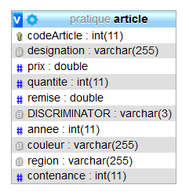

# 12.1 : HERITAGE : TABLE UNIQUE PAR HIERARCHIE/CLASSES (**heritage01**)

TRAVAIL A REALISER :

On souhaite développer une hiérarchie de bean entités avec la stratégie :

>une table unique par hiérarchie de classes.

- Créer le projet **springheritage01**
- vous allez encore picoler !!

Création de la hiérarchie de classes de beans entités

- la classe **Article** comportera les attributs suivants :

```java
    private Integer codeArticle;
    private String designation;
    private double prix;
    private double remise;
    private int quantite;
```

La clé primaire sera représentée par le **codeArticle** et ne sera **pas autogénérée**

La classe **Vin** qui hérite de **Article** comportera les attributs suivants :

```java
    private String region;
    private String couleur;
    private int annee;
```

La classe **Barrique** qui hérite de **Vin** comportera les attributs suivants :

```java
@Entity
public class Barrique extends Vin {
    private int contenance;
}
```

La classe **Bouteille** qui hérite de **Vin** comportera les attributs suivants :

```java
@Entity
public class Bouteille extends Vin {
    private int contenance;
}
```

## Mise en place de la stratégie d’héritage

La stratégie d’héritage est indiquée par l’annotation **@Inheritance** sur la classe de base ou classe mère (Article)

```java
@Inheritance(strategy=InheritanceType.SINGLE_TABLE)
```

La colonne discrimante et son type sont précisés par l’annotation 
**@DiscriminatorColumn** sur cette classe, par exemple :

```java
@DiscriminatorColumn(name="DISCRIMINATOR",discriminatorType=DiscriminatorType.STRING)
```

Chacune des classes de la hiéarchie devra indiquer la valeur à stocker dans la colonne discriminante (par défaut le nom de la classe) au moyen d’une annotation **@DiscriminatorValue**, par exemple :

```java
@DiscriminatorValue("ART") // pour article
```

## Code du Contrôleur :

```java
@RestController
@CrossOrigin("*")
public class MainController{

	@Autowired
	private ArticleRepository articleRepo;
	@Autowired
	private BouteilleRepository bouteilleRepo;
	@Autowired
	private VinRepository vinRepo;
	@Autowired
	private BarriqueRepository barriqueRepo;
	
	
	
	@GetMapping("/")
	@ResponseBody
	public String home()
	{
		init();
		StringBuilder sb = new StringBuilder();
		sb.append("<h1>Regardez dans votre base de données MySQL <strong>JPA</strong></h1>");
		sb.append("<p>Vous devez avoir 1 table <strong>Article</strong> dans votre base de données :</p>");
		sb.append("<ul><li><a href='http://localhost:8080/articles'>Liste des <strong>Articles</strong> enregistrés</a></li>");
		sb.append("<li><a href='http://localhost:8080/barriques'>Liste des <strong>Barriques</strong> enregistrées</a></li>");
		sb.append("<li><a href='http://localhost:8080/bouteilles'>Liste des <strong>Bouteilles</strong> enregistrées</a></li>");
		sb.append("<li><a href='http://localhost:8080/vins'>Liste des <strong>Vins</strong> enregistrés</a></li></ul>");

		return  sb.toString();
	}

	@GetMapping(value = "/articles")
	public ResponseEntity<?> getAllArticles(){
		List<Article> liste = null;
		try
		{
			liste = articleRepo.findAll();
		} catch (Exception e) {
			return ResponseEntity.status(HttpStatus.NOT_FOUND).body(null);
		}

		return ResponseEntity.status(HttpStatus.OK).body(liste);
	}

	@GetMapping(value = "/barriques")
	public ResponseEntity<?> getAllBarriques(){
		List<Barrique> liste = null;
		try
		{
			liste = barriqueRepo.findAll();
		} catch (Exception e) {
			return ResponseEntity.status(HttpStatus.NOT_FOUND).body(null);
		}

		return ResponseEntity.status(HttpStatus.OK).body(liste);
	}

	@GetMapping(value = "/bouteilles")
	public ResponseEntity<?> getAllBouteilles(){
		List<Bouteille> liste = null;
		try
		{
			liste = bouteilleRepo.findAll();
		} catch (Exception e)
		{
			return ResponseEntity.status(HttpStatus.NOT_FOUND).body(null);
		}

		return ResponseEntity.status(HttpStatus.OK).body(liste);
	}

	
	@GetMapping(value = "/vins")
	public ResponseEntity<?> getAllVins(){
		List<Vin> liste = null;
		try
		{
			liste = vinRepo.findAll();
		} catch (Exception e) {
			return ResponseEntity.status(HttpStatus.NOT_FOUND).body(null);
		}

		return ResponseEntity.status(HttpStatus.OK).body(liste);
	}

	/**
	 * Méthode d'initialisation (démo)
	 * non utilisée
	 */
	private void init()
	{
		Article a1=new Article();
        a1.setCodeArticle(396238);
        a1.setDesignation("verre");
        a1.setPrix(2.3);
        a1.setRemise(0);
        a1.setQuantite(8);
        
        Barrique bar1=new Barrique();
        bar1.setCodeArticle(629043);
        bar1.setDesignation("Barrique en chene");
        bar1.setRegion("Bordeaux (Margaux)");
        bar1.setCouleur("rouge");
        bar1.setPrix(85);
        bar1.setRemise(0);
        bar1.setQuantite(8);
        bar1.setContenance(1000);
        
        Bouteille b1=new Bouteille();
        b1.setCodeArticle(765439);
        b1.setDesignation("Les Hauts du Tertre 1999");
        b1.setRegion("Bordeaux (Margaux)");
        b1.setCouleur("rouge");
        b1.setPrix(11.50);
        b1.setRemise(0);
        b1.setQuantite(2);
        b1.setContenance(75);
        
        Bouteille b2=new Bouteille();
        b2.setCodeArticle(543289);
        b2.setDesignation("Château Marquis de Terme 1998");
        b2.setRegion("Bordeaux (Margaux)");
        b2.setCouleur("rouge");
        b2.setPrix(19.00);
        b2.setRemise(0);
        b2.setQuantite(3);
        b2.setContenance(75);
        
        Bouteille b3=new Bouteille();
        b3.setCodeArticle(278237);
        b3.setDesignation("Clos du Marquis 1999");
        b3.setRegion("Bordeaux (Saint-Julien)");
        b3.setCouleur("rouge");
        b3.setPrix(22.90);
        b3.setRemise(0);
        b3.setQuantite(15);
        b3.setContenance(75);
        
        Bouteille b4=new Bouteille();
        b4.setCodeArticle(974534);
        b4.setDesignation("Clos du Baron 1998");
        b4.setRegion("Bordeaux (Saint-Julien)");
        b4.setCouleur("blanc");
        b4.setPrix(45.20);
        b4.setRemise(0);
        b4.setQuantite(54);
        b4.setContenance(75);
        
        Vin v1 = new Vin();
        v1.setCodeArticle(666666);
        v1.setDesignation("Pinard de Simplon");
        v1.setRegion("Montreuil");
        v1.setCouleur("rosé");
        v1.setPrix(3.80);
        v1.setRemise(0);
        v1.setQuantite(150);
        v1.setAnnee(2016);
        		
        Vin v2 = new Vin();
        v2.setCodeArticle(777777);
        v2.setDesignation("Bière de Guinot");
        v2.setRegion("Villejuif à Perpette les oies");
        v2.setCouleur("Jaune");
        v2.setPrix(8.99);
        v2.setRemise(0);
        v2.setQuantite(200);
        v2.setAnnee(2015);
        
        System.out.println("ajout du produit: "+a1);
        articleRepo.save(a1);
        
        System.out.println("ajout du produit: "+bar1);
        articleRepo.save(bar1);
        
        System.out.println("ajout du produit: "+b1);
        articleRepo.save(b1);
        
        System.out.println("ajout du produit: "+b2);
        articleRepo.save(b2);
        
        System.out.println("ajout du produit: "+b3);
        articleRepo.save(b3);
        
        System.out.println("ajout du produit: "+b4);
        articleRepo.save(b4);
        
        System.out.println("ajout du produit: "+v1);
        articleRepo.save(v1);
        
        System.out.println("ajout du produit: "+v2);
        articleRepo.save(v2);

       
        System.out.println("modification du produit "+b3.getDesignation()+ "(10 bouteilles)");
        b3.setQuantite(10);
        articleRepo.save(b3);
           
      
        System.out.println("modification du produit "+b4.getDesignation()+ "(50 bouteilles)");
        b4.setQuantite(50);
        articleRepo.save(b4);
        
       
        System.out.println("suppression de l'article "+b2.getDesignation());
        articleRepo.delete(b2); 

	}

}

```

Déployez et testez votre application et observez ! 

Voici ce que vous devez obtenir comme table dans la base de données MySQL :



```sql
CREATE TABLE `article` (
  `CODEARTICLE` int(11) NOT NULL,
  `DISCRIMINATOR` varchar(3) DEFAULT NULL,
  `DESIGNATION` varchar(255) DEFAULT NULL,
  `PRIX` double DEFAULT NULL,
  `QUANTITE` int(11) DEFAULT NULL,
  `REMISE` double DEFAULT NULL,
  `ANNEE` int(11) DEFAULT NULL,
  `COULEUR` varchar(255) DEFAULT NULL,
  `REGION` varchar(255) DEFAULT NULL,
  `CONTENANCE` int(11) DEFAULT NULL
) ENGINE=MyISAM DEFAULT CHARSET=utf8;

ALTER TABLE `article`
  ADD PRIMARY KEY (`CODEARTICLE`);
```

[Retour vers les autres exercices](mapping-orm.md)