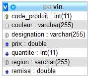

# 1 - BEAN ENTITE VIN - PERSISTANCE (**Pinard01**)



Pour chacun des exercices vous devez créer un projet SpringBoot Gradle avec **New Spring Starter Project** dans Eclipse et choisir les éléments suivants :

- Spring Web
- MySQL Driver
- Spring Data JPA
- java version 11
- Packaging War

- Créér une base de données nommée **jpa** avec un user **test** et un mot de passe **test**.

Pour tous les projets, Il y aura 1 package principal et 3 sous-packages :

- fr.apprenant.jpa
- fr.apprenant.jpa.model
- fr.apprenant.jpa.controller
- fr.apprenant.jpa.repository

- Ajouter les informations suivantes dans le fichier **applications.properties** de votre répertoire **src/main/resources** (ceci est valable pour tous les projets suivants) : 

```java
# ===============================
# base de données MySQL
# ===============================
spring.datasource.url=jdbc:mysql://localhost:3306/jpa?useSSL=false&zeroDateTimeBehavior=CONVERT_TO_NULL&serverTimezone=UTC
spring.datasource.username=test
spring.datasource.password=test
spring.datasource.driver-class-name=com.mysql.cj.jdbc.Driver
# log
logging.level.root=INFO
logging.file=d:/data/log-hibernate-jpa.log
logging.level.org.springframework.jdbc.core.JdbcTemplate=debug
# ===============================
# JPA / HIBERNATE
# ===============================
spring.jpa.show-sql=true
## spring.jpa.hibernate.ddl-auto=update
spring.jpa.hibernate.ddl-auto=create-drop
spring.jpa.properties.hibernate.dialect = org.hibernate.dialect.MySQL5InnoDBDialect
# ===============================
# Permet d'exécuter le data.sql
# ===============================
## spring.datasource.initialization-mode=always

```

Allez, commençons...

>Vous allez enfin pouvoir picoler et travailler avec des Entités !

Objectif : créer une entité **Vin** qui deviendra une table en base de données. Des enregistrements seront créés par le  Servlet Controleur **STester** et sauvegarder dans la table **vin** dans la bd **pratique** de MySQL.

## Création du projet Dynamique Web Projet : **pinard01**

Il s’agit d’utiliser des objets persistants en base de données. On souhaite manipuler des vins gérés par un Contrôleur qui appelera les méthodes de l'interface **Repository**, ici **VinRepository**.

- Il faut créer la classe du bean entité **Vin** dans le package **fr.apprenant.jpa.model** ayant les attributs suivants :

```java
private Integer codeProduit;
private String designation;
private String region;
private String couleur;
private double prix;
private double remise;
private int quantite;
```

Il faut :

- ajouter l’annotation **@Entity** devant la classe et l’annotation **@Id** devant l’attribut codeProduit.
- générer les getters et setters
- générer un constructeur vide
- ajouter les méthodes **hashCode()** et **equals()** pour la gestion des identifiants, et **toString()** que vous pouvez modifier.

Voici les méthodes **hashCode()**,  **equals()** et **toString()** que vous pouvez ajouter si vous ne l'avez pas déjà fait :

```java
@Override
public int hashCode() {
	int hash = 0;
	hash += (this.getCodeProduit() != null ? this.getCodeProduit()
			.hashCode() : 0);
	return hash;
}
@Override
public boolean equals(Object object) {
	
if (!(object instanceof Vin))
 	{
		return false;
	}
	Vin v = (Vin) object;
	if (codeProduit == null || designation == null || region == null
	|| couleur == null)
		return false;
	else if (!codeProduit.equals(v.codeProduit)
|| !designation.equals(v.designation) || !region.equals(v.region) || !couleur.equals(v.couleur)|| prix != v.prix || remise != v.remise || quantite != v.quantite) return false;
	return true;
	}

	@Override
	public String toString() {
	return "Produit : "+ getCodeProduit()+ " "
		+ getDesignation() + "  " + getRegion() + "  "
		+ getCouleur() + " remise : " + getRemise() + " prix : "
		+ getPrix() + " quantite :" + getQuantite();
}

```

>Comme nous allons utiliser une interface **@VinRepository** pour accéder à cette entité Vin, nous pouvons implementer l’interface **java.io.Serializable** pour éviter d’avoir les erreurs de **Marshalling/UnMarshalling** dans la console.
Cette interface permet d’envoyer des méta-informations via le réseau pour que le destinataire puisse reconstruire l’objet envoyé. Mais ce n'est forcément nécessaire pour les exercices.

>Voici l’explication donnée dans wikipédia : En informatique, la sérialisation (Serialization) est un processus visant à coder l'état d'une information qui est en mémoire sous la forme d'une suite d'informations plus petites le plus souvent des octets voire des bits. Cette suite pourra par exemple être utilisée pour la sauvegarde dite persistance ou le transport sur un réseau. L'activité symétrique, visant à décoder cette suite pour créer une copie conforme de l'information d'origine, s'appelle la désérialisation (ou **unmarshalling** en anglais).

## Création de @VinRepository pour gérer les entités Vin

- Dans un package nommé **fr.apprenant.jpa.repository**, créer une interface nommée **VinRepository** qui hérite de **JpaRepository<Vin, Integer>** dans laquelle vous ne mettrez rien sauf l'annotation **@Repository** pour dire à SpringBoot que c'est un repository.

```java
@Repository
public interface VinRepository extends JpaRepository<Vin, Integer> {

}
```

- Voici le code complet de votre classe Contrôleur **PinardController** pour vous aider à tester le projet :

```java
@RestController
@CrossOrigin("*")
public class PinardController {
	
	@Autowired
	private VinRepository vinRepository;
	
	@GetMapping("/")
	@ResponseBody
	public String home(){
		
		Vin v1=new Vin();
		v1.setCodeProduit(765439);
		v1.setDesignation("Les Hauts du Tertre 1999");
		v1.setRegion("Bordeaux (Margaux)");
		v1.setCouleur("rouge");
		v1.setPrix(11.50);
		v1.setRemise(0);
		v1.setQuantite(2);

		Vin v2=new Vin();
		v2.setCodeProduit(543289);
		v2.setDesignation("Château Marquis de Terme 1998");
		v2.setRegion("Bordeaux (Margaux)");
		v2.setCouleur("rouge");
		v2.setPrix(19.00);
		v2.setRemise(0);
		v2.setQuantite(3);

		Vin v3=new Vin();
		v3.setCodeProduit(782377);
		v3.setDesignation("Clos du Marquis 1999");
		v3.setRegion("Bordeaux (Saint-Julien)");
		v3.setCouleur("rouge");
		v3.setPrix(22.90);
		v3.setRemise(0);
		v3.setQuantite(15);

		Vin v4=new Vin();
		v4.setCodeProduit(974534);
		v4.setDesignation("Clos du Baron 1998");
		v4.setRegion("Bordeaux (Saint-Julien)");
		v4.setCouleur("blanc");
		v4.setPrix(45.20);
		v4.setRemise(0);
		v4.setQuantite(54);


		System.out.println("ajout du produit v1 : "+v1);
		ajoutVin(v1);

		System.out.println("ajout du produit v2 : "+v2);
		ajoutVin(v2);

		System.out.println("ajout du produit v3 : "+v3);
		ajoutVin(v3);
		v3.setQuantite(10);
		updateVin(v3);

		System.out.println("ajout du produit v4 : "+v4);
		ajoutVin(v4);

		updateQuantite(v4.getCodeProduit(),50);
		updateVin(v3);

		System.out.println("liste des vins enregistrés :");
		Collection<Vin> vins=findAll();
		Iterator<Vin> it=vins.iterator();
		while(it.hasNext())
		{
			System.out.println(it.next());
		}

		System.out.println("suppression du vin "+v3);
		deleteVin(782377);


		System.out.println("liste des vins enregistrés:");
		vins = findAll();
		it=vins.iterator();
		while(it.hasNext())
		{
			System.out.println(it.next());
		}
		
		return "<h1>Regardez dans votre console et dans votre base de données MySQL <strong>JPA</strong></h1>";
	}

	

	public Optional<Vin> findByCodeProduit(Integer codeProduit){
		return vinRepository.findById(codeProduit);
	}
	/**
	 * Retourne tous les produits dans une liste
	 */
	@SuppressWarnings("unchecked")
	public Collection<Vin> findAll(){

		return vinRepository.findAll();
	}
	/**
	 * Ajoute un vin
	 */
	public void ajoutVin(Vin vin){
		vinRepository.saveAndFlush(vin);
	}
	/**
	 * Met un jour un enregistrement pour un objet Vin
	 */
	public Vin updateVin(Vin vin){
		return vinRepository.saveAndFlush(vin);
	}

	/**
	 * Méthode qui détruit un objet de type Vin en fonction de son code
	 * et si ce dernier existe !
	 */
	public void deleteVin (Integer codeProduit){
		
		vinRepository.delete(vinRepository.getOne(codeProduit));
	}

	/**
	 * Met à jour la quantité d'un objet de type Vin
	 */
	public void updateQuantite(Integer codeProduit, int quantite){
		(vinRepository.getOne(codeProduit)).setQuantite(quantite);
	}
}
```

Ce projet permet de créer des vins et de les sauvegarder dans la base de données avec la méthode **save()** de notre **EntityManager** automatiquement gérer par Spring et Hibernate.

Voici la structure de la table de l’entité **Vin** générée dans la BD MySQL **pratique** :

```sql
CREATE TABLE `vin` (
  `CODEPRODUIT` int(11) NOT NULL,
  `COULEUR` varchar(255) DEFAULT NULL,
  `DESIGNATION` varchar(255) DEFAULT NULL,
  `PRIX` double DEFAULT NULL,
  `QUANTITE` int(11) DEFAULT NULL,
  `REGION` varchar(255) DEFAULT NULL,
  `REMISE` double DEFAULT NULL
) ENGINE=InnoDB DEFAULT CHARSET=utf8;

ALTER TABLE `vin`
  ADD PRIMARY KEY (`CODEPRODUIT`);
```

Elle contient 3 enregistrements.

Pour les exercices suivants, il y aura moins d'indication !

[Retour vers les autres exercices](mapping-orm.md)