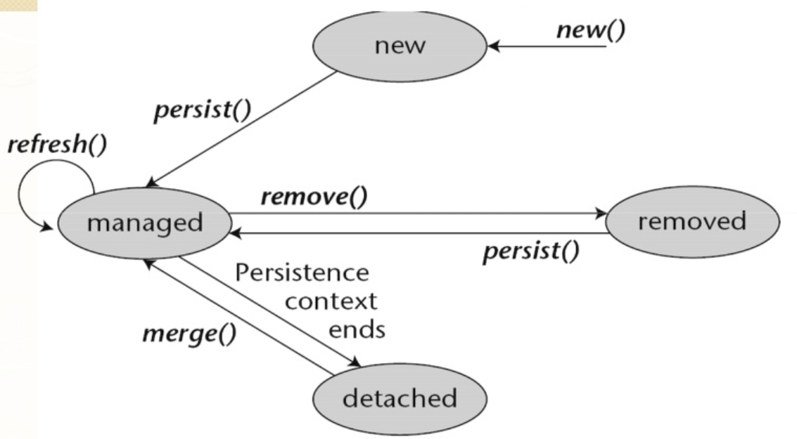
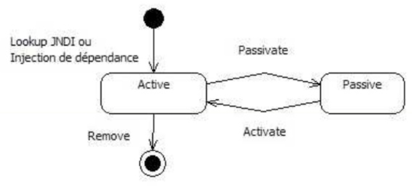

# JavaEE

## JavaEE et ejb Session

### Unité de persistence

Partie intégrante du framework Java EE, **l'unité de persistance est la « boite noire » qui permet de rendre persistants les Entity Beans**. Plus qu'un simple fournisseur de persistance, celle-ci va permettre aux développeurs d'optimiser leurs applications selon la gestion de leurs Entity Beans.

Cycles et méthodes



L'unité de persistance est l'élément clé de la gestion des Entity Beans au sein d'une application.

La solution adoptée pour la gestion de ces Entity Beans est l'utilisation d'une unité de persistance (ou contexte de persistance) qui prend en charge la sauvegarde des informations dans la source de données, de manière autonome.

Une unité de persistance (Persistence Unit) est caractérisée par les points suivants :

- un ensemble d'Entity Beans,
- un fournisseur de persistance (Provider),
- une source de données (dite Datasource).

Une entité persistante étant vouée à être enregistrée dans une source de données, le rôle de l'unité de persistance est :

- savoir où et comment stocker les informations.
- s'assurer de l'unicité des instances de chaque identité persistante.
- gérer les instances et leur cycle de vie : c'est le gestionnaire d'entité (**EntityManager**).

Le cycle de vie et les différents états des Entity Beans sont explicites dans le schéma plus haut.

>Il est important de comprendre la différence entre l'état attaché (**attached**) et détaché (**detached**).

Attaché :

Quand un Entity Bean est attaché à un contexte de persistance, les modifications appliquées à l'objet sont alors automatiquement synchronisées avec la base de données, via l'Entity Manager, le gestionnaire d’entités.

Détaché :

À l'inverse, un Entity Bean est dit détaché lorsqu'il n'a plus aucun lien avec l'Entity Manager.

>En résumé, l'unité de persistance est un groupe d'instance d'entités managées (gérées) dont leur gestion est réalisée par l'EntityManager.

#### Comment intégrer et packager une unité de persistance ?

Grâce à cette nouvelle spécification et à ses conteneurs légers, l'utilisation des Entity Beans n'est plus fermée au monde JAVA EE ou à un conteneur EJB. Vous pouvez désormais « déployer » des Entity Beans dans de nombreuses applications :

- Application Entreprise (EAR).
- Module Java Bean Entreprise (EJB-JAR).
- Application web (WAR).
- Client d'application entreprise (JAR).
- Un environnement Java SE compatible. Ce dernier point est, sans doute, le plus appréciable, en effet il vous permet d'inclure facilement et simplement un système de persistance de données à une application Java SE.

8.5.1.1 Paramétrage de l'unité de persistance

La nouvelle spécification définit un fichier qui regroupe l'ensemble des informations de persistance.

Vous devez nommer ce fichier : « **persistence.xml** » et placer ce dernier dans le répertoire « **META-INF** », à la racine du projet.

Ce fichier sera lu par le conteneur EJB lors du déploiement de l'application. Le conteneur créé alors une instance du fournisseur de persistance avec les paramètres demandés.

>Attention : vous devez nommer correctement le fichier « persistence.xml ». Si le nom ne correspond pas, le conteneur n'associera aucun contexte de persistance à l'application.

Il existe un schéma descriptif (DTD, Document Type Definition) à laquelle le fichier persistence.xml obéit comme pour tout fichier xml.

La balise racine `<persistence>` ne contient que des balises `<persistence-unit>`. Voici une description de chacune des balises utilisées, ainsi que le nombre de paramètres (entre parenthèses) qu'elles peuvent prendre :

- `<persistence-unit>` : déclare une unité de persistance.
L'attribut **name** affecte un nom unique à cette unité dans votre application. Le nom est utilisé pour identifier l'unité de persistance lors de son utilisation avec les annotations **@PersistenceContext** et **@PersistenceUnit** pour la création d'EntityManager ou d'EntityManagerFactory.

L'attribut type définit si l'unité de persistance est gérée et intégrée :

- **transaction JavaEE (JTA)** (automatique)
- **transaction RESOURCE_LOCAL)** (manuellement)

La valeur par défaut en environnement JavaEE est JTA et RESOURCE_LOCAL en environnement Java SE.

>Attention : Vous devrez définir plusieurs unités de persistance si vous souhaitez utiliser plusieurs sources de données.

Liste des balises qui permettent de paramétrer une unité de persistance :

-`<description>` : permet de décrire l'unité de persistance courante.
- `<provider>` : permet de définir la classe d'implémentation du fournisseur de persistance utilisé dans l'application (sous-classe de **javax.persistence.spi.PersistenceProvider**). Chaque unité de persistance utilise un fournisseur unique. Vous pouvez cependant, en environnement Java EE, utiliser le fournisseur par défaut du serveur d'applications :

  - JBoss utilise Hibernate (org.hibernate.ejb.HibernatePersistence)
  - Oracle Application Server utilise TopLink (oracle.toplink.essentials.ejb.cmp3.EntityManagerFactoryProvider)
  - GlassFish (Sun Application Server 9) utilise TopLink (oracle.toplink.essentials.ejb.cmp3.EntityManagerFactoryProvider)
  - KODO utilise kodo.persistence.PersistenceProviderImpl

En environnement Java SE, vous devez spécifier le fournisseur de persistance.

- `<jta-datasource>` : permet de définir le nom **JNDI** de la source de données transactionnelle à utiliser. Celle-ci doit être paramétrée sur le serveur et prendre en compte les transactions.
- `<nom-jta-datasource>` : permet de définir le nom **JNDI** de la source de données non transactionnelle à utiliser. Celle-ci doit être paramétrée sur le serveur. En environnement Java SE, vous ne pouvez pas utiliser de source de données. Il faut utiliser les propriétés (balise `<properties>`) du provider pour spécifier la base de données à utiliser.
- `<mapping-file>` : permet de définir le fichier de mapping XML pour les Entity Beans (lorsqu'il n'est pas possible d'utiliser les annotations).
- `<properties>` : Cette balise vous permet de configurer les attributs de configuration du fournisseur de persistance. Cette balise regroupe l'ensemble des propriétés `<property>`.
  - Une `<property>` est définie par un nom (attribut name) et une valeur (attribut value).

Une **unité de persistance** est mappée à un ensemble d'Entity Bean. Par défaut dans un environnement Java EE, le conteneur analyse l'ensemble des classes du fichier JAR contenant le fichier «persistence.xml».

Pour définir manuellement les classes à mapper, vous pouvez utiliser les balises suivantes :

- `<jar-file>` : permet de définir le(s) fichier(s) JAR, contenant les classes des Entity Beans à analyser.
- `<class>` : permet de définir les noms des classes à intégrer dans l'unité En environnement Java SE, vous devez définir l'ensemble des classes d'entités utilisées.
- `<exclude-unlisted-classes>` : indique que les classes non listées explicitement ne doivent pas être intégrées à cette unité. **En environnement Java EE, le conteneur cherche automatiquement les classes annotées @Entity et les ajoute aux unités de persistance**. Vous devez utiliser la balise exclude-unlisted-classes lorsque plusieurs unités de persistance sont définies et qu'elles utilisent des ensembles distincts d'Entity Bean dans une même application.

Finalement, l'ensemble des classes à mapper est défini par l'ensemble des :

- Classes annotées avec **@Entity** incluses dans les fichiers JAR définis via `<jar-file>`.
- Classes mappées dans le fichier « **META-INF/orm.xml** » s'il existe ou dans n'importe quel fichier XML défini via `<mapping-file>`.
- Classes listées via `<class>`.

Généralement, vous n'avez pas à utiliser les balises `<jar-file>` et `<class>` sauf si vous souhaitez mapper ou non une classe à plusieurs unités de persistance.
 
### Déploiement en environnement Java EE

En environnement Java EE, le déploiement des classes d'EJB ainsi que de l'unité de persistance doit respecter certaines contraintes, selon le type d'utilisation. Vous devez donc respecter les règles suivantes.

- Si l'unité de persistance doit être assemblée :

- En tant qu'ensemble de classes dans une archive EJB «.jar» :

  - **persistence.xml** doit se trouver dans le répertoire **META-INF**
  - les classes doivent être à la racine du fichier JAR.
- En tant qu'ensemble de classes dans une archive web « .war » :

  - **persistence.xml** doit se trouver dans le répertoire **/WEB-INF/classes/META-INF**
  - les classes doivent être dans le répertoire **/WEB-INF/classes** du fichier WAR.

- En tant qu'archive JAR externe incluse dans une archive WAR :

  - celle-ci doit se trouver dans le dossier **WEB-INF/lib**

- En tant qu'archive **JAR** externe incluse dans une archive **EAR** :
  - celle-ci doit se trouver à la racine du fichier EAR.

>Lorsqu'une contrainte n'est pas respectée, le conteneur ne démarre pas le moteur de persistance.

### Cycle de vie du contexte de persistance

Tout comme les Entity Beans, le contexte de persistance représenté par l'Entity Manager est lui aussi soumis à une durée de vie.

Il existe 2 comportements différents, pour les instances d'Entity Manager, qui dépendent du Session Bean utilisé :

- **transaction-scoped persistence context** : durée de vie liée à une seule transaction.
- **extended persistence contexts** : durée de vie liée à celle d'un Stateful Session Bean (et donc plusieurs transactions).

>Remarque : dans un environnement Java SE, seul **extended persistence contexts** est disponible.

#### Transaction-scoped persistence context

Lorsqu'un Entity Manager est de type *transaction-scoped** le cycle de vie est automatiquement géré par le conteneur Java EE.
Cela induit une totale transparence pour l'application.

Le contexte de persistance s'initialise lorsque l'application demande un Entity Manager au sein d'une transaction déjà active. Le contexte persistant s'arrête quand la transaction associée est validée ou annulée. Si un Entity Manager est appelé en dehors de toute transaction, le contexte est créé et supprimé respectivement au début et à la fin de la méthode.

>Lorsque le contexte de persistance est détruit, l'ensemble des entités managées deviennent détachées.

Exemple de déclaration d'une unité de persistance par annotation :

```java
@Stateless
public class WebClientServiceBean implements WebClientService
{
@PersistenceContext(unitName="stockManagerUP")
private EntityManager manager;

public User createUser(User user)
 {
   manager.persist(user);
   user.setValid(false);
   return user;
 }
}
```

Dans l'exemple ci-dessus, la méthode **createUser(User user)** enregistre un nouvel utilisateur. Même si la méthode **persist(Object o)** est appelée avant la modification de la propriété **valid** de l'instance **user**.

>La modification sera prise en compte et synchronisée en base de données car user est managée. Lorsque la transaction se termine, user est alors détaché et les modifications apportées ne sont plus synchronisées avec la base de données.

#### Extended persistence context

Il est également possible de définir un contexte de persistance avec une durée de vie s'étalant sur plusieurs transactions. On parle alors de **extended persistence context**. Chaque instance d'Entity Bean managée par ce type de contexte le reste même après la fin d'une transaction. Les instances sont détachées à la fermeture du contexte.

Dans ce cas, la durée de vie d'un contexte de persistance étendu doit être gérée par l'application (de la création jusqu'à la suppression). Toutefois, cette gestion peut être automatiquement gérée avec un Stateful Session Bean.

>Ce type de contexte de persistance n'a d'utilité que s'il est utilisé au sein d'un Stateful Session Bean.



**C'est le seul composant à garder un état conversationnel avec le client entre plusieurs appels de méthodes**. 

Avec les Stateless Session Beans ou les Message Driven Beans il est impossible de mettre en place un cache local, ceux-ci n'étant pas affectés à un client particulier.

Persistance via l’Entity Manager (Gestionnaire d’entités)

Lors du développement d'une application Java EE, il est possible que certaines instances ne soient pas utilisées de la même manière que les autres. Il est possible que la majorité de celles-ci doivent être rendues persistantes dans la source de données, mais que certaines doivent rester temporaires (en mémoire).

Le conteneur ne peut donc pas savoir si telle ou telle instance doit être liée à la source de données. C'est le développeur qui décide de sauvegarder, modifier, supprimer ces instances. L'interface EntityManager permet d'effectuer ces opérations d'accès aux données.

Toutefois, pour créer un objet de ce type, il faut utiliser la fabrique associée : **EntityManagerFactory**.

L'Entity Manager étant une interface, la classe d'implémentation est différente suivant le fournisseur utilisé (défini dans le fichier **persistence.xml** avec la balise `<provider>`).

Par défaut, c'est le conteneur qui instanciera l'Entity Manager et qui gérera son cycle de vie. On parle alors de gestionnaire d'entités géré par le conteneur (**container-managed entity manager**).

Il vous est possible de gérer manuellement ce cycle de vie. On parle alors de gestionnaire d'entité géré par l'application (**application-managed entity manager**). Ce sera le cas des **applications Java SE** où seuls un Entity Manager géré par l'application est disponible.

#### Comment obtenir un Entity Manager ?

Il existe plusieurs manières d'obtenir un objet EntityManager qui ont chacune des spécificités quant à leur utilisation :

- Injection par annotation : utilisée exclusivement en environnement Java EE.
- Utilisation de la **fabrique EntityManagerFactory** : utilisée pour gérer de façon manuelle la création d'EntityManager. Elle est obligatoire pour une application Java SE.

Dans la plupart des cas, **la manipulation des données via un conteneur EJB se réalise en définissant un Session Bean dit en «façade»**. Ce Session Bean accède donc au contexte de persistance et peut ensuite travailler avec les instances des Entity Beans, via l'Entity Manager.

>C'est ce que nous utiliserons dans la construction de certains exercices.

Nous n’aborderons pas l’utilisation de l’EntityManagerFactory pour une application JavaEE, il est préférable d’utiliser l’Injection par annotation.

>Il est possible de laisser le conteneur se charger d'injecter une instance d'un Entity Manager lors de l'instanciation du Session Bean. Cette méthode est sans doute la plus simple et la plus pratique.

Annotation de l'EntityManager :

Afin d'indiquer au conteneur que le Bean est dépendant d'un **EntityManagerFactory** ou d'un **EntityManager**, vous devez annoter la variable d'instance de type EntityManagerFactory ou EntityManager avec **@PersistenceContext**. Cette annotation admet plusieurs attributs :

- **name** : déclare un nom local référencé sur une unité de persistance déployé (référence locale vers une unité de persistance).
- **unitName** : définit le nom de l'unité de persistance à utiliser pour injecter l'EntityManager.
- **type** : indique le type contexte de persistance injecté (EXTENDED ou TRANSACTION par défaut).

Exemple d'utilisation au sein d’une application web de gestion de portefeuille d'actions. Ici, un EntityManager, lié à l'unité de persistance nommée « stockmanagerPU », est injecté :

```java
@Stateless
@Local({CommonService.class})
public class CommonServiceBean implements CommonService {

@PersistenceContext(unitName="stockmanagerPU")
protected EntityManager emStockManager;
//…
}
```

Si vous utilisez **l'EntityManagerFactory**, vous devez explicitement créer votre EntityManager. Cette instance sera de type **EXTENDED**. 

Vous devrez donc appeler la méthode **EntityManager.joinTransaction()** si l'unité de persistance est configurée avec le type de transaction JTA (par défaut en environnement Java EE). Dans le cas contraire, des informations pourraient être perdues, étant donné qu'aucune synchronisation ne sera faite avec la base de données.

Exemple d’écriture :

```java
@PersistenceContext(unitName="stockmanagerPU")
protected EntityManagerFactory emStockManagerFactory;

public void addUser(User user) {
EntityManager em = emStockManagerFactory.createEntityManager();
em.jointTransaction();
//...
}
```

Comme vous pouvez le constater, l'utilisation de l'EntityManagerFactory est une charge pour les développeurs. Il est, cependant, possible de laisser cette charge au conteneur en lui demandant d'injecter directement une instance EntityManager.

Exemple :
```java
@Stateless
@Local({CommonService.class})
public class CommonServiceBean implements CommonService {
@PersistenceContext(unitName="stockmanagerPU")
protected EntityManager emStockManager;
//…
}
```

Dans cet exemple, l'EntityManager injecté est automatiquement associé à la transaction courante jusqu'à la fin de celle-ci. Nous sommes alors en présence d'un **transaction-scoped persistence context**. Le même contexte de persistance est alors utilisé tant que vous travaillez dans la transaction de départ.

Il devient alors inutile d'appeler la méthode close() de l'EntityManager, **son cycle de vie étant automatiquement géré par le conteneur** (en cas d'appel de cette méthode, une exception IllegalStateException est levée).

L'injection d'un extended persistence context ne prend de sens que dans un Stateful Session Bean. En effet, la durée de vie de celui-ci a réellement un intérêt dans l'application. Pour spécifier le fait d'utiliser un contexte de persistance de type étendu, vous devez utiliser l'attribut type de l'annotation **@PersistenceUnit**.

Exemple :

```java
@Stateful
@Local({RichClientService.class})
public class RichClientServiceBean implements RichClientService {
@PersistenceContext(unitName="stockmanagerPU",
	type=PersistenceContextType.EXTENDED)
protected EntityManager emStockManager;
//...
}
```

Le contexte de persistance est créé au même moment que le Session Bean et a le même cycle de vie que celui-ci. Il est fermé lorsque le Session Bean est détruit.

Durant toute la vie du Session Bean, les instances des Entity Beans associées au contexte de persistance sont managées.


#### Comment travailler avec un Entity Manager ?

L'interface **javax.persistence.EntityManager** est le point central de la gestion des entités persistantes. Elle offre des méthodes d'ajout, modification, suppression, recherche et un accès à l'API Query.

Nous allons détailler les différentes méthodes de cette interface et expliquer leur comportement.

##### Enregistrer les entités

Enregistrer une entité consiste à l'insérer dans la base de données.   
Cette opération se traduit par l'appel de la méthode :

EntityManager.**persist(Object o)**

Celle-ci ne s'applique que sur des entités encore non enregistrées dans la base de données. Pour enregistrer une entité, vous devez tout d'abord créer une instance, puis affecter ses propriétés et ses relations avec les valeurs souhaitées, comme vous pouvez le faire avec un objet Java.

Il vous suffit d'appeler la méthode persist() comme ceci :

```java
User nouvelUtilisateur = new User();
// affecte les relations
nouvelUtilisateur.setFirstname("Tarzan") ;
nouvelUtilisateur.setEmail("popom@sopinfo.com");
//...
entityManager.persist(nouvelUtilisateur);
```

- **l'instance nouvelUtilisateur devient managée**
- son **insertion en base de données est mise dans la file d'attente** de l'Entity Manager.
- Si la méthode **persist()** est appelée dans une transaction, l'insertion en base de données peut être faite immédiatement ou mise en file d'attente jusqu'à ce que la transaction se termine. Cela dépend du mode utilisé pour la synchronisation à la base de données.

>Il n'est pas possible d'appeler la méthode persist() en dehors d'une transaction seulement si l'Entity Manager est de type étendu EXTENDED. Dans ce cas-là, l'insertion est mise en file d'attente jusqu'à ce que le contexte soit associé à une transaction.

#### Retrouver vos entités

Une fois les objets sauvegardés, il est important de pouvoir les récupérer. Il existe deux façons de récupérer ces objets de la base de données. Nous allons détailler la récupération d'objets à partir de leur clé primaire. L'autre solution consiste à travailler avec les requêtes EJB-QL ou JPQL que nous aborderons par la suite.

L'Entity Manager a deux méthodes simples pour trouver une entité à partir de sa clé primaire :

- **<T> T find(Class<T> entity, Object primaryKey)**
- **<T> T getReference(Class<T> entity, Object primaryKey)**

Ces deux méthodes se ressemblent étroitement et prennent toutes les deux les mêmes paramètres :

- la classe de l'entité
- l'instance de la clé primaire.

L'utilisation des génériques évite d'avoir à caster la valeur de retour. Toutefois des différences existent !

- La méthode **find()** retourne null si aucune entité n'est associée à la clé primaire demandée. Elle initialise également les états de base du lazy-loading associés aux propriétés.

Exemple d’utilisation :
```java
User user1 = entityManager.find(User.class, 1);
if(user1 == pull)
{…}
```

- La méthode **getReference()** se comporte différemment si l'entité n'est pas trouvée en base de données. Dans ce cas-là, **elle lance une javax.persistence.EntityNotFoundException**. De plus, elle ne garantit pas l'initialisation des états de l'entité.

>Attention ! La méthode find() ne fonctionne que si l’identifiant est de type numérique, sinon il vaut mieux utiliser une requête nommée avec l’identifiant comme paramètre.

#### Modifier vos entités

Il existe 2 façons de modifier une entité. Soit vous la chargez depuis la base de données et vous lui appliquez les modifications au sein de la transaction, soit vous souhaitez mettre à jour un objet détaché et dans ce cas-là vous devez utiliser la méthode **merge()**.

Lorsque vous récupérez une entité via **find()**, **getReference()** ou par l'intermédiaire d'une requête, celle-ci se retrouve managée jusqu'à la fermeture du contexte de persistance. Vous pouvez alors changer les propriétés de cette instance, les modifications seront synchronisées automatiquement.

Exemple de code :
```java
public void changeUserEmail(int userId, String email) {
User currentUser = entityManager.find(User.class, userId);
currentUser.setEmail(email);
```

Dans cet exemple, l'Entity Manager doit être associée à la transaction courante si l'on souhaite que les modifications soient enregistrées.

>Celles-ci sont réellement affectées en base de données lorsque la transaction se termine ou que méthode **flush()** est appelée explicitement.

L'autre solution est à utiliser lorsque vous souhaitez fusionner les modifications faites sur un objet détaché vers le contexte de persistance. C'est le cas, par exemple, lorsqu'une entité quitte le conteneur EJB vers une autre application (Web ou client riche).

Vous devez alors utiliser la méthode EntityManager.**merge()** afin de **rattacher l'instance au contexte de persistance**.

Imaginons qu'un client riche appelle la méthode findUser() suivante :
```java
@PersistenceContext
EntityManager em;
public User findUser(int userId)
{
return em.find(User.class, userId);
}
```

>Le contexte de persistance se ferme après l'exécution de la méthode **findUser()** car il est de type **transaction-scoped**. (nous supposons que le Session Bean utilise la gestion par défaut des transactions). À partir de là, l'instance retournée est détachée et les modifications appliquées ne sont plus synchronisées. Si l'application cliente souhaite enregistrer les modifications faites en local, elle doit renvoyer l'instance au Session Bean.

Exemple :

```java
User returnedUser = adminService.findUser(2);
returnedUser.setEmail("nouvelemail@supinfo.com");
adminService.updateUser(returnedUser);
```

>Dans ce cas-là, la méthode **updateUser()** doit utiliser EntityManager.merge() afin de rattacher l'instance au contexte.

```java
@PersistenceContext
EntityManager em;
public void updateUser(User user) {
User attachedUser = em.merge(user);
}
```

Différents comportements s'appliquent suivant le contexte dans lequel vous appelez la méthode merge().

- Si l'Entity Manager ne contient pas d'instance de l'entité avec la même clé primaire, alors il crée une copie complète de l'objet passé en argument et la retourne. Cette copie est alors attachée au contexte de persistance et les modifications faites dessus sont synchronisées avec la base de données.

- Si l'Entity Manager détient déjà une instance de l'entité ayant la même clé primaire, alors le contenu du paramètre (ici user) est copié dans l'instance attachée.

Dans les deux cas, le paramètre user de la méthode updateUser() reste détaché et donc n'est pas synchronisé avec la base de données.

>C'est la raison pour laquelle **le développeur doit travailler avec l'instance retournée par la méthode merge() s'il doit faire d'autres modifications sur l'entité**.

#### Supprimer vos entités

La méthode EntityManager.**remove()** sert à demander la suppression d'une entité de la base de données. **Nous parlons de "demande" car la suppression n'est pas effective immédiatement mais seulement à l'appel de la méthode flush() ou à la fermeture du contexte de persistance**.
Entre-temps, il est possible d'annuler la suppression.

```java
@PersistenceContext
EntityManager em;
public void removeUser(int userld) {
User userToRemove = em.find(userId);
em.remove(userToRemove);
}
```

L'appel à la méthode **remove()** détache l'entité du contexte de persistance.

>Pour annuler cette suppression dans le même contexte de persistance **il faut appeler la méthode persist()** afin de rattacher l'instance au contexte.

#### Recharger les entités

Si vous savez que l'instance d'une entité ne reflète pas les valeurs de la base de données (parce que celle-ci a été modifiée entre-temps...) vous pouvez utiliser la méthode EntyManager.**refresh()** afin de recharger l'entité depuis la base de données.

Cette opération écrase toutes les modifications qui ont pu être apportées à l'entité.

```java
@PersistenceContext
EntityManager em;
public void workOnUser(int userld){
User user = em.find(userId):
user.setEmail("nomail@supinfo.com");
// recharge l'objet depuis la base de données
em.refresh(user);
}
```

>Dans l'exemple précédent, l'email n'est pas modifié à cause de l'appel à la méthode refresh().

#### Méthode flush()

>Lorsque vous appelez les méthodes **persist()**, **merge()** ou **remove()**, les changements ne sont pas synchronisés immédiatement.

Cette synchronisation s'établit, automatiquement à la fin d'une transaction ou lorsque l'Entity Manager décide de vider (to flush, en anglais) sa file d'attente.

>Toutefois, le développeur peut forcer **la synchronisation en appelant explicitement la méthode flush() de l'Entity Manager**.

Vous pouvez également définir le comportement que doit avoir l'Entity Manager pour effectuer automatiquement ses appels à flush(), via la méthode **setFlushMode()**. Cette méthode prend en paramètre un objet **FlushModeType**, une énumération regroupant deux valeurs :

- **AUTO** : définit le comportement par défaut (présenté tout au long de cette partie).
- **COMMIT** : spécifie que les changements sont envoyés à la base de données seulement lorsque la transaction est commitée et non après chaque requête.

>Attention : flush() et commit() sont deux opérations différentes !
flush() envoie les requêtes SQL aux sources de données alors que commit() valide la transaction au niveau de ces sources.

Le mode AUTO est utilisé dans la plupart des cas : il permet de maintenir une cohérence des données. Par exemple, lorsque vous faites une requête sur la base de données, vous souhaitez que toutes les modifications faites avant aient été envoyées.

Le mode COMMIT est utilisé lorsqu'on souhaite optimiser les performances de certaines transactions. L'utilisation de ce mode permet de réunir l'ensemble des requêtes à exécuter et à les transmettre d'un seul coup à la base de données.

Il est apparemment plus facile d'utiliser le mode AUTO, celui-ci garanti de manière cohérente les données. Toutefois, il peut être intéressant d'utiliser le mode COMMIT lorsque vous souhaitez optimiser votre application et la rendre plus performante.

Note : ce cours peut servir pour la préparation du diplôme CDA (Concepteur Développeur d'Application de niveau II)

Auteur : **Philippe Bouget**