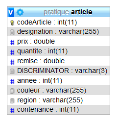

# Exercices pratiques pour maîtriser le Mapping avec JPA/Hibernate/SpringBoot

Tous les TP ne sont pas à faire.   
Les TP obligatoires sont les suivants : 1, 2, 5, 6, 7, 8, 9, 10, 11, 12.1, 12.2, 12.3 et 12.4.

1 - ENTITE VIN - PERSISTANCE (**[pinard01](exercices/pinard01-entity.md)**) identifiant **NON AUTO-GENERE**

2 - ENTITE VIN AVEC **CLE PRIMAIRE AUTO-GENEREE** (**[pinard02](exercices/pinard02-entity-clef-auto-generee.md)**)

3 - ENTITE VIN : **CLE PRIMAIRE COMPOSITE** avec **@IdClass** [**(pinard03)**](exercices/pinard03-entity-clef-composee-IdClass.md)

Pour ce projet (démo), on utilise **Lombok** pour réduire le code de l'entité **Vin**. Il faut penser à installer le JAR dans votre IDE et l'ajouter dans votre dépendance **Gradle** ou **Maven**.

4 - ENTITE VIN : CLE PRIMAIRE COMPOSITE avec **EmbeddedId** (**[pinard04](exercices/pinard04-entity-clef-composee-EmbeddedId.md.md)**)

Pour ce projet, pas de Lombok.

5 - ENTITE CLIENT : MAPPING MULTI-TABLES avec **@SecondaryTable** (**[client01](exercices/client01-entity-table-secondaire.md)**)

6 - **@OneToOne** : ASSOCIATION UNIDIRECTIONNELLE DE 1 VERS 1 (**[client02](exercices/client02-@OneToOne-unidirectionnelle.md)**)

7 - **@OneToOne** : ASSOCIATION BIDIRECTIONNELLE DE 1 VERS 1 (**[client03](exercices/client03-@OneToOne-bidirectionnelle.md)**)

8 - **@OneToOne** & **@OneToMany** : ASSOCIATION UNIRECTIONNELLE DE 1 VERS n (**[client04](exercices/client04-@OneToOne-@OneToMany-uni-et-bidirectionnelle.md)**)

9 - **@ManyToOne** : ASSOCIATION UNIDIRECTIONNELLE DE N VERS 1 (**[croisiere01](exercices/croisiere01-@ManyToOne-unidirectionnelle.md)**)

10 - **@ManyToMany**, **@OneToMany** : ASSOCIATION BIDIRECTIONNELLE DE N VERS 1 (**[croisiere02](exercices/croisiere02-@ManyToMany-@ManyToOne-@OneToMany-uni-et-bidirectionnelle.md)**)

11 - **@ManyToMany**, **@OneToMany**, **@ManyToOne** : ASSOCIATION BIDIRECTIONNELLE DE N VERS N (**[croisiere03](exercices/croisiere03-@ManyToMany-@ManyToOne-@OneToMany-uni-et-bidirectionnelle.md)**)

12.1 - HERITAGE : **SINGLE_TABLE** - UNE TABLE UNIQUE PAR HIERARCHIE/CLASSE (**[heritage01](exercices/heritage01-Single-Table.md)**)

12.2 - HERITAGE : **TABLE_PER_CLASS** - UNE TABLE PAR CLASSE CONCRETE (**[heritage02](exercices/heritage02-Table-Per-Class.md)**)

12.3 - HERITAGE : **JOINED** - UNE TABLE PAR SOUS-CLASSE (**[heritage03](exercices/heritage03-Joined.md)**)

L'annoation **JOINED** permet de générer des jointures.

12.4 – HERITAGE : **@MappedSuperClass** - CLASSE DE BASE NON PERSISTANTE (**[heritage04](exercices/heritage04-@MappedSuperClass.md)**)

L'annoation **@MappedSuperClass** permet de générer des tables relatives au sous-classes en intégrant les propriété de la classe mère.

**Tous les projets Eclipse/Gradle sont sur mon github !**

Nous verrons ultérieurement la notion de `transaction` avec Hibernate (prochaine session).