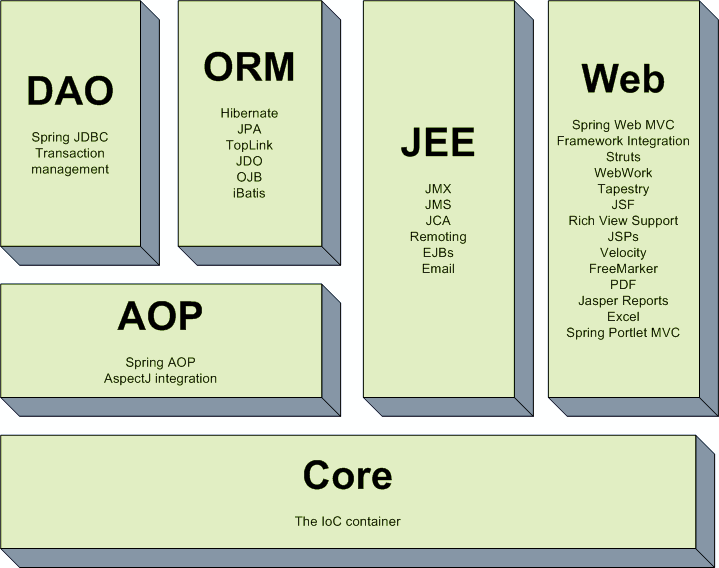
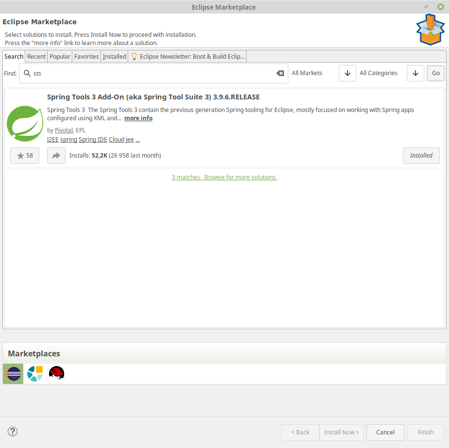
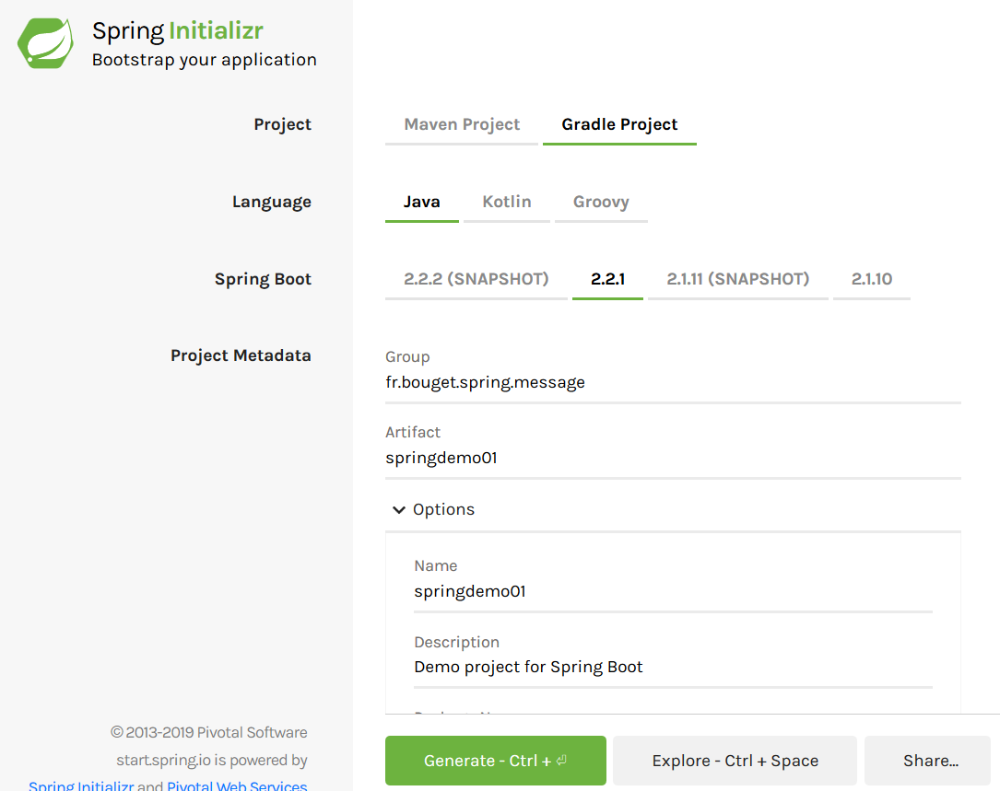
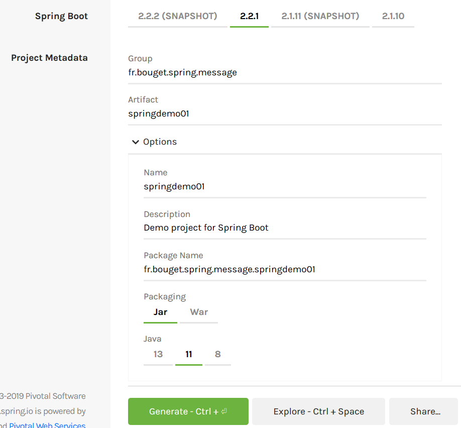
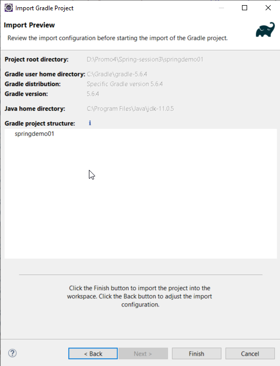
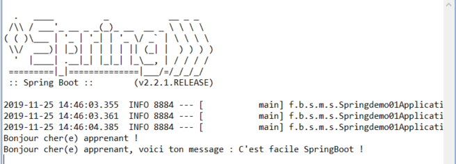

# Premiers pas avec SpringBoot


## Découvrir le framework Spring

Spring est un framework Java open source qui facilite et structure le développement d'applications java. Créé par Rod Jonhson, il est aujourd'hui porté par la société Pivotal.

Initialement dénommé Spring Framework, il est utilisé dans de nombreux projets depuis de nombreuses années.

Au fils du temps, il a évolué pour fournir toujours plus de services et permettre aux développeurs de travailler plus vite, plus facilement et de manière plus structurée.

### Spring Framework est composé de modules



 * Spring `Core`
 * Spring `AOP`
 * Spring `DAO`
 * Spring `ORM`
 * Spring `Web`
 * Spring `Context`

Bien qu'ils soient prévus pour être indépendants, il est fréquent et souvent intéressant d'utiliser au maximum les services qu'ils proposent.
Spring est un framework extrement puissant, proposant des services très intéressants mais il un a un gros défaut : il est assez difficile à configurer.

> C'est pour palier ce défaut qu'a été créé `SpringBoot`.

Bien que l'objectif principal soit toujours le même (permettre de développer plus facilement, plus rapidement et de manière structurée des applications java), SpringBoot facilite la mise en place d'un projet qui utilisera les fonctionnalités proposées par Spring en fournissant :

 * une configuration par défaut pour les projets Spring
 * un site qui centralise les ressources : https://start.spring.io/
 * un assistant intégré dans Eclipse : `STS` (Spring Tool Suite)
 * une intégration forte du serveur d'application (Tomcat version embarquée dans les projets SpringBoot)
 * un recours massif aux annotations (pour éviter les fichiers de configurations)
 * l'encapsulation d'un grand nombre de librairies java.
 * un cadre de bonnes pratiques : test, MVC...

Par ailleurs, SpringBoot est particulièrement efficace dans la création d'API Rest (ou RestFull). 

#### Concepts fondateurs

Spring s'appuie sur 3 concepts :

* l'inversion de controle (IOC)
* la programmation orienté aspect (POA)
* une couche d'abstraction  

L'IOC gère les dépendances entre les classes par une `simple déclaration`.

La POA sépare la couche métier (coeur du logiciel) de la couche technique.

La couche d'abstraction permet d'intégrer facilement d'autres frameworks ou bibliothèques. On utilise pour cela l'outil Maven ou Gradle.

Avant de commencer à utiliser SpringBoot, il faut installer le plug-in pour Eclipse.

>SpringBoot est un framework java très pratique et facile à mettre en place. Il prend en charge les dépendances nécessaires au fonctionnement du projet. Une fois le plug-in installé, vous pourrez générer un projet Gradle depuis le site web : https://start.spring.io/

## Installation du plugin STS pour eclipse

A installer depuis le **Eclipse Marketplace** (nous ne l'utiliserons pas dans l'immédiat pour la création de projet SpringBoot) :



## Création d'un projet SpringBoot-Gradle depuis **Spring Initializr**

Ce projet est une application Standalone (non web)

rendez-vous à l'adresse : https://start.spring.io/ et suivez les instructions.





### Importation du projet Gradle dans Eclipse



### Ajout d'un package et d'une classe (un simple Bean)

Cette classe MessageBean contient 2 méthodes :

- **message()** : affiche un message type
- **message(String phrase)** : affiche un message qui prend une chaîne en argument

```java
@Component("messageBean")
public class MessageBean {
	public void message()
	{
		System.out.println("Bonjour cher(e) apprenant(e) !");
		
	}
	public void message(String phrase)
	{
		System.out.println("Bonjour cher(e) apprenant(e), voici ta phrase : "+phrase);
	}
}
```

### Modification dans la classe principale et la méthode main()

```java
@SpringBootApplication
@ComponentScan(basePackages = {"fr.bouget.spring.message.springdemo01"})
public class Springdemo01Application {

	public static void main(String[] args) {
		ApplicationContext context = SpringApplication.run(Springdemo01Application.class, args);
		MessageBean monObjetMessage = (MessageBean) context.getBean("messageBean");
		monObjetMessage.message();
		monObjetMessage.message("C'est facile SpringBoot !");
	}
}
```

### Exécution

- Faites un clic droit sur votre projet et faites un **Run As Spring Boot App**
- Jetez un oeil dans votre console

### Résultat attendu dans votre console



## Création d'un projet web SpringBoot-Gradle depuis **Spring Initializr**

>Projet identique avec une dépendance pour le web. Quelques annotations suffisent pour le webiser !

Il faudra juste ajouter une dépendance. Voici un extrait du build.gradle :

```java
implementation 'org.springframework.boot:spring-boot-starter-web'
	providedRuntime 'org.springframework.boot:spring-boot-starter-tomcat'
```

### Structure du projet

En parcourant notre projet SpringBoot, on observe que les répertoires suivants ont été créés :

 * **src/main/java** : répertoire racine pour le code source de notre application
 * **src/main/resources** : répertoire racine pour les ressources de notre application
 * **src/main/resources/static** : répertoire pour les ressources statiques à déployer(fichiers html, css, js,...)
 * **src/test/java** : repertoire destiné à recevoir les tests (Junit...)

En plus de ces répertoires, des fichiers de configurations essentiel au bon fonctionnement de notre projet ont été générés dont celui de `Gradle`.

 * **build.gradle** : fichier dans lequel vous pouvez configurer les dépendances du projet SpringBoot.

Dans ce fichier, on y trouve :

 * des élements d'identification de notre projet (méta informations)
 * la configuration Spring Boot (package, version...)
 * les propriétés pour le projet (version java, encodage...)
 * les dépendances vers les librairies utiles au projet
 
C'est grâce à ce fichier que le projet java sera configuré et que l'ensemble des librairies utiles seront téléchargées et intégrées au projet.

Dans le répertoire **src/main/resources** Il y a un fichier important nommé **application.properties**. Ce fichier a vocation à contenir **TOUTES** les informations de configuration des composants utilisés par le projet (composants encapsulés par SpringBoot).

>Toutefois, il est possible de stocker les informations de configuration dans d'autres types de fichiers (YAML, XML) en créant une classe spécifique pour que le framework SpringBoot puisse prendre en charge ce changement.

Pour plus de détails sur les mots clefs utilisables, cliquez [ici](https://docs.spring.io/spring-boot/docs/current/reference/html/common-application-properties.html).

- Dans le package **fr.bouget.spring.message.springdemo02.bean** ajouter la classe suivante (ici, pas de changement):

```java
@Component("messageBean")
public class MessageBean {
	public String message()
	{
		return "Bonjour cher(e) apprenant(e) !";
	}
	public String message(String phrase)
	{
		return "Bonjour cher(e) apprenant(e), voici ta phrase : "+phrase;
	}
}
```

```java
package fr.bouget.spring.message.springdemo02;

import org.springframework.boot.SpringApplication;
import org.springframework.boot.autoconfigure.SpringBootApplication;

@SpringBootApplication
public class Springdemo02Application {
	public static void main(String[] args) {
		SpringApplication.run(Springdemo02Application.class, args);
	}
}
```

> L'annotation **@SpringBootApplication** a 3 fonctions :

- Montrer que nous sommes dans un **Context** Spring
- Scanner les fichiers qui se trouvent dans le même package que l'application
- Permettre l'autoconfiguration

Voici la classe **MessageController**, le point d'entrée.

```java
@Controller
@RequestMapping("/demo2")
public class MessageController {
	
	@Autowired
	private MessageBean messageBean;
	
	@RequestMapping("/message")
	@ResponseBody
	public String afficherMessage()
	{
		return messageBean.message();
	}
	
	@RequestMapping("/message/{phrase}")
	@ResponseBody
	public String afficherMessage(@PathVariable("phrase") String phrase)
	{
		return messageBean.message(phrase);
	}

}
```

> Dans le monde Spring, le mot `Controller` designe la classe qui fournit les services web (équivalent des Servlet en Java Web). C'est le point d'entrée de l'application web.
Pour définir un `Controller` au sens Spring, on va ajouter à la classe précédemment créée l'annotation **@Controller**.

Grâce à cette annotation, Spring identifiera cette classe comme une classe `spéciale` sur laquelle le framework travaillera.

> Pour relier la méthode **afficherMessage()** à une URI, on va ajouter à la déclaration de la méthode l'annotation **@RequestMapping**(chemin). *Chemin* étant la chaîne de caractère qui sera ajoutée à la fin de l'URL entrée dans le navigateur.

Comme notre méthode retourne une variable (ici une chaîne de caractères), il faut aussi ajouter l'annotation **@ResponseBody** qui permet de renvoyer une réponse HTTP.

#### Lancer votre application web

- Faites un clic droit sur votre projet et faites un **Run As Spring Boot App**
- Ouvrez votre navigateur web préféré et saisissez l'url suivantes :

http://localhost:8080/demo2/message

puis celle ci-dessous :

http://localhost:8080/demo2/message/phil Jarive qui arrive !

### Annotations Spring 5.0

[Cliquez sur ce lien du blogspot javamidnight](http://javamidnight.blogspot.com/2017/11/le-guide-complet-des-annotations-du.html)

### Conclusion

Avec ces projets d'introduction, vous avez pu découvrir que SpringBoot :

- Facilite la mise en place d'un projet
- Utilise Gradle ou Maven pour gérer les dépendances du projet
- Nécessite peu de configuration (Cette configuration se fait dans les classes java à l'aide d'annotations)
- Fournit une encapsulation forte du serveur d'application (avec une configuration par défaut, ici, le serveur **Tomcat**)

### Quelques conseils

Spring est un framework difficile à prendre en main car son champ d'application est très vaste. Il fournit une quantité importante de classes utilisables pour différents contextes / besoins et une quantité phénoménale d'annotations auxquelles viennent s'ajouter les annotations des librairies que Spring gère. De plus il est souvent possible d'écrire ces annotations de plusieurs manières.

Vous l'aurez compris, une grande partie du travail à venir sera donc de se familiariser avec tous ces éléments (les annotations particulièrement).

#### Annotations

Dans la version actuelle de SpringBoot, les annotations ont une importance particulière. Il en existe un grand nombre cependant si vous maîtriser la listes des annotations ci-dessous, vous aurez une base solide pour être autonome. Nous vous conseillons donc d'étudier cette liste est classée par "thématique".

### Configuration

@SpringBootApplication<br>
@Configuration<br>
@ComponentScan<br>
@EnableWebMvc<br>
@Value<br>

### Injection de dépendances

@Bean<br>
@Component<br>
@Service<br>
@Repository<br>
@Autowired<br>
@Qualified<br>

### Web

@Controller<br>
@RestController<br>
@RequestMapping<br>
@GetMapping<br>
@PutMapping<br>
@PostMapping<br>
@DeleteMapping<br>
@RequestParam<br>
@RequestBody<br>
@ResponseBody<br>
@PathVariable<br>

### Culture

10 raisons pour se mettre à SpringBoot :

[1ère partie](http://blog.ellixo.com/2015/06/08/10-raisons-de-se-mettre-a-Spring-Boot-1ere-partie.html),  
[2ème partie](http://blog.ellixo.com/2015/06/26/10-raisons-de-se-mettre-a-Spring-Boot-2eme-partie.html)

### Liens spring.io sélectionnés

* [Spring Boot référence guide](https://docs.spring.io/spring-boot/docs/current/reference/html/index.html)
* [Spring Boot référence](http://docs.spring.io/spring-boot/docs/1.5.2.RELEASE/reference/htmlsingle/)
* [Building a RESTful Web Service](https://spring.io/guides/gs/rest-service/)
* [Consuming a RESTful Web Service](https://spring.io/guides/gs/consuming-rest/)
* [Consuming a RESTful Web Service with jQuery](https://spring.io/guides/gs/consuming-rest-jquery/)
* [Accessing Relational Data using JDBC with Spring](https://spring.io/guides/gs/relational-data-access/)
* [Accessing data with MySQL](https://spring.io/guides/gs/accessing-data-mysql/)
* [Serving Web Content with Spring MVC](https://spring.io/guides/gs/serving-web-content/)
* [Securing a Web Application](https://spring.io/guides/gs/securing-web/)
* [Producing a SOAP web service](https://spring.io/guides/gs/producing-web-service/)
* [Consuming a SOAP web service](https://spring.io/guides/gs/consuming-web-service/)
* [Validating Form Input](https://spring.io/guides/gs/validating-form-input/)
* [Handling Form Submission](https://spring.io/guides/gs/handling-form-submission/)
* [Managing Transactions](https://spring.io/guides/gs/managing-transactions/)
* [Integrating Data](https://spring.io/guides/gs/integration/)
* [Testing the Web Layer](https://spring.io/guides/gs/testing-web/)

### webographie
* [spring reference](http://docs.spring.io/spring/docs/5.0.x/spring-framework-reference/html/)
* [guides spring](https://spring.io/guides)
* [doc reference spring](https://spring.io/docs/reference)
* [exemples sur github](https://github.com/netgloo/spring-boot-samples)
* [spring batch](http://blog.octo.com/spring-batch-par-quel-bout-le-prendre/)
* [mvc](http://orm.bdpedia.fr/mvc.html)
* [jackson](https://www.tutorialspoint.com/jackson/index.htm) : Une librairie pour manipuler les objets JSON.
* [une API Spring REST](http://idak.developpez.com/tutoriels/spring/creation-restfull-serviceweb/) en Spring sans Spring-boot.
* [tuto Spring developpez.com](http://rpouiller.developpez.com/tutoriels/spring/application-web-spring-hibernate/)