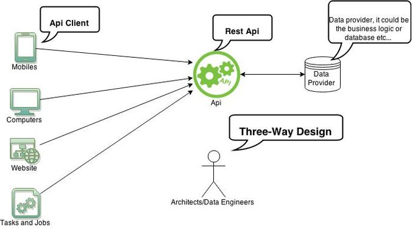
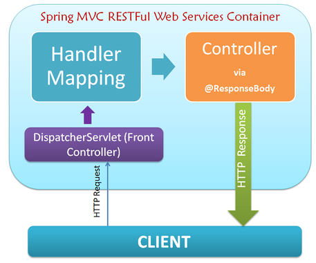

# Création d'une API REST avec Spring pour retourner du JSON

   

Notre serveur d'application attend les requêtes des clients (navigateurs ou autres). Le serveur renvoie une réponse au format **JSON**.

## Principe de fonctionnement

   

Le serveur d'application analyse les requêtes, les traite, puis transforme la réponse pour la renvoyer au format **HTTP**.

## Exemple simple avec un objet **Pilote**

Faites comme pour les projets précédents, utilisez **SpringInitializr** et créez un projet web `springdemo03`.

### Créer la classe **Pilote** et copier le code ci-dessous

```java
package fr.bouget.model;

import java.io.Serializable;

public class Pilote implements Serializable {
	private static final long serialVersionUID = 1L;

	private int id;
	private String nom;
	private String site;

	public Pilote() {super();}

	/**
	 * Constructeur
	 * @param id
	 * @param nom
	 * @param site
	 */
	public Pilote(int id, String nom, String site) {
		super();
		this.id = id;
		this.nom = nom;
		this.site = site;
	}


	/**
	 * @return the id
	 */
	public int getId() {
		return id;
	}

	/**
	 * @param id the id to set
	 */
	public void setId(int id) {
		this.id = id;
	}

	/**
	 * @return the nom
	 */
	public String getNom() {
		return nom;
	}

	/**
	 * @param nom the nom to set
	 */
	public void setNom(String nom) {
		this.nom = nom.toUpperCase();
	}

	/**
	 * @return the site
	 */
	public String getSite() {
		return site;
	}

	/**
	 * @param site the site to set
	 */
	public void setSite(String site) {
		this.site = site.toUpperCase();;
	}

	/* (non-Javadoc)
	 * @see java.lang.Object#toString()
	 */
	@Override
	public String toString() {
		return "Pilote : "+this.getId()+ " "+this.getNom()+ " "+this.getSite();
	}
}

```

Voici la classe **Controller** :

```java
/**
 * 
 */
package fr.bouget.spring.restapi.springdemo03.controller;

import java.util.ArrayList;
import java.util.List;

import org.springframework.web.bind.annotation.GetMapping;
import org.springframework.web.bind.annotation.RequestMapping;
import org.springframework.web.bind.annotation.RestController;

import fr.bouget.spring.restapi.springdemo03.bean.Pilote;

/**
 * @author Philippe
 *
 */
@RestController
@RequestMapping("/demo3")
public class PiloteController  {
	
	private List<Pilote> liste = new ArrayList<>();
	
	public PiloteController()
	{
		Pilote p = new Pilote(1,"Josselin","Montreuil");
		Pilote p2 = new Pilote(2,"Philippe", "Paris");
		Pilote p3 = new Pilote(3, "Anissa", "Marseille");
		this.liste.add(p);
		this.liste.add(p2);
		this.liste.add(p3);
	}
	
	@GetMapping("/pilotes")
	public List<Pilote> getAll()
	{
		return this.liste;
		
	}

}

```

> Cette classe implémente une méthode **getAll()** qui retourne une liste contenant une liste de 3 pilotes codés en dur dans le constructeur du Contrôleur (la prochaine étape consistera à récuperer des données dans une base MySQL).
> L'annotation **@GetMapping("/pilotes")** va associer la méthode **getAll()** au point d'entrée (l'url) : `/pilotes`

### Tester votre API Web JSON

- Saisissez l'url suivante : http://localhost:8080/demo3/pilotes

Et voici ce que vous devez obtenir dans votre navigateur :

```json
[

    {
        "id": 1,
        "nom": "Josselin",
        "site": "Montreuil"
    },
    {
        "id": 2,
        "nom": "Philippe",
        "site": "Paris"
    },
    {
        "id": 3,
        "nom": "Anissa",
        "site": "Marseille"
    }

]

```

### Conclusion

- Facile à déployer
- Vous savez envoyer des données au format JSON
