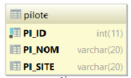

# SpringBoot et JDBC

## Création d'un projet Spring-JDBC avec Spring Initializr

Vous nommerez votre projet : **springdemo04**.

Pour le moment, ce projet reste une application dite **standalone** java-jdbc-mysql (ce n'est pas du web !) mais cela ne change pas grand chose pour la suite !

Nous allons respecter le Design pattern **DAO** (`Data Access Object`) pour cet exemple. Nous aurons donc les classes suivantes :

**PiloteDao.java**     : Interface qui implémente les méthodes   
**PiloteDaoImpl.java** : Classe qui implémente l'interface PiloteDao (code les méthodes)   
**Pilote.java**        : Classe qui correspond à l'entité manipulée (table Pilote de bd-avion)   
**Demo04Application**  : classe spécifique qui lance l'application et exécute des commandes grâce à l'implémentation de l'interface **CommandLineRunner**.

Faites comme pour les projets **démos** précédents an ajoutant les dépendances appropriées :

- spring-boot-starter-jdbc
- mysql-connector-java

Dans le répertoire **src/main/resources**, vous avez un fichier nommé **application.properties** dans lequel vous allez ajouter les lignes suivantes pour faire le lien avec la base de données avion :

```java
# ===============================
# base de données MySQL
# ===============================
spring.datasource.url=jdbc:mysql://localhost:3306/bd-avion?createDatabaseIfNotExist=true&useSSL=false&zeroDateTimeBehavior=CONVERT_TO_NULL&serverTimezone=UTC
spring.datasource.username=test
spring.datasource.password=test
spring.datasource.driver-class-name=com.mysql.cj.jdbc.Driver
# ==============================
# log
# ==============================
logging.level.root=INFO
logging.file=d:/data/log-springdemo04.log
logging.level.org.springframework.jdbc.core.JdbcTemplate=debug
# ===============================
# JPA / HIBERNATE
# ===============================
## spring.jpa.show-sql=true
## spring.jpa.hibernate.ddl-auto=update
## spring.jpa.properties.hibernate.dialect = org.hibernate.dialect.MySQL5InnoDBDialect
# ===============================
# Permet exécuter le data.sql si besoin, nous verrons cela ultérieurement.
# ===============================
## spring.datasource.initialization-mode=always
  ```

## Classe persistante **Pilote**



idem que dans **springdemo03**

## Application sans Controleur

Modifier la classe **Demo04Application.java** en implémentant l'interface **CommandLineRunner** qui permet d'exécuter du code automatiquement au lancement de l'application java SpringBoot.

## Code des classes et interfaces

### Pilote.java

```java
package fr.bouget.spring.jdbc.springdemo04.model;

import java.io.Serializable;

public class Pilote implements Serializable {
	private static final long serialVersionUID = 1L;

	private int id;
	private String nom;
	private String site;

	public Pilote() {super();}

	/**
	 * Constructeur
	 * @param id
	 * @param nom
	 * @param site
	 */
	public Pilote(int id, String nom, String site) {
		super();
		this.id = id;
		this.nom = nom;
		this.site = site;
	}


	/**
	 * @return the id
	 */
	public int getId() {
		return id;
	}

	/**
	 * @param id the id to set
	 */
	public void setId(int id) {
		this.id = id;
	}

	/**
	 * @return the nom
	 */
	public String getNom() {
		return nom;
	}

	/**
	 * @param nom the nom to set
	 */
	public void setNom(String nom) {
		this.nom = nom.toUpperCase();
	}

	/**
	 * @return the site
	 */
	public String getSite() {
		return site;
	}

	/**
	 * @param site the site to set
	 */
	public void setSite(String site) {
		this.site = site.toUpperCase();;
	}

	/* (non-Javadoc)
	 * @see java.lang.Object#toString()
	 */
	@Override
	public String toString() {
		return "Pilote : "+this.getId()+ " "+this.getNom()+ " "+this.getSite();
	}
}
```
### PiloteDAO.java

```java
package fr.bouget.spring.jdbc.springdemo04.dao;

import java.util.List;
import fr.bouget.spring.jdbc.springdemo04.model.Pilote;

/**
 * @author Philippe
 *
 */
public interface PiloteDao {

	public List<Pilote> findByNom (String nom);
	public List<Pilote> findAll();
	public void addPilote(Pilote pilote);
	public void removePilote(Pilote pilote);
	public void updatePilote(Pilote pilote);
}

```

### PiloteDaoImpl.java

Cette classe intégre une classe statique privée **PiloteMapper** qui implémente l'interface **RowMapper**. Nous aurions pu la mettre à l'extérieur mais elle n'a d'utilité qu'à cet endroit !

```java
package fr.bouget.spring.jdbc.springdemo04.dao;

import java.sql.ResultSet;
import java.sql.SQLException;
import java.text.MessageFormat;
import java.util.List;

import org.slf4j.Logger;
import org.slf4j.LoggerFactory;
import org.springframework.beans.factory.annotation.Autowired;
import org.springframework.beans.factory.annotation.Qualifier;
import org.springframework.jdbc.core.JdbcTemplate;
import org.springframework.jdbc.core.RowMapper;
import org.springframework.stereotype.Component;

import fr.bouget.spring.jdbc.springdemo04.Demo04Application;
import fr.bouget.spring.jdbc.springdemo04.model.Pilote;

/**
 * @author Philippe
 *
 */
@Component
@Qualifier("piloteDao")
public class PiloteDaoImpl implements PiloteDao {

	private static final Logger log = LoggerFactory.getLogger(Demo04Application.class);

	@Autowired
	private JdbcTemplate jdbcTemplate;


	/**
	 * Méthode pour rechercher les pilotes par NOM
	 * @param nom
	 * @return
	 */
	@Override
	public List<Pilote> findByNom (String nom){
		log.info(MessageFormat.format("Méthode findByNom() => rechercher un pilote dont le nom est {0}:", nom));

		return jdbcTemplate.query(
				"SELECT * FROM pilote WHERE PI_NOM = ?", new Object[] {nom}, new PiloteMapper());
	}
	/**
	 * Méthode pour rechercher tous les pilotes de la table
	 * @return
	 */
	@Override
	public List<Pilote> findAll()
	{
		log.info("Méthode findAll() => recherche tous les pilotes dans la table Pilotes");
		return jdbcTemplate.query("SELECT PI_ID, PI_NOM, PI_SITE FROM pilote", new PiloteMapper());
	}

	@Override
	public void addPilote(Pilote pilote) {
		// ... à vous de compléter le code

	}

	@Override
	public void removePilote(Pilote pilote) {
		// ... à vous de compléter le code

	}
	@Override
	public void updatePilote(Pilote pilote) {
		// ... à vous de compléter le code

	}


	/**
	 * Classe privée interne
	 * avec méthode pour le Mapping des objets de type Pilote
	 * @author Philippe
	 *
	 */
	private static final class PiloteMapper implements RowMapper<Pilote> {

		public Pilote mapRow(ResultSet resultSet, int rowNum) throws SQLException {
			Pilote p = new Pilote();
			p.setId(resultSet.getInt("PI_ID"));
			p.setNom(resultSet.getString("PI_NOM"));
			p.setSite(resultSet.getString("PI_SITE"));
			return p;
		}
	}

}

```

### Demo04Application.java

```java
package fr.bouget.spring.jdbc.springdemo04;


import java.util.List;

import org.springframework.beans.factory.annotation.Autowired;
import org.springframework.boot.CommandLineRunner;
import org.springframework.boot.SpringApplication;
import org.springframework.boot.autoconfigure.SpringBootApplication;
import org.springframework.context.annotation.ComponentScan;

import fr.bouget.spring.jdbc.springdemo04.dao.PiloteDao;
import fr.bouget.spring.jdbc.springdemo04.model.Pilote;

@SpringBootApplication
@ComponentScan(basePackages = { "fr.bouget.spring.jdbc.springdemo04" })
public class Demo04Application implements CommandLineRunner {

	@Autowired
	private PiloteDao piloteDao;

	/**
	 * méthode main()
	 * @param args
	 */
	public static void main(String[] args) {
		SpringApplication.run(Demo04Application.class, args);
	}

	@Override
	public void run(String... args) throws Exception {

		// on suppose que la table Pilote existe et qu'elle contient des enregistrements.
		// petit test
		List<Pilote> pilotes = piloteDao.findAll();
		for (Pilote pilote : pilotes) {
			System.out.println(pilote);
		}

		// on recherche élodie
		List<Pilote> elodies = piloteDao.findByNom("ELODIE");
		for (Pilote pilote : elodies) {
			System.out.println(pilote);
		}
	}
}

```

### Petit travail à faire

Compléter le code des méthodes ci-dessous :

```java
	@Override
	public void addPilote(Pilote pilote) {
		// ... à vous de compléter le code

	}

	@Override
	public void removePilote(Pilote pilote) {
		// ... à vous de compléter le code

	}
	@Override
	public void updatePilote(Pilote pilote) {
		// ... à vous de compléter le code

	}
```

Et ajouter le code suivant dans votre méthode **main()** à la suite du code existant :

```java
// ajouter pilote
Pilote p= new Pilote();
p.setNom("Philippe");
p.setSite("Paris");
p.setId(piloteDao.addPilote(p));
System.out.println("Ajout de Philippe -  Paris : "+p);

// modifieer le site du pilote p avec Avignon au lieu de Paris
System.out.println("Modification du Pilote "+p.getNom()+" pour le nouveau site Avignon");
p.setSite("Avignon");
piloteDao.updatePilote(p);

// ajouter un pilote puis le détruire
Pilote toto= new Pilote();
toto.setNom("Toto");
toto.setSite("Lisbonne");
toto.setId(piloteDao.addPilote(toto));
System.out.println("Ajout de Toto - Lisbonne : "+toto);

// détruire le pilote dans la base !
piloteDao.removePilote(toto);
```

## Développer une application **springdemo05**

>Elle doit permettre d'afficher la liste des pilotes au format JSON dans un navigateur. _Que devez-vous transformer ?_

## Développer le back de votre application fil-rouge

- Développer une seule fonctionnalité permettant de renvoyer une liste d'objets quelconques.
- Afficher ces objets au format JSON dans votre navigateur.