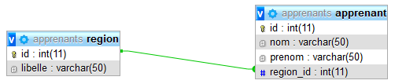

# Spring et Hibernate : Démonstration et initiation

Voici un exemple d'application qui permet de simplifier l'accès aux tables d'une base de données grâce à des annotations Hibernate. 

Schéma proposé

2 tables reliées par les relations suivantes :

- une Région possède plusieurs Apprenants
- un Apprenant est effectée à une et une seule Région.

## Modèle Entité Relation de MySQL



## Utilisez Spring Initializr pour le projet **spring-hibernate**

### Dans votre package Model

#### Classe **Apprenant**

```java
package fr.bouget.demo.springhibernate.model;

import java.io.Serializable;

import javax.persistence.Column;
import javax.persistence.Entity;
import javax.persistence.FetchType;
import javax.persistence.Id;
import javax.persistence.ManyToOne;

import com.fasterxml.jackson.annotation.JsonIgnoreProperties;

@Entity
@JsonIgnoreProperties({"hibernateLazyInitializer", "handler"})
public class Apprenant implements Serializable {

	private static final long serialVersionUID = 1L;


	private Integer id;
	private String nom;
	private String prenom;
	private Region region;

	/**
	 * Constructeur sans arguments
	 */
	public Apprenant() {}

	public Apprenant(String nom, String prenom, Region region) {
		super();
		this.nom = nom;
		this.prenom = prenom;
		this.region = region;
	}

	@Id
	@Column(name="id")
	public Integer getId() {
		return id;
	}

	public void setId(Integer id) {
		this.id = id;
	}

	@Column(length = 50, nullable = false)
	public String getNom() {
		return nom;
	}

	public void setNom(String nom) {
		this.nom = nom;
	}

	@Column(length = 50, nullable = false)
	public String getPrenom() {
		return prenom;
	}

	public void setPrenom(String prenom) {
		this.prenom = prenom;
	}

	@ManyToOne(fetch = FetchType.EAGER)
	public Region getRegion() {
		return region;
	}

	public void setRegion(Region region) {
		this.region = region;
	}

	@Override
	public String toString() {
		return this.nom +" "+ this.prenom + " "+this.region;
	}
}

```

#### Classe **Region**

```java
package fr.bouget.demo.springhibernate.model;

import java.io.Serializable;
import java.util.ArrayList;
import java.util.List;

import javax.persistence.Column;
import javax.persistence.Entity;
import javax.persistence.FetchType;
import javax.persistence.Id;
import javax.persistence.OneToMany;

import com.fasterxml.jackson.annotation.JsonIgnore;

@Entity
public class Region implements Serializable {
	private static final long serialVersionUID = 1L;

	private Integer id;
	private String libelle;
	private List<Apprenant> apprenants;

	public Region() { this(0);}

	public Region(Integer id) {
		this.id = id;
		this.apprenants = new ArrayList<>();
	}

	@Id
	@Column(name="id")
	public Integer getId() {
		return this.id;
	}

	public void setId(Integer id) {
		this.id = id;
	}

	@Column(length = 50)
	public String getLibelle() {
		return this.libelle;
	}

	public void setLibelle(String libelle) {
		this.libelle = libelle;
	}

	@OneToMany(targetEntity=Apprenant.class, mappedBy="region", fetch = FetchType.EAGER)
	@JsonIgnore
	public List<Apprenant> getApprenants() {
		return this.apprenants;
	}

	public void setApprenants(List<Apprenant> apprenants) {
		this.apprenants = apprenants;
	}
	/* (non-Javadoc)
	 * @see java.lang.Object#toString()
	 */
	@Override
	public String toString() {
		return this.libelle;
	}
}

```

### Package **repository**

#### Interface **ApprenantRepository**

```java
package fr.bouget.demo.springhibernate.repository;

import org.springframework.data.jpa.repository.JpaRepository;
import org.springframework.stereotype.Repository;

import fr.bouget.demo.springhibernate.model.Apprenant;

/**
 * Interface pour l'entity Apprenant
 * 
 */
@Repository
public interface ApprenantRepository  extends JpaRepository<Apprenant, Integer> {

	// rien à  ajouter car toutes les fonctionnalités CRUD sont existantes dans la 
	// classe JpaRepository... c'est cool !) 
}

```

#### Interface **RegionRepository**

```java
package fr.bouget.demo.springhibernate.repository;

import org.springframework.data.jpa.repository.JpaRepository;
import org.springframework.stereotype.Repository;

import fr.bouget.demo.springhibernate.model.Region;

@Repository
public interface RegionRepository extends JpaRepository<Region, Integer>{

	// Rien à faire le crud est implémenté

}

```

### Classe **Controller**

```java
package fr.bouget.demo.springhibernate.controleur;

import java.text.MessageFormat;
import java.util.List;

import org.slf4j.Logger;
import org.slf4j.LoggerFactory;
import org.springframework.beans.factory.annotation.Autowired;
import org.springframework.web.bind.annotation.GetMapping;
import org.springframework.web.bind.annotation.PathVariable;
import org.springframework.web.bind.annotation.RequestMapping;
import org.springframework.web.bind.annotation.RestController;

import fr.bouget.demo.springhibernate.SpringHibernateApplication;
import fr.bouget.demo.springhibernate.model.Apprenant;
import fr.bouget.demo.springhibernate.model.Region;
import fr.bouget.demo.springhibernate.repository.ApprenantRepository;
import fr.bouget.demo.springhibernate.repository.RegionRepository;

/**
 * @author Philippe
 *
 */
@RestController
@RequestMapping("/api")
public class Controleur {

	private static final Logger log = LoggerFactory.getLogger(SpringHibernateApplication.class);

	@Autowired
	private ApprenantRepository apprenantRepository;
	@Autowired
	private RegionRepository regionRepository;

	@GetMapping("/apprenants")
	public List<Apprenant> getAllApprenants(){
		List<Apprenant> listeApprenants = null;
		try {
			listeApprenants = apprenantRepository.findAll();
		} catch (Exception e) {

			log.info(MessageFormat.format("Méthode getAllApprenants() => renvoie la liste des apprenants \n {0}:", e.getMessage()));

		}

		return listeApprenants;
	}

	@GetMapping("/regions")
	public List<Region> getAllRegions(){
		List<Region> listeRegions = null;
		try {
			listeRegions = regionRepository.findAll();
		} catch (Exception e) {
			log.info(MessageFormat.format("Méthode getAllRegions() => renvoie la liste des régions \n {0}:", e.getMessage()));

		}

		return listeRegions;
	}

	@GetMapping("/apprenant/{id}")
	public Apprenant getApprenant(@PathVariable("id") Integer id){
		Apprenant apprenant = null;

		try {
			apprenant =apprenantRepository.getOne(id);
		} catch (Exception e) { 
			log.info(MessageFormat.format("Méthode getApprenant() => renvoie un apprenant par son id \n {0}:", e.getMessage()));

		}
		// pour info, il existe une méthode pour chaque attribut comme getApprenantById()
		return apprenant;
	}

}

```

#### fichier **applications.properties** dans resources

```java
# ===============================
# base de données MySQL
# ===============================
spring.datasource.url=jdbc:mysql://localhost:3308/apprenants?createDatabaseIfNotExist=true&useSSL=false&zeroDateTimeBehavior=CONVERT_TO_NULL&serverTimezone=UTC
spring.datasource.username=root
spring.datasource.password=ton mot de passe
spring.datasource.driver-class-name=com.mysql.cj.jdbc.Driver
# ==============================
# log
# ==============================
logging.level.root=INFO
logging.file=d:/data/log-java-springboot-apprenant-jpa-hibernate.log
logging.level.org.springframework.jdbc.core.JdbcTemplate=debug
# ===============================
# JPA / HIBERNATE
# ===============================
spring.jpa.show-sql=true
spring.jpa.hibernate.ddl-auto=create-drop
spring.jpa.properties.hibernate.dialect = org.hibernate.dialect.MySQL5InnoDBDialect
# ===============================
# Permet exécuter le data.sql
# ===============================
spring.datasource.initialization-mode=always
#================================
spring.jackson.serialization.fail-on-empty-beans=false
```

### les données pour le test

Ils sont dans le projet SpringBoot dans le dossier `resources` si ce lien ne fonctionne pas. [data.sql](sql/data.sql)


### Exemples d'utilisation

Voici ce que vous devez obtenir dans votre navigateur après avoir saisi l'url suivante : `http://localhost:8080/api/regions`

```json
[

    {
        "id": 1,
        "libelle": "Ile de France"
    },
    {
        "id": 2,
        "libelle": "Nantes"
    },
    {
        "id": 3,
        "libelle": "Bordeaux"
    },
    {
        "id": 4,
        "libelle": "Toulouse"
    }

]
```

>Avec Josselin vous allez voir comment récupérer vos données JSON pour les afficher dans votre page web html !