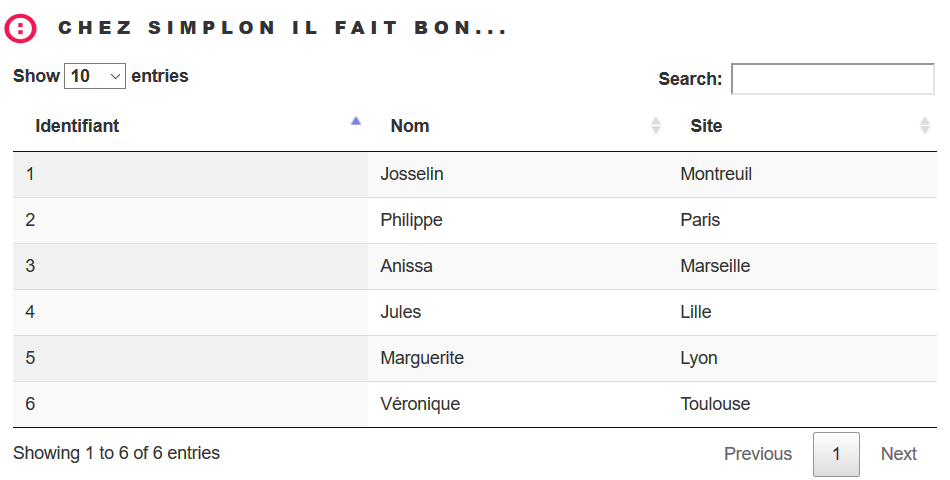

# JSON et DataTable



Dans cet exemple, on va juste récupérer une liste d'objets **Pilote** instancier dans le Controleur. 
Cette liste est appelée depuis JavaScript avec **AJAX** et affichée dans une DataTable dans une page HTML.
Cela permet de faire le lien entre un Back (SpringBoot) et un Front (JavaScript).

La différence avec les autres projets concerne la mise en place d'une page HTML, JS et éventuellement CSS dans le répertoire des resources `static`.

Créez votre projet web **springpratique01** avec `Spring Initialzr` comme pour les précédents.

Voici les dépendances que vous devrez avoir dans votre `build.gradle` :

```java
'org.webjars:jquery:2.2.4'
"org.webjars:bootstrap:3.3.7"
'org.springframework.boot:spring-boot-starter-web'
'org.springframework.boot:spring-boot-starter-tomcat'
```

## Classe **Pilote**

```java
package fr.bouget.spring.springpratique01.bean;

import java.io.Serializable;

public class Pilote implements Serializable {
	private static final long serialVersionUID = 1L;
	
	private int id;
	private String nom;
	private String site;

	public Pilote() {super();}
	
	/**
	 * Constructeur
	 * @param id
	 * @param nom
	 * @param site
	 */
	public Pilote(int id, String nom, String site) {
		super();
		this.id = id;
		this.nom = nom;
		this.site = site;
	}
	
	
	/**
	 * @return the id
	 */
	public int getId() {
		return id;
	}

	/**
	 * @param id the id to set
	 */
	public void setId(int id) {
		this.id = id;
	}

	/**
	 * @return the nom
	 */
	public String getNom() {
		return nom;
	}

	/**
	 * @param nom the nom to set
	 */
	public void setNom(String nom) {
		this.nom = nom.toUpperCase();
	}

	/**
	 * @return the site
	 */
	public String getSite() {
		return site;
	}

	/**
	 * @param site the site to set
	 */
	public void setSite(String site) {
		this.site = site.toUpperCase();;
	}

	/* (non-Javadoc)
	 * @see java.lang.Object#toString()
	 */
	@Override
	public String toString() {
		return "Pilote : "+this.getId()+ " "+this.getNom()+ " "+this.getSite();
	}
}
```

## Classe **PiloteController**

```java
package fr.bouget.spring.restapi.springdemo03.controller;

import java.util.ArrayList;
import java.util.List;

import org.springframework.web.bind.annotation.GetMapping;
import org.springframework.web.bind.annotation.RequestMapping;
import org.springframework.web.bind.annotation.RestController;

import fr.bouget.spring.restapi.springdemo03.bean.Pilote;

/**
 * @author Philippe
 *
 */
@RestController
@RequestMapping("/demo3")
public class PiloteController  {
	
	private List<Pilote> liste = new ArrayList<>();
	
	public PiloteController()
	{
		Pilote p = new Pilote(1,"Josselin","Montreuil");
		Pilote p2 = new Pilote(2,"Philippe", "Paris");
		Pilote p3 = new Pilote(3, "Anissa", "Marseille");
		this.liste.add(p);
		this.liste.add(p2);
		this.liste.add(p3);
	}
	
	@GetMapping("/pilotes")
	public List<Pilote> getAll()
	{
		return this.liste;
		
	}

}
```

## Fichier **pilotes.js**

Ici, j'ai utilisé Ajax mais vous pouvez utiliser JQuery.

```javascript
// Juste remplir le tableau html avec la liste des pilotes
$(document).ready( function () {
	 var table = $('#tablePilotes').DataTable({
			"sAjaxSource": "/api/pilotes",
			"sAjaxDataProp": "",
			"order": [[ 0, "asc" ]],
			"aoColumns": [
			    	{ "mData": "id"},
			    	{ "mData": "nom" },
			    	{ "mData": "site" }
			]
	 })
});
```

## Fichier **index.html**

```html
/<!DOCTYPE html>
<html>
<head>
<title>Spring - JavaScript</title>
<meta http-equiv="Content-Type" content="text/html; charset=UTF-8" />
<link rel="stylesheet" href="css/main.css" />
<link rel="stylesheet" href="https://maxcdn.bootstrapcdn.com/bootstrap/3.3.7/css/bootstrap.min.css">
<link rel="stylesheet" href="https://cdn.datatables.net/1.10.12/css/jquery.dataTables.min.css">
<title>teste</title>

</head>
<body>
	<header id="header">
		<div class="inner">
			<a href="index.html" class="logo"> <span class="symbol"></span><span
				class="title">Chez Simplon il fait bon...</span>
			</a>
		</div>
	</header>

<!-- ICI - ultérieurement ajout d'un formulaire avec CRUD -->

<article class="col-sm-6 col-xs-12" id="piloteList">
	<table id="tablePilotes" class="display">
		<thead>
			<tr>
				<th>Identifiant</th>
				<th>Nom</th>
				<th>Site</th>
			</tr>
		</thead>
	</table>
</article>	
<script	src="https://ajax.googleapis.com/ajax/libs/jquery/3.1.1/jquery.min.js"></script>
<script	src="https://maxcdn.bootstrapcdn.com/bootstrap/3.3.7/js/bootstrap.min.js"></script>
<script	src="https://cdn.datatables.net/1.10.12/js/jquery.dataTables.min.js"></script>
<script src="/js/pilotes.js"></script>
</body>
</html>
```

Pour le logo, mettez ce que vous voulez à la place de `src="image/logo-simplon.png"`

## Y a plus qu'à tester