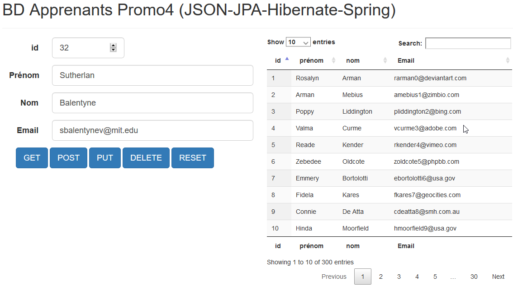

# SpringBoot

## Initiation par la pratique

[Découverte du framework avec Spring Initialzr](1-springboot.md)

## Spring et REST (JSON)

[Créer une API Rest](2-rest.md)

## Spring et JDBC avec JdbcTemplate

[Mettre en place une connection JDBC](3-jdbc.md)

## Spring et JPA (plus facile)

[Rapide initiation au Mapping avec Hibernate](4-mapping.md)

## Datatable et Json (Back et Front JS/HTML)

[Datatable et json](6-datatable-json.md)

## Projets et solutions sur le Git

Vous trouverez sur ce GitHub des projets démos pratiques dont le `springpratique02` qui permet de comprendre
le lien entre JSON, JPA, Hibernate et SpringBoot avec une table **Apprenant**

[Récupérer les projets Eclipse-Gradle](https://github.com/pbougetsimplon/springdemos)

## Spring autres exercices

[Application à développer avec SpringBoot](5-pratiques.md)

### 10 raisons de se mettre à Spring

[Partie 1](http://blog.ellixo.com/2015/06/08/10-raisons-de-se-mettre-a-Spring-Boot-1ere-partie.html)

[Partie 2](http://blog.ellixo.com/2015/06/26/10-raisons-de-se-mettre-a-Spring-Boot-2eme-partie.html)

### Les guides

[https://spring.io/guides](https://spring.io/guides)

### Référence

[https://docs.spring.io/spring-boot/docs/2.1.0.RELEASE/reference/htmlsingle/](https://docs.spring.io/spring-boot/docs/2.1.0.RELEASE/reference/htmlsingle/)

## [Retour](../README.md)
