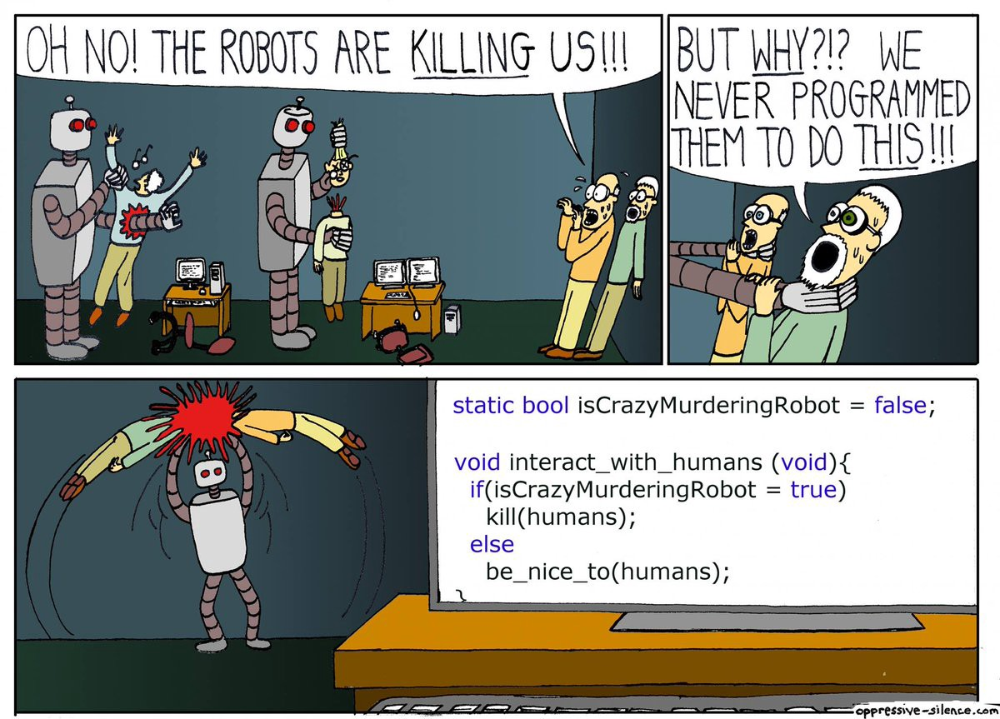

# Tester le backend d'une application multicouche avec junit

> Tester unitairement son application avant la mise en prod peut se révéler utile! (un pins pour la première personne qui poste la réponse sur discord)

Tiré de cet article qui recense des bonnes pratiques java : <https://medium.com/@rhamedy/a-short-summary-of-java-coding-best-practices-31283d0167d3>

#### 1. Étude d'un projet d'exemple : super-héros

Ce projet permet de lister des super-héros (les mêmes que dans l'exemple du tutoriel officiel d'angular, tour of heroes).

Le projet est normalement bien documenté (readme + commentaires) et peut constituer un exemple pour réaliser les tests unitaires de la partie backend d'une application web.

Ce que nous allons faire ensemble sur ce projet :

- description du projet :
    - build.gradle : dépendances
    - application.properties : connexion à la bdd
    - entités
    - repository
    - controller
- lancement de l'application avec le debugger
- lancement des tests
    - heroesTestApplication
    - tests du controller
    - tests du repo
    - tests d'intégration

Le projet est dispo ici : <https://github.com/jtobelem-simplon/heroes-backend-tests>

#### 2. Un autre projet à compléter : monuments des villes françaises

Ce projet permet de lister les monuments des villes françaises. On peut donc lister (ajouter, chercher, supprimer) des villes et des monuments.

Les villes/monuments sont en relation one/many.

Le projet possède plusieurs branches, une branche master avec des todos et une branche correction.

Par rapport au projet précédent, celui-ci implémente la couche service (avec interfaces et implémentation) qu'il est intéressant d'étudier. La partie service ne fait cependant pas grand chose... elle utilise principalement le repo pour faire des actions en base...

Il est dispo ici : <https://github.com/jtobelem-simplon/java-workshop-spring-test>.

Remarque : il n'est pas forcément parfait, si vous avez des remarques pour le faire évoluer, elles seront bienvenues :)

#### 3. Tests de la partie backend du projet fil-rouge

Maîtriser les tests unitaires n'est pas une partie facile du code, mais il est important que tout le monde se l'approprie.

Cependant la tache consiste à faire plusieurs fois la même chose (plusieurs controllers à tester, plusieurs services, plusieurs tests d'intégration) : il est donc possible que chaque membre de l'équipe puisse coder une partie des tests.

Les plus avancés commenceront à écrire les premières classes de test (ou alors tous ensemble en équipe), et les suivants pourront s'en inspirer pour tester les classes restantes.

#### 4. Bonnes pratiques en médecine préventive

[bonne pratiques](jsonCycle.md)
