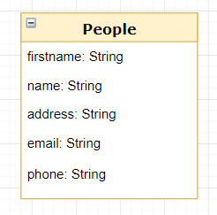

# java-springboot-simplecrud

Un serveur REST ultra basique créé avec SpringBoot qui utilise une base de données H2 (intégrée au serveur d'application) via JPA/Hibernate.

## Modèle de données

Le code de ce projet permet la mise à disposition des informations de la classe suivante :

## Présentation de l'API REST

Ce projet met à disposition l'API suivante :

 * **GET** /api/people : liste les information de l'ensemble des instances de People.
 * **GET** /api/people/[id] : renvoie les informations d'une instance d'objet People avec son id.
 * **POST** /api/people : crée une nouvelle instance de People avec les informations fournies.
 * **PUT** /api/people/[id] : met à jour l'instance de People correspondant à l'id fourni avec les informations fournies.
 * **DELETE** /api/people/[id] : supprime l'instance de People correspondant à l'id fourni.

## Compilation et exécution

Dans un terminal, se placer dans le répertoire du projet et lancer les commandes ci-dessous.

**Compilation :**  
<code>mvnw clean install</code>

**Lancement du serveur :**  
<code>mvnw spring-boot:run</code>
