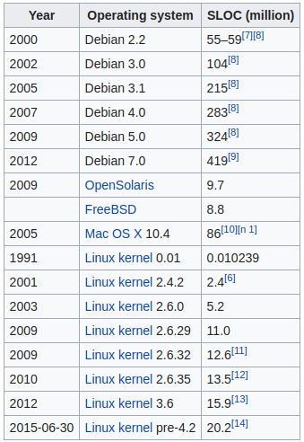

# Présentation brève de Git et GitHub

Les projets informatiques offrent l'occasion comme peu d'autres domaines de collaborer à plusieurs sur un même projet. Pour vous donner une idée de la complexité des projets, il existe une métrique, le **SLOC** !

>SLOC : Ligne de code source (**SLOC** en anglais) est une métrique logicielle servant à mesurer la taille d’un programme informatique en dénombrant le nombre de lignes de son code source.

Sources : [sur wiki](https://en.wikipedia.org/wiki/Source_lines_of_code)

Le développement des OS sont des projets complexes qui impliquent de nombreux intervenants.

Les logiciels de contrôle de version tels que **Git** ou **SVN** permettent de conserver un historique des changements afin de pouvoir revenir à des états antérieurs en cas de problème. Ils permettent aussi de gérer la collaboration en donnant des fonctionnalités de fusion si des  fichiers identiques sont modifiés par plusieurs personnes en même temps.

## A. Mise en pratique

1. Installer Git sur votre ordinateur
2. Créer un compte sous GitHub avec votre email perso (gmail de préférence)
3. Intégrer Git à votre IDE
4. Création d'un repo local et envoi en *remote* sur GitHub
5. Cloner un repo distant (remote) existant
6. Simuler un projet à plusieurs (si cela est bien entendu possible)

**[Rendez-vous ici pour la pratique](exercices.md)**.

## B. Ressources

Une bonne introduction des commandes de base, des généralités sur git et github :
[https://guides.github.com/introduction/git-handbook/](https://guides.github.com/introduction/git-handbook/)

**Git** est le logiciel de versionning actuellement le plus utilisé par les developpeur.euse.s. L'autre grand nom est **SVN** ou **TortoiseSVN** *(*Subversion*): [stackoverflow -> why is git better than subversion](https://stackoverflow.com/questions/871/why-is-git-better-than-subversion).
