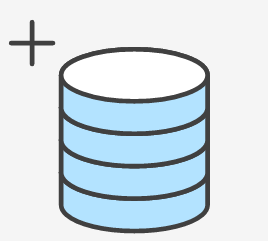

# Exercices pratiques avec Git/GitHub



## Installation

- Pour linux, rien à faire :)
- Pour windows, vous pouvez installer Git avec GitBash et Git GUI depuis ce lien [https://gitforwindows.org/](https://gitforwindows.org/)

Configurer votre compte :

>Précisez votre prénom et votre nom ou un pseudo ansi que votre adresse email.

```bash
git config --global user.name "John Rambo"
git config --global user.email "john.rambo@gmail.com"
```

## Exercice 1 : Commandes de base (en local)

1) Créer un repository (en local)

```bash
cd desktop
git init demo
cd demo
ls -al
```

*remarque : `ls -al` est la commande linux pour lister le contenu du répertoire. Pour windows, on peut utiliser `dir`. Sinon, avec GitBash, vous pouvez utiliser les mêmes commandes que sous Linux*

> `git init` va créer un répertoire nommé *demo*. Ce répertoire contient un répertoire caché nommé *.git* et qui contiendra l'historique local des différentes versions.

2) Créer un fichier


```bash
touch readme.md
git status
git add readme.md
git status
git commit -m 'ajoute le fichier readme.md'
git log
```

Détail :

> Créer le fichier avec la commande linux **touch nomDuFichier**, cela ne modifie rien au git status, il faut utiliser **git add**.

`git status` indique l'ensemble des différences avec *HEAD*

`git log` liste l'ensemble des commits réalisés.

3) Ajouter d'autres commits...

Ouvrir le fichier **readme.md** et le modifier en ajoutant le titre d'un projet, puis sauvegarder-le.

```bash
git status
git add readme.md
git status
git commit -m 'ajout du titre du projet'
git status
```

> Il faut ajouter les fichiers impactés après chaque modification avant de *commiter* (de valider notre changement).

> Chaque commande **commit** devrait être unitaire et impacter un changement précis.

Ou encore

```bash
git commit -a -m 'ajout du titre du projet'
```

> L'option **-a** permet d'ajouter à la zone (stage) tous les fichiers qui ont déjà été ajoutés précédemment et qui ont été modifiés ou supprimés, mais pas les fichiers qui n'ont jamais été ajoutés.

4) Revenir à un état antérieur

Dans le git log, regarder les 4 premiers caractères du commit auquel vous souhaitez accéder.

======= changer png ici ====


===== fin =========

Entrer la commande suivante :

>A utiliser avec précaution car son action est irréversible surtout si des fichiers sont indexés et en attentes de validation.

```bash
git reset --hard c60c
```

> Cette commande va effacer toutes les modifications faites après le commit dont le numéro commence par c60c.

[Un lien pour vous aider](https://www.atlassian.com/fr/git/tutorials/undoing-changes/git-reset) 

> Plus de détail ici : [stackoverflow -> how to revert a git repository to a previous commit]( https://stackoverflow.com/questions/4114095/how-to-revert-a-git-repository-to-a-previous-commit)   

## Exercice 2 : Placer un repo sur votre GitHub

Nous allons partir du repo local précédent et souhaitons que les commits soient enregistrés sur une machine distante. Celle-ci sera vue comme un `remote`.

1. Créer un repo sur github du même nom que celui de l'exercice 1.

2. Ajouter dans notre repo local une référence au repo distant. On l'appellera **origin**.


```bash
git remote add origin (repo location)
git remote -v
tree .git/refs
```

> L'emplacement du repo est qqch comme : ` https://github.com/pbouget/cours.git`.   
> On peut consulter la liste des remote associés à notre repo avec la commande **git remote -v**.

```bash
tree .git/refs
```

> Sous linux, on peut visualiser les remotes avec la commande **tree**

3. Envoyer une première modification sur le repo distant (remote) avec la commande **git push**

```bash
git push -u origin master
```

> **-u** est un raccourci pour **--set-upstream**, donc les prochaines fois, on pourra juste faire **git push**

4. Modifier le **readme** sur l'interface distante (donc sur GitHub) et récupérer les modifications distantes non encore présente en local.

```bash
git fetch
git diff master origin/master
git merge
```

> La commande **git diff** permet de comparer la branche locale master avec la branche master du remote origin   
> **fetch** permet de récupérer les modifications distantes. On peut ensuite les intégrer avec la commande **merge**.   
> **fetch + merge = pull**

5. Modifier à nouveau le readme.md sur l'interface distante en ajoutant 'remote' sur la dernière ligne et en local en ajoutant 'local' sur la dernière ligne. Tentez un *pull*... Régler les conflits.

```bash
git config --global core.editor "atom --wait"
```

> C'est assez pratique de configurer un editeur à utiliser avec git en cas de conflit. On peut le faire avec la commande précédente.   
> Plus de détails sur la résolution de conflits : [stackoverflow -> how to resolve merge conflicts](https://stackoverflow.com/questions/161813/how-to-resolve-merge-conflicts-in-git/163659#163659)

## Utiliser git avec un IDE

Un repo est un dossier qui contient un dossier caché nommé *.git*. Ce dossier contient l'historique des versions de vos fichiers.

Pour que votre IDE puisse gérer les fonctions de git, il faut ajouter le repo (donc qui contient le .git). L'ide verra alors naturellement les fichiers qui ont été ajoutés, modifiés ou supprimés et vous proposera de les synchroniser avec votre repo distant (sur GitHub ou GitLab généralement).

## Utiliser Git sans générer de conflit


Pour commencer avec git, nous allons faire en sorte de ne jamais générer de conflit (plus tard, vous n'aurez plus peur d'aller au "front", et au "back" aussi d'ailleurs ^^). Pour cela, si vous travaillez en équipe (sinon, il ne risque pas d'y avoir de conflit), nommez une des personnes **GitMaster**. C'est cette personne uniquement qui fera des **push**. Si vous avez des modifications à faire, il faudra lui envoyer vos fichiers modifiés.

Vous devrez aussi avoir une 2ème version du repo dans laquelle vous ne faites que des *pull*. **Si vous ne voulez pas avoir de conflit, ne faites pas de pull dans un repo que vous avez modifié.**

## Et maintenant, en équipe

Créez quatre équipes.

- nommez un *git master*
- choisissez un nom pour votre projet et créez ce projet sur github avec un *readme.md* vide
- chaque personne de l’équipe va sur son ordinateur dans un dossier de travail. On utilise ensuite `git clone` pour faire une copie locale du repo distant.

Ensuite chacun son tour :
- ajoute une rubrique dans le *readme.md* avec un titre, un texte, une image et un bout de code.
- envoie les modifications au git master

Après chaque modification :
- le git master averti toute l'équipe qu'il y a un pull en attente
- chaque membre de l'équipe fait un pull

> Plus de détail sur le markdown : [https://about.gitlab.com/handbook/product/technical-writing/markdown-guide/](https://about.gitlab.com/handbook/product/technical-writing/markdown-guide/)

Bah voilà, c'est trop facile Git !

