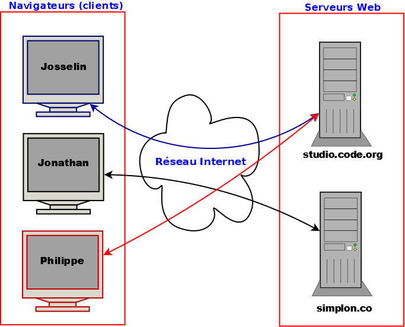
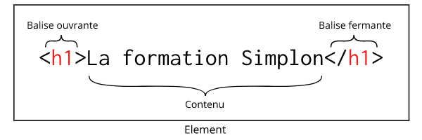
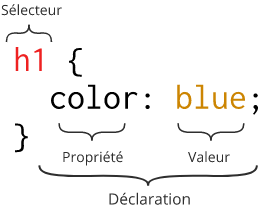
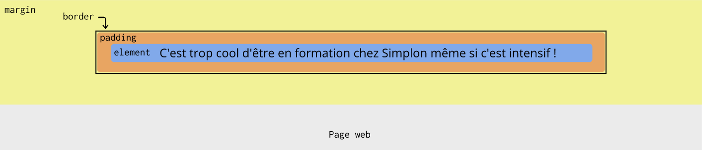

<center>
<H1>
Synthèse HTML & CSS
</H1>
</center>

# Introduction

*Internet* est un réseau public mondial reliant des ordinateurs entre eux. Il est constitué de serveurs et de clients.  
Le *web* (www) abréviation de World Wide Web, est une toile qui s'appuie sur le réseau internet.  
Pour cela le web utilise un protocole de communication nommé `HTTP` (`HTTPS` dans sa version sécurisée).

 * HTML signifie `HyperText Markup Language` : langage de balisage pour représenter des pages web
 * HTTPS signifie `HyperText Transfer Protocol Secure` : ajout d'une couche sécurisée de chiffrement avec SSL (Secure Socket Layer) ou TLS (Transport Layer  Security)

Un site web est un ensemble de documents consultables sur le web. Ces documents, appelés aussi pages web, sont reliés entre eux par des liens qui permettent de passer d’un document à un autre, d'ou le terme de liens `HyperText`.  
Par défaut, un site web contient un fichier *index.html* ou *index.htm*. Ce document est toujours ouvert lors du premier appel depuis un navigateur.   
Pour décrire ces documents, nous utilisons 3 langages :

- HTML (le fond)
- CSS (la mise en forme)
- javascript (langage permettant de rendre le site dynamique) ou TypeScript avec le framework Angular

# Fonctionnement

Dans l'exemple suivant, Josselin et Philippe saisissent l'adresse studio.code.org dans leur navigateur tandis que Jonathan rentre l'adresse simplon.co.



Chaque navigateur web cherche l'adresse physique du site demandé avec le protocole DNS(Domain Name System) en se basant sur l'URL (_simplon.co_ ou _studio.code.org_) fournie. Une fois l'URL transformée en adresse IP, le navigateur envoie une requête HTTP au serveur pour récupérer le contenu disponible à cette adresse. Si l'adresse est correcte alors le serveur renvoie le contenu dans le navigateur du client.

Pour info, le DNS est un service qui permet d'établir une correspondance entre un nom de domaine et une adresse IP(Internet Protocol). Il est plus facile de mémoriser un nom comme ***simplon.co** plutôt que l'adresse IP publique **83.142.149.227**

Une fois les ressources récupérées, le navigateur les interprète et utilise un moteur de rendu pour transformer le texte HTML et CSS afin d'afficher un résultat à l'écran.

## L'interprétation du contenu des pages Web

Ce qui est retourné par le site est interprété par le navigateur web.

Lorsque nous avons vu les bases du langage Java, nous avons compilé nos premiers programmes. Nous avons transformé des fichiers de code source `.java` en d'autres fichiers `.class` qui sont directement interprétables par la machine virtuelle Java.

Dans le cas des pages Web en HTML, pas besoin de compilation. En effet, le HTML est un langage interprété. Créer un fichier `index.html` à l'emplacement de votre choix sur votre PC et mettez-y le contenu suivant :

```html
<!DOCTYPE html>
<html>
  <head>
    <meta charset="utf-8">
    <title>Formation Simplon - Promo3 La Poste</title>
  </head>
  <body>
      <h1>Cette page est compréhensible par un navigateur web</h1>
    <p>Je suis en formation chez Simplon et j'adore faire la Java !</p>
  </body>
</html>
```

Maintenant, ouvrez ce fichier avec votre navigateur préféré (Google Chrome, Mozilla Firefox, ...). Vous remarquerez que son contenu s'affiche dans votre navigateur et vous n'avez pas eu besoin de le compiler. Le navigateur **interprète** directement le HTML.

C'est le même fonctionnement avec les fichiers CSS et JavaScript. Les fichiers de code source sont envoyés directement du serveur vers le client et le navigateur les interprète directement.

**Remarque :** si vous ouvrer le fichier depuis votre PC, il n'y a qu'un client (et pas de serveur). Le navigateur charge le fichier HTML depuis votre PC directement.

## Rôle du navigateur

En temps normal, les documents sont hébergés sur un serveur distant et sont consultables sur le web via un navigateur Web.
Un navigateur Web est un logiciel complexe capable de lire les documents et d'interpréter les langages HTML, CSS et javascript (et uniquement ces langages). Il affiche un résultat graphique constitué de textes, images, vidéos, audios, animations, etc...

On dit que c'est un client léger.
La richesse de l'interface web et sa souplesse sont telles qu'aujourd'hui, le développement des interfaces utilisateur (UI) se fait essentiellement sur un navigateur web. On parle de clients riches.  

## Pour les passionné(e)s d'histoire

* En 1991, apparition du HTML par son inventeur : Tim Berners-Lee.  
Le but premier était d’écrire facilement des documents diffusables sur le web, et de référencer d’autres pages grâce à l’hyperlien.  
HTML est l’un des piliers du World Wide Web, avec HTTP, et les adresses web.  
* En 1994, création du World Wide Web Consortium (W3C), organisme de standardisation.  
* En 1995, apparition du javascript pour l'interactivité.  
* En 1996, apparition du CSS pour la mise en forme.  
* En 1997, création du 1er iphone. L’apparition des tablettes et smartphones a révolutionné l'utilisation du Web et en particulier l’affichage des documents.  
* En 2011, suite à des divergences et un HTML trop figé, création du HTML living standard.  
* Aujourd’hui, nous sommes arrivés à HTML5, CSS3 et ES6.  

## Les langages du Web

Les navigateurs actuels interprètent uniquement 3 langages.
`HTML` et `CSS` utilisent un paradigme de programmation descriptive.  
`Javascript` est un langage objet fortement inspiré du Java (mais la syntaxe est très différente).
Depuis ES6, il utilise les classes.   
Les langages sont interprétés par les navigateurs sans besoin d'être compilé. 
Ils sont donc portables et indépendants de tout matériel (processeur, OS).  
Comme c'est le navigateur qui interprète le code et affiche le document, et qu'il existe de nombreux navigateurs, le comportement peut différer.
Une norme prédomine : le W3C. C'est pour cela qu'il faut passer par des validateurs.   

## Le HTML
Le HTML est un langage de balisage. Il décrit le **contenu** ds pages web à l'aide de balises spécifiques.  
Le code HTML est stocké dans un fichier avec l'extension `.html`.  
La dernière version du HTML (HTML5) est sortie en 2014.
HTML5 introduit la notion de sémantique, ceci signifie que les noms des balises ont une signification (contrairement au HTML4 qui contenait beaucoup de balises DIV).

Les balises permettent d'organiser le contenu de nos pages web. Chaque balise permet de donner un sens à notre contenu.

Je veux par exemple décrire la formation Simplon avec un titre et un petit paragraphe. On peut utiliser les balises suivantes :

```html
<h1>La formation Simplon</h1>
<p>La formation Simplon est une formation intensive en alternance.</p>
```

J'utilise les balises `<h1>` et `<p>` respectivement pour le titre et le paragraphe.

### Struture de la balise de titre

Voici la structure d'un élément HTML :



Toutes les données qu'on souhaite afficher sont à répartir dans les  différentes balises de nos fichiers HTML.

## Les balises

### Balise ouvrante et fermante

Balise ouvrante `<BALISE>` et balise fermante `</BALISE>`.  
Entre les deux, du texte.

```html
<H1>Ceci est du texte à l'intérieur d'une balise titre de niveau 1</H1>
```  

### La balise orpheline

Certains éléments n'ont pas de contenu textuel. Prenons l'exemple des images. Il y a simplement une image à charger depuis les ressources du site.

on utilise l'attribut `src` pour spécifier la localisation de l'image par rapport au fichier HTML. on utilise aussi l'attribut `alt` pour décrire l'image. Il est important de spécifier cet attribut car il permet aux personnes visuellement handicapées de savoir ce qu'il y a dans l'image et aussi de décrire l'image si le chargement ne fonctionne pas (si le chemin n'est pas correct ou si la ressource n'existe pas). Par ailleurs, cet attribut devra rester vide si l'image n'apporte pas d'information importante,  `alt=""`.

```html


```

### le saut de ligne (autre balise orpheline)

```html
<BR>  
```

Elles n’ont pas de balise de fermeture obligatoire `</..>`. Cependant vous verrez parfois des balises orphelines avec des `/`. Elles passent dans le navigateur mais afficheront une erreur dans le validateur W3C.

## Le type de balise (inline vs block)

On distingue deux grands types de balises :

- Les balises **block** qui forment un bloc sur la page. A chaque nouveau bloc, le contenu se place sur une nouvelle ligne. La balise `<p>` est une balise de type block. Les élements block peuvent être imbriqués les uns dans les autres.

- Les balises **inline** qui se placent sur une même ligne. La balise `<strong>` est un élément de type inline. Attention : on ne peut pas imbriquer un élément de type block dans un élément de type inline !

Pour changer leur comportement, il faut utiliser le CSS.

### Attributs de la balise

On peut spécifier des attributs dans certaines balises. Les attributs permettent de donner plus d'informations sur la balise sans que ces informations s'affichent dans la page. Je peux par exemple afficher un lien vers le site de Simplon dans ma page web. Je peux utiliser le code suivant :

```html
<a  target="_blank" href="http://simplon.co">Simplon.co</a>
```

Ici, on utilise la balise `<a>` pour spécifier le lien et se rendre à la page d'accueil du site de simplon.co. Pour indiquer la page ou le site ver slequel pointer, on utilise l'attribut `href` de la balise.   
L'utilisateur du site n'a pas besoin de connaître l'adresse de Simplon, il veut juste pouvoir cliquer sur le lien pour visiter la page d'accueil.

Il y a un autre attribut qui permet d'indiquer au navigateur d'ouvrir la page de Simplon dans un nouvel onglet. C'est `target="_blank` avec la valeur `_blank` qui permet d'ouvrir un nouvel onglet.

Remarques : les attributs sont toujours dans la balise ouvrante.

Il n'y a jamais d’attribut dans les balises balises fermantes.  

Ultérieurement, nous  verrons l'utilité de l'attribut suivant :
* `id` : c'est l'identification unique de la balise.

## L'imbrication des balises

Les balises html peuvent s'imbriquer. On peut par exemple utiliser la balise `<strong>` qui sert à donner de l'importance à un passage de texte dans un paragraphe pour insister sur un mot. On placera alors la balise `<strong>` à l'intérieur de la balise `<p>`.

Exemple :
```html
<p>La formation Simplon est une formation en alternance, <strong>intensive et inclusive.</strong></p>
```

## structure du document

Le document est structuré. Le HTML est basé sur le XML. Une balise peut contenir d’autres balises.  
Comme tout langage, il est possible de mettre du texte en commentaire. Celui-ci ne sera pas interprété par le navigateur. `<!—ceci est un commentaire -->`
Structure

```html
<!DOCTYPE html >
<html>

<head>
    <!-- Entête de la page -->
    <meta charset="utf-8" />
    <title>Formation chez Simplon</title>
</head>

<body>
    <!-- Corps de la page -->
    <p>C'est cool !</p>
</body>

</html>
```

On y voit les élements suivants :   

* Le **DOCTYPE** : C'est une balise qui avait initialement pour objectif de faire la différence entre les règles de validation qu'on pouvait utiliser pour valider les fichiers HTML. Aujourd'hui on ne s'en sert plus mais on décrit toujours le DOCTYPE pour s'assurer que notre fichier sera lisible sur les anciens navigateurs.
* La balise `<html>` qui est la racine du document. C'est l'élément qui englobe tous les autres.
* La balise `<head>` qui contient des informations sur le document et qui ne seront pas affichées dans la page. Il s'agit du titre de la page, de l'encodage utilisé pour la page, ...
* La balise `<body>` qui contiendra tout le contenu visible de la page.

Récapitulatif des balises présentes :

* `<!DOCTYPE>` indique qu’il s’agit d’un document HTML  
* `<HTML>` borne le document  
* `<HEAD>` contient les définitions,
* `<META charset="UTF-8">` pour le codepage
* `<BODY>` contient la description.
* `<TITLE>` le titre du document (lisible dans l’onglet du navigateur)

## Pour aller plus loin

## Les titres

En HTML on peut définir jusqu'à 6 niveaux de titres : de `<h1>` jusqu'à `<h6>`. Le niveau du titre permet de spécifier leur importance. Le titre `<h1>` est un titre très très important. Le titre `<h6>` est un titre peu important.

Exemple :

```html
<h1>Titre super important !!!</h1>
<h3>Titre assez important !</h3>
<h6>Titre pas vraiment important...</h6>
```

Le niveau du titre ne sert en aucun cas à la mise en forme. Il s'agit de donner du sens au titre. La mise en forme sera faite en CSS.

### Les paragraphes

Rien de compliqué ici, pour créer un paragraphe de texte, il suffit de placer sont texte entre les balises `<p>` et `</p>`.

Exemple :

```html
<p>Le programme UpSkilling de BNPPPF c'est trop la classe, il y a la bonne ambiance et en plus on apprend plein de trucs cools !</p>
```

### Les listes

Pour lister des données on peut utiliser :
- des listes ordonnées avec `ol`
- des listes non ordonnées avec `ul`

Exemple :

```html
<p>Les formateurs Simplon Corp Java :</p>
<ul>
  <li>Josselin</li>
  <li>Jonathan</li>
  <li>Philippe</li>
  <li>Jules</li>
</ul>
```

### Les liens

Vu plus haut [attributs](###Attributsdelabalise).

### Les tableaux

On peut aussi structurer ses données avec un tableau. On crée un tableau avec la balise `<table>`. On peut donner un titre à son tableau avec la balise `<caption>`. Ensuite on structure son tableau avec les balises `<thead>`, `<tbody>` et `<tfoot>`.

`<thead>` permet de décrire l'en tête du tableau, `<tbody>` permet de décrire son contenu, `<tfoot>` permet de décrire le bas de page du tableau.

Pour décrire les données on utilise les balises `<tr>` pour décrire une ligne et `<td>` pour décrire une cellule.

Exemple :

```html
<table>
  <caption>Liste des apprenants Simplon</caption>
  <thead>
    <tr>
      <th scope="col">Nom</th>
      <th scope="col">Prénom</th>
      <th scope="col">Origine</th>
    </tr>
  </thead>      
  <tbody>
    <tr>
      <td>Jobs</td>
      <td>Steve</td>
      <td>Etats-Unis</td>
    </tr>
    <tr>
      <td>Gates</td>
      <td>Bill</td>
      <td>Etats-Unis</td>
    </tr>
    <tr>
      <td>Ma</td>
      <td>Jack</td>
      <td>Chine</td>
    </tr>
  </tbody>
</table>
```

**Remarque :** Il est important de noter qu'on ne doit surtout pas utiliser de tableau pour faire la mise en page de son site. C'était une pratique courante lorsque les CSS n'étaient pas encore supportése par les navigateurs. Mais de nos jours ce n'est plus le cas !

Tout ça c'est sympa mais le texte ça ne fait pas tout ! Si on mettait un peu d'images et de vidéos ?

## Le contenu multimédia

### Les images

Voir l'exemple vu plus haut sur les [éléments vides](#les-éléments-vides).

### Le contenu vidéo ou audio

On peut inclure du contenu audio ou vidéo grâce aux balises `<audio>` et `<video>`. Dans l'exemple suivant l'attribut `controls` permet de spécifier au navigateur qu'il doit afficher une barre de contrôles pour lire, avancer, mettre en pause, ... On spécifie la source de notre fichier audio avec la balise `<source>`. On peut spécifier plusieurs sources sous différents formats. Le navigateur chargera le premier fichier qu'il arrive à lire. Enfin le paragraphe rajouté est affiché si le navigateur n'est pas capable de lire le fichier audio.

```html
<audio controls>
  <source src="song.mp3" type="audio/mp3">
  <source src="song.ogg" type="audio/ogg">
  <p>Votre navigateur ne peut pas lire le contenu audio. Vous pouvez le télécharger via ce <a href="song.mp3">lien</a>.</p>
</audio>
```

### Les commentaires

Comme dans tout langage, on peut (et il vaut mieux !) écrire des commentaires pour documenter son code. On les écrit de cette façon :

```html
<!-- Ceci est mon commentaire -->
```

### Bref aperçu des CSS

Tout ça est intéressant mais ce n'est pas très joli. Heureusement on peut associer des fichiers CSS aux fichiers HTML pour faire la mise en forme des pages.

Le CSS, comme HTML, n'est pas un langage de programmation. En effet on n'écrit pas d'instruction. Il permet d'appliquer des styles sur des éléments de nos fichiers HTML.

Afin d'appliquer une feuille de style à un fichier HTML, il faut appliquer indiquer dans la balise `<head>` de notre fichier HTML que nous voulons intégrer une feuille de style CSS.

```html
<link href="styles/style.css" rel="stylesheet">
```

Ceci fait, la navigateur appliquera la feuille de style `style.css` à notre page HTML.

### Les règles CSS

Un premier exemple de fichier CSS :

```css
h1 {
  color: blue;
}
```

Détaillons ce fichier :



Ici plusieurs choses se passent :
- Le selecteur `h1` permet de spécifier que les règles que l'on va écrire entre les accolades s'appliqueront à tous les éléments `<h1>` de notre page HTML.
- La déclaration `color: blue` permet de spécifier que tout nos éléments `<h1>` devront être de couleur bleue. On appelle cela une règle.
- Le mot clé `color` est une propriété.
- Le mot clé `blue` est une valeur. On aurait pu ici définir la couleur en hexadécimal ou sous forme RGB.

### Les différents sélecteurs

Dans notre premier exemple nous avons appliqué une règle à tous nos éléments `<h1>` de notre fichier HTML. C'est bien mais c'est un peu limité, si nous voulons par exemple avoir une mise en forme différente pour deux titres `<h1>` différents, c'est impossible. Heureusement CSS est beaucoup plus puissant que ça et nous propose un grand nombre de sélecteurs !

Je veux par exemple avoir deux couleurs de titres `<h1>`, un rouge et un bleu, on fonction du contenu que je vais y mettre.

Je peux procéder de la manière suivante :
Mon fichier HTML ressemble à ça :

```html
<!-- En tête du fichier non écrit pour plus de lisibilité -->
<h1 class="cold-location">Laponie</h1>
<!-- Ici du contenu sous mon titre bleu -->
<h1 class="hot-location">Maroc</h1>
<!-- Ici du contenu sous mon titre rouge -->
<h1 class="hot-location">Thaïlande</h1>
<!-- Ici du contenu sous mon titre rouge -->
```

Et mon fichier CSS à ça :

```css
.cold-location {
  color: blue;
}

.hot-location {
  color: red;
}
```

Ceci nous permet de découvrir l'attribut `class` qu'on peut spécifier dans une balise HTML. Cet attribut est **universel**, ce qui signifie qu'on peut le définir dans n'importe quelle balise HTML. L'attribut `class` permet de catégoriser certaines balises.

Dans le fichier HTML ci-dessus, tous les titres de la classe `hot-location` seront écrits en rouge, tous les titres `cold-location` seront écrits en bleu.

On peut aussi se servir de l'attribut `id` qu'on peut spécifier dans une balise HTML pour **identifier de manière unique un élément**.

On pourrait faire :
```html
<!-- En tête du fichier non écrit pour plus de lisibilité -->
<h1 id="chefdeprojet">Jonathan</h1>
<!-- Ici du contenu sous mon titre spécial -->
<h1>Josselin</h1>
<!-- Ici du contenu sous mon titre normal -->
<h1>Philippe</h1>
<!-- Ici du contenu sous mon titre normal -->
```

Et mon fichier CSS à ça :

```css
#chefdeprojet {
  color: gold;
}
```

Les possibilités sont vraiment larges, car on peut combiner les sélecteurs. Pour tout savoir sur les sélecteurs CSS, vous trouverez d'excellentes informations sur [MDN](https://developer.mozilla.org/fr/docs/Web/CSS/Reference#S%C3%A9lecteurs).

### Les différentes propriétés CSS

Dans les précédents exemples, je n'ai utilisé que la propriété `color`. Mais beaucoup d'autres propriétés existent.

Nous allons voir quelques exemples de propriétés qui permettent de définir un peu plus la mise en forme de nos éléments.

Une notion importante à comprendre est le modèle des **boites**. En effet, la plupart des composants HTML peuvent être assimilés à des boites que l'on peut empiler les unes sur les autres. Chaque boite peut être dimensionnée selon nos préférences. Prenons l'exemple d'un paragraphe de texte : on peut définir les propriétés :

- `border` pour ajouter une bordure autour de l'élément
- `padding` pour laisser de l'espace entre le texte est la bordure
- `margin` pour ajouter de l'espace entre notre bloc `<p>` et les autres blocs de la page
- `text-align` pour centrer notre texte dans le paragraphe
- `width` pour définir la largeur de notre bloc `<p>`

Voici un exemple :

```html
<p>
  C'est cool d'être en formation à Simplon même si c'est intensif !
</p>
```

Et le fichier CSS contient :

```css
p {
  border: 2px solid black;
  margin: auto;
  padding: 10px 5px;
  text-align: center;
  width: 500px;
}
```

On peut schématiser ce bloc `<p>` de cette façon :



Pour plus de détails, n'hésitez pas à visiter [MDN](https://developer.mozilla.org/fr/Apprendre/CSS).

## Petit résumé

Les balises permettent d'afficher du contenu (texte, menu, vidéo, image, ...), de faire des liens hypertexte et de structurer la page.  
Les balises donnent du sens au texte. **En aucun cas c'est une mise en forme**.
S'il y a mise en forme, c'est une mise en forme par défaut. C'est la feuille de style (CSS) qui se charge de la mise en forme.
Pour étudier les balises, visitez les sites ci-dessous :
* [Elements d'une page html](http://apps.workflower.fi/vocabs/html/en#attribute-name)
* [OpenClassroom](https://openclassrooms.com/courses/apprenez-a-creer-votre-site-web-avec-html5-et-css3)
* [w3school](https://www.w3schools.com/html/default.asp)
* [MDN](https://developer.mozilla.org/fr/)
* [JsFiddle pour tester son code HTML et CSS](https://jsfiddle.net/)

### Les balises simples à connaître :

*  `P` : le paragraphe
*  `BR` : le saut de ligne
*  `H1`, `H2`, …, `H6` :Les titres
* `A` (ancre) : le lien
* `EM` : mot assez important (par défaut c’est en italique)
* `STRONG` : mot important (par défaut c’est en gras)
* `MARK` : texte marqué (par défaut surlignage)
* `SPAN` : identifie un morceau de contenu en inline
* `DIV` : identifie un morceau de contenu en formant un bloc
* `UL`, `OL` et `LI` : Les listes
* `IMG` : l'image
* `FIGURE` : la figure
* `TABLE` : Le tableau

### les balises multimédia

* `AUDIO`
* `VIDEO`
* `SOURCE`
* `CANVAS`

Les sources d'audio et de vidéo sont confrontées aux différents codecs. Tous les navigateurs ne lisent pas les mêmes codecs. Il faut donc multiplier les sources.  
Voir le tuto de [zestedesavoir](https://zestedesavoir.com/tutoriels/449/les-balises-audio-et-video-en-html5/)

### les balises structurantes

* `HEADER`
* `FOOTER`
* `NAV`
* `SECTION`
* `ASIDE`
* `ARTICLE`

#### un exemple de code (layout) tiré d'OpenClassroom

```html
<!DOCTYPE html>
<html>
    <head>
        <meta charset="utf-8" />
        <title>Zozor - Le Site Web</title>
    </head>

    <body>
        <header>
            <h1>Zozor</h1>
            <h2>Carnets de voyage</h2>
        </header>

        <nav>
            <ul>
                <li><a href="#">Accueil</a></li>
                <li><a href="#">Blog</a></li>
                <li><a href="#">CV</a></li>
            </ul>
        </nav>

        <section>
            <aside>
                <h1>À propos de l'auteur</h1>
                <p>C'est moi, Zozor ! Je suis né un 23 novembre 2005.</p>
            </aside>
            <article>                
                <h1>Je suis un grand voyageur</h1>
                <p>Bla bla bla bla (texte de l'article)</p>
            </article>
        </section>

        <footer>
            <p>Copyright Zozor - Tous droits réservés<br />
            <a href="#">Me contacter !</a></p>
        </footer>

    </body>
</html>
```

### Le formulaire

* `FORM`
* `INPUT`
* `LABEL`
* `FIELDSET`
* `LEGEND`
* `TEXTAREA`
* `SELECT`
* `DATALIST`
* `BUTTON`

# Précisions sur les CSS

Le CSS (Cascading Style Sheets) est le langage qui met en forme le contenu des pages web.
Il peut être mis dans une balise (fortement déconseillé), dans l'entête (peu réutilisable), dans un fichier indépendant (conseillé).  
Le fichier css est déclaré dans ce cas dans le `HEAD`.  
Une déclaration de style est composé de 3 éléments :

* l'identification de la (ou des) balise(s)
* un bloc limité par des accolades `{ }`
    * une clef : c'est un mot clef
    * une valeur : décrit la forme (position, marge, couleur, ...).  

[Voir le vocabulaire CSS ici](http://apps.workflower.fi/vocabs/css/en)

### exemple

```css
p
{
    color: blue;
    font-size: 14px;
    text-align: justify;
}
```

## Notion de class en CSS

Attention, le mot clef `class` dans un contexte CSS n'a rien à voir avec son homologue en POO. Il s'agit du ou des styles qu'on attribuera à la balise pour laquelle on la définit.

## Identification des balises

* nom de la balise (ex : `p`) : toutes les balises portant ce nom utilise ce style.
* .nom : nom de la classe. exemple : `.rougeetnoir`
* #nom_du_chien : id de la balise
* `*` : toutes les balises
* les séparateurs
    * `,` : c'est un *ou*. toutes les balises citées portent ce style (h1, h2 ==> les balises h1 ou h2)
    * ` ` : espace est un *et* la balise contenu dans une autre balise (h1 p) ==> la balise p a l'intérieur de h1
    * `+` : une balise qui suit une autre
    * `a[title]` : les balises `a` qui ont l'attribut `title`
    * `a[title="clic here"]` : les balises `a` qui ont l'attribut `title` valorisé avec "clic here"
* l'apparence dynamique
    * `:` action
        * hover
        * active
        * focus
        * visited
        * disabled

## Les formes

### La couleur, image de fond, opacité

#### couleur

* color
* backgroud-color

#### image de fond

* background
    * url
    * fixed
    * no-repeat
    * top
    * down
    * left
    * right

#### opacité

* opacity

### Le texte

* font-size
* font-family
* font-style
* font-weight
* text-decoration
* text-align
* @font-face

### La taille

En informatique, l'unité de base est le pixel.
Un élément peut avoir une taille donné en :
* `px` : pixel
* `xx-small` --> `xx-large` : unité relative (très peu utilisé)
* `em` : unité de mesure (1em est la base)
* `ex` : idem `em` sauf plus petit
* `vh` : remplit l'écran sur la base de la hauteur (utile pour les images de fond)
* `%` : pourcentage

### image flottante

* float
* clear

### bordure

* border
* marging
* padding

# Du beau code et questions à se poser :

Votre site est beau, vous avez fait une belle mise en page.
Votre page HTML est-elle bien structurée ? (désactiver les CSS dans votre navigateur pour le test)  
Et votre code ? Comment est-il ?  
Avez-vous écrit avec la dernière norme HTML5 et CSS3 ?  
Avez-vous mis des commentaires ?  
Avez-vous vérifier votre code avec les validateurs de W3C.  
Toutes ces questions ont de l'importance :

* Pour la maintenance de votre code
* Pour le référence naturel (SEO)
* Pour les personnes handicapées (accessibilité)

[validateur HTML](https://validator.w3.org/)  
[validateur CSS](https://jigsaw.w3.org/css-validator/)

# Le design

## Quelques conseils

* [Mise en forme du texte](http://ergonomie-web.studiovitamine.com/mise-en-forme-du-texte,359,fr.html)
* [le visuel](http://evolutiongraphique.com/les-6-regles-de-base-en-communication-visuelle/)
* [la mise en page](http://www.mon-design-web.com/mise-en-page.php)
* [les bonnes pratiques du formulaire](https://www.lafabriquedunet.fr/blog/bonnes-pratiques-design-formulaires/)

## La couleur

Le choix des couleurs est très important sur un site Web.  
* [signification des couleurs](http://www.creads.fr/blog/actualite/signification-couleurs-logo)
* [choisir ses couleurs](https://fr.wix.com/blog/2014/09/23/choisir-et-utiliser-couleurs-site/)
* [assembler les couleurs](http://colorhunt.co/)
* [code couleur](http://www.colorhexa.com/00b1ff)

# Le handicap

Lorsque l'on conçoit un site Web, il faut toujours penser au handicap physique.
Nous parlons d'accessibilité.  
W3C s'est pensé sur la question : [WCAG](https://www.w3.org/Translations/WCAG20-fr/).  
Deux handicaps sont fortement pénalisés par  sur le Web :
* impossibilité d'utiliser une souris
* la mal-voyance et la non-voyance.

## La souris

La solution palliative est d'utiliser la tabulation.  
Donc abandonner votre souris le temps d'un test, et observer où vous promène la touche tabulation.
Votre site est utilisable : Bravo.  
Vous partez dans des zones non prévues, l'ordre n'est pas respecté : revoyez votre copie.

## La mal-voyance

Un handicap visuel empêche la lecture de la page.
Pour cela les mal-voyants utilisent un logiciel de synthèse vocale (JAWS ou NVDA).  
A vous développeur de mettre les bonnes informations.
* utiliser la sémantique (le DIV ne veut rien dire)
* utiliser les titres
* utiliser l'attribut `alt` sur les images pour décrire l'image.
* [quelques bonnes pratiques](http://www.blindlife.ch/drupal/node/23)
* Tester votre page avec la synthèse vocale NVDA pour découvrir ce que les personnes aveugles lisent réellement
* [NVDA] (https://www.nvda-fr.org/download.php)

# Le temps d'attente

Comme toute interface, l'utilisateur ne supporte pas d'attendre.
Ceci est principalement dû aux débits du réseau et à la capacité des serveurs. **Actuellement un internaute n'attend pas plus de 3 secondes de téléchargement d'une page !**  
Quelques astuces :

* Utiliser un loader pour tromper l'utilisateur
* Utiliser des images légères
* Soulager votre serveur avec les CDN (Content Delivery Network)
* Référencer vos bibliothèques et framework JS en fin de page, et non dans le head.

# Mise en page

## La taille des écrans

La capacité des écrans est souvent divisés en 4 catégories. Un écran appartient à une catégorie en fonction de sa largeur d'écran. L'unité de mesure est le pixel.   
* smartphone : <= 780 px
* tablette : 990 px
* PC moyen : 1200 px
* écran large : > 1200 px

## Adaptabilité & taille des écrans

La réponse à la multiplicité des supports Web est le Web Responsive Design, plus connu sous l'abréviation Responsive.
Le responsive est basé sur le CSS et sur le media query.  
Le média query définit le type d'interface. Le CSS définit la mise en page.

### Le media query

* une [explication](https://developer.mozilla.org/fr/docs/Web/CSS/Requ%C3%AAtes_m%C3%A9dia/Utiliser_les_Media_queries)
* une [utilisation](https://www.w3schools.com/css/css3_mediaqueries.asp)

### mise en page

La disposition (layout) des pages web est un soucis majeur du développeur.
Nous ne revenons pas sur l'historique.
Aujourd'hui, il subsistent 3 façons de mettre en pages vos pages web (par ancienneté) :
* [inline block](http://fr.learnlayout.com/inline-block.html)
* [flexbox](https://www.alsacreations.com/tuto/lire/1493-css3-flexbox-layout-module.html)
* [css grid](https://developer.mozilla.org/fr/docs/Web/CSS/CSS_Grid_Layout)
Heureusement, nous avons les frameworks front qui englobent ces technologies et nous simplifient le travail.

## Les styles

### Évolution

Le look des interfaces utilisateur évolue avec le temps. Le Web ne déroge pas à la règle.  
Plusieurs raisons à ce phénomène :

* les progrès technologiques :

    * couleur,
    * définition de l'écran
    * taille de l'écran
    * le débit réseau
    * la capacité du poste client : processeur, RAM, carte graphique
    * l'écran fixe, portable, tablette, projection 3D   
* L'utilisateur a besoin de changement, et le développeur adore créer.
* L'utilisateur change sa dépendance avec la technologie
* La multiplicité des applications
* L'outil de travail qui devient un outil de loisir.
* Les réseaux sociaux
* La connexion et la stimulation permanente  

### les grandes phases du Web

* la simplicité : dans les 1ers temps du web
* les animations à outrance : images, Gif, animations, relief
* Le réalisme avec le skeuomorphe
* Le Flat Design (WindowsPhone)
* Material Design (Android)

## Quelques frameworks du front-end

## Design

Quelques framework de mise en forme.  
* Bootstrap : framework de référence écrit par l'équipe de twitter
* Semantic UI : pour ReactJs
* Material Design : orienté Android (Google)
* Knacss : petit framework écrit par l'équipe d'AlsaCreation

## Javascript

* JQuery
* AngularJs
* Angular
* ReactJs
* VueJs

# Prototyper son site Web

Pour prototype votre site, utilisez un crayon et une feuille.
Vous dessinez le rectangle d’un smartphone pour commencer et ajoutez à la main les différents boutons et fonctionnalités.
Vous pouvez aussi utiliser des post-it (plus rapide que de gommer et permet de simuler le Material design).  
Ensuite, vous passez sur un écran plus grand, pour terminer par le grand écran.
Lorsque vous agrandissez votre support, vous ne reprenez que les grand bloc (pas les détails).  
Quelques [outils](https://www.lafabriquedunet.fr/conseils/conception-site-web/creer-maquettes-site-web/)
[pencil] (https://pencil.evolus.vn/)

# Material Design

* [Introduction à Material Design](https://openclassrooms.com/courses/composez-des-interfaces-utilisateurs-en-material-design)
* [material.io](https://material.io/guidelines/material-design/introduction.html)
* [grafikart](https://www.grafikart.fr/tutoriels/html-css/materialize-css-648)
* [materialize](http://materializecss.com/)

# NodeJs

Un rapide aperçu avec [OpenClassRoom](https://openclassrooms.com/courses/des-applications-ultra-rapides-avec-node-js/node-js-mais-a-quoi-ca-sert).  
Node.js nous servira plus tard pour le développement d'Angular. C'est un serveur back-end écrit en Javascript.
Nous pouvons être amenés à l'utiliser pour télécharger des modules avec NPM (Node Package Manager).

# Cheat Sheet

* [HTML](https://hostingfacts.com/wp-content/uploads/2016/06/HTML_CHEAT_SHEET_PNG.png)
* [HTML5](https://websitesetup.org/HTML5-cheat-sheet.pdf)
* [HTML complet](https://www.hostinger.com/tutorials/html-cheat-sheet#HTML-Cheat-Sheet-in-pdf)
* [CSS3](https://websitesetup.org/css3-cheat-sheet/)
* [CSS](https://cdn.makeawebsitehub.com/wp-content/uploads/2016/05/css-cheat-sheet-2016-1.jpg)
* [CSS Complete](https://www.onblastblog.com/wp-content/uploads/2017/01/CSS3-Cheat-Sheet.pdf)
* [SEO](https://d2eeipcrcdle6.cloudfront.net/seo-cheat-sheet.pdf)

# Annexe

* [HTML vs CSS](http://www.codingdojo.com/blog/html-vs-css-inforgraphic/)
* [Être visible](http://www.bevisible.fr/qualite-web/)
* certification [OPQUAST](https://www.opquast.com/)
* [Référencement naturel](http://www.rankspirit.com/referencer-google.php)

[Travail à faire](./travail/site-web-statique-C1-C2.md)
Bon courage !

Auteur : **Philippe Bouget** (plus sources diverses de Manu en fin de cours)
