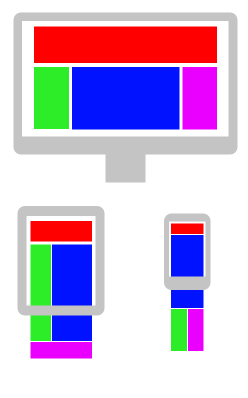

# Soyez responsive

Aujourd'hui, on entend beaucoup parler de responsive design ou de site web adaptatif. Pourquoi ? Est-ce nécessaire lors d'un design de penser à l'aspect adaptatif ?

## La diversité des écrans

Les sites web et les applications web sont maintenant consultables depuis différents appareils : Ordinateurs de bureau, ordinateurs portables, tablettes, smartphones, ... Tous ces écrans ont différentes tailles et résolutions et si nous voulons que notre contenu reste lisible et facilement utilisable on doit adapter nos applications et sites aux différents écrans.

C'est une pratique aujourd'hui obligatoire si vous voulez produire une application ou un site de qualité et bien accepté par vos utilisateurs. Il existe encore aujourd'hui de nombreux sites qui sont difficilement lisibles et utilisables sur mobile.

Exemples :

* Un site responsive : [Headspace](https://www.headspace.com/)
* Un site pas responsive : [LingsCars](https://www.lingscars.com/)

Essayer d'utiliser les outils de développement de votre navigateur avec les 2 sites donnés en exemple. Que se passe t-il si vous simulez l'utilisation d'un smartphone avec les outils du navigateur ? Le site responsive adapte le contenu à la taille de l'écran, le site non responsive ne s'adapte pas et vous êtes obligés de dézoomer ou de scroller pour voir tout le contenu.

Qu'est-ce que le responsive design en image :



Cette image illustre le principe du responsive design : il s'agit d'agencer différement les blocs de notre application ou de notre site en fonction de l'écran sur lequel on l'affiche. Sur mobile on a forcément moins de place disponible et on doit optimiser au maximum la taille de nos contenus.

## Comment faire ?

Heureusement pour nous, CSS permet de définir des règles spécialement pour certains médias. Il est par exemple possible de différencier un écran d'une impression.

```css
@media print {
  // Ici mes règles spécifiques à l'impression.
}

@media screen {
  // Ici mes règles spécifiques à l'affichage sur écran
}
```

Il est aussi possible de définir des règles pour différentes tailles d'écran :

```css
@media screen and (max-width: 1024px) {
  // Ici mes règles spécifiques à l'affiche sur écran dont la taille est inférieure à 1024px.
}
```

On peut donc changer la disposition de nos blocs sur la page en fonction de la taille de l'écran. On peut aussi choisir de transformer certains éléments de notre interface. Par exemple on transformera souvent un menu qui est affiché sous forme de liste de liens sur un écran large d'ordinateur en une icône à cliquer pour afficher le menu sur un écran de téléphone portable.

**Remarque** : Attention à la taille du viewport d'un navigateur mobile. Les navigateurs mobile simulent une taille d'écran plus grande que la taille réelle de l'écran. Cela fait un effet "dezoomé" sur le site qu'on visite. Pour contourner le problème et avoir la taille réelle de l'écran du téléphone, il est nécéssaire d'utiliser la balise `<meta name="viewport" content="width=device-width" />` dans la balise `<head>` de votre document HTML.

## Les frameworks CSS

Certains frameworks CSS existent et mettent en place un système de grille qui s'adapte en fonction des écrans.

C'est le cas de [Bootstrap](https://getbootstrap.com/) ou de [Materialize](https://materializecss.com) par exemple.

Ces frameworks sont utiles pour mettre facilement en place des règles CSS standardisées sur son site. Il est par contre un peu plus délicat de "customiser" son design.

## Materialize CSS

[Framework à découvrir](materialize.md)