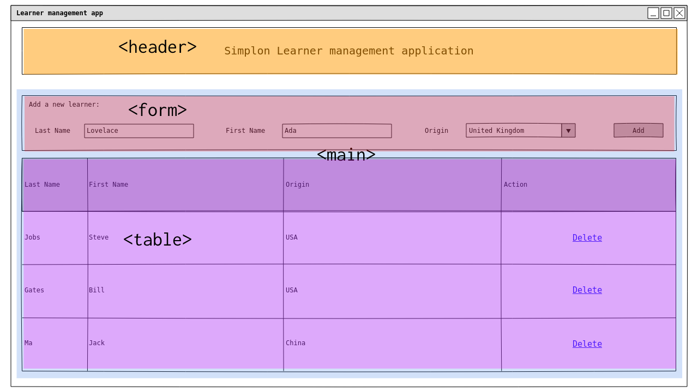

# Un peu plus loin en HTML
## La sémantique
#### C'est quoi la sémantique ?

La sémantique est d'après le dictionnaire Larousse :

> l'étude du **sens** des unités linguistiques et de leurs combinaisons.

En HTML notre but est de définir du contenu. Il est donc important de pouvoir définir le sens de chaque élément. Est-ce que mon élément est un titre, un paragraphe, un item d'une liste ?

La majorité des balises ont un sens. La balise `<p>` délimite un "paragraphe", `<h1>` délimite un "titre très important", ... Cela nous permet de définir le sens de notre contenu.

Certaines balises HTML ont pour but de mettre en forme le contenu. C'est le cas des balises `<i>`, `<b>` ou `<center>`. Cependant comme CSS est aujourd'hui bien supporté par les navigateurs, il est déconseillé de les utiliser. En effet il est conseillé de bien séparer notre contenu de sa mise en forme. Si un contenu est important, on peut l'indiquer avec la balise `<strong>` qui signifie "mise en valeur forte" et décider de la mise en forme de la balise dans notre fichier CSS associé.

```html
<!-- Bon exemple -->
<p>La sémantique est <strong>très</strong> importante.</p>

<!-- Mauvais exemple -->
<p>La sémantique est <b>très</b> importante.</p>
```

Enfin, quelques balises n'ont pas de sens. C'est le cas par exemple des balises `<div>` et `<span>`. Ce sont des balises **neutres**. La balise `<div>` est de type **block** alors que `<span>` est de type **inline**.

#### Depuis HTML5, des balises de structure
Si vous vous baladez souvent sur le web, vous avez du remarquer que la majorité des sites ont la même structure : un bandeau en haut de page, un menu de navigation, un corps de page avec le contenu et un pied de page.

Les personnes qui ont participé à l'élaboration d'HTML5 avaient fait ce constat et ont intégré à HTML5 de nouvelles balises structurantes permettant de délimiter les différentes zones d'un site.

Illustrons leur possible emploi sur l'exemple de mon application de gestion des apprenants Simplon :



On utilise la balise `<header>` pour définir le bandeau supérieur de l'application. On utilise la balise `<main>` pour placer le contenu principal de la page.

On aurait aussi pu utiliser les balises suivantes :
- `<nav>` si nous voulions afficher un menu de navigation.
- `<section>` si nous avions eu plusieurs sections à délimiter.
- `<article>` si nous voulions afficher des articles dans notre page.
- `<footer>` si nous voulions ajouter un pied de page.

#### Pourquoi utiliser les balises sémantiques :
###### Pour l'accessibilité
Une des raisons pour lesquelles bien structurer son site avec des balises sémantiques est que les personnes visuellement handicapées utilisent des lecteurs d'écran pour visiter les sites. Un site bien structuré est facilement lisible par les lecteurs d'écrans et cela permet de repérer facilement les différentes parties du site (où se trouve le menu, où est le contenu, ...).

###### Pour le Search Engine Optimization (SEO)
Utiliser les balises sémantiques pour structurer ses pages HTML est aussi une bonne pratique pour s'assurer que son site sera bien référencé. En effet, les moteurs de recherche scannent les pages Web et analysent si nos pages web sont bien structurées. C'est un des critères de notation des sites et cela peut faire monter le site dans les résultats de recherche.

Pour plus de détails sur la sémantique des pages Web :
- [La structure des sites sur MDN](https://developer.mozilla.org/fr/Apprendre/HTML/Introduction_%C3%A0_HTML/Document_and_website_structure)
- [Structurer sa page sur OpenClassrooms](https://openclassrooms.com/courses/apprenez-a-creer-votre-site-web-avec-html5-et-css3/structurer-sa-page)

## Les formulaires
Les formulaires permettent d'interagir avec l'utilisateur. Ils permettent à l'utilisateur de saisir des données que l'on peut ensuite envoyer au serveur. La récupération des données et leur traitement implique de développer une routine de traitement des données. Nous verrons cet aspect serveur avec Java EE. Ici nous allons nous concentrer sur la conception d'un formulaire en HTML.

#### Créer son formulaire
La balise `<form>` permet de définir un formulaire. Il s'agit seulement d'une boite vide qu'il faut ensuite remplir avec différents champs de formulaire.
Il est important de bien comprendre les attributs `action` et `method` de la balise `form` :
- `action` permet de faire le lien avec la page qui traitera les informations collectées par le formulaire.
- `method` permet de choisir la méthode HTTP qui se chargera de l'envoi des données (cela peut être `get` ou `post` et c'est très généralement `post`).

Dans l'exemple suivant, c'est la page `traitement` qui collectera les données et ce sera fait via la méthode `post`.
```html
<form action="/traitement" method="post">

</form>
```

Une fois que nous avons posé la structure du formulaire il faut le remplir avec des champs à compléter.

Prenons l'exemple d'un formulaire écrit pour l'exemple de l'application de gestion des apprenants Simplon :

```html
<form action="traitement" method="post">
  <!-- Last name field -->
  <label for="last_name">Last Name</label>
  <input placeholder="Jobs" id="last_name" type="text" name="last_name">
  <!-- First name field -->
  <label for="first_name">First Name</label>
  <input placeholder="Bill" id="first_name" type="text" name="first_name">
  <!-- Origin country field -->
  <label>Origin</label>
  <select>
    <option value="" disabled selected>Choose your origin country</option>
    <option value="1">China</option>
    <option value="2">France</option>
    <option value="3">United Kingdom</option>
    <option value="4">United States of America</option>
  </select>
  <!-- Submit button -->
  <button type="submit">Add</button>
</form>
```

Chaque balise a une fonction bien définie :
- `<label>` décrit un champ. On utilise l'attribut `for` pour faire le lien avec le champ en question (le lien se fait sur l'attribut `id` du champ à lier).
- `<input>` définit une entrée de type zone de texte, mot de passe, adresse email, ... On choisit le type de données à rentrer avec l'attribut `type`. On étiquette aussi les données qui seront à envoyer au serveur avec l'attribut `name`.
- `<select>` affiche une liste déroulante dont les valeurs seront contenues dans les différentes balises `<option>`.
- `<button>` définit une action sur le formulaire. L'attribut `type` permet de définir laquelle. _Submit_ permet d'envoyer le formulaire, _reset_ permet de vider les champs du formulaire.

#### Quelques bonnes pratiques
- Donner un titre à son formulaire
- Rester simple (demander uniquement ce qui est vital)
- Découper son formulaire s'il y a beaucoup de champs
- Grouper les champs
- Choisir le bon type d'input (text, email, password, ...)
- Utiliser l'attribut `placeholder` pour donner un exemple
- Offrir des suggestions (essayer la balise `<datalist>`)
- Mettre en valeur le bouton de validation

Bien d'autres astuces sont utiles lorsqu'on met en place des formulaires. Lisez par exemple l'article de Google sur le sujet : [Create Amazing Forms](https://developers.google.com/web/fundamentals/design-and-ux/input/forms/)

Ceci n'est qu'un aperçu de toutes les possibilités qu'offrent les forumlaires HTML. Pour plus de détails sur les formulaires :
- [Une liste d'articles sur MDN](https://developer.mozilla.org/fr/docs/Web/Guide/HTML/Formulaires)
- [Les formulaires HTML sur OpenClassrooms](https://openclassrooms.com/courses/apprenez-a-creer-votre-site-web-avec-html5-et-css3/les-formulaires-8)
