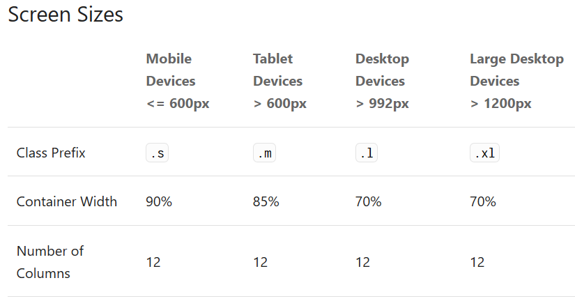
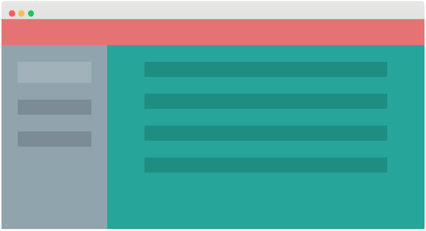

# Découverte de Materialize

>Il existe énormément de tuto et de ressources sur le web sur ce framework css. Nous allons juste aborder la mise en forme de base.

## Notion de **Grille**

Comme avec le framework **BootStrap** que vous pouvez aussi utilier, le framework **Materialize** utilise une grille de 12 cellules par défaut pour quadriller votre page web.

### Principe

>La page web est découpée en cellule et de fait ressemble à un tableur.

Etapes :

- Ligne : on ajoute une **div** avec la class **row**
- Colonne : on ajoute autant de colonnes suivant nos besoins, avec la classe **col** à laquelle on ajoute les informations suivantes pour le côté **responsive**
  
    - **s** + le nombre des cellules : exemple **s12**, **s8**, etc...
    - **m** + le nombre des cellules, exemple : **m4**
    - **l** + le nombre des cellules, exemple : **l8**

- on ferme la **div** de chaque colonne
- on ferme la **div** de la ligne

et ainsi de suite...

>Note :   
 **s** signifie **small** screens (mobile)   
 **m** signifier **medium** screen (tablettes)   
 **l** signifie **large** screen (desktop)



Pour agencer vos cellules qui vont contenir vos composants, vous pouvez utiliser **offset**, **pull** et **push** (à découvrir sur le lien en bas de page)

```css

<div class="row">
    <div class="col s12"><p>s12</p></div>
    <div class="col s12 m4 l2"><p>s12 m4</p></div>
    <div class="col s12 m4 l8"><p>s12 m4</p></div>
    <div class="col s12 m4 l2"><p>s12 m4</p></div>
</div>
  <div class="row">
    <div class="col s12 m6 l3"><p>s12 m6 l3</p></div>
    <div class="col s12 m6 l3"><p>s12 m6 l3</p></div>
    <div class="col s12 m6 l3"><p>s12 m6 l3</p></div>
    <div class="col s12 m6 l3"><p>s12 m6 l3</p></div>
</div>

```

## Exemple de layout sur le site de Materialize



Ensuite, il vous reste à inclure le code des différents composants du framework. (Vous pouvez faire la même chose avec le framework **BootStrap** qui permet de réaliser la même chose que **Materialize** mais en moins de ligne !)

>Remarque : les composants de **Materialize** sont plus dans l'air du temps et plus pointus...


[lien pour comprendre et mettre en place une grille](https://materializecss.com/grid.html)
