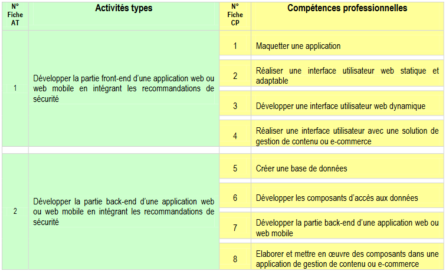
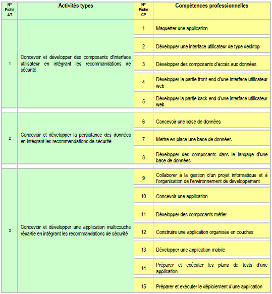
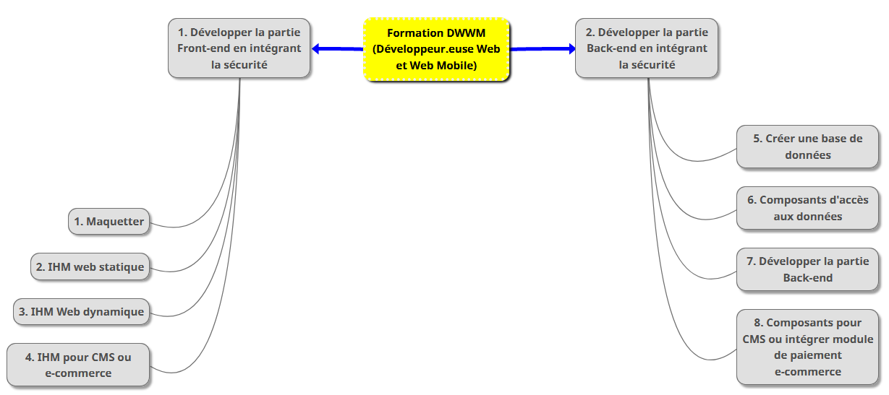
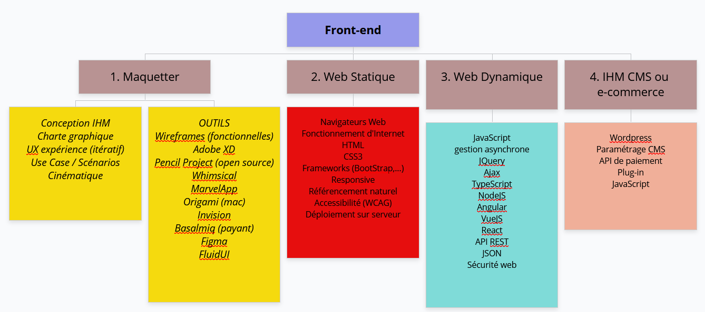
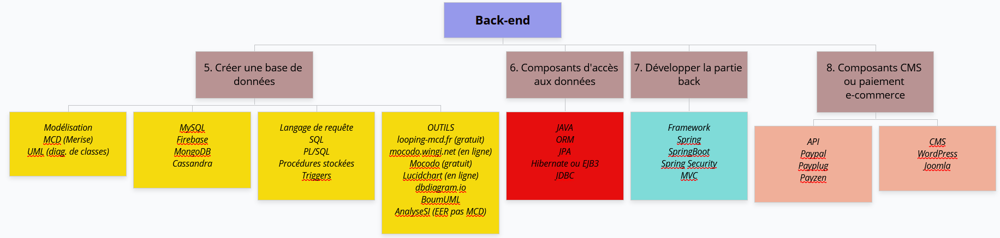

# Préparation aux titres DWWM et CDA

>Ce site va vous permettre d'aborder et d'acquérir les différentes compétences pour vous préparer à l'examen pour les titres **DWWM** et **CDA**. Les référentiels de formation pour ces 2 titres inscrits au **RNCP** (**R**egistre **N**ational des **C**ertifications **P**rofessionnelles) n'imposent aucune contrainte technique ni langage, seulement des compétences à acquérir. Prenez le temps pour parcourir le **REAC** (**R**éférentiel **E**mploi **A**ctivités **C**ompétences) du titre qui vous intéresse.

- **DWWM** (Développeur.euse Web et Web Mobile) niveau III
    

source : REAC DWWM ([REAC_DWWM_V03_03052018.pdf](pdf/REAC_DWWM_V03_03052018.pdf))

- **CDA** (Concepteur.trice Développeur.euse d'Applications) niveau II

source : REAC CDA ([REAC_VDA_V03_03052018.pdf](pdf/REAC_VDA_V03_03052018.pdf))

>Vous constatez à la lecture des tableaux ci-dessus, qu'il existe de nombreuses compétences communes aux 2 titres. Pour le titre CDA, vous voyez que l'on insiste sur l'aspect multi-couches, desktop, développement mobile natif et gestion de projets.

Il existe aussi des compétences importantes qui ne sont pas mentionnées dans les référentiels comme "**Savoir mettre en forme un document avec OpenOffice ou Word**" ou bien "**Rédiger le plan pour présenter votre projet web**". Cela parait étonnant, mais depuis plusieurs années, je constate que les développeur.euse.s repoussent le plus tard possible le moment de passer à l'écriture et la mise en forme des documents indispensables pour présenter son savoir-faire. 

Il y a 3 raisons à cela :
- On préfère **coder** plutôt qu'expliquer ce que l'on a fait
- On ne sait **pas utiliser un traitement de texte**
- On ne sait pas **quoi mettre dans le plan** (table des matières)

Vous allez certainement trouver d'autres raisons, j'en suis certain !

>Vous n'êtes pas obligé.e de suivre la logique et l'ordre des différents cours et travaux pratiques de ce site. Cependant, l'enchaînement proposé est le plus rationnel pour avancer sereinement.

Des cours et travaux pratiques pour certaines compétences du titre CDA seront ajoutés au fil du temps...

Bonne découverte !

# Avant de commencer...
## Savoir effectuer des recherches efficaces sur le Web

Vous allez découvrir [la plateforme **pix.fr**](pix/README.md) pour vous échauffer et acquérir quelques bases pour naviguer et programmer.

## Découvrez l'algorithmie en ligne

Consacrez entre 2 et 3 heures seul.e ou à 2 pour cette découverte de l'algorithmie grâce au site **code.org**.
Nous utiliserons par la suite un outil graphique agréable nommé _Flowgorithm_. [En attendant, pour s'amuser c'est par ici](pix/codeorg/README.md)

## Abordez les notions de bases indispensables pour comprendre **Internet**

Comme vous allez bientôt réaliser des applications Web, il est indispensable que vous ayez quelques notions de bases
sur le fonctionnement d'Internet. Il se trouve qu'il existe déjà énormément de sites avec des tutoriels sur ce sujet.

En attendant, [parcourez ce bref récapitulatif et faites quelques manipulations sur votre machine...](internet/README.md)
## Collaborez et gérez (versionning) avec Git et GitHub

[Pour comprendre à quoi sert Git et comment l'utiliser, suivez le guide...](git/README.md)

>Il existe de nombreux tutoriaux sur le net qui permettent d'approfondir l'utilisation de ce fabuleux outil que nous utilisons quotidiennement en tant que développeur.euse.

## Ce que vous serez capable de réaliser en fin de parcours

Pour obtenir le titre DWWM voici un visuel des 8 compétences que vous allez
acquérir au cours de cette formation.

## Partie Front

## Partie Back

avec navigateur, Front-end, back-end et BD avec MVC.
# Enfin, les cours...

## Java : Découverte (back)

### [1. Entrainez-vous à l'Algorithmie](java/java1/0-algo-java/pedagogy/targets.md)

### [2. Choisissez votre IDE](ide/README.md)

### [3. Eclipse, votre compagnon de route...](java/java2/5-ide/README.md)

### [4. Découvrez les bases du langage Java](java/java1/1-bases/README.md)

### [5. Manipulez des Tableaux](java/java1/2-tableaux/README.md)

### [6. Utilisez des Fichiers](java/java1/3-fichiers/README.md)

### [7. Faites de l'Héritage en POO](java/java2/6-heritage/README.md)

### [8. Manipulez une API REST](java/java2/7-rest/README.md)

### 9. Projets Java

#### [9.1. **Bibliothèque** (individuel)](java/java1/projet/README.md)

#### [9.2. **Restaurant** (groupe)](java/java1/projet-restau/README.md)
## Web statique : HTML et CSS (front)

### [1. Cours HTML et CSS](html-css/README.md)

### [1.1. Projet **Mon site HTML**](./html-css/1-introduction/travail/site-web-statique-C1-C2.md)

### 1.2. Frameworks CSS et site Responsive
## SQL et NoSQL (back)

### [1. Installation de MySQL, DataGrip, cours et TP](./bd/1-sql/README.md)

### [2. Triggers, procédures stockées et Transactions](./bd/4-sql-avance/README.md)

#### [2.1 Cours complet](./bd/4-sql-avance/README.md)
#### [2.2 Transactions](./bd/4-sql-avance/sql-avance.md)
#### [2.3 Corrections des TP](./bd/4-sql-avance/correction-sql-avance.md)

#### [3. Les SGBD NoSQL](./bd/1-sql/cours/no-sql.md)

## Web Dynamique : JavaScript (front)

### [1. Introduction au langage JS](./js/1-intro/README.md)
## Java Swing (desktop/back)

### [1. Construire des IHMs avec Swing](cours-swing.md)

### [2. Approfondissement sur la gestion des événements](cours-java-evenement.md)

### [3. Rappel : Connection à une BD avec JDBC](java/java2/8-jdbc/README.md)

### [4. Gestion de configuration et des langues avec les fichiers **properties**](cours-properties.md)

### [5. Exemple simple avec le Framework Hibernate](cours-hibernate.md)

### [6. Travaux pratiques Swing](travaux-pratiques-swing.md)

### [7. Utilisation de l'encodage en java](cours-cryptage-simple.md)

### [8. Utilisation de JUnit](cours-tests-junit5.md)

### [9. CDC du Projet Gestion des Opérations Bancaires](projets/gestion-banque.md)

### 10. Aides, conseils et propositions de corrections

## Sécurité web et OWASP ZAP

### 1. Mise en place de JWT (JSON Web Token)

## Accessibilité et outils

## Découverte du framework Angular (front)

## Tests Unitaires

## Quelques outils pratiques et méthodologie
## Modélisation

### [Cours UML](uml/README.md)

### [Cours Merise](2-mcd/README.md)

## Bonus (back)

### [SpringBoot](framework-back/1-springboot/README.md)

### [Java EJB](framework-back/1-jpa-orm/javaee-persistence-ejb3.md)

### [Mapping ORM](framework-back/1-jpa-orm/mapping-orm.md)
 
## ressources Web
