# Comprendre Internet et le Web


>Le World Wide Web date des années 70. Comme vous le savez, il rend accessible des documents quelque soit leur localisation sur des machines en réseau.   
Le **W3C** utilise le concept des **liens hypertextes** qui permet une lecture non-linéaire des documents contrairement aux livres. La technique de l'hypertexte a grandement contribué au succès du Web.

<center>

**Désolé, pour les Arachnophobes !**

</center>

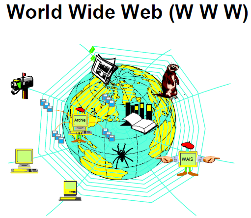

## Architecture

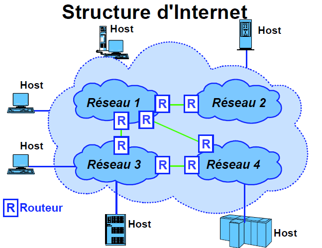

**Internet** est constitué de réseaux connectés entre eux grâce au `protocole TCP/IP`.

Les composants  d'Internet sont :

- **Hosts** : dans un réseau TCP/IP, on appelle `host` n'importe quel système.
- **Réseaux** : lorsque deux hosts (ou plus) communiquent entre eux grâce à TCP/IP, on a un réseau.
- **Internet** : Lorsqu'un `host` sur un réseau TCP/IP donné communique avec un autre host situé sur un autre réseau, on a un Internet.
- **Routeurs** : ils sont utilisés pour connectés un réseau TCP/IP à un autre. Les routeurs connectent les réseaux au niveau de la couche `réseaux` IP et acheminent les `paquets` entre ces réseaux. Ils sont capable de déterminer le meilleur chemin possible entre ces réseaux ainsi que la taille adéquate des paquets pour optimiser la transmission.

En fin de compte, pour tous les hosts, le réseau est représenté comme une seule entité, un seul réseau, le nom ou l'adresse du destinataire étant suffisante pour établir le contact.

## Modèle Client/Serveur

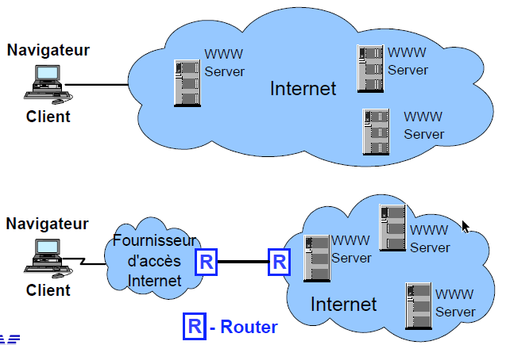

Le modèle **Client/Serveur** constitue Internet :

- Chaque participant (Navigateur) à Internet est un **client**.
- Chaque ressource sur Internet est située sur un serveur quelque part dans le monde.

L'ordinateur client dispose d'un programme (`Navigateur`) qui formule une requête ou exécute un programme, alors que le serveur contient la puissance et la capacité pour accéder aux données qu'il détient.

Un même client peut accéder à n'importe quelle application serveur, de même, un serveur unique peut répondre à de nombreux clients, d'où une flexibilité dans la conception des applications.

- Sur le Web, le programme client qui formule la requête fait partie du **navigateur**.

- Les serveurs qui répondent aux navigateurs s'appellent des **serveurs Web**.

- Les navigateurs et les serveurs Web communiquent à l'aide du protocole **HTTP**.

L'illustration plus haut représente une configuration standard chez un(e) Internaute :

- En haut, la relation client/serveur peut être établie entre le navigateur et n'importe quel serveur sur Internet.

- En bas, il s'agit d'une vue détaillée de l'image du haut. Pour atteindre son fournisseur d'accès Internet, l'utilisateur établit généralement une connexion à partir de son navigateur, à travers le réseau téléphonique, la Fibre ou le Wifi.

- La connexion entre le réseau du fournisseur d'accès Internet, et l'Internet se fait grâce à des connexions entre **routeurs**. Lorsque les connexions physiques sont établies de part et d'autres, une relation client/serveur peut prendre place entre le navigateur et n'importe quel serveur sur Internet.

## Le serveur

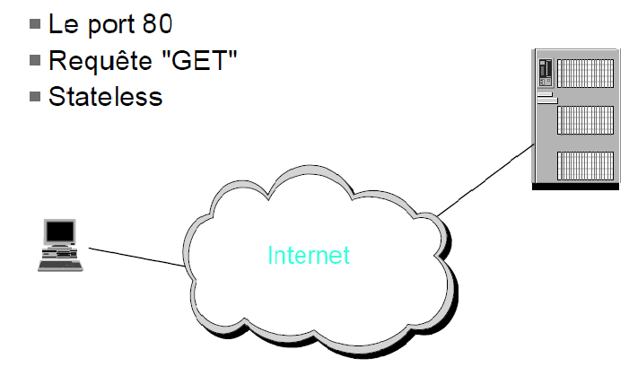

Le navigateur émet une requête `GET` reçue sur le **port 80 du serveur Web**. On dit que le serveur Web `écoute` sur le port 80.

> Tout ce qui est reçu sur ce port est pris en charge par le serveur, aussi appellé HTTP serveur ou HTTPD (démon) sous Unix.
Lorsque la totalité des éléments d'une page est chargée, la connexion avec le serveur Web s'arrête :

- On est en mode déconnecté.
- On appelle `stateless` (sans état), le fait que la **session** ne conserve pas de souvenir du contexte.

## Le client

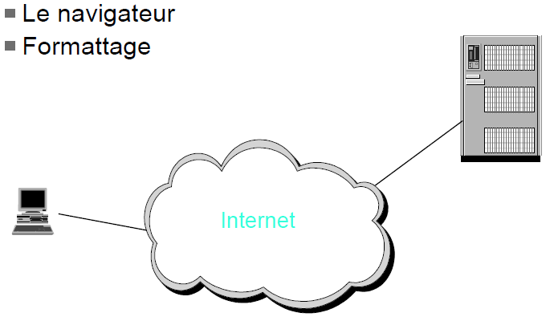

Le navigateur fait le travail de formattage.

La **requête GET** ne va pas chercher tous les fichiers inclus dans une page. Lorsque le navigateur lit la page et demande les objets nécessaires qui seront chargés un à un.

## Une histoire de protocole : TCP/IP

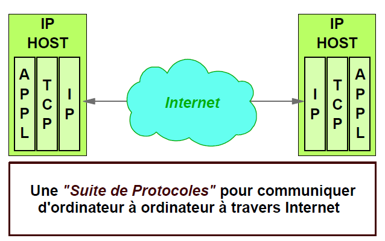

>TCP/IP est une suite de protocoles qui ont été développés pour permettre d'établir des communications dans un environnement réseau hétérogène.

(APPL : pour Application dans le schéma)

**TCP/IP** peut fonctionner sur n'importe quelle machine, que ce soit un PC portable ou un autre. Il peut également assurer le transport des paquets au travers de moyens divers et variés qui utilisent différents protocoles.

Il fonctionne aussi bien sur un **LAN** (Local Area Network) que sur un **WAN** (Wide Area Network). (TCP/IP étant constitué de quatre couches de protocoles, on parle de suite de protocoles).

## Pile du protocole TCP/IP

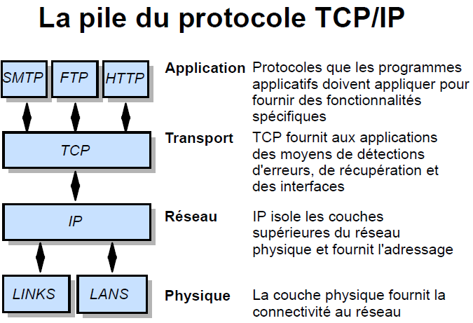

>TCP/IP est un protocole en **couche**, chacune d'elle ayant un rôle disctinct dans le réseau. Lorsque deux réseaux échangent des données, chacune des couches d'un système, communique de manière logique avec les couches équivalentes sur l'autre système.

1 - La **couche application**

>C'est la couche que les utilisateur.trices.s connaissent le mieux. A ce niveau, les protocoles sont définis pour des programmes applicatifs qui mettent en oeuvre des fonctionnalités spécifiques comme l'e-mail ou le surf. Il existe des centaines de protocoles d'application.

Voici les trois les plus connus sur le net aujourd'hui :

- **HTTP** est le protocole utilisé par les programmes applications des navigateurs et des serveurs Web.
- **FTP** (File Transfer Protocol) définit les protocoles pour les programmes d'envoi ou de copie de fichiers.
- **SMTP** (Simple Mail Transfer Protocol) définit les protocoles pour les applications de messagerie électronique.

2 - La **couche Transport** - TCP (Transport Control Protocol)

- Il s'agit d'un protocole de connexion point-à-point.
- Il est chargé de l'établissement des connexions, de leur maintien et de leur fin. C'est ce protocole qui détecte les erreurs et s'occupe
de la récupération (recovery)
- Les connexions ont lieu entre des applications spécifiques des hosts expéditeurs et destinataires. On appelle **session** ou circuit
logique la connexion logique entre deux entités TCP (appelées ports ou sockets).

3 - La **couche réseau** - IP (Internet Protocol)

- A ce niveau, **IP** masque le réseau physique aux couches supérieures. Ce protocole fournit des services aux données en leur ajoutant les adresses de départ et d'arrivée. **IP est un protocole sans connexion**, c'est à dire une connexion logique où le destinaire n'a pas besoin d'être opérationnel.

Fonctionnement : IP envoie, un point c'est tout. Les détections d'erreurs et récupération prennant du temps, on a préféré assurer un acheminement rapide et laisser aux protocoles supérieurs (TCP) le soin de vérifier la fiabilité de la livraison des paquets.

4 - La **couche physique**

- La couche physique sert d'interface avec le matériel spécifique comme celui utilisé pour Ethernet, X25, anneau à jeton, ou asynchrone. L'interface matériel, peut ou non assurer un acheminement fiable, peut ou non prendre en charge les paquets. En fait, TCP/IP ne spécifie aucun protocole à ce niveau et peut utiliser pratiquement toutes les interfaces existantes. Tout repose sur la flexibilité de la couche IP supérieure.

## Quelques protocoles

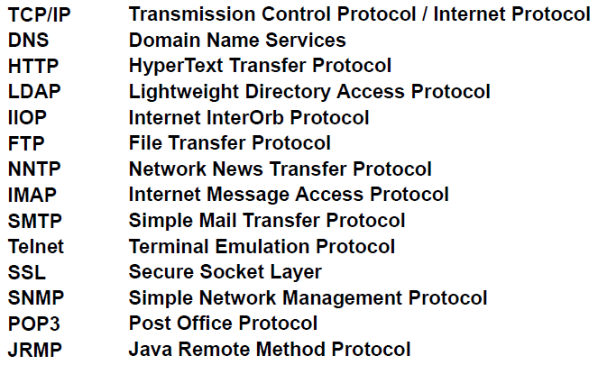

## Adressage réseau IP

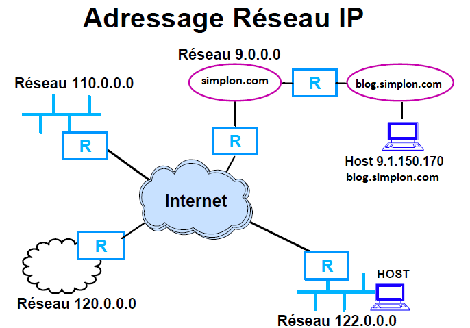

>Afin d'acheminer les données au bon destinataire, chaque machine (**host**) doit avoir une adresse
unique.

IP fournit un système basé sur des adresses sur 32 bits. Afin de faciliter la compréhension, ces adresses sont exprimées en format décimal. Chaque partie de 8 bits est séparée par un point. La première partie de cette adresse sert à identifier le réseau, l'autre identifie la machine sur ce réseau. Chaque machine appartenant à un réseau, dispose d'une adresse unique à l'intérieur de ce réseau.

>A la limite, si on n'a pas l'intention de connecter son réseau à Internet, on pourrait utiliser n'importe quelle adresse, mais il est recommandé aux administrateurs réseaux d'obtenir des adresses Internet officielles.

>Des millions d'utilisateurs étant connectés à Internet, comment les informations leur parviennent-elles ?

Chaque utilisateur est associé à un réseau spécifique avec une adresse unique. A l'intérieur de ce réseau, chaque machine dispose également d'une adresse unique. Les routeurs utilisent les adresses réseaux pour acheminer les paquets à ce réseau. Cette adresse reconnait ses utilisateurs sur Internet (éventuellement grâce à un fichier de configuration). L'adresse peut aussi être dynamiquement attribuée par le fournisseur d'accès Internet.

## Noms de Domaines

- **.com**
- **.fr**
- **.gouv**
- **.edu**
- **.net**
- **.biz**
- **.art**

Top Level Domains (TLD)

>Au début d'Internet aux Etat-Unis, `il a été décidé d'utiliser une convention de noms pour éviter d'avoir à se souvenir de l'adresse 32 bits`. Ces noms sont enregistrés par l'ICANN (Internet Corporation for Assigned Names and Numbers) ou le NIC (Network Information Center) local.

> Des serveurs de noms **DNS** (Domain Name System) sont utilisés pour les traductions d'adresses.

Ces TLD sont toujours en vigueur et de nouveaux TLD s'ajoutent au fils des ans. Lorsqu'Internet s'est *internationalisé*, une convention de noms alternative a été créée par l'**ISO** (International Standards Organization) basée sur les noms des pays. Ces dénominations géographiques sont très utilisées hors Etats-Unis (exemple .fr pour la France)

Voir les noms de domaines actuellement valables (sur wikipédia) : [https://fr.wikipedia.org/wiki/Nom_de_domaine](https://fr.wikipedia.org/wiki/Nom_de_domaine)

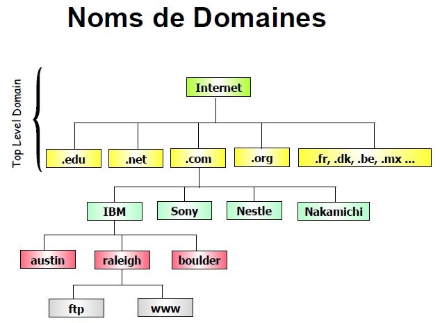

## URL (Uniform Resource Locator)

Format générique : protocol://servername.domain/[:port#/][path/][fileName[.extension]]

Exemples : 

- https://fr.wikipedia.org/wiki/Uniform_Resource_Locator
- https://numerosoft.fr/
- https://openclassrooms.com/fr/dashboard
...

>L'URL sert à identifier de manière unique une ressource sur un réseau TCP/IP. Elle sert aussi à
trouver cette ressource.

En règle générale, on assigne au protocole son port par défaut : par exemple **le port 80 pour HTTP**. Si le port par défaut est utilisé, il est inutile de le préciser.

>Note : On appelle `socket` la paire constituée par un protocole et son port.

Pour les serveurs Web, certains fichiers par défaut sont définis, comme par exemple le fichier **index.htm**. En conséquence, il est suffisant de saisir le nom de domaine pour faire apparaitre dans le navigateur la page d'accueil.

Si plusieurs serveurs existent dans un domaine, il faut spécifier le nom du serveur. Les noms peuvent s'inscrire en cascade, par exemple, dans **blog.simplon.com**

**blog** est connu du domaine **simplon** lui même connu du domaine **com** (un TLD)

>Attention : Le chemin ne reflète pas le chemin physique du fichier. Les serveurs Web ont leur propre mapping logique aux disques physiques et aux répertoires.

## Universalité

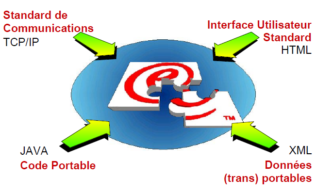

- Protocoles indépendants du matériel : L'universalité s'étend en quelque sorte, puisque de nos jours, de plus en plus d'objets sont accessibles par Internet. De fait, pour lutter contre la pénurie d'adresses IP, la naissance d'IPV6 sur 128 bits, c'est à dire 16 octets au lieu des 4 octets d'IPV4 a permis d'augmenter les adresses IP possibles !

- Logiciel : Le navigateur traite le code HTML et permet l'affichage.

### Connaître l'IP de sa machine

Dans mon cas, mon **IPv6** est `fe80::f8c7:e515:fa0b:caa2%18` et mon **IPv4** est `192.168.1.16`

Lancez votre terminal windows et entrez **ipconfig**

Pour Linux, je crois que c'est **ip addr** mais je pense qu'*ipconfig* fonctionne aussi (à vérifier)

Voici ce que vous pouvez obtenir avec une IP différente.

```java
Carte Ethernet Ethernet :
   Suffixe DNS propre à la connexion. . . : lan
   Adresse IPv6 de liaison locale. . . . .: fe80::f8c7:e515:fa0b:caa2%18
   Adresse IPv4. . . . . . . . . . . . . .: 192.168.1.16
   Masque de sous-réseau. . . . . . . . . : 255.255.255.0
   Passerelle par défaut. . . . . . . . . : 192.168.1.254
```

>Remarque : je n'ai pas abordé la notion de **proxy**, voici ce à quoi ça correspond (source wikipédia). Nous verrons cela ultérieurement.

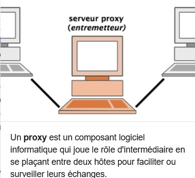

## Mise en pratique

[Un exercice simple](pratique.md)

Auteur : Philippe Bouget
