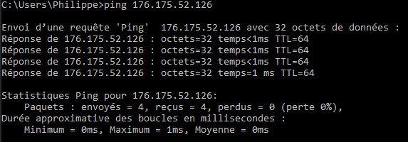

# Pratique sur les notions de réseau

## Adresse IP

- Affichez votre adresse IP depuis la console

    - Windows 	: un invite de commande, lancer : `ìpconfig`   
    - Linux 	: un terminal (ctrl + alt + T), taper la commande : `ifconfig wlan0`

- Noter sur un document partagé l'ensemble des IP du groupe, que remarquez-vous ?

- Affichez votre adresse IP depuis votre navigateur   
Ouvrez votre navigateur et allez sur https://showip.net/

>remarque : selon le navigateur que vous utilisez vous pouvez ne pas avoir la même adresse IP.

- Avec Firefox, Chrome, IE ou autres

- Avec Tor Browser (permet de naviguer de façon anonyme) 

Bref, si vous voulez votre adresse IP réelle, utilisez la première option !

> Une adresse IP privée n’est utilisable que sur un réseau local et sera ignorée par les routeurs sur Internet.    
Contrairement aux adresses IP publiques, plusieurs réseaux peuvent utiliser les mêmes adresses.

## Jouez au Ping (Pong !)

Si vous sonnez à une porte, quelqu'un doit vous répondre, sauf s'il n'y a personne dans la maison.

>**Ping** est un service par défaut qui est actif sur la majorité des ordinateurs (pas forcément sur les serveurs).   
Il permet de tester qu'on peut accéder de notre ordinateur jusqu'à un autre ordinateur.   
Cela permet de vérifier avant toute autre chose que les câbles réseaux sont branchés et que la machine distante est allumée.

Dans une console (ou Terminal windows), lancez : **ping \<votre adresse IP\>**

Exemple avec une IP existante :

Exemple avec une IP erronée :

Vous pouvez aussi utiliser la commande **ipconfig /all** sous windows pour obtenir la configuration de votre réseau windows

## Envoyer un message à une autre machine du réseau

[Découvrez la commande **netcat** sur le wiki](https://fr.wikipedia.org/wiki/Netcat)

Sur la console d’une machine (qui sera le serveur) taper : `netcat -l 55555`   
Sur la console d’une autre machine (client) taper : `netcat <nom ou ip serveur> 55555`   

## Envoyer un fichier à une autre machine du réseau

Sur la console (linux) d’une machine (qui sera le serveur) taper : `sudo service vsftpd start`   
Sur la console (linux) d’une autre machine (client) taper : `ftp <nom ou ip serveur>`   

## Il existe d’autres types de communication client/serveur

Naviguez sur le web pour approfondir vos connaissances : **http**, **UDP**, **ssh**, **ftp**,... 

**Allez, c'est parti...**

