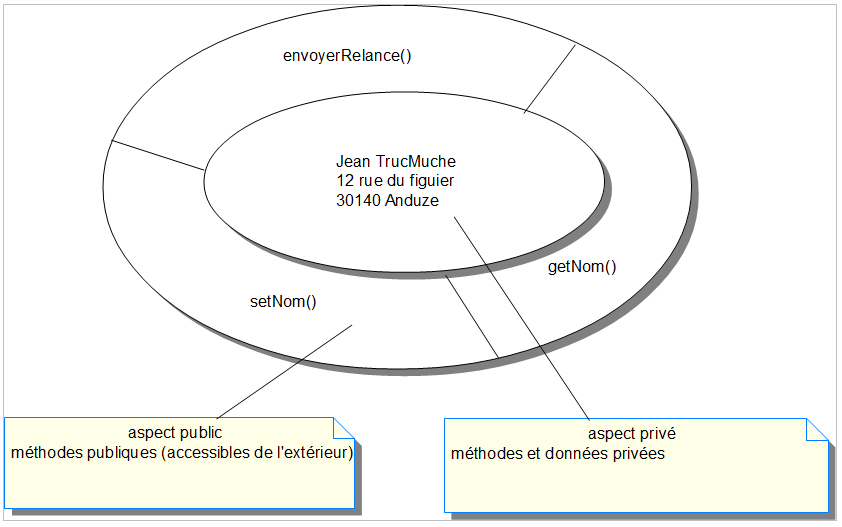
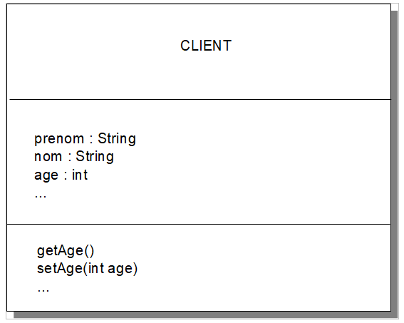
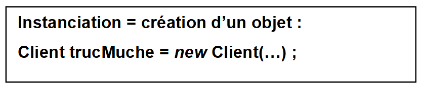

# Concepts Objets pour Java

## 1.Utilisation de classes existantes

**Objectifs :**

- Comprendre la relation entre les objets et les classes
- Comprendre et manipuler les références d&#39;objets
- Connaître les conventions pour dénommer les classes et les variables
- Savoir instancier les objets et appeler leurs méthodes
- Se familiariser avec les classes _String_, _Vector_ et &#39;wrapper&#39; dites &quot;enveloppes&quot;

**Découvertes des Objets :**

- le monde réel est composé d&#39;objets.
- Certains de ces objets peuvent être traités sur ordinateur.
- La représentation informatique d&#39;un objet du monde réel s&#39;appelle **objet** ou **instance**.
- Un objet contient des données appelées **variables**.
- Un objet contient aussi la définition des traitements qu&#39;on peut effectuer sur ses données : il s&#39;agit des **méthodes**.

## 2.Qu&#39;est-ce qu&#39;un Objet ?

- Si les données ou attributs d&#39;un objet ne sont modifiables que par des méthodes, on parle d&#39; **encapsulation**.
- Les attributs constituent **l&#39;état de l&#39;objet**
- Les méthodes définissent le &quot; **comportement**&quot; de l&#39;objet.
- Certains objets sont des représentations du monde réel
- D&#39;autres sont des représentations abstraites ou internes

**Voici un exemple d&#39;objet :**

_Un client d&#39;une société peut être géré dans un objet_

Nom de la _classe_ : Client

Référence de _l&#39;objet_ : trucMuche

_Attributs :_

Mr. Jean TrucMuche
 12, Rue du figuier
 30140 - Anduze

_Méthodes_ (comportement) :

getNom() : Retourne le nom d&#39;un objet de type Client
 setNom() : Initialise le nom d&#39;un objet de type Client
 envoyerRelance() : Réalise un comportement (action)



### Peut-on parler d&#39;objet ?

- compte bancaire
- employé
- une fraction
- un âge

## 3.Distinction entre objet et Classe

Voici 3 objets :

Attributs : Mr. Jean TrucMuche 12, Rue du figuier 30140 – Anduze

Méthodes  : getNom(), setNom(), envoyerRelance()


Attributs : Mme Magali Vergne 2, Rue des arbouses 34510 - Florensac

Méthodes  : getNom(), setNom(), envoyerRelance()

Attributs : Mr. Marc Pignon Chemin du muscat 34400 - Lunel

Méthodes  : getNom(), setNom(), envoyerRelance()

>On a bien 3 objets différents mais ce sont toujours 3 Clients.
La valeur des attributs (données) est spécifique à chacun.

>Les opérations à réaliser sur ces données sont les mêmes.

On dit que ces 3 objets sont des **instances** de la même **classe.**

**Instance** et **Objet** sont synonymes.

## 4.La Classe : type de données abstrait

### 4.1.La classe est un **MOULE** ou un **MODELE** pour créer des objets.

En Java chaque objet est **l&#39;instance** d&#39;une classe. Sans classe, il ne peut pas y avoir d&#39;objet !

Toutes les instances d&#39;une classe partagent les mêmes structures de données et les mêmes méthodes. La valeur des données est spécifique à chaque instance. La classe permet une **représentation abstraite** d&#39;objets concrêts (exemple : Client) ou d&#39;objets abstraits (ex : pile, action, compte bancaire, portefeuille d&#39;action, commande, …).

Un diagramme de classe (que nous étudierons en UML) spécifie :

- le nom de la classe
- la définition de ses variables (attributs)
- la définition de ses opérations (méthodes).

#### Exemple de description d&#39;une classe java :

_Nom de la classe : Client_

_Liste des attributs :_

_prenom : String
 nom : String
 age : int_

_Liste des méthodes :
 getAge()
 setAge(int)_

**Voici ci-dessous une représentation sous forme graphique :**



>Comme nous le verrons dans la pratique, Java propose un grand nombre de classes :

**String** : sert à stocker des mots ou des phrases

**Vector** : ressemble à un tableau, mais avec beaucoup plus de fonctionnalités.

**Wrappers** : classes qui permettent de traiter des types primitifs comme des objets, en
 élargissant ainsi les possibilités de traitements.

**Déclaration des variables avec les types primitifs :**

```java
int i;
char c;
float f = 0.0F;
```

**Déclaration avec des classes existantes :**

```java
String s1;
Vector v;
String s2 = null;
```

>Attention **s1**, **v** et **s2** ne sont que des références d&#39;objets, pas des objets !

## 5.Méthodes d&#39;instance : comportement des objets

Chaque objet contenant des données peut subir des opérations (traitements). Les opérations sont faites en utilisant les **méthodes** qui recoivent des paramètres et peuvent renvoyer un résultat unique. Les méthodes utilisables sont définies dans la classe.

Une méthode d&#39;instance traduit le **comportement** des objets de la classe à laquelle appartient cette méthode.

Une méthode est constituée :

- d&#39;une _Signature_ (nom de la méthode, type renvoyé et liste des paramètres)
- d&#39;un _Corps_ (implémentation de la méthode entre accolades)

**Pour la classe String voici quelques méthodes avec leur fonctionnalité :**

**Nom de la méthode Explication de son rôle**

**charAt** (int)renvoie le nième caractère de la chaîne

**compareTo** (String)compare la chaîne avec l&#39;argument

**concat** (String)ajoute l&#39;argument à la chaîne et renvoie la nouvelle chaîne

**endsWith** (String)vérifie si la chaîne se termine par l&#39;argument

**equalsIgnoreCase** (String)compare la chaîne sans tenir compte de la casse

**indexOf** (String)renvoie la position de début à laquelle l&#39;argument est contenu dans la chaîne

**lastIndexOf** (String)renvoie la dernière position à laquelle l&#39;argument est contenu dans la chaîne

**lenght** ()renvoie la longueur de la chaîne

**replace** (char,char)renvoie la chaîne dont les occurrences d&#39;un caractère ont remplacées

**startsWidt** (String int)Vérifie si la chaîne commence par la sous chaîne

**substring** (int,int)renvoie une partie de la chaîne

**toLowCase** ()renvoie la chaîne en minuscule

**toUpperCase** ()renvoie la chaîne en majuscule

**trim** ()enlève les caractères non significatifs de la chaîne

## 6.Instanciation d&#39;un objet : mot clé NEW()

### Nom de la classe : Client

Liste des attributs :

prenom : String

 nom : String

 age : int


Liste des méthodes :

getAge()

setAge(int)

- La classe




<center>


</center>


**L&#39;instanciation consiste à créer un objet, à partir d&#39;une classe (avec le mot clé**  **NEW**** ) :**

Client _trucMuche_ = **new** Client(&quot;jean&quot;,&quot;Trucmuche&quot;, &quot;12 rue du figuier&quot;, 30140, &quot;Anduze&quot;);

## 7.Comment utiliser une méthode ?

**INVOQUER** une méthode d&#39;instance correspond à la demande d&#39;un service à **l&#39;OBJET** , à l&#39;envoi d&#39;un **MESSAGE**. Nous allons prendre 2 méthodes :

_setNom()
 getNom()_

**La structure est toujours la suivante**  :

MaRéférenceObjet **POINT** MaMéthode **PARENTHESE** Liste des Paramètres **PARENTHESE**

**Voici un appel de la méthode setNom()** :

MonObjetEmploye.setNom(&quot;Zouzou&quot;) ;

**La structure de cet appel est la suivante :**

Référence objet **POINT** nom de méthode (&quot;valeur du paramètre&quot;) ;

**Voici un appel de la méthode getNom()** :

String NomRécupéré = MaRéférenceObjet.getNom();

**La structure de cet appel est la suivante :**

Variable locale = référence objet POINT nom de méthode ;

**D&#39;abord il faut créer un objet :**

String réponse = **new** String(&quot;Oui&quot;);

**Ensuite on peut appeler (invoquer) ses méthodes :**

```java
 boolean ditOui = false;
 if ( **reponse.length** () == 1)
 {

if ( **reponse.equalsIgnoreCase** (&quot;o&quot;))
 {

ditOui = true;
 }

}
 else
 {

String mot = reponse.trim();
 if ( **mot.equalsIgnoreCase** (&quot;Oui&quot;))

{

ditOui = true;
 }

}
```

## 8.Syntaxe spécifique pour les Strings

L&#39;utilisation des _Strings_ est fondamentale en informatique. Le langage Java a créé quelques fonctionnalités spécifiques pour cette classe :

**L&#39;instanciation est automatique (pas forcément besoin d&#39;utiliser new()) :**

Constructeur explicite du String :

```java
String MaChaine = new String("MaChaine est un objet");
```

Constructeur implicite du String :

```java
String MaChaine = "MaChaine est considérée comme un objet avec cette écriture";

String s = "Hello";
```

**Concaténation :**

String chaîneUn = &quot;Bernard&quot;;
 String chaîneDeux = &quot;Martin&quot;;
 String s3 = chaîneUn + &quot; &quot; + chaîneDeux;

### Comparaison de Strings

La classe _String_ donne des méthodes pour comparer 2 _chaînes_ :

- int **compareTo** (String autreString)
- int **compareToIgnoreCase** (String autreString)
- boolean **equalsIgnoreCase** (String autreString)

Ces 3 méthodes permettent de comparer le contenu d&#39;un _String_ avec le contenu d&#39;un autre _String._

**Les Objets String ne sont pas modifiables**.

Voici une illustration :

Etape 1 : on écrit _**s1 = new String(&quot;Bonjour&quot;);**_
Etape 2 : on écrit _**s1 = new String(&quot;Au revoir&quot;);**_
Etape 3 : on écrit _**s2 = new String(&quot;Au revoir&quot;);**_
Etape 4 : on utilise la fonction de comparaison de Chaînes : 

_**s1.equals(s2)**_

**Que se passe t-il ?**

Lors de l&#39;étape 2, s1 pointe vers l&#39;objet String Au revoir, tandis que l&#39;objet String Bonjour auparavant référencé est candidat à la poubelle (garbage Collector). Donc, maintenant, S1 pointe vers Au revoir. Lors de l&#39;étape 4, la fonction de comparaison retournera VRAI car s1 et s2 pointent vers des chaînes identiques.

**Attention au piège de la comparaison directe !**

```java
boolean stringsIdentiques = false;
 String s1 = "Texte";
 String s2 = "Texte";
**if** ( **s1 == s2** )
 {

**stringsIdentiques = true;**

}
```

**L&#39;opérateur &#39;==&#39; compare les références, pas les objets !**

## 9.Vector, ArrayList et Tableau

**Java permet de définir des tableaux de primitives ou d&#39;objets :**

```java
int[] tableauDEntier;
String[] tableauDeChaînes;
Client[] tableauDObjetsClient ;
```

Mais ...

- un tableau, une fois créé a un **nombre fixe de postes**
- un tableau ne peut contenir qu&#39;un seul type de données

Mieux vaut utiliser les classes _Vector_ ou _ArrayList_ plus souples :

Par exemple, avec la classe Vector (obsolète), il existe de nombreuses methodes :

- addElement(o:Object)
- capacity():int
- elementAt(i:int):Object
- removeAllElements()
- remove(o:Object):Boolean
- toString():String
- ...

Un _Vector_ peut être agrandi ou réduit suivant le besoin.
 Un _Vector_ peut contenir des références à divers objets, mais il **ne peut contenir de types primitifs**.
 Un _Vector_ peut renvoyer la référence d&#39;un objet si on lui donne un rang (position).
 Quand on enlève un élément d&#39;un _Vector,_ il y a tassage automatique du _Vector._
 La méthode _toString()_ d&#39;un _Vector_ appelle la méthode _toString()_ pour chacun de ses éléments.

**Quelques exemples sur des tableaux simples et des Vecteurs :**

```java
String[] s = new String[7];
 Vector v = new Vector();

 String jour = &quot;Lundi&quot;;
 s[0] = jour;
 v.add(jour); // ou v.addElement(jour)

 jour = &quot;Mardi&quot;;
 s[1] = jour;
 v.add(jour);

 //...
 String aujourdhui = s[numJour];
 //...ou bien ...
 String aujourdhui = v.elementAt(numJour);
```

## 10.Iterateur : parcourir un tableau

Un itérateur est un objet java dont le travail consiste à se déplacer dans une séquence d&#39;objets et de sélectionner chaque objet de cette séquence. Très facile à construire et à utiliser, il ne peut se déplacer que dans un seul sens.

Pour cela, vous devez faire appel à la méthode **iterator()** généralement présente pour de nombreux vecteurs et tableaux. Cette méthode renvoie tout simplement un objet de type Iterator qui possède ses propres méthodes pour que l&#39;on puisse le parcourir et extraire chaque objet :

**hasNext** () : méthode qui vérifie s&#39;il reste des objets dans la séquence
**next** () : méthode qui renvoi l&#39;objet suivant.
**remove** () : méthode pour enlever le dernier objet renvoyé par un next().

Exemple :

```java

System._out_.println(&quot;Voici la liste des enfants :&quot;);

Iterator\&lt;Enfant\&gt; enfant = listeEnfants.iterator();

**while** (enfant.hasNext())

{

// on récupère un objet de type enfant dans la liste :

Enfant e = enfant.next();

e.afficher();

}

```

## 11.Utilisation des Wrappers (Classes enveloppes)

Problème : On veut stocker directement un type primitif (par exemple un _int_) dans un _Vector._

**Impossible !!!**

Solution : Utiliser un &quot;wrapper&quot; qui permettra de stocker la référence au type primitif. A chaque type primitif correspond une classe, qu&#39;on nomme wrapper (attention à la majuscule !) : par exemple _Boolean_ est le wrapper du type _boolean._

Attention aux exceptions : _Integer_ et _Character._

Le wrapper stocke simplement une référence au type primitif, ce qui permet plus de possiblités de traitement.

La classe  **Integer** :

**Elle possède deux constructeurs :**

Integer(String s);

Integer(int i);

**Il est facile de passer du type primitif à la classe et réciproquement :**

int i = 4;

Integer objInt = new Integer(i);

int j = objInt.intValue();


**Détail de la classe présentée dans le graphique de la page suivante :**

**Integer
Attributs :**
-value:int

**Méthodes :**
**compareTo** (i:Integer):int
**byteValue** ():byte
**shortValue** ():short
**intValue** ():int
**longValue** ():long
**floatValue** ():float
**doubleValue** ():double
**toString** ():String
 ...


**Tableau des correspondances :**

| **Type origine (primitif)** | **Classe Enveloppe** |
| --- | --- |
| boolean | Boolean |
| integer | Integer |
| long | Long |
| float | Float |
| double | Double |
| char | Character |

## 12.Pourquoi devez-vous utiliser des Package ?

Toute classe appartient à un _ **package** _. Si on ne le spécifie pas explicitement, la classe appartient au package par défaut. Trois raisons pour utiliser les packages :

  1. **regrouper** des classes pour des raisons d&#39;organisation
  2. **contrôler** les accès à des données encapsulées
  3. **éviter** les problèmes de noms de classe identiques

Pour affecter une classe à un package, on utilise la clause _package,_ **obligatoirement en première instruction** :

package paie.info;
 public class ...
{ ... }

**Il existe de nombreux packages de base en Java :**

java.lang
 java.awt
 java.io
 java.math
 java.net
 java.text
 java.util
 ...

Exemple d&#39;importation de package
 import java.util.Vector; // référence explicite à une classe
 import java.text.\*; // référence à toutes les classes d&#39;un package

public class ExempleImport
 {

public static void main(String[] args)
 {
 DateFormat df =DateFormat.getDateInstance(DateFormat.SHORT);
 Vector v = new Vector();
 v.add(df.parse(&quot;22/03/00&quot;));
 }

}

## 13.Création de nouvelles classes : Abstraction

**Objectifs :**

Comprendre **l&#39;encapsulation**
Comprendre **l&#39;agrégation**
Ecrire des définitions de classe
Comprendre et utiliser les **méthodes**
Comprendre et utiliser les **constructeurs**
Utiliser efficacement les variables

Les classes de base Java sont très utiles pour écrire les programmes mais ne couvrent pas les domaines spécifiques de l&#39;entreprise. **Il faut pouvoir définir et utiliser ses propres classes** , par exemple un _ **Client** __,_ un _ **Compte**__ ,_ une _ **Adresse** __._ Ces objets du monde réel doivent donc être &quot;modélisés&quot; en classes. Ils seront ainsi plus faciles à manipuler.

**On peut supposer qu&#39;un Client est caractérisé par :**

un nom
une adresse
une taille
un poids
une couleur de cheveux
un sexe
un age
une profession
des parents
des amis
des hobbies, …

**Principe d&#39;Encapsulation**

Quelques éléments de l&#39;objet peuvent être publics, d&#39;autres peuvent être privés.

En règle générale les données d&#39;un objet sont privées.

En règle générale les méthodes d&#39;un objet sont publiques.

**Formalisme UML (graphique) pour la classe Client** :


**Détail du graphisme UML :**

Nom de la classe : Client
**Liste des attributs :**

-nom : String
 -Adresse : Adresse
 -age : int
 -sexe : char
 ...

**Liste des méthodes publiques :**

+setNom()

Ici le symbole moins (-) placé devant les attributs signifie que les attributs sont privés.
 Le symbole plus (+) placé devant la méthode signifie qu&#39;elle doit être déclarées publiques.

## 14.Agrégation : Les cadeaux du Père Noël

Un objet contient des données dont certaines peuvent elles-même être contenues dans d&#39;autres objets. Les données d&#39;un objet sont souvent **l&#39;agrégation** (la réunion) des données contenues dans d&#39;autres objets.


Client Mme Magali Vergne

Adresse : 2 Rue des arbouses Florensac France

Dans cet exemple peu représentatif de la réalité, nous avons un objet Client qui contient lui-même 2 références d&#39;objets Nom et Adresse. L&#39;objet Adresse contient lui-même 4 références différentes d&#39;objets Ligne1, Ligne2, ligne3 et codePostal. Il évident que cet exemple n&#39;a d&#39;utilité que pour illustrer le principe de l&#39;agrégation, il est rare que nous ayons besoin de détailler autant.

Voici un exemple plus explicite :

Le père Noël doit préparer la distribution des cadeaux aux enfants. Chaque enfant possède une liste de cadeaux et ne peut pas avoir 2 fois le même cadeau. Cette application doit permettre au Père Noël de gérer une liste d&#39;enfants, une liste de cadeaux et des méthodes pour affecter à chaque enfant un cadeau. Cet exemple illustre parfaitement le principe de l&#39;agrégation. Le Père Noël doit posséder 2 listes d&#39;objets **Enfants** et **Jouets**.


Classe Enfant :

```java
```java
package fr.bouget.agregation;

import java.util.ArrayList;
import java.util.Iterator;

public class Enfant {

	private String prenom;
	private String nom;
	private int age;
	private ArrayList<Jouet> listeCadeaux;

	/**
	 * Constructeur sans argument
	 */
	public Enfant()
	{
		// appel du second constructeur 
		this(null,null,0);
	}
	
	/**
	 * Constructeur avec 3 arguments
	 * @param n
	 * @param p
	 * @param a
	 */
	public Enfant(String nom, String prenom, int age)
	{
		this.nom=nom;
		this.prenom=prenom;
		this.age=age;
		// on instancie une liste qui va contenir des objets de type Jouet
		this.listeCadeaux = new ArrayList<Jouet>();  
	}
	/**
	 * @return retourne le prenom
	 */
	public String getPrenom() {
		return prenom;
	}
	/**
	 * @param prenom : initialise le prenom
	 */
	public void setPrenom(String prenom) {
		this.prenom = prenom;
	}
	/**
	 * @return retourne le nom
	 */
	public String getNom() {
		return nom;
	}
	/**
	 * @param nom : initialise le nom
	 */
	public void setNom(String nom) {
		this.nom = nom;
	}
	/**
	 * @return retourne l'age
	 */
	public int getAge() {
		return age;
	}
	/**
	 * @param age : initialise l'age
	 */
	public void setAge(int age) {
		this.age = age;
	}
	/**
	 * @return retourne la liste la listeCadeaux
	 */
	public ArrayList<Jouet> getListeCadeaux() {
		return listeCadeaux;
	}
	/**
	 * @param listeCadeaux : initialise la liste de cadeaux
	 */
	public void setListeCadeaux(ArrayList<Jouet> listeCadeaux) {
		this.listeCadeaux = listeCadeaux;
	}
	
	/**
	 * Ajouter un cadeau à sa liste de cadeaux
	 * @param j
	 */
	public void ajouterUnCadeau(Jouet j)
	{
		this.listeCadeaux.add(j);
	}


	/**
	 * Afficher la liste de cadeaux de l'enfant
	 */
	public void afficher()
	{
		System.out.println(this.getNom()+ " "+	this.getPrenom()+" "+ this.getAge()+" ans");
		
		if (!listeCadeaux.isEmpty())
		{
			System.out.println("Voici le(s) cadeaux reçu(s) : ");
			Iterator<Jouet> jouets = listeCadeaux.iterator();
			while(jouets.hasNext())
			{
				Jouet j = jouets.next();
				// ici on appelle la méthode de la classe Jouet
				j.afficher();

			}


		}

	}

	@Override
	public String toString() {
		
		StringBuilder stringBuilder = new StringBuilder();

		stringBuilder.append(this.getNom()+ " "+this.getPrenom()+" "+ this.getAge()+ " ans");
		
		// on regarde s'il a des cadeaux :
		if (!listeCadeaux.isEmpty())
		{
			stringBuilder.append("\nVoici le(s) cadeaux reçu(s) : \n");
			for (Jouet jouet : listeCadeaux) {
				
				stringBuilder.append(jouet.getLibelle()+"\n");
			}

		}
		return stringBuilder.toString();
	}
// ======================================== méthode hors TP ============
	@Override
	public int hashCode() {
		final int prime = 31;
		int result = 1;
		result = prime * result + age;
		result = prime * result + ((nom == null) ? 0 : nom.hashCode());
		result = prime * result + ((prenom == null) ? 0 : prenom.hashCode());
		return result;
	}

	@Override
	public boolean equals(Object obj) {
		if (this == obj)
			return true;
		if (obj == null)
			return false;
		if (!(obj instanceof Enfant))
			return false;
		Enfant other = (Enfant) obj;
		if (age != other.age)
			return false;
		if (nom == null) {
			if (other.nom != null)
				return false;
		} else if (!nom.equals(other.nom))
			return false;
		if (prenom == null) {
			if (other.prenom != null)
				return false;
		} else if (!prenom.equals(other.prenom))
			return false;
		return true;
	}

	
	


}

```

Classe Jouet :

```java
package fr.bouget.agregation;

/**
 * La classe jouet possède 2 attributs : un libellé et un état, distribué ou pas.
 * @author Philippe
 *
 */
public class Jouet {
	
	private String libelle;
	private boolean distribuer=false;

	/**
	 * Contructeur avec un argument
	 * @param libelle
	 */
	public Jouet(String libelle)
	{
		this.libelle=libelle;
	}
	
	public Jouet() {
		
		this(null);
		
	}

	/**
	 * @return the libelle
	 */
	public String getLibelle() {
		return libelle;
	}
	/**
	 * @return retourne distribuer
	 */
	public boolean isDistribuer() {
		return distribuer;
	}

	/**
	 * @param distribuer : initialise distribuer
	 */
	public void setDistribuer(boolean distribuer) {
		this.distribuer = distribuer;
	}

	/**
	 * @param libelle the libelle to set
	 */
	public void setLibelle(String libelle) {
		this.libelle = libelle;
	}

	public void afficher()
	{
		System.out.println(this.libelle + " (distribué = " + (isDistribuer()==true ? "Oui" : "Non")+ ")\n");
	}

	@Override
	public String toString() {
		
		return this.libelle + " (distribué = " + (isDistribuer()==true ? "Oui" : "Non")+ ")\n";
	}
}


```

Classe PereNoel :

```java
package fr.bouget.agregation;

import java.util.ArrayList;
import java.util.Iterator;

/**
 * ici, je n'ai pas fait d"héritage car j'ignore si le père noël est une personne
 * et même s'il existe !
 * Son job, affecter des cadeaux (1 ou plusieurs aux enfants)
 * @author Philippe
 *
 */
public class PereNoel {
	
	private ArrayList<Enfant> listeEnfants;
	private ArrayList<Jouet> listeJouets;
	
	/**
	 * Constructeur sans argument
	 */
	public PereNoel()
	{
		listeEnfants = new ArrayList<Enfant>();
		listeJouets = new ArrayList<Jouet>();
	}
	
	/**
	 * Méthode qui permet d'ajouter un enfant à sa liste
	 * @param e
	 */
	public void ajouterEnfant(Enfant e)
	{
		// ici il faut tester si l'enfant n'existe pas déjà dans
		// la liste :
		if (!listeEnfants.contains(e))
		{
			listeEnfants.add(e);
		}
	}
	
	/**
	 * Méthode qui permet de supprimer un enfant de sa liste
	 * @param e
	 */
	public void supprimerEnfant(Enfant e)
	{
		if (listeEnfants.contains(e))
		{
			listeEnfants.remove(e);	
		}

	}
	
	/**
	 * Méthode qui permet d'ajouter un objet de type Jouet à sa liste de jouets
	 * @param j
	 */
	public void ajouterJouet(Jouet j)
	{
		// ici on ne peut pas avoir plusieurs fois le même jouet dans notre liste :

		if (!listeJouets.contains(j))
		{
			listeJouets.add(j);
		}
	}
	
	/**
	 * Méthode qui permet de supprimer un jouet de la liste
	 * @param j
	 */
	public void supprimerJouet(Jouet j)
	{
		if (listeJouets.contains(j))
		{
			listeJouets.remove(j);
		}

	}

	public void afficherListeDesEnfants()
	{
		System.out.println("Voici la liste des enfants :\n");
		
		System.out.println("Démo en utilisant un Iterator<> et une boucle While() :");
		Iterator<Enfant> enfant = listeEnfants.iterator();
		while(enfant.hasNext())
		{
			// on récupère un objet de type enfant dans la liste :
			Enfant e = (Enfant)enfant.next();
			e.afficher(); // ici, quelle mérhode appelle t-on ?
		}
		
		System.out.println("\nDémo en utilisant une boucle foreach :");
		
		for (Enfant petit : listeEnfants) {
			
			petit.afficher();
		}
		
	}

	
	public void afficherListeDesJouets()
	{
		System.out.println("Voici la liste des jouets :");
		
		for (Jouet jouet : listeJouets) {
		
			jouet.afficher();
		}
		
	}
	
	/**
	 * Méthode qui permet au PèreNono d'associer un enfant et un jouet
	 * On pourrait améliorer cette méthode en y ajoutant une exception personnalisée
	 * qui permettrait de savoir si le cadeau existe et si l'enfant exite aussi dans la liste.
	 * @param e
	 * @param j
	 */
	public void distribuer(Enfant e, Jouet j)
	{
		// on teste si l'enfant et le jouet sont dans les listes
		// du père Noël et aussi que le jouet n'est pas déjà distribué :
		
		if (listeEnfants.contains(e) && (listeJouets.contains(j) && j.isDistribuer()==false))
		{
			// avant d'effectuer la distribution, le père noel
			// veut vérifier que l'enfant ne possède pas déjà ce jouet
			// parmi ses cadeaux :
			if (!e.getListeCadeaux().contains(j))
			{
				// on affecte le jouet à la liste de cadeaux de l'enfant
				e.ajouterUnCadeau(j);
				// on précise que ce jouet n'est plus disponible, donc 
				// distribuer = true (vrai) :
				j.setDistribuer(true);
			}
		}
		else
		{
			System.out.printf("Désolé, le jouet %s n'est peut-être pas disponible !\n", j.getLibelle());
			System.out.printf("Ou bien l'enfant %s %s n'est peut-être pas dans la liste !", e.getNom() , e.getPrenom());

		}
	}
}

```

Classe TestExemple :

```java
package fr.bouget.agregation;

/**
 * Classe permettant de tester l'appli PèreNono
 * @author Philippe
 * Date : Décembre 2020
 * 
 * Objectifs :
 * - manipulation de la notion de classe, propriétés et méthodes
 * - utilisation des principes d'agrégation
 * - manipulation d'un ArrayList<>
 *
 */
public class TestExemple {


	public static void main(String[] args) {

		// on va d'abord crée un Père Noel ! (même s'il n'existe pas)
		PereNoel papaNono = new PereNoel();

		// Ensuite on va crée 3 enfants :
		
		// Noémie Truc à 8 ans :
		Enfant nono = new Enfant("Bidule","Noémie",8);
		// Joachim Machin à 6 ans :
		Enfant jojo = new Enfant("Machin","Joachim",6);
		// Soufiane Touti à 9 ans :
		Enfant souf = new Enfant("Truc","Soufiane",9);
		
		Enfant doublon = new Enfant("Bidule","Noémie",8);

		// Ensuite on crée les jouets à distribuer :
		// on pourrait en mettre davantage
		
		Jouet joujou1 = new Jouet("Ferrari 308GTB");
		Jouet joujou2 = new Jouet("BarbiZou la poupée qui gazouille ");
		Jouet joujou3	= new Jouet("Super puzzle avec 180 pièces ");
		Jouet joujou4 = new Jouet("Mikado");
		Jouet joujou5 = new Jouet("Rubik's Cube");
		Jouet joujou6	= new Jouet("iPad");

		// le père Noel met dans sa hote des jouets :
		
		papaNono.ajouterJouet(joujou1);
		papaNono.ajouterJouet(joujou2);
		papaNono.ajouterJouet(joujou3);
		papaNono.ajouterJouet(joujou4);
		papaNono.ajouterJouet(joujou5);
		papaNono.ajouterJouet(joujou6);

		// le père Noel met dans sa liste des enfants :
		
		papaNono.ajouterEnfant(nono);
		papaNono.ajouterEnfant(jojo);
		papaNono.ajouterEnfant(souf);

		// il affiche la liste des enfants à visiter et 
		// les cadeaux à distribuer (ça va, il a pas trop de boulot):
		
		papaNono.afficherListeDesEnfants();
		papaNono.afficherListeDesJouets();

		// il affecte des cadeaux aux 3 enfants :
		papaNono.distribuer(nono,joujou1);
		papaNono.distribuer(jojo, joujou2);
		papaNono.distribuer(souf,joujou3);
		papaNono.distribuer(souf,joujou4);
		papaNono.distribuer(nono,joujou5);
		papaNono.distribuer(jojo,joujou6);

		// il va afficher les enfants avec leurs cadeaux :
		nono.afficher();
		jojo.afficher();
		souf.afficher();

		// peut-il ajouter un autre jouet(joujou2) à nono ?
		papaNono.distribuer(nono,joujou2);
	
		// pour le fun, on teste de la méthode equals rédéfinie dans la classe Enfant (hors TP)
		
		if (doublon.equals(nono)) System.out.println("\nIls ne portent pas la même référence mais ils ont la même valeur !");
		if (doublon!=nono) System.out.println("\nOn compare leurs références... ce n'est pas la même !");
	
	}

}


```

# 15.Les méthodes

Une classe contient aussi des méthodes :

Par exemple : _envoiRelance()_

**Exemple avec le formalisme UML :**


**Détail du graphisme UML ci-dessus :**

Classe : Client

**Liste des Attributs :**

-taille : int

**Liste des méthodes :**

 +getTaille():int
 +setTaille(t:int)
 +envoiRelance()
 +Client(name:String)
 ...

# 16.Variables d&#39;instance

Une variable d&#39;instance est généralement déclarée privée (_ **private** _) pour assurer l&#39;encapsulation.
 Elle peut contenir une valeur de type primitif ou une référence d&#39;objet. On peut l&#39;initialiser, sinon elle prend la valeur par défaut liée à son type.

private int age;
 private String nom;

Chaque objet (instance) possède ses propres valeurs pour les variables d&#39;instance.

# 17.Méthodes d&#39;instance

Une méthode est l&#39;équivalent d&#39;une fonction effectuant un traitement spécifique pour une classe.
 Comme une fonction, une méthode peut recevoir plusieurs arguments et peut retourner un seul résultat. Une méthode d&#39;instance peut accéder à toutes les variables d&#39;instance de la classe.

**public** String getNom()
 {
 String nom = prenom.trim();
 nom += &#39; &#39;;
 nom += nomFamille.trim();
 return nom;
 }

**Les paramètres des méthodes :**

La définition de la méthode indique le type et le nom des paramètres attendus. A l&#39;appel de la méthode, les valeurs des paramètres sont reçues dans des variables locales. Si une méthode ne renvoit pas de résultat, elle est définie de type _ **void** _et le _ **return** _ est facultatif.

public void setTaille(int t)
 {

taille = t;
 }

# 18.La référence _this_

_ **this** _ représente la référence de l&#39;objet courant. Dans cet exemple, _ **this** _ permet de lever une ambiguïté de nommage entre le nom du paramètre et la variable d&#39;instance :

public void setTaille(int taille)
 {

this.taille = taille;
 }

# 19.Utilisation du mot clé THIS dans un constructeur

...
 private int matricule;
 private String diplome;

Employe(int leMatricule) // premier constructeur
 {

this( leMatricule,&quot;Non défini&quot;);

}

Employe(int leMatricule, String leDiplome) // second constructeur
 {

matricule = leMatricule;
 diplome = leDiplome;

}
 ...

Exemple d&#39;instanciation dans lequel on appelle le premier constructeur qui lui-même appelle le second constructeur grâce au mot clé THIS. Ceci évite de réécrire les mêmes instructions :

new **Employe** (41113);

# 20.Variables locales

Les valeurs des paramètres sont stockées dans des variables locales. On peut définir ses propres variables locales qui peuvent être des types primitifs ou des références d&#39;objets. Une variable locale doit être déclarée et initialisée avant d&#39;être utilisée. Les variables locales sont détruites en fin d&#39;exécution de la méthode. En Java, on doit tenir compte de deux points importants lorsqu&#39;on veut partager des données par paramètres :

Tous les paramètres sont passés par valeur :

## 20.1.Quand une méthode se termine, toutes ses variables locales sont détruites.

Question : Peut-on permuter deux entiers en appelant une méthode Java ?

Le passage de paramètres en Java :

**Passer par valeur des valeurs ?**

```java
class Swap
 {
 public static void main( String[] args )
 {
 int i = 3, j = 4;
 swap( i, j );
 System.out.println( i + &quot; et &quot; + j );
 }
 public static void swap( int x, int y )
 {
 int temp = x;
 x = y;
 y = temp;
 }
 }
 ??? on affiche =\&gt; 3 et 4

```

**Passer par valeur des références ?**

```java
class Swap2
 {
 public static void main( String[] args )
 {
 Integer i = new Integer( 3 );
 Integer j = new Integer( 4 );
 swap( i, j );
 System.out.println( i + &quot; et &quot; + j );
 }
 public static void swap(Integer x, Integer y)
 {
 Integer temp = x;
 x = y;
 y = temp;
 }
 }
 ??? on affiche toujours =\&gt; 3 et 4
```

**Illustration par l&#39;exemple : Variables d&#39;instance, de classe et locale**

```java
public class Employe

{

// **variable d&#39;instance**
 private String nom;
 private int matricule;

 // **variable de classe ou statique** :
 private static int memoDernierMatricule;

public void setNom(String nom);
 {

// **variable locale** :
 String prefixe = &quot;FI&quot;;
 this.nom = prefixe + nom ;

}
 }
```

# 21.Surcharge des méthodes

Quand on définit deux ou plusieurs _méthodes de même nom_, on dit que la méthode est &quot; **surchargée**&quot; (overloaded). **Ce n&#39;est possible que si les méthodes différent entre elles par le nombre et/ou le type des paramètres**. Par exemple la classe _String_ possède une méthode **substring** _()_ qui est surchargée :

```java
String substring (int indexDebut)
String substring (int indexDebut, int indexFin)

```

# 22.Utilisation des Constructeurs

Instanciation d&#39;une classe par l&#39;instruction **new** _._ L&#39;instruction new invoque un _constructeur._ Toute classe possède un constructeur par défaut, sans paramètres. Si le développeur écrit un constructeur avec des paramètres, le constructeur par défaut n&#39;existe plus. Les initialisations, implicites ou explicites, sont effectuées avant l&#39;exécution des constructeurs.

## 22.1.Un _constructeur_ est une méthode qui porte le même nom que la classe, il n&#39;est pas typé et ne doit pas être déclaré _void_

Exemple :

```java
Client unClient = new Client(&quot;Martin&quot;); // appel extérieur du constructeur
 ...
 public class Client
 {
 private String nom;
 ...

// Définition d&#39;un conctructeur recevant le nom en argument
 public Client(String n) // réception de l&#39;argument dans une
 // variable locale n
 {

// initialisation de la variable d&#39;instance nom
 nom = n;
 }
 ...
 }
```

# 23.Surcharge des constructeurs

Déclaration possible de plusieurs constructeurs dans une même classe, de signatures différentes :

```java
Client c = new Client(); // par défaut
Client c = new Client(«Martin&quot;); // nom
Client c = new Client(«Martin», 47); // nom et age
Client c = new Client(6002372); // numéro
```

En l&#39;absence de déclaration explicite d&#39;un constructeur, le compilateur en crée un par défaut (sans paramètres). A partir d&#39;un constructeur il est possible d&#39;en appeler un autre de la même classe avec l&#39;instruction **this** (_listeDesArguments_) :

```java
public class Client
 {

String nom;
 int age;

public Client(String nom)
 {

_this(nom, 0)_ ; // appel du constructeur à 2 arguments
 ...
 }

public Client(String nom, int age)
 {

this.nom = nom ;
 this.age = age ;

}

}
```

**Diagramme d&#39;une classe Compte :**


**Code Java de la classe Compte :**

```java
public class Compte
 {
 private int solde;
 public Compte(int depotOuverture)
 {
 solde = depotOuverture;
 }
 public Compte()
 {
 solde = 0;
 }
 public int getSolde()
 {
 return solde;
 }
 public void setSolde(int nouveauSolde)
 {
 solde = nouveauSolde;
 }
 public void depot(int depot)
 {
 setSolde(getSolde() + depot);
 }
 public void retrait(int retrait)
 {
 setSolde(getSolde() - retrait);
 }
 }
```

**Après avoir écrit et compilé la classe Compte, on peut l&#39;utiliser :**

```java
Compte c1 = new Compte();
Compte c2 = new Compte(3250);
c1.depot(25000);
c2.retrait(1250);
int total = c1.getSolde() + c2.getSolde();
```

**Petit Résumé**

Les classes sont des types abstraits.

La définition d&#39;une classe comprend la description des variables et le code des méthodes.

Les classes définies par le programmeur sont utilisées de la même façon que les classes de base de Java.

Les constructeurs sont utilisés pour initialiser les objets.

Tous les paramètres des méthodes sont passés par valeur, donc ils ne sont pas modifiables directement par la méthode appelée.

# 24.Méthodes et variables de classe

Il faut faire la différence entre _membres de classe_ et _membres d&#39;instance (d&#39;objet)_

Les méthodes et variables définies au niveau d&#39;une classe sont appelées méthodes et variables _de classe (statiques_). La variable de classe est un moyen d&#39; **ECHANGER** des informations entre les différents **OBJETS** d&#39;une même classe. Une variable de classe est déclarée **STATIQUE** avec le mot-clé anglais **STATIC.** Cette variable **STATIQUE** est **PARTAGEE** par toutes les instances de la classe.

**Classe Client :**

**Attributs**  :

prochainNumClient :int {static}
 numClient :int

**Méthodes**  :

setProchainNumClient(i:int)
 {static}
 setNumClient(i:int)

**Classe Client sous forme de Diagramme :**


## 24.1.Les membres de classe, s&#39;utilisent sans avoir besoin d&#39;instancier la classe.

Les variables de classe sont initialisées au chargement de la classe. Une variable de classe n&#39;existe qu&#39;en un seul exemplaire.

**Exemples d&#39;utilisation d&#39;une variable de classe :**

```java
public class Employe
 {

private int matricule;
 private **STATIC** int dernierMatricule;

public Employe()

{

matricule = ++dernierMatricule;
 }

}

// déclaration
 public class Tarif
 {
 public static double TVA\_1= 5.5;
 }
 ...
 // utilisation

double montantTVA = prixHt \* Tarif.TVA\_1;
 ...

Exemple avec une variable de classe fournie par Sun :

double circonference = 2 \* rayon \* Math.PI;
```

**Les méthodes de classe sont utilisables sans instanciation préalable de la classe :**

```java
// appel de la méthode parseInt() de la classe Integer
 int rayon = Integer.parseInt(&quot;41113&quot;);
 // appel de la méthode sin de la classe Math
 double sinusAngle = Math.sin(3.14159);
```

Les méthodes de classe ne peuvent pas accéder aux membres d&#39;instance (variables ou méthodes)
 Les méthodes de classe sont l&#39;équivalent des &quot;librairies&quot; utilitaires du langage C ou d&#39;autres langages.

Les membres de classes permettent de définir :

- des méthodes _main()_ pour démarrer ...

```java
public static static void main(String[] args)
 {

Compte compte1 = new Compte();
 Compte compte2 = new Compte(1234);

}
```

- des librairies de fonctions

```java
double racineD = Math.sqrt(d);
```

- des constantes &#39;globales&#39;

```java
double surface = Math.PI
Math.PI * Math.pow(rayon,2);
```

Les membres de classe peuvent aussi être utilisés pour des variables globales à toutes les instances de la classe.

**Exemple :**

```java
public class Client
 {
 private static int prochainNumClient = 1;
 private int numClient;
 public Client() // constructeur
 {
 numClient = prochainNumClient;
 prochainNumClient++;
 }
 }
```

# 25.Les constantes

Le modificateur **FINAL** permet de créer des constantes. La constante est toujours écrite en MAJUSCULE et est non modifiable.

```java
public final static int VALEUR_MAX = 100;

public final static int VALEUR_MIN = 10;
```

# 26.Découverte de la classe Math

Elle offre des fonctions et des constantes telles que :

public static final double E = 2.718281828459045;
 public static final double PI = 3.141592653589793;
 public static double pow(double a, double b);
 public static double random();

Exemples d&#39;utilisation :

// Choix aléatoire de 6 chiffres de loto (de 1 à 49)
 // Version simplifiée sans vérification entre les 6 numéros...
 // Merci de compléter cet algorithme classique en exercice...

int[] grille = new int[6];
 int nbNum = 0;
 while (nbNum \&lt; 6)
 {
 int n = ((int)(Math.random() \* 49) + 1);
 grille[nbNum] = n;
 nbNum++;
 System.out.println(n);
 }

Pour résumer, une méthode de classe est toujours déclarée **STATIQUE**. Elle correspond a un **SERVICE** directement rendu par la **CLASSE**. Dans cette méthode, l&#39;accès aux membres de la classe est impossible.

Exemple de déclaration de la méthode **SIN** () de la classe **MATH :**

public class **Math**
 {

public static
**static** double **sin** (double angle)
 {
 ...
 return ...;
 }

}

Exemple d&#39;invocation de la méthode **SIN** () :

double sinus = Math.sin(3.14);

_ **Que remarquez vous dans cette écriture ?** _

L&#39;appel de la méthode statique **SIN** () se fait directement à partir du nom de la classe **MATH** , soit **Math.sin** () suffit. Vous n&#39;avez pas besoin d&#39;instancier un objet de la classe Math pour invoquer la méthode **SIN** (). Il en est ainsi pour toutes les méthodes de classe.

# 27.Formatage de dates, de nombres et générateur aléatoire

Java fournit des techniques intéressantes pour formater les dates et les nombres.
 Il faut pour cela :

Instancier _ **DateFormat** _ ou _ **NumberFormat** _ensuite appeler la méthode sur l&#39;instance en lui passant la donnée. La méthode renvoie la donnée formatée.

DateFormat df = DateFormat.getDateInstance(DateFormat.SHORT);
 Date d = df.parse(&quot;22/03/98&quot;);
 ...
 String dateAffichage = df.format(d);

Vous pouvez aussi utiliser la classe _ **DecimalFormat** _ et sa méthode _ **format** _() :

DecimalFormat df = new DecimalFormat(&quot;###.##&quot;) ;
 System.out.println(&quot;nombre formatée : &quot;  +df.format(145.56298) );

Ce code permettra d&#39;afficher le nombre passé en paramètre avec 2 décimales seulement en arrondissant à 145,55.

Vous avez aussi la classe _ **Random** _ avec des méthodes pour générer des nombres aléatoires :

Int unEntier = (new Random()).nextInt(49) ;
 System.out.println(&quot;Voici un entier tiré au hasard : &quot;  +unEntier) ;

Cette méthode attend comme argument la limite supérieure, ici 49, les tirages iront de 0 à 49. Il y a d&#39;autres méthodes de cette classe permettant de récupérer des doubled, de flottants, … .

Faites un petit tours dans le package **java.util** , il y a plein de trésors.

_Remarques sur les membres de classe :_

**Les membres déclarés en** _ **static** _ **sont partagés par toutes les instances de la classe.
 On utilise indifféremment les termes variables de classe ou variables statiques.
 Même remarque pour les méthodes.
 Une méthode de classe peut être appelée même s&#39;il n&#39;existe aucune instance de la classe.
 Les méthodes de classe n&#39;ont pas accès à **_** this **_** , qui référence l&#39;instance &quot;courante&quot;.**

**Résumé**

**Les membres statiques existent indépendamment de toute instance d&#39;une classe.
 Les variables statiques sont intéressantes pour les constantes.
 Les méthodes statiques sont utiles pour des fonctions de base communes.
 Chaque application doit avoir une méthode **_** main **_** statique qui lui permet de démarrer.**

# 28.Notion sur l&#39;Héritage et le polymorphisme

**La réutilisation avant l&#39;objet**...

Un problème classique en programmation : sur des structures de données &quot;similaires&quot; on doit faire des traitements identiques pour certaines données communes et des traitements spécifiques pour un
 certain nombre de données spécifiques. On s&#39;oriente alors trop souvent vers deux types de solutions qui vont bafouer les principes de base de la programmation.

Soit on intègre les traitements dans un même programme et on utilise une structure alternative pour les traitements spécifiques. On aboutit ainsi à un &quot;mégalithe&quot;.

Soit on duplique le code commun dans des programmes différents et on aboutit à plusieurs &quot;monolithes&quot; contenant la logique commune dupliquée.

**Les SGBD montrent la voie**...

Les SGBD montrent la voie. Chaque donnée élémentaire est gérée dans son Entité, &quot;au bon endroit et à un seul endroit&quot; et le SGBD est capable (plus ou moins facilement) de retrouver les liens entre les entités. On évite ainsi les redondances.

**Et si on pouvait appliquer le même principe aux traitements ?**

Données + Traitements = Classes d&#39;objets

Une solution =\&gt; organisation hiérarchique des classes

Un exemple simple d&#39;héritage


Dans une application de santé publique, représentons l&#39;objet Individu et Patient :

Classe : **Individu**
 Attributs :
 -nom : String
 -prenom : String

Méthodes :
 +getNom() :String
 +getPrenom() :String

Classe : **Patient**
 Attributs :
 -nom : String
 -prenom : String
 -numeroSecu :String

Méthodes :
 +getNom() :String
 +getPrenom() :String
 +getNumeroSecu():String

**La relation d&#39;héritage avec UML**  :


L&#39;héritage en Java donne le code suivant :

class **Individu**
 {
 private String nom ;
 private String prenom ;
 public String getNom()
 {
 return nom ;
 }
 public String getPrenom()
 {
 return prenom ;
 }
 }
 class **Patient extends Individu**
 {
 private String numeroSecu;

 public String getNumeroSecu()
 {
 return numeroSecu ;
 }
 }

Terminologie de l&#39;héritage :


Individu est appelé : Classe de base, Ancêtre, Super classe, Classe mère, Racine

Patient est appelé : Classe dérivée, Sous classe, Classe fille

Le lien entre Individu et Patient est appelé : Héritage, Dérivation, Sous classement.

Héritage sur plusieurs niveaux :


Consultant hérite de Patient
 Hospitalise hérite de Patient
 Cadre hérite de Employé
 NonCadre hérite de Employé
 Patient hérite de Individu
 Employe hérite de Individu

# 29.L&#39;ancêtre commun à toutes les classes

Toutes les classes sont rattachées directement ou indirectement à la classe **Object** (_java.lang.Object_) de Java. Comme nous l&#39;avons vu plus haut, les classes sont organisées de manière hiérarchique. Toutes les classe ont un ancêtre et un seul.

**java.lang.Object -\&gt; Employe -\&gt; Programmeur**

Ici, la classe _ **Programmeur** _ hérite de la classe _ **Employé** _ qui elle-même hérite comme tous les objets Java, de la classe **OBJECT** du paquetage **Java.lang.Object**. Les termes utilisés pour exprimer le principe de l&#39;héritage sont multiples :

  - _Dérivation_
  - _Héritage_
  - _Spécialisation_
  - _Enrichissement_
  - _Sous-classement_

Dans notre exemple, la classe Employé est dite :

  - _Ancêtre_
  - _Mère_
  - _Super-Classe_

La classe Programmeur est dite :

  - _Classe dérivée_
  - _Fille_
  - _Sous-classe_

Toutes les classes (sauf la classe **OBJECT** ) ont **UN ANCETRE ET UN SEUL**.

Pour écrire que la classe Programmeur hérite de la classe Employé, on utilise le mot-clé : **EXTENDS** qui signifie _ **étendre** _ :

Exemple : _Class Programmeur_ _ **extends** _ _Employé_

Nous n&#39;avons pas besoin de préciser que la classe Employé est dérivée de la classe **OBJECT** du langage Java, ceci se fait implicitement.

C&#39;est l&#39;ancêtre commun (Root) de toutes les classes Java. Il propose des méthodes de base pour tous les comportements généraux comme :

**equals** ()
**toString** ()
**clone** ()

Ces méthodes de base peuvent être utilisées directement sur tous les objets Java.

# 30.Composition d&#39;un objet

Un objet issu d&#39;une classe dérivée est composé de deux parties :

Partie issue de la (ou des ...) classe(s) ancêtre(s)
 Partie propre à la classe dérivée

Toutes les méthodes publiques de la classe ancêtre sont &quot;héritées&quot;, donc utilisables à partir de la classe dérivée.

Dans un langage OO, c&#39;est l&#39;héritage des méthodes qui va considérablement augmenter le taux de réutilisation du code. Les constructeurs ne font pas partie de l&#39;héritage.

# 31.Les opérateurs _this_ et _super_


**Détail du graphique ci-dessus :**

**super** désigne la partie ancêtre :

super classe
 ( ancêtre )
 - attributs d&#39;Individu
 - méthodes d&#39;Individu

**this** désigne l&#39;objet courant :

La partie précédente accessible par Super et :

sous classe
 ( dérivée )
 - attributs de Patient
 - méthodes de Patient

**Illustration :**

class Programmeur extends Employé
 {

private String langage ;

// constructeur 1
 public Programmeur( String nom , String langue )
 {

super( nom );

this.langage = langue;
 }

// constructeur 2
 public Programmeur( String nom )
 {

this( nom , &quot;Cobol&quot; ) ;
 }

}

Voici les règles dans l&#39;utilisation du mot-clé **This**  :

- Obligatoirement dans un CONSTRUCTEUR
- TOUJOURS en PREMIERE INSTRUCTION
- UNE SEULE FOIS par constructeur.

# 32.Héritage et constructeurs

**Quelques règles à savoir :**

## 32.1.Les constructeurs ne font pas partie de l&#39;héritage.

Si la classe ancêtre ne possède pas de constructeur sans argument, le constructeur de la classe dérivée doit appeler le constructeur de son ancêtre.

A la création d&#39;un objet d&#39;une classe dérivée on peut écrire un constructeur pour initaliser les données
 spécifiques à la classe dérivée.

**Comment faire pour construire la partie ancêtre de la classe dérivée ?**

On peut dans le constructeur de la classe dérivée appeler par _super()_ un constructeur de la super classe en respectant la signature du constructeur. Cet appel à _super()_ doit être la première instruction du constructeur.

class Patient extends Individu
 {
 private String numeroSecu;

 public Patient (String n, String p, String num)
 {

 super ( n , p) ;
 numeroSecu = num ;
 }
 ...
 }
 class Individu
 {
 private String nom ;
 private String prenom ;
 public Individu (String n, String p)
 {
 nom = n ;
 prenom = p ;
 }
 ...
 }

**Quelques règles sur les constructeurs d&#39;une même classe**  :

Une classe peut avoir plusieurs constructeursUn constructeur peut faire appel à un autre de la même classe en utilisant this().

# 33.Constructeur avec _super_

**Réécriture d&#39;une méthode**

Une méthode contenue dans une classe ancêtre peut être réécrite (on dit aussi redéfinie) dans une classe dérivée. La méthode de la classe dérivée doit avoir la même signature que celle de la classe ancêtre, elle va &quot;surcharger&quot; (override) cette méthode ancêtre. C&#39;est toujours la méthode la plus
 interne qui sera exécutée. Par exemple si on a défini une méthode _print()_ pour la classe Individu, on pourra écrire un _print()_ spécifique pour la classe Patient. Mais dans le _print()_ de Patient on pourra aussi utiliser, grâce à _super()_, le _print()_ d&#39;Individu, puis compléter ...

Exemple de réécriture de méthode :

class Individu
 {
 private String nom ;
 private String prenom ;
 public void print()
 print()
 {
 ... // formate et imprime nom et prénom
 }
 ...
 }

class Patient extends Individu
 {
 private String numeroSecu;
 public void print()
 {

 super.print() // appel du print() de la super classe
 ... // impression spécique à la classe dérivée
 }

 ...
 }

**Voici les règles dans l&#39;utilisation du mot-clé super :**

Obligatoirement dans un CONSTRUCTEUR TOUJOURS en PREMIERE INSTRUCTION UNE SEULE FOIS par constructeur.

La référence **super** () permet d&#39;appeler le constructeur de l&#39;ancêtre. Le constructeur de la classe dérivée doit fournir les valeurs nécessaires au constructeur de l&#39;ancêtre comme dans l&#39;exemple ci-dessous :

public Programmeur( String unNom )
 {

super( unNom ) ; // Appel du constructeur de l&#39;ancêtre
 }

**Exemple avec l&#39;utilisation de super :**

public Employe( String n)
 {

...
 }
 public Programmeur( String n)
 {

super(n) ;
 ...

}

on tape la commande : **new Programmeur(&quot;Vincent&quot;);**

 1 – appel du constructeur Programmeur
 2 – appel par SUPER du constructeur Employé avec passage de n
 3 – retour après le mot-clé super du constructeur Programmeur pour exécuter la suite.

# 34.Le polymorphisme

C&#39;est la capacité d&#39;envoyer un même message à des objets de classes différentes, mais d&#39;activer en fait une méthode spécifique à chaque classe.

Le polymorphisme est intéressant dans un contexte d&#39;héritage. Le même message peut être envoyé à divers objets de la hiérarchie mais il activera la méthode approprié en fonction de la nature de l&#39;objet récepteur.

Exemple : si on a mis dans un _Vector_ des objets _Individu, Patient,__Employe_ ... on activera la méthode _print()_ de la même façon sur tous les éléments du _Vector,_ sans se soucier de leur spécificité.

# 35.L&#39;opérateur _instanceof_

Il permet de comparer une instance d&#39;objet à une classe Java. Il renvoie vrai si le nom de la classe fait partie des classes dont l&#39;objet référencé est issu.

patient1 = new Patient(...)
 if (patient1 instanceof Patient) // Vrai
 if (patient1 instanceof Individu) // Vrai aussi
 ind1 = new Individu(...)
 if (ind1 instanceof Individu)
 // Vrai
 if (ind1 instanceof Patient)
 // Faux

# 36.Héritage et Agrégation

Utiliser l&#39;héritage quand il y a vraie filiation, spécialisation : un patient est un cas particulier d&#39;individu, c&#39;est normal et souhaitable qu&#39;il hérite de toutes ses méthodes.

Utiliser l&#39;agrégation quand on a une relation de contenu à contenant. Une chaudière est un composant d&#39;une maison, mais son comportement est très spécifique.

Exemple :


**Patient** est un **Individu**
**Chaudière** fait partie de **Maison**

**Résumé**

L&#39;héritage est la base de la réutilisation en Orienté Objet.

Les classes dérivées permettent d&#39;étendre _(extends)_ les fonctionnalités d&#39;une classe mère.

Un classe dérivée hérite de toutes les méthodes publiques des classes ancêtres.

Toute classe en Java est dérivée de la classe Object.

Le polymorphisme permet d&#39;utiliser un même nom de méthode sans préciser la nature de l&#39;objet récepteur.

L&#39;héritage et l&#39;agrégation répondent à des cas de figure différents et sont complémentaires.
