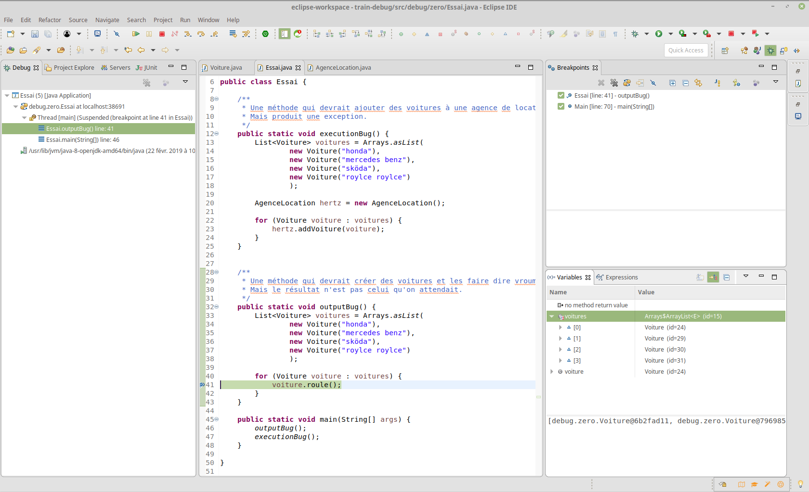
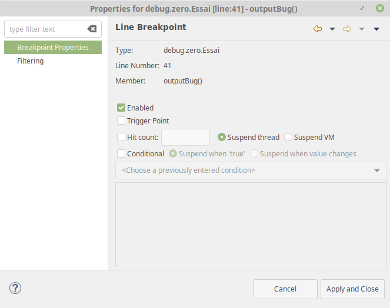
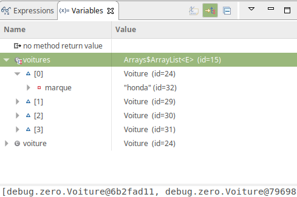

# Utilisation du debugger sous eclipse

#### Présentation
L'outil de développement Java d'Eclipse inclut un debugger qui permet de détecter et de diagnostiquer les erreurs dans vos programmes. Le debugger vous permet de contrôler l'exécution de votre programme en spécifiant des points d'arrêt (breakpoints), en suspendant des programmes en cours d'exécution, en avançant pas-à-pas dans le code et en examinant l'état des variables.

Dans Eclipse, le debugger est associé à une perspective particulière qui affiche des fonctionnalités spécifiques au debugging.

* En haut à gauche se trouve l'état d'exécution du debugger (Debug). Cette vue permet de savoir quels sont les programmes en cours de debug et où ils en sont de leur exécution.
* A droite se trouve une table présentant l'état (la valeur) des variables visibles dans la portion de code où s'est pausé le debugger (Variables) et une liste des points d'arrêts (Breakpoints).
* Au milieu se trouve le code source en cours de test, comme dans la perspective Java.

* Tout en haut, dans la barre d'outils, se trouve des commandes spéciales de debugging que nous allons explorer.

Pour lancer le debugger, on peut :

* presser le bouton Debug dans la barre d'outils ;
* ou sélectionner Run > Debug dans le menu ;
* ou sélectionner Run > Debug As > Java Application dans le menu ;
* ou sélectionner Debug As > Java Application dans le menu contextuel de votre programme (clic droit).

Vous pouvez arrêter l'exécution du debugger en pressant le bouton Stop comme lors de l'exécution classique d'un programme.

#### Gérer les breakpoints (ou points d'arrêt)
Les breakpoints (ou points d'arrêts) sont un moyen de spécifier au debugger, quand se mettre en pause pour inspecter l'état des variables et le comportement de notre programme. Pour positionner un tel point d'arrêt, il suffit de faire clic droit sur la marge gauche, au niveau de la ligne qui nous intéresse, puis de choisir Toggle Breakpoint ou tout simplement de double cliquer sur la marge gauche au même niveau. La présence d'un point d'arrêt sera signalée par un rond bleu.

Les points d'arrêts peuvent être activés ou non. Par défaut, ils le sont.

Il est également possible de spécifier les conditions d'arrêts d'un breakpoint, en faisant double clic sur le point d'arrêt et en éditant les informations de l'onglet Breakpoint Properties. Il est alors possible de spécifier :

* si le point d'arrêt est activé ou non
* le nombre de passage avant de l'activer (hit count)
* une condition booléenne d'activation (Suspend when true), par ex. i > 4 && v.size() > 0
* une condition de changement de valeur (Suspend when value changes), par ex i ou v.size()

#### Exécution pas-à-pas
La vue Debug nous donne accès à des fonctionnalités très utiles pour l'exécution du programme pas-à-pas, à partir de la barre d'outils :

Icone                     |Action    |Détail
---                       |---       |---
 |Resume    |Pour continuer l'exécution du programme depuis l'instruction où il a été suspendu, jusqu'à rencontrer un point d'arrêt, être suspendu manuellement, ou terminer (normalement ou par une exception non capturée)|
 |Suspend    |Pour suspendre l'exécution du programme là où il en est
 |Terminate    |Pour terminer l'exécution du programme (comme si l'on tapait CTRL-C)

D'autres boutons permettent de contrôler pleinement l'exécution du programme lorsqu'il a été suspendu :

Icone                     |Action    |Détail
---                       |---       |---
 |Step Into    |Pour exécuter la ligne courante. Si celle-ci contient un appel à une méthode, alors le debugger se placera sur la première ligne de cette méthode. Notons que le debugger ne pourra explorer une méthode que si le code source lui est accessible
 |Step over    |Pour exécuter la ligne courante et se placer sur la ligne qui suit (éventuellement en sortant d'une méthode). Ainsi, contrairement au Step Into, s'il y avait un appel de méthode, celle-ci aura été exécutée mais pas explorée
 |Step return    |Pour retourner de l'appel d'une méthode. Ainsi le debugger va exécuter toutes les instructions restantes afin de terminer l'appel courant de la méthode en cours d'exploration

Enfin, il est possible de demander au debugger d'exécuter toutes les instructions jusqu'à une ligne donnée (si tant est que cela soit possible) en se plaçant sur la ligne souhaitée et en tapant CTRL-R (qui est un raccourci pour Run to Line du menu Run).

#### Consultation de l'état des variables

Lorsque le programme est suspendu par le debugger, il est possible de consulter l'état des variables accessibles depuis le ligne de code en cours.

On peut aussi évaluer des instructions entières ou partielles avec la commande watch, le résultat apparaît alors dans la vue expressions.

#### [retour](../README.md)
