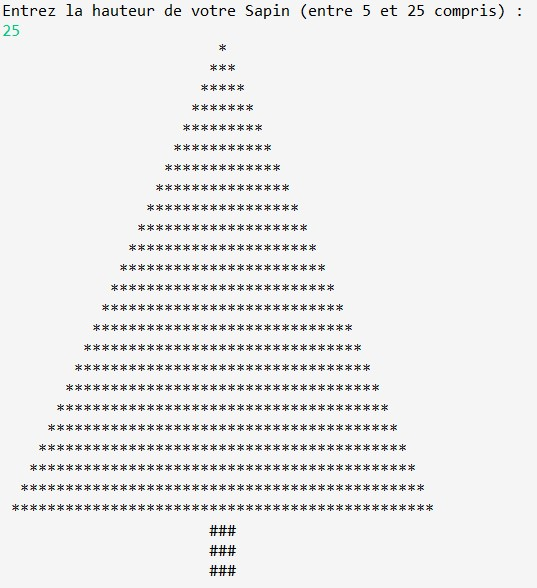

# Proposition de corrections des exercices algorithmiques

La correction peut-être affichée avec un diagramme Flowgorithm ou bien en java.

## Niveau 1 (Base)

* **Entrée/Sortie** : Ecrire un algorithme qui demande un nom en entrée et qui affiche "Hello " + nom_entrée + " !"


* **Entrée/Sortie** : Ecrire un algorithme qui calcule l'aire d'un triangle en demandant à l'utilisateur de rentrer la base et la hauteur d'un triangle


* **Entrée/Sortie** : Ecrire un algorithme qui calcule le volume d'une sphère en demandant à l'utilisateur de rentrer son rayon.


* **Structure conditionnelle** : Ecrire un mini quizz où le joueur doit répondre à 3 questions en mode console. A chaque question le joueur peut gagner 1 point s'il répond correctement. S'il répond faux, donner lui la bonne réponse pour qu'il ne se trompe pas la prochaine fois !

*Programmme principal*


*Fonction*


* **Boucle** : Ecrire un algorithme qui demande à l'utilisateur de rentrer un entier qui définira la longueur d'une chaîne de caractères que vous construirez ensuite à base de "#" et que vous afficherez ensuite dans la console. Exemple : si l'utilisateur rentre '6' vous aurez en sortie "######".

## Niveau 2 (on réfléchit un peu)

* **Calcul** : Ecrire un algorithme qui permet à l'utilisateur de convertir un angle en degrés vers un angle en radians et vice versa. Il sera possible à l'utilisateur de choisir 3 fonctionnalités : 1) je convertis de degrés en radians 2) je convertis de radians en degrés 0) Je quitte le programme.


* **Conditions** :

  -   Écrire une fonction qui affiche si une année est bissextile ou non (Sachant qu'une année est bisextile si elle est divisible par 400 OU divisible par 4 ET non divisible par 100). Voilà, vous avez les infos pour écrire votre alogithme.

  -   Écrire une fonction qui affiche combien d'années dans un intervalle donné (par exemple \[1980, 2016\[ ) sont bissextiles ?

* **Boucle** : Ecrire un algorithme qui permet de calculer le PGCD de deux nombres en utilisant la méthode Euclidienne. Le calcul devra être fait dans une méthode dédiée spécifiquement au calcul.

*Principale*


*Fonction*


* **Boucle & Récursivité** : Ecrire un algorithme qui permet de calculer la factorielle d'un nombre que l'utilisateur donne en entrée.

* **Conditions et Boucles** :
  -   Écrire une fonction qui affiche si un nombre est premier ou non.


## Niveau 3 (on se creuse les méninges)

* **Palindrome** : Ecrire un algorithme qui permet de vérifier si un nombre donné en entrée est un palindrome.

* **Calcul** : Ecrire un algorithme qui permet à l'utilisateur de rentrer un nombre et d'avoir en sortie sa racine carrée. Faire la même chose pour la racine n-ième (x tel que x^n= v).

* **Entrée/Sortie & boucle** : Ecrire un algorithme qui prend en entrée un nombre entier entre 6 et 24 qui désignera la hauteur d'un sapin à dessiner en mode console. Une fonction de création de l'arbre doit être réalisée. Elle prend en paramètre la hauteur de l'arbre et renvoie sous forme d'un tableau de chaînes de caractères les étages du tableau. Une fonction de création de chaque étage de l'arbre doit être créée et être utilisée dans la fonction de création de l'arbre.



- Proposition de code java avec 2 classes :

    * Classe **BeauSapin** pour construire notre Sapin
    * Classe **MauvaisNombreException** pour gérer les saisies erronées.

```java
package fr.bouget.beausapin;

import java.util.InputMismatchException;
import java.util.Scanner;

/*
 * Il exite aussi la classe StringUtils et d'autres qui permettent de simplifier notre algo.
 * avec la classe "org.apache.commons.lang.StringUtils",
 * on peut écrire ceci : 10Etoiles = 10Etoiles + StringUtils.repeat("*", 10);
 */

/**
 * 
 * @author Philippe
 * @category Algo Sapin
 * @version 1.0
 *
 */
public class BeauSapin {

	private int hauteur;
	private final String ETOILE = "*";
	private final String DIEZE = "#";

	/**
	 * Constructeur qui appelle 2 méthodes :
	 * - saisir() pour la saisie de la hauteur par l'utilisateur
	 * - construire() qui permet la construction de notre joli sapin
	 */
	public BeauSapin()
	{
		this.saisir();
		this.construire();
	}

	/**
	 * Méthode permettant la saisie d'une valeur pour la hauteur
	 * Ici je traite des saisies invalides en utilisant une classe Exception 
	 */
	private void saisir() throws MauvaisNombreException
	{
		Scanner scanner = new Scanner(System.in);
		try {

			System.out.println("Entrez la hauteur de votre Sapin (entre 5 et 25 compris) : ");
			this.hauteur= scanner.nextInt();
			if (this.hauteur>25)
			{
				throw new MauvaisNombreException("le nombre "+this.hauteur+" est trop grand, ");
				
			}
			else if (this.hauteur<5)
			{
				throw new MauvaisNombreException("le nombre "+this.hauteur+" est trop petit, ");
			}
			
		}catch(InputMismatchException ime)
		{
			String info = (ime.getMessage() != null) ? ime.getMessage() : "Caractères invalides, ";
			System.out.println(info+" veuillez recommencer...\n");
			saisir();
		}finally {
			scanner.close();
		}

	}

	/**
	 * Génération du joli sapin
	 */
	private void construire()
	{
		// nos variables internes à la méthode
		StringBuilder lignes = new StringBuilder();
		String symboles = null;
		String espaces = null;
		int j=0;
		// notre boucle for
		for(int i = 1 ; i < hauteur ; i++)
		{
			espaces = new String( new char[hauteur - i]).replace("\0", " ");
			symboles = new String( new char[(i * 1) + j]).replace("\0", ETOILE);
			lignes.append(espaces).append(symboles).append("\n");
			j++;

		}
		// appel à une méthode pour construire le pied
		lignes.append(construirePied(symboles.length()));
		// affichage du sapin complet dans la console.
		System.out.println(lignes.toString());
	}

	/**
	 * Méthode de construction du pied centré
	 * @param largeur
	 * @return
	 */
	private String construirePied(int largeur) {
		// variable
		StringBuilder pied = new StringBuilder();
		// boucle for
		for (int i = 0; i < 3 ; i++)
		{
			String espaces = new String( new char[ ((int) (largeur/2)) ]).replace("\0", " ");
			String tronc = new String( new char[3] ).replace("\0", DIEZE);
			pied.append(espaces).append(tronc).append("\n");
		}
		// renvoi du pied construit sous forme de chaîne de caractères
		return pied.toString();
	}

	/**
	 * Méthode de lancement
	 * @param args
	 */
	public static void main(String[] args) {

		// ici, on instancie notre objet BeauSapin en appelant son constructeur
		// on ne lui donne aucun nom
		new BeauSapin();
	}
}

```

- Classe : **MauvaisNombreException** qui hérite de **InputMismatchExcetpion**

```java
package fr.bouget.beausapin;
import java.util.InputMismatchException;

public class MauvaisNombreException extends InputMismatchException {
	public MauvaisNombreException(String message) {
		super( message );
	}
}

```

Pour les plus fort.e.s !

* **Cryptographie** : Ecrire un algorithme qui permet de chiffrer et déchiffrer un message via le chiffrement de  [César](https://fr.wikipedia.org/wiki/Chiffrement_par_d%C3%A9calage). Vous pouvez limiter l'algorithme aux messages en majuscules. Pour mener à bien cet exercice, vous devrez vous servir des codes ASCII.
