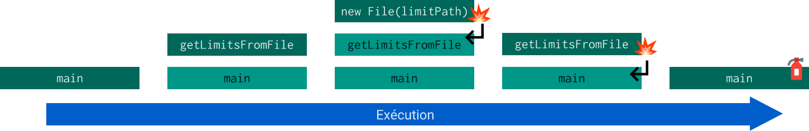

# Java et les Exceptions
## What is an exception?
Une exception est le terme raccourci pour décrire un "événement exceptionnel". En programmation il s'agit d'un événement non voulu, d'un comportement anormal du programme développé.

Il existe un mécanisme en Java qui permet de **lancer** et de **gérer** les exceptions. Ce mécanisme permet de gérer proprement les erreurs qui arrivent pendant l'exécution de notre programme.

Pour bien comprendre la gestion des exceptions, il est nécessaire de comprendre comment fonctionne un programme lorsque les fonctions s'appellent entre elles. Toutes les fonctions en cours d'exécution (appelées) sont stockées dans une **pile d'appel** (call stack in :gb: English :us:).

## La pile d'appel

Prenons un exemple très simple d'un programme qui donne un chiffre aléatoire deux entiers `lowLimit` et `highLimit`;

```java
public static void main(String[] args) {
  int random = getNumberBetween(-10, 60);
  System.out.println(random);
}

public static int getNumberBetween(int lowLimit, int highLimit) {
  int result = 0;
  if (lowLimit < 0 && highLimit < 0) {
    result = (int) ((lowLimit - highLimit) * getRandomNumber()) + highLimit;
  } else {
    result = (int) ((highLimit - lowLimit) * getRandomNumber()) + lowLimit;
  }
  return result;
}

public static double getRandomNumber() {
  return Math.random();
}
```

Voici la pile d'appels (en vert foncé : la dernière fonction appelée = en cours d'exécution, en vert clair les fonctions appelantes) :


## Si ça tourne au vinaigre ?

Imaginons maintenant qu'une des fonctions de la pile d'appel présente un risque de ne pas fonctionner (dans l'exemple précédent ça paraît impossible). Mais si on ajoute une fonction de récupération des limites dans un fichier texte. On demande alors à l'utilisateur.trice de spécifier la localisation du fichier où sont stockées les limites. On aura potentiellement les problèmes suivants :

* Lire un fichier qui n'existe pas
* Lire un fichier qui existe mais qui ne contient pas le bon contenu (du texte au lieu d'entiers)
* Lire un fichier qui existe et contient du contenu valide mais mal formaté (le fichier commence à la ligne 4 au lieu de 1)
* ...

J'ai donc modifié mon programme pour lire les limites depuis un fichier texte. J'ai arbitrairement décidé que le fichier "limites" doit contenir deux lignes avec une limite par ligne. Ci dessous le contenu du fichier avec les limites :

```text
-10
60
```

Et maintenant un exemple possible de gestion des exceptions :

```java
public static void main(String[] args) {
  System.out.println("Bienvenue dans l'application de calcul de nombre aléatoire !");

  int[] limits;
  try {
    String limitPath = getFileNameFromConsole();
    limits = getLimitsFromFile(limitPath);
    System.out.println(getNumberBetween(limits[0], limits[1]));
  } catch (FileNotFoundException e) {
    System.out.println("Le fichier \"limite\" que vous avez spécifié n'existe pas.");
    System.out.println("Impossible de calculer un nombre aléatoire.");
  } finally {
    System.out.println("Merci d'avoir utilisé mon application, aurevoir");
  }

}

public static String getFileNameFromConsole() {
  System.out.println("Veuillez spécifier l'emplacement du fichier limites :");

  Scanner scanner = new Scanner(System.in);
  String limitPath = scanner.nextLine();
  scanner.close();

  return limitPath;
}

public static int[] getLimitsFromFile(String limitPath) throws FileNotFoundException {
  int[] limits = new int[2];

  Scanner scanner = new Scanner(new File(limitPath));
  limits[0] = scanner.nextInt();
  scanner.nextLine();
  limits[1] = scanner.nextInt();
  scanner.nextLine();

  scanner.close();

  return limits;
}

public static int getNumberBetween(int lowLimit, int highLimit) {
  int result = 0;
  if (lowLimit < 0 && highLimit < 0) {
    result = (int) ((lowLimit - highLimit) * getRandomNumber()) + highLimit;
  } else {
    result = (int) ((highLimit - lowLimit) * getRandomNumber()) + lowLimit;
  }
  return result;
}

public static double getRandomNumber() {
  return Math.random();
}
```

C'est notre fonction `getLimitsFromFile` qui peut poser problème.

### Cas 1 : Fichier inexistant
Essayez ce code et rentrez dans la console le chemin d'un fichier qui n'existe pas. Vous remarquerez alors que vous aurez un message vous disant que le fichier que vous avez spécifié n'existe pas. C'est normal, dans notre fonction `getLimitsFromFile()` nous **renvoyons** l'exception `FileNotFoundException` de la classe `File` qui survient quand on essaye de faire `new File(limitPath))` avec un chemin `limitPath` qui n'existe pas. Cette exception est ensuite **gérée** dans la méthode `main` grâce a un bloc `try\catch\finally` qui permet d'attraper les exceptions **lancées** et **non gérées** par les méthodes appelées dans le bloc `try`



Détaillons un peu plus la gestion de l'exception faite dans la méthode `main`.
* Le bloc `try` permet de spécifier que le code qui est exécuté à l'intérieur peur éventuellement renvoyer une exception.
* Le bloc `catch` quant à lui se charge de gérer l'exception `FileNotFoundException` qui peut arriver dans le bloc `try`. On pourrait "attraper" d'autres exceptions si on pense qu'il est possible que d'autres surviennent dans le bloc `try`.
* Le bloc `finally` qui s'exécute après la capture d'une exception, si capture il y a, ou après la fin du bloc `try` si tout s'est bien passé.

Dans le cas d'une exception `FileNotFoundException` arrivant à l'appel de la fonction `getLimitsFromFile` toutes les actions après cette fonction seront ignorées et le programme exécutera directement les actions du bloc `catch`.

### Cas 2 : Contenu du fichier incorrect
Essayez maintenant de donner au programme un fichier qui existe mais qui n'est pas au bon format (avec des chaînes de caractères à la place d'entiers par exemple). Dans ce cas vous verrez apparaître dans la console un message d'erreur. C'est dû au fait que je n'ai pas géré les exceptions que peut renvoyer de la méthode `nextInt()` de la classe `Scanner`. Du coup l'exception vous est renvoyée dans la console.


Dans ce cas, personne n'a "d'extincteur" et l'erreur remonte jusqu'à l'utilisateur.trice :open_mouth: !

## Les 3 types d'erreurs
### Error
Il s'agit d'une erreur grave qui "normalement" ne se gère pas. C'est une erreur qui empêche le bon fonctionnement du programme mais que le programme ne peut pas anticiper. Exemple : l'utilisateur.trice spécifie un nom de fichier valide à ouvrir mais un problème de lecture disque arrive. Dans ce cas là, ce n'est pas au.à la programmeur.euse de prévoir ce type d'erreur, car il.elle ne pourra pas y remédier.

### Exception
Il s'agit d'une erreur que le.la programmeur.euse peut **et doit** anticiper. De ce fait il doit proposer une solution pour corriger le problème. Dans l'exemple vu plus haut et la lecture des limites dans un fichier texte, on affiche un message pour spécifier à l'utilisateur.trice que son fichier est introuvable. On pourrait faire un peu mieux et lui redemander de rentrer un chemin tant que celui qu'il propose est invalide.

Une fonction qui appelle une fonction renvoyant une exception du type `Exception` est dans l'obligation de spécifier ce qu'elle fera si une telle exception arrive. Deux choix sont possible :
* Comme `getLimitsFromFile` elle renvoie l'exception à la fonction appelante. Elle doit le spécifier grâce au mot clé `throws`.
* Comme la fonction `main` elle gère l'exception renvoyée.

Si aucun choix n'est fait alors le programme ne compilera pas.

### RuntimeException
Il s'agit d'une erreur que le.la programmeur.euse peut anticiper mais il.elle n'est pas obligé.e. Il s'agit plutôt d'une erreur qui est due à la mauvaise utilisation d'une fonction. Par exemple, si le.la programmeur.euse essaye d'accéder à un index d'un tableau qui dépasse la taille du tableau.

Dans l'exemple vu plus haut, les fonctions `nextInt()` et `nextLine()` de la classe `Scanner` renvoient plusieurs exceptions de type `RuntimeException`. Si par exemple le.la programmeur.euse a utilisé la méthode `getInt()` mais que le Scanner lit une chaîne de caractères.

Le.la programmeur.euse peut utiliser des fonctions qui renvoient des `RuntimeException` sans dire ce qu'il fait si une exception arrive. Le code compile quand même !

## Retour sur `finally` ?
Souvent, et c'est une **bonne pratique**, on utilise le bloc `finally` pour fermer les ressources que l'on utilise. Par exemple si on utilise un `Scanner` on doit toujours le fermer avec la méthode `close()` une fois qu'on ne s'en sert plus.

Dans l'exemple détaillé plus haut on aura donc un problème car les fonctions `nextInt()` ou `nextLine()` peuvent renvoyer une exception qui arrêtera l'exécution normale du programme et l'appel à la fonction `close()` du scanner ne sera pas fait.
Il est donc indiqué d'inclure l'appel aux méthodes de `Scanner` dans un bloc try suivi d'un `finally` pour fermer la ressource car même si une exception est levée on passera dans le bloc `finally`.

**Depuis Java 7 c'est plus facile :** On peut aussi utiliser le `try` with resources.

Un exemple d'implémentation propre de la fonction `getFileNameFromConsole()` avec le `try` with resources :

```java
public static String getFileNameFromConsole() {
  System.out.println("Veuillez spécifier l'emplacement du fichier limites :");
  String limitPath = "";
  try (Scanner scanner = new Scanner(System.in)) {
    limitPath = scanner.nextLine();
  }

  return limitPath;
}
```

Ici pas besoin de fermer la ressource dans le bloc `finally`, c'est fait automatiquement.

## Créer et/ou lancer ses propres exceptions
### Lancer une exception
Dans l'exemple de la fonction `getLimitsFromFile()` on se contente de **relancer** l'exception qui est lancée lors de l'appel `new File(limitPath)` avec un chemin `limitPath` qui n'existe pas. En fait ce qu'il se passe lors de l'appel de `new File(limitPath)` avec un chemin `limitPath` qui ne correspond à aucun fichier existant est un `throw new FileNotFoundException()`.

Si on en a le besoin, on peut faire le choix de lancer une exception lorsqu'une de nos fonctions ne se passe pas comme on l'attend. Pour ce faire l'instruction la plus simple à exécuter l'instruction suivante : `throw new Exception("Un problème est survenu")`.

Cependant ce n'est pas une bonne pratique car c'est beaucoup trop vague. Il convient donc de créer son propre type d'exception.

### Créer son propre type d'exception
L'instruction présentée au paragraphe précédent n'est pas très parlante et il faudrait plus de détails. Pour bien faire il faudrait pouvoir définir son propre type d'exception.

**Exemple :** je développe une application de base de données répertoriant tous les films sortis au cinéma. Mon application permet d'ajouter des films en ligne de commande sous le format : `Nom_du_film;Année_de_sortie;Réalisateur;Producteur`. Si un.une utilisateur.trice ajoute un film avec une `Année_de_sortie` supérieure à l'année actuelle ou inférieure à la date d'invention du cinéma je pourrais **lancer** une exception du type `IllegalReleaseDateException` que j'aurais créée moi même. Pour lancer mon exception personnalisée, je dois pouvoir écrire `throw new IllegalReleaseDateException()`

Mais pour faire ça, nous devons voir les bases de la programmation objet. Ce point sera revu après la découverte de l'objet. Mais sachez que c'est possible !

## Pour plus de détails
* [Les exceptions dans la documentation Java Oracle](https://docs.oracle.com/javase/tutorial/essential/exceptions/index.html)
* [Les bonnes pratiques](http://anisfrikha.developpez.com/tutoriel/java/exceptions/)
