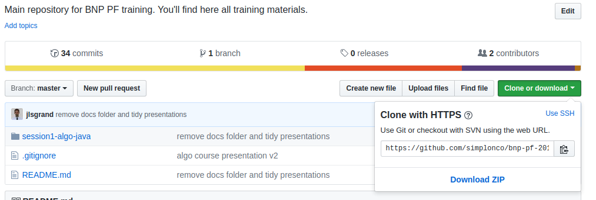
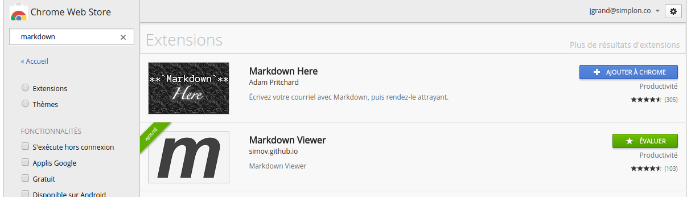
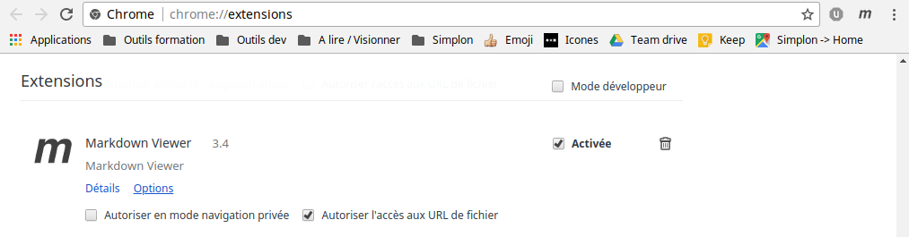

# Utiliser le repo bnp-pf-2018
Le repository `bnp-pf-2018` est le lieu de stockage de la majorité des ressources pédagogiques de la formation. En le récupérant en local sur votre PC vous pourrez à la fois pratiquer git et suivre l'avancement du cours.

#### Etape 1 : Installer l'utilitaire Git sur votre poste
* Pour Windows : [Install Windows](https://git-scm.com/download/win)
* Pour Mac : [Install Mac](https://git-scm.com/download/mac)
* Pour Linux : [Install Linux](https://git-scm.com/download/linux)

#### Etape 2 : Cloner le repo Github
Afin de récupérer le contenu de repo sur votre PC il faut que vous cloniez le repo en local sur votre PC. Pour ce faire :
* Créez un dossier sur votre PC où vous souhaitez stocker les cours.
* Copiez l'adresse du repository 

* Utilisez la commande `git clone [adresse du repo]` dans le dossier que vous avez créé.

Bien joué, vous avez récupéré tout le contenu de la formation qui a déjà été publié.

#### Etape 3 : Revoir des présentation
Il vous suffit d'ouvrir les présentations avec votre navigateur (de préférence Chrome). Elles sont stockées dans le dossier `presentation`.

#### Etape 4 : Lire les cours ou les exercices
Les cours et exercices sont stockés dans les dossiers `course` et `exercices`. Nouveau challenge ici, les cours et exercices sont écrits en Markdown. Si vous les visualisez avec un éditeur de texte, ce n'est pas très sexy. Pour profiter de la mise en forme, vous pouvez :

* Ajouter le plugin Chrome Markdown Viewer 

* Ouvrir les cours et les exercices avec le navigateur Chrome (en autorisant le plugin à ouvrir les fichiers locaux) 

#### Etape 5 : Vérifier s'il y a du nouveau !
En utilisant la commande `git pull` vous vérifiez s'il y a des nouveaux contenus sur le répository GitHub et les téléchargez sur votre poste.
