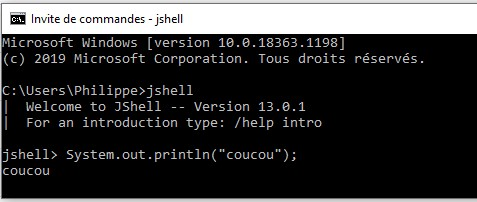

# Java : Support de cours abrégé

Bienvenu dans le monde de java. C'est un langage de programmation orienté objet crée en 1995. Il est actuellement détenu par la société Oracle qui le distribue gratuitement ([est-ce toujours le cas ? article](https://blog.invivoo.com/java-va-t-il-devenir-payant/)).

Une de ses caractéristiques principales est la **JVM** : **J**ava **V**irtual **M**achine. C'est une couche qui permet à un même programme java de tourner sur différents systèmes d'exploitation.

Pour exécuter un programme écrit en java, il suffit d'installer un environnement d'exécution appelé **JRE** (**J**ava **R**untime **E**nvironment).


Lorsqu'un vous souhaitez développer en Java sur votre machine, vous devez installer la **JSE** (**J**ava **S**tandard **E**dition).

Cette installation comprend la **JRE**, la **JDK** (**J**ava **D**evelopment **K**it => toutes les librairies java + outils de programmation tels que le compilateur) et **JSR** (**J**ava **S**pecification **R**equest).

>La dernière version de la JSE est la 13. ([plus de détail sur les versions](https://fr.wikipedia.org/wiki/Java_%28langage%29#Contenu_et_%C3%A9volutions)).

Java est un langage à la fois *robuste* (grâce à des règles de compilation strictes, vous en ferez vite l'expérience) et sa syntaxe permet d'implémenter des concepts élaborés (plus simplement qu'en C++). 

C'est un langage très largement répandu, je n'ai pas trouvé à combien de [sloc](https://en.wikipedia.org/wiki/Source_lines_of_code#Example) il était estimé. Ainsi java possède une large communauté d'utilisateurs et de nombreux programmes déjà écrits, si bien qu'une solution existe souvent pour un besoin donné.

Voici les tendances sur le site [stackoverflow](https://stackoverflow.com/) pour quelques langages choisis (je vous laisse décrypter ce graphique car je suis daltonien!) : .

On voit l'apparition de **Scala** et **kotlin**, notamment depuis 2017 ([explication](https://fr.wikipedia.org/wiki/Kotlin_(langage))) qui sont totalement compatibles avec JAVA et la JVM mais font évoluer sa syntaxe en s'inspirant des bonnes trouvailles des autres langages.

Voici à quoi ressemble un programme java :
```java
public class HelloWorld {
  public static void main(String[] args) {
    System.out.println("Bonjour les apprenant.e.s !");
  }
}
```

Le nom du fichier est le nom de la classe (ici **HelloWorld**) avec l'extension **.java.** Comme on peut le voir, ce fichier est écrit de façon _compréhensible_. Il va ensuite être compilé en bytecode (écrit en octets) qui sera interprété par la JVM.

> Java est donc un langage **compilé et interprété**.

## Testez des instructions avec jshell

Depuis Java 1.8, on peut simplement tester du code java en lançant jshell :

Il suffit de lancer un terminal windows et de taper **jshell** pour exécuter du code java.

```
jshell> System.out.println("Coucou !");
Coucou !
```


## Commenter le code

Avant toute chose, il convient de parler des commentaires ! C'est certainement une des choses les plus importantes que l'on écrit lorsque l'on code. Ce sont des lignes de code qui ne seront pas interprétées mais qui donnent des indications primordiales pour les développeur.euse.s qui liront le code (y compris vous lorsque vous replongerez le nez dans le code dans quelques mois).

```java
// Voici comment j'écris un commentaire en java : en démarrant ma ligne de code par //
// C'est vraiment très important de documenter son code en mettant des bons commentaires pour les futurs développeur•euse•s
// J'espère que vous le ferez !
```

On peut aussi regrouper plusieurs lignes de commentaires ainsi :

```java
/*
Je peux dire n'importe quoi, le compilateur ne le lira pas (par contre les autres développeur.euse.s, oui !)
*/
```

> Question : quelle est votre priorité en tant que développeur.euse ?

- [ ] que votre code fonctionne ?
- [x] que votre code soit maintenable ? (eh oui!)

---

## 1. Variables et types de données

Les variables en java permettent de stocker des données en mémoire pour pouvoir les utiliser par la suite. Les variables sont typées et créées en deux phases :

- Déclaration
- Initialisation

```java
// on déclare que le type de la variable est 'int'
int unNombre;
// on initialise la variable
unNombre = 22;
```

On peut rassembler ces deux phases en une seule instruction :

```java
// on déclare et on initialise
int unNombre = 33;
```

Une fois qu'une variable est déclarée, on ne peut pas changer son **TYPE**. On peut cependant lui affecter de nouvelles valeurs.

```java
int unNombre = 22;
unNombre = 33; // ok
unNombre = "abc"; // alors là, possible ou pas ?
```

En java, les variables sont soit des types **primitifs**, soit des **classes**. Les primitifs sont les types de base (nombres, caractères, booléens, ...) et les classes sont toutes les classes qui viennent dans la **JSE** ([liste des classes](https://docs.oracle.com/javase/10/docs/api/index.html?overview-summary.html)) + toutes celles que vous développez pour vous-même.

```java
int unNombre = 25; // primitives en minuscules
char initiale = 'b';
double monSouvenirDePi = 3.1415926;
boolean AfpaAParis = true;

String unMotOuUnTexte = "hey jude, don't make it bad"; // String n'est pas un type primitif : c'est une classe qui commence par une majuscule.
```

> Remarque, lire du java n'est pas forcément évident, il est donc important de respecter les conventions de nommage. Pour le nom des variables, les noms des classes, etc...

on utilise la convention dite **camelCase**. Les classes doivent commencer par une majuscule, et les variables par une minuscule :


Pour afficher le contenu d'une variable, on utilise la méthode `System.out.println()` ou `System.out.printf()` que nous verrons ultérieurement :

```java
int unNombre = 10;
int unAutre = 156;
int total = unNombre + unAutre;
System.out.println(total);
```

### Booléens

Le type de données élémentaire à connaître qui est à la base de l'informatique d'aujourd'hui est le booléen. Il s'agit d'un type de données qui n'a que deux valeurs possibles :

- `true`
- `false`.

Cela correspond au `0` et au `1` du binaire (le yin et le yang de l'informaticien.ne). Nous l'utiliserons beaucoup lorsque nous aborderons les conditions.

```java
// Une vérité
boolean jeTravailleEnIndependant = true;

// Un mensonge
boolean jeSuisPlusRicheQueBillGates = false;
```

### Les nombres

Deux grand types de nombre nous seront utiles :

- `int` : représentent les nombres entiers
- `double` : représentent les nombres décimaux.

```java
int monAge = 30;
int ageMatusalem = 1_042; // le tiret du bas peut être utilisé pour rendre visuellement les nombres plus faciles à lire. Ce n'est pas une obligation.

// Ma taille en cm, enfin je triche un peu
double taille = 165.5;
```

> Remarque : il existe d'autres types de nombres entiers :

- byte
- short
- long
- et d'autres types de décimaux : float. Mais ils sont utilisés plutôt pour des questions d’optimisation de programme.

On peut **caster** (convertir) des types en d'autres, mais attention au résultat :

```java
int a = 10.0; // a = 10, rien à faire
a = (int) 3.14; // a = 3, il faut faire le cast si on veut la partie entière.
```

Pour plus de détails : [La documentation officielle de java](https://docs.oracle.com/javase/tutorial/java/nutsandbolts/datatypes.html)

### Les caractères

```java
char initialeMajuscule = 'P';
char dernierLettre = 'e';
char unNombreOuBien = '1';  // c'est bien le caractère 1, et pas un nombre sur lequel on peut faire des opérations
```

### Les chaînes de caractères

Afin de stocker du texte (un prénom, un nom, une phrase,...) nous utiliserons les `String` qui représentent les chaînes de caractères :

```java
String prenom1 = "Véronique";
String prenom2 = "Philippe";
String starJava = "Jean Michel Doudoux"
```

On peut utiliser un certain nombre de caractères spéciaux qui n’apparaîtront pas en les **échappant** avec un **backslash** :

Ici le **\\n** correspond à un saut de ligne.

```java
String menu = "Faites votre choix :\n1-Pour démarrer\n2-Pour quitter";
System.out.println(menu);
```

Qui s'affichera ainsi :
```
Faites votre choix :
1- Démarrer
2- Quitter
```

Pour plus de détails : [La documentation officielle de java](https://docs.oracle.com/javase/tutorial/java/data/strings.html)

---

## 2. Opérateurs

### Opérations de base sur des nombres

On peut utiliser les 4 opérations sur des nombres. Les résultats obtenus sont sans surprise.

```java
int soldeCompte = 150;
int retrait = 20;

int nouveauSolde = soldeCompte - retrait;

int depot = 105;
nouveauSolde = soldeCompte + depot;
```

Les opérations `+,-,*,/` sur des nombres entiers donnent des nombres entiers.
Les opérations `+,-,*,/` sur au moins un nombre double donnent des nombres doubles.

```java
int soldeCompte = 150;
double depot = 10.0;

double nouveauSolde = soldeCompte + depot;

double pourcentage = 0.3;
nouveauSolde = soldeCompte * 0.3;
```

Pour la division, attention au cas des nombres entiers :

```java
int nbPartPizza = 4;
int nbPersonne = 2;

int nbPart = nbPartPizza/nbPersonne; // 2 bien sur

nbPartPizza = 5;
nbPart = nbPartPizza/nbPersonne; // 5/2 = 2, attention
```

> Pour avoir le résultat de la division précédente exact, on **caste** un des deux nombres `int` en `double` :

```java
int a = 5;
int b = 2;
double exact = a/(double)b;
```

Les priorités de calcul sont les priorités habituelles, on peut utiliser des parenthèses.
```java
int a = (2+4)*3; // 18
int b = 2+4*3; // ? selon vous...
```

### Division entière

On utilise souvent en informatique la division entière qui donne deux résultats : le reste (ou modulo) et le quotient.

```java
int etudiants = 16;
int nbGroupes = 3;

int etudiantsParGroupe = 16 / 3; // un résultat entier
int etudiantsRestant = 16 % 3; // on dit 16 modulo 3, il reste 1
```

### Comparaison

Les relations d'ordre produisent des booleans.

```java
18 < 22; // true
3*5 < 10; // false
2*3 <= 6; // true
2 < 4 < 8; // erreur, l'encadrement ne fonctionne pas en java, il faut utiliser &&
2 < 4 && 4 < 8; // true
"la ligne rouge" < "apocalypse now"; // erreur, il faut comparer des nombres !
```

On peut bien sur les stocker dans des variables :

```java
int unNombre = 17;
double unAutre = 8.4;

boolean estPlusGrand = (unNombre > unAutre); // true
```

### Egalité

On compare des variables avec `==`, puisque le `=` est déjà utilisé pour l'affectation. Cela produit aussi un boolean. Le signe différent est `!=`.

```java
ligne1 = "Nah nah nah nah nah nah nah nah nah yeah";
ligne2 = "Nah nah nah nah nah nah, nah nah nah, hey Jude";
ligne3 = "Nah nah nah nah nah nah, nah nah nah, hey Jude";

ligne1 == ligne2
ligne2 == ligne3

isDifferent = ligne1 != ligne3 // il est vrai que ces lignes ne sont pas égales!
```

### Opérations avec les **booleans**

[L'algèbre de Boole](https://fr.wikipedia.org/wiki/Alg%C3%A8bre_de_Boole_(logique)) (c'est à dire les calculs sur les booléens) est la base de l’électronique. On la retrouve aussi dans les langages de programmation, notamment pour exprimer des conditions (voir plus loin : branchements, et aussi boucles).

Il y a trois opérations importantes à connaître :

- **et** : `&&`
- **ou** : `||`
- **non** : `!`

```java
int revenu = 26_000;
int seuil1 = 16_000;
int seuil2 = 38_000;

boolean exonere = revenu < seuil1; // exo si inférieur à 16000.
boolean doitPaye = !exonere; // on doit payer si on n'est pas exonéré

boolean payeTranche1 = revenu > seuil1 && revenu < seuil2; // si le revenu est compris entre seuil1 et seuil2
```

Un autre exemple avec **ou** :

```java
int note = 12;
boolean noteInvalide = note < 0 || note >20;
```

### Opérations avec des chaînes

On peut concaténer (mettre bout à bout) des chaînes de caractères avec l'opérateur `+`.

```java
String nom = "Odile";
int age = 34;

String presentation = "Bonjour, je m'appelle "+nom+ " et j'ai "+age+ " ans";
```


---
## 3. POO

Dans cette partie, nous allons aborder les concepts de base de la programmation orientée objet, à savoir les notions suivantes :

- **classes**
- **attributs**
- **méthodes**

En effet, en plus des librairies java de base qui contiennent de nombreuses classes (pour représenter des listes, des fichiers, des images, ...), on peut se construire ses propres classes.

Une classe est composée d'attributs et de méthodes.

>Elle sert à fabriquer des objets.

Par exemple si je travaille sur des mails, il est plus simple de créer une classe **Mail** qui regroupe toutes les variables de chaque mail :

- A ne pas faire !

```java
String objet1 = "ton compte";
String destinataire1 = "toto@yopmail.com";
String message1 = "bonjour, votre compte a été désactivé. Au revoir.";

String objet2 = "salut";
String destinataire2 = "pipou@yopmail.com";
String message2 = "Salut, ça va?";
```

Version avec une **classe** Mail :

```java
Mail mail1 = new Mail("ton compte", "toto@yopmail.com", "bonjour, votre compte a été désactivé. Au revoir.");
Mail mail2 = new Mail("salut","pipou@yopmail.com","Salut, ça va?");
```

Voici comment définir la classe Mail :

```java
public class Mail {
  String message; // les attributs de la classe, ici il y en a 3
  String destinataire;
  String sujet;

  // ceci est le constructeur, qui va permettre d'initialiser les attributs et construire des objets de type Mail
  public Mail(String monMessage, String monDestinataire,  String monSujet) {
    this.message = monMessage;
    this.destinataire = monDestinataire;
    this.sujet = monSujet;
  }

  public static void main(String[] args) {

  }
}
```

Une classe permet de créer des objets (ou instances). Ainsi mail1 et mail2 sont des **instances** de la **classe** Mail.

>La classe est comme un moule qui permet de fabriquer toujours les mêmes **types** d'objet.

Le mot clé `this` à l'intérieur de la classe permet de désigner l'instance sur laquelle on travaille.

### Méthodes

Une classe permet aussi de définir des méthodes (la méthode **main()** et les constructeurs sont des méthodes). Les méthodes correspondent à des comportements (des actions) que l'on peut demander à un objet.

Une méthode possède une portée (**public**, **private**, **protected**), un nom, un type de retour (ou **void** si elle ne donne aucun résultat) et des paramètres.

```java
public class Mail {
  String message; // les attributs de la classe, ici il y en a 3
  String destinataire;
  String sujet;

  public Mail(String monMessage, String monDestinataire,  String monSujet) { // ceci est le constructeur, qui va permettre d'initialiser les attributs
    this.message = monMessage;
    this.destinataire = monDestinataire;
    this.sujet = monSujet;
  }

  public void envoyer(){
    System.out.println("votre message a bien été envoyé à "+this.destinataire);
  }

  public static void main(String[] args) {

  }
}
```

On peut ajouter des paramètres à notre méthode :

```java
public class Mail {
  String message; // les attributs de la classe, ici il y en a 3
  String destinataire;
  String sujet;

  public Mail(String monMessage, String monDestinataire,  String monSujet) { // ceci est le constructeur, qui va permettre d'initialiser les attributs
    this.message = monMessage;
    this.destinataire = monDestinataire;
    this.sujet = monSujet;
  }

  public void envoyer(){
    System.out.println("votre message a bien été envoyé à "+this.destinataire);
  }

  public void envoyerDansXHeures(int nbHeures){
    System.out.println("votre message sera envoyé à "+this.destinataire+" dans "+nbHeures+" heures.");
  }

  public static void main(String[] args) {
    Mail mail1 = new Mail("ton compte", "toto@yopmail.com", "bonjour, votre compte a été désactivé. Au revoir.");
    Mail mail2 = new Mail("salut","pipou@yopmail.com","Salut, ça va?");

    mail1.envoyer();
    mail2.envoyer();
  }
}
```

### Modification des attributs d'un objet

Méthodes **getXXXX()** et **setXXXX()**

### Méthodes statiques

Dans le cas où l'on veut créer des méthodes qui n'ont pas besoin de s'appliquer sur des objets, par exemple une classe qui contient plusieurs fonctions de calculs mathématiques, alors on donne la caractéristique `static` aux méthodes :

```java
public class Calculs {    

    /**
     * Calcule la moyenne de deux nombres entiers
     * @param a : le 1er nombre
     * @param b : le second nombre
     * @return : la moyenne
     */
    public static double moyenne(int a, int b) {
        double resultat = (a+b)/2.0; // on divise par un double pour que le résultat soit décimal
        return resultat;
    }

    // on utilise la méthode main pour tester
    public static void main(String[] args) {
        // quelques tests pour la fonction moyenne
        System.out.println(moyenne(10, 12)); // 11 normalement
        System.out.println(moyenne(10, 11)); // 11.5 normalement
    }
}
```

> Ce qu'il faut retenir : une classe permet de structurer des données (les attributs). Une classe permet aussi de définir des actions ou des comportements pour des objets, ce sont les méthodes.

> Si les méthodes n'ont pas besoin d'être propres à un objet, alors elles sont **static**.

Pour plus de détails : [La documentation officielle de java](https://docs.oracle.com/javase/tutorial/java/concepts/index.html)


## 4. Conditions et branchements conditionnels

### Branchements

Pour effectuer un bloc d'instructions si une condition est vraie, on utilise le mot-clé `if`. Pour délimiter la taille du bloc d'instructions, on utilise des accolades (et fortement recommandée : une **indentation**).

```java
int temperature = 10;
String vetement = "teeshirt";

if (temperature < 15) { // on délimite le bloc avec des accolades
  System.out.println("c'est deja l'automne"); // toutes les lignes du bloc sont indentées
  vetement = "pull";
}

System.out.println(vetement);

```

Si la condition est vraie, on exécute les instructions du blocs. Sinon on saute le bloc.

On peut ajouter un bloc à exécuter seulement si la condition est fausse avec `else`.

```java
int temperature = 10;
String vetement = "teeshirt";

if (temperature < 15) { // on délimite le bloc avec des accolades
  System.out.println("c'est deja l'automne");
  vetement = "pull";
}
else  { // un autre bloc : accolades + indentation
  System.out.println("vive le réchauffement");
  // pas la peine de changer de vetement
}

System.out.println(vetement);

```

On peut aussi ajouter d'autres conditions intermédiaires avec `else if`, a exécuter seulement si les précédentes sont fausses.


```java
int age = 2;

if (age < 0) {
  System.out.println("merci d'entrer un âge valide (positif)");
}

else if (age < 3) {// on ne rentre pas ici si on est déjà entré dans le cas d'avant
  System.out.println("tarif : gratuit");
}

else if (age < 18){
  System.out.println("tarif : réduit");
}

else if (age > 65) {
  System.out.println("tarif : réduit");
}

else {// dans tous les autres cas
  System.out.println("tarif : normal");
}
```

### Conditions

Dans le cas précédent, on obtient un tarif réduit si l'âge est inférieur à 18 **ou** supérieur à 65. On peut rassembler les deux cas.

```java
int age = 2;

if (age < 0) {
  System.out.println("merci d'entrer un âge valide (positif)");
}

else if (age < 3) {// on ne rentre pas ici si on est déjà entré dans le cas d'avant
  System.out.println("tarif : gratuit");
}

else if (age < 18 || age > 65) {
  System.out.println("tarif : réduit");
}

else {// dans tous les autres cas
  System.out.println("tarif : normal");
}
```

Une erreur classique est d'utiliser un **or** lorsqu'il faudrait un **and** ou inversement. Ici par exemple, **un age qui est inférieur à 18 **et** supérieur à 65 n'existe pas**, il fallait bien utiliser le **ou**.

```
brocoli = 4
aubergine = 6
concombre = 5
radis = 2
pomme = 3
mure = 9
```

> Quelle condition sur les prix pour ne sélectionner que :

```
brocoli = 4
radis = 2
pomme = 3
mure = 9
```

question tirée du concours [castor informatique 2016](http://concours.castor-informatique.fr)

Pour plus de détails : [La documentation officielle de java](https://docs.oracle.com/javase/tutorial/java/nutsandbolts/if.html)
