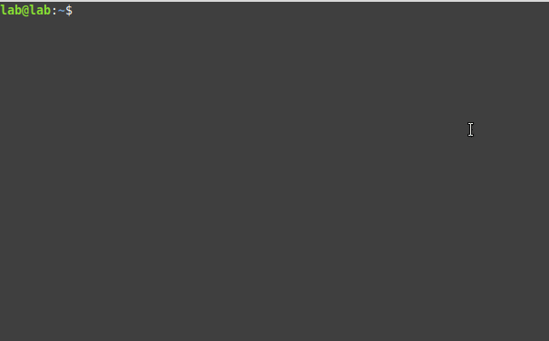
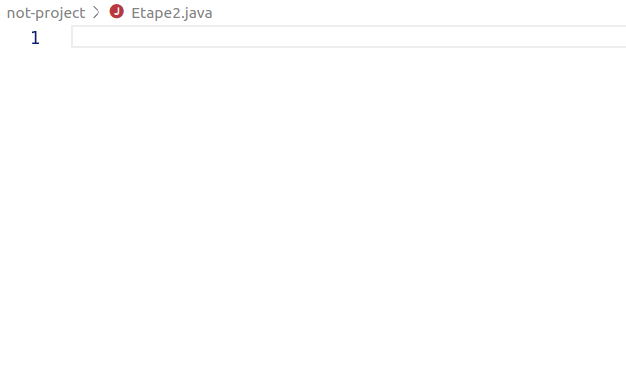
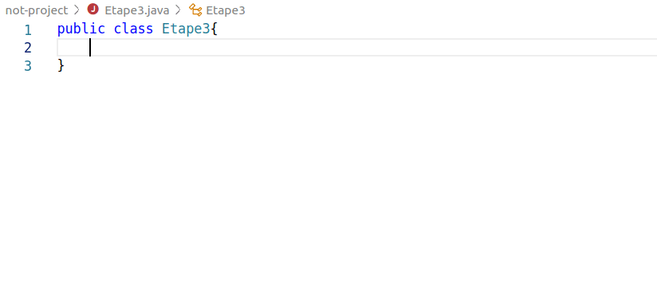

# Les bases de java : exercices

Avant de commencer, n'hésitez pas à relire le cours, et à tester les exemples. `jshell` est très pratique pour essayer des instructions :



## HelloWorld

### Installation de java sur votre ordinateur

- Allez chercher et installer la dernière [jse](https://www.oracle.com/technetwork/java/javase/downloads/jdk13-downloads-5672538.html).

- Récupérez le programme suivant [helloWorld](HelloWorld.java)
```java
public class HelloWorld {
  public static void main(String[] args) {
    System.out.println("Hello evrybody!");
  }
}
```

- Compilez ce programme dans un terminal :
```shell
javac HelloWorld.java
```

- Vérifiez qu'un fichier HelloWorld.class a bien été crée. Exécutez ce programme :
```shell
java HelloWorld
```


### CodeAcademy en mode dojo

Mettez vous par groupes de à personnes. On va définir des rôles qui vont tourner à chaque question :
- 1 codeur au clavier
- 2 conseillers
- 2-4 observateurs

Le codeur essaie de coder la bonne réponse, aidé par ses conseillers qui peuvent lui dire quoi faire. Les observateurs n'ont pas le droit de parler. A chaque exercice, les rôles tournent (on commence par les observateurs qui deviennent conseillers ou codeur).

L'exercice est [HelloWorld](https://www.codecademy.com/courses/learn-java/lessons/hello-world-java)

## Etape 1 : Déclarons quelques variables

Dans un premier temps nous allons simplement utiliser l'interpréteur jshell. Pour cela il suffit d'ouvrir un terminal et de taper la commande `jshell`. Vous devriez voir dans votre terminal en début de ligne `jshell>`. Si c'est le cas, c'est le signe que vous pouvez écrire du Java.

A faire : déclarer des variables permettant de vous décrire avec :

- Votre prénom
- Votre nom
- Votre age
- Votre taille en cm
- Quelques lignes qui expliquent pourquoi vous rejoignez la formation

## Étape 2 : Opérations sur les variables

Les exercices suivants sont à faire dans le main du fichier Etape2.java :


> Attention : le nom du fichier .java doit être **identique** au nom de la classe

### Ex1
```java
int mystery1 = 8 + 6;
int mystery2 = 8 - 6;
```
(Attention : exercice très simple) Afficher avec `System.out.println()` la variable qui est égale à 2.

### Ex2
```java
int zebrasInZoo = 8;
int giraffesInZoo = 4;
```
Créer une variable **animalsInZoo** qui contient le nombre total d'animaux dans le zoo. Afficher cette variable.

### Ex3
```java
double prixInitial = 1500;
double tva = 0.20;
```
Créer une variable **prixFinal** qui égale au prix initial plus le prix initial multiplié par la tva. Afficher cette variable.

### Ex4 : modulo et division entière
1. Remplir des boites de 6 œufs! Créer une variable **nbBoites** qui contient le nombre de boites pleines et une variable **nbOeufsRestant** pour le nombre d’œufs qui restent.

```java
int nbOeufsParBoite = 6;
int nbOeufsTotal = 145;
```

2. Dans un jeu de 32 cartes (7, 8, 9, ..., roi, as pour les couleurs pique, cœur, carreau, trèfle), on décide d'associer à chaque carte un numéro.

Le numéro de la carte est obtenu en multipliant le numéro de la couleur (0,1,2 ou 3) par le nombre de cartes par couleur + numéro de la figure (0,1,2,3 ... 7).

Les cartes sont donc numérotées ainsi :
7pique, 8pi, 9pi, 10pi, valet pi, dame pi, roi pi, as pi, 7coeur, 8coe, 9coe, ... avec les numéros 0,1,2,3,4,5,6,7,8,9,10, ...

**Exemple** :
le 9 de pique a pour numéro = 2 + 0 fois 8 = 2 (carte n°2 de la couleur 0)
la dame de cœur a pour numéro = 5 + 1 fois 8 = 13 (carte n°5 de la couleur 1)

```java
numero_carte_mystere = 28
```

Créer une variable **numero_couleur** et **numero_figure** à retrouver à partir du numéro de la carte mystère. Vous pouvez vérifier que votre méthode fonctionne en retrouvant la couleur de la carte n°2 (9 de pique) ou de la carte n°13 (dame de cœur).

> Indice : on peut retrouver **numero_couleur** et **numero_figure** avec la division (en nombres entiers) et avec le reste (`%`)

### Ex5 : inférieur, supérieur
```java
int prixInitial = 1500;
double tva = 0.20;

int budget = 2000;
```
Créer une variable **budgetSuffisant** qui indique si le budget est supérieur ou égal au prix initial plus le prix initial multiplié par la tva. Afficher cette variable.

### Ex6 : égalité
Pour éviter les doublons, on cherche à comparer des albums par rapport à leur durée totale et au nombre de chansons par album.

```java
int songsA = 9;
int songsB = 9;
int albumLengthA = 41;
int albumLengthB = 53;
```
Créer une variable **sameSongs** qui est vraie si les deux albums contiennent le même nombre de chansons.
Créer une variable **sameAlbumLength** qui est vraie si les deux albums ont la même longueur au total. Afficher ces variables.

## Étape 3 : Utilisons des fonctions



- Créer une fonction qui renvoie l'aire d'un triangle en prenant en paramètres base et hauteur.
- Créer une fonction qui renvoie le volume d'une sphère en prenant en paramètre son rayon.
- Créer une fonction qui renvoie un message donnant l'IMC d'une personne. Elle prendra en paramètre le prénom de la personne, son poids en kg et sa taille en cm.

### CodeAcademy en mode dojo

Mettez vous par groupes de à personnes. On va définir des rôles qui vont tourner à chaque question :
- 1 codeur au clavier
- 2 conseillers
- 2-4 observateurs

Le codeur essaie de coder la bonne réponse, aidé par ses conseillers qui peuvent lui dire quoi faire. Les observateurs n'ont pas le droit de parler. A chaque exercice, les rôles tournent (on commence par les observateurs qui deviennent conseillers ou codeur).

L'exercice est [Methods](https://www.codecademy.com/courses/learn-java/lessons/learn-java-methods/)


## Etape 4 : Conditionnons notre code

```java
String periode = "a definir"
int heure = 10
```

1. Créer une condition **if** qui affecte la valeur "matinée" à la variable **periode** si l'heure est inférieure à 10. Afficher ensuite un message du type : "bonne <periode>"
2. Ajouter un deuxième **if** qui affecte la valeur "après-midi" à la variable **periode** si l'heure est inférieure à 18. Tester avec heure = 10, cela devrait afficher "bonne après-midi" ...
3. Corriger en remplaçant le **if** précédent par **elif**. Tester avec heure = 10 et heure = 15.
4. Ajouter un **elif** si l'heure est inférieure à 0. Dans ce cas afficher "erreur de saisie" (remarque il aurait mieux valu arrêter le programme..)
5. Ajouter un **elif** si l'heure est supérieure à 24. Dans ce cas afficher "erreur de saisie" (remarque il aurait mieux valu arrêter le programme..)
6. Grouper les deux cas précédent en utilisant un **or**.
7. Dans tous les autres cas, affecter la valeur "soirée" à la variable **periode**. Tester avec heure = 8, heure = -5, heure = 12, heure = 18, heure = 23, heure = 35.


Pour aller plus loin, [défi sur hackerRank](https://www.hackerrank.com/challenges/java-if-else/problem)
